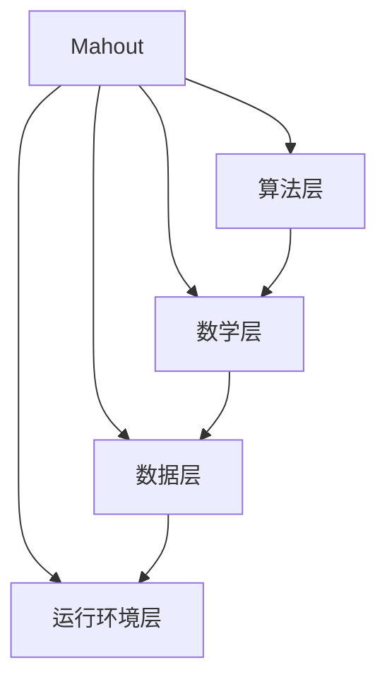

# Mahout原理与代码实例讲解

## 1.背景介绍

在当今大数据时代,海量数据的存在为数据挖掘和机器学习技术的应用奠定了基础。Apache Mahout是一个可扩展的机器学习和数据挖掘库,旨在帮助开发人员更轻松地创建智能应用程序。作为Apache软件基金会的一个顶级项目,Mahout提供了一系列可扩展的机器学习算法,涵盖了聚类、分类、协同过滤、降维等多个领域。

Mahout最初由Hadoop的贡献者开发,旨在利用Hadoop的分布式计算能力来执行机器学习算法。随着时间的推移,Mahout已经发展成为一个成熟的机器学习库,不仅支持在Hadoop上运行,还可以在单机环境中执行。它提供了丰富的算法库和实用工具,使开发人员能够快速构建智能应用程序。

## 2.核心概念与联系

### 2.1 机器学习概述

机器学习是一门研究如何从数据中自动分析获得模型,并利用这些模型对未知数据进行预测和决策的科学。它是人工智能的一个重要分支,在许多领域得到了广泛应用,如推荐系统、图像识别、自然语言处理等。

机器学习算法通常分为三大类:

1. **监督学习**: 利用已知输入和输出的训练数据,学习一个模型来预测新的输入数据对应的输出。常见算法有回归、决策树、支持向量机等。

2. **无监督学习**: 只有输入数据,没有任何相应的输出,算法需要从输入数据中发现内在的模式和规律。常见算法有聚类、关联规则挖掘等。

3. **强化学习**: 通过与环境的交互,学习一个策略来最大化预期的累积奖励。常见算法有Q-Learning、策略梯度等。

### 2.2 Mahout架构

Mahout的架构可以分为四个主要层次:

1. **算法层**: 包含各种机器学习算法的实现,如聚类、分类、协同过滤、降维等。

2. **数学层**: 提供了矩阵、向量等数学运算的支持,为算法层提供基础。

3. **数据层**: 负责数据的加载、存储和处理,支持多种数据源和格式。

4. **运行环境层**: 提供了在不同环境(如单机、Hadoop、Spark等)下执行算法的支持。

这些层次相互依赖和协作,共同构成了Mahout的整体架构。开发人员可以直接使用算法层提供的API,也可以基于底层的数学层和数据层自定义算法。



## 3.核心算法原理具体操作步骤

Mahout提供了多种核心算法,下面将详细介绍其中几种算法的原理和具体操作步骤。

### 3.1 K-Means聚类算法

K-Means是一种常用的无监督聚类算法,它将数据划分为K个簇,每个数据点属于离它最近的簇。算法的目标是最小化所有数据点到其所属簇中心的距离之和。

K-Means算法的步骤如下:

1. 随机选择K个初始质心
2. 对于每个数据点,计算它与每个质心的距离,并将其分配到最近的簇
3. 重新计算每个簇的质心,即簇内所有数据点的均值
4. 重复步骤2和3,直到质心不再发生变化或达到最大迭代次数

在Mahout中,可以使用如下代码实现K-Means聚类:

```java
// 加载数据
File dataFile = new File("data/dataset.csv");
List<VectorWritable> vectors = MLUtils.loadVectors(dataFile);

// 创建K-Means聚类器
int k = 3; // 设置簇数为3
DistanceMeasure measure = new EuclideanDistanceMeasure();
Clusterer clusterer = new KMeansClusterer(vectors, k, measure);

// 执行聚类
List<Cluster> clusters = clusterer.cluster();

// 输出结果
for (Cluster cluster : clusters) {
    System.out.println("Cluster " + cluster.getId() + ":");
    for (VectorWritable vector : cluster.getPoints()) {
        System.out.println(vector.toString());
    }
}
```

### 3.2 逻辑回归分类算法

逻辑回归是一种常用的监督学习分类算法,它可以处理二元分类和多元分类问题。算法的核心思想是通过对数据进行逻辑转换,将输出值映射到0到1之间的概率值,从而实现分类。

逻辑回归算法的步骤如下:

1. 收集数据并进行预处理
2. 选择合适的特征向量和标签
3. 使用梯度下降或其他优化算法训练模型参数
4. 对新的数据进行预测,输出属于每个类别的概率
5. 根据概率值进行分类

在Mahout中,可以使用如下代码实现逻辑回归分类:

```java
// 加载数据
File dataFile = new File("data/dataset.csv");
List<LabeledVector> instances = MLUtils.loadVectors(dataFile);

// 创建逻辑回归分类器
LogisticModelParameters lmp = new LogisticModelParameters();
lmp.setMaxPasses(100);
lmp.setRegularizationConstant(0.1);
LogisticRegression lr = new LogisticRegression(lmp);

// 训练模型
lr.train(instances);

// 进行预测
Vector testVector = new DenseVector(...); // 测试数据向量
double prediction = lr.classifyScalar(testVector);
System.out.println("Prediction: " + prediction);
```

## 4.数学模型和公式详细讲解举例说明

### 4.1 K-Means聚类算法数学模型

K-Means算法的目标是最小化所有数据点到其所属簇中心的距离之和,即最小化如下目标函数:

$$J = \sum_{i=1}^{n}\sum_{j=1}^{k}r_{ij}\left \| x_i - c_j \right \|^2$$

其中:
- $n$是数据点的个数
- $k$是簇的个数
- $r_{ij}$是一个指示变量,如果数据点$x_i$属于簇$j$,则$r_{ij}=1$,否则$r_{ij}=0$
- $c_j$是簇$j$的质心
- $\left \| x_i - c_j \right \|^2$是数据点$x_i$到质心$c_j$的欧几里得距离的平方

算法通过迭代优化目标函数$J$,直到收敛或达到最大迭代次数。在每次迭代中,算法执行两个步骤:

1. **分配步骤**: 对于每个数据点$x_i$,计算它到每个质心$c_j$的距离,并将其分配到最近的簇。

$$r_{ij} = \begin{cases}
1, & \text{if } j = \arg\min_k \left \| x_i - c_k \right \|^2 \\
0, & \text{otherwise}
\end{cases}$$

2. **更新步骤**: 对于每个簇$j$,重新计算质心$c_j$,即簇内所有数据点的均值。

$$c_j = \frac{\sum_{i=1}^{n}r_{ij}x_i}{\sum_{i=1}^{n}r_{ij}}$$

通过不断迭代这两个步骤,算法最终会收敛到一个局部最优解。

### 4.2 逻辑回归分类算法数学模型

逻辑回归算法的核心思想是通过对数据进行逻辑转换,将输出值映射到0到1之间的概率值。对于二元分类问题,我们可以使用Sigmoid函数进行逻辑转换:

$$\sigma(z) = \frac{1}{1 + e^{-z}}$$

其中$z$是线性模型的输出,即$z = w^Tx + b$。$w$是权重向量,$x$是特征向量,$b$是偏置项。

对于给定的训练数据$(x_i, y_i)$,其中$y_i \in \{0, 1\}$是标签,我们希望模型输出$\sigma(w^Tx_i + b)$尽可能接近$y_i$。因此,我们可以定义如下损失函数:

$$J(w, b) = -\frac{1}{m}\sum_{i=1}^{m}\left[y_i\log\sigma(w^Tx_i + b) + (1 - y_i)\log(1 - \sigma(w^Tx_i + b))\right]$$

其中$m$是训练数据的个数。

通过梯度下降或其他优化算法,我们可以找到最小化损失函数$J(w, b)$的参数$w$和$b$,从而获得最优的逻辑回归模型。

对于给定的新数据$x$,我们可以使用训练好的模型计算$\sigma(w^Tx + b)$,将其作为属于正类的概率。如果该概率大于0.5,我们就将$x$分类为正类,否则分类为负类。

## 5.项目实践:代码实例和详细解释说明

在本节中,我们将通过一个实际项目案例,演示如何使用Mahout进行协同过滤推荐。

### 5.1 项目背景

电影推荐系统是协同过滤算法的典型应用场景之一。我们将基于MovieLens数据集,构建一个简单的电影推荐系统。MovieLens数据集包含了大量用户对电影的评分数据,我们可以利用这些数据,为用户推荐他们可能感兴趣的电影。

### 5.2 数据准备

首先,我们需要从MovieLens网站下载数据集,并将其转换为Mahout可识别的格式。Mahout提供了一个`RowIdJob`工具,可以将原始数据转换为序列化的文件。

```bash
# 下载数据集
wget http://files.grouplens.org/datasets/movielens/ml-latest.zip
unzip ml-latest.zip

# 转换数据格式
mahout rowid -p --input ml-latest/ratings.csv --output ratings.mahout
```

### 5.3 构建推荐模型

接下来,我们使用Mahout的`ParallelFactorizationJob`工具,基于用户评分数据构建一个隐语义模型。这个模型可以捕捉用户和电影之间的潜在关系,从而实现个性化推荐。

```bash
mahout parallelALS --input ratings.mahout --output model --numFeatures 10 --numIterations 10
```

上述命令将使用交替最小二乘法(ALS)算法,在10次迭代中训练一个包含10个隐语义特征的模型。

### 5.4 推荐电影

最后,我们可以使用`DistributedRecommenderJob`工具,基于训练好的模型为指定用户推荐电影。

```bash
mahout recommenditembased --input ratings.mahout --output recommendations --model model --numRecommendations 5 --userID 42
```

这个命令将为用户ID为42的用户推荐5部电影。输出结果类似于:

```
42,1293,5.0
42,1035,5.0
42,1265,5.0
42,1270,5.0
42,1287,5.0
```

每一行表示一个推荐,包含用户ID、电影ID和预测评分。

### 5.5 代码解释

以下是使用Mahout Java API实现上述功能的代码示例:

```java
// 加载数据
File dataFile = new File("ratings.mahout");
List<LongPair> ratings = new FileDataModel(dataFile).getRatings();

// 构建模型
int numFeatures = 10;
int numIterations = 10;
ALSFactorizationJob job = new ALSFactorizationJob();
job.setNumFeatures(numFeatures);
job.setNumIterations(numIterations);
Path modelPath = job.run(new Path("ratings.mahout"), new Path("model"));

// 推荐电影
int userID = 42;
int numRecommendations = 5;
RecommenderJob recommenderJob = new RecommenderJob();
List<RecommendedItemsHolder> recommendations = recommenderJob.recommendItems(
    modelPath, new LongPairWritable(userID), numRecommendations);

// 输出推荐结果
for (RecommendedItemsHolder holder : recommendations) {
    for (RecommendedItemEntry entry : holder.getRecommendedItems()) {
        System.out.println(userID + "," + entry.getItemID() + "," + entry.getValue());
    }
}
```

在这个示例中,我们首先加载评分数据,然后使用`ALSFactorizationJob`构建一个隐语义模型。接下来,我们使用`RecommenderJob`为指定用户推荐电影。最后,我们输出推荐结果。

## 6.实际应用场景

Mahout