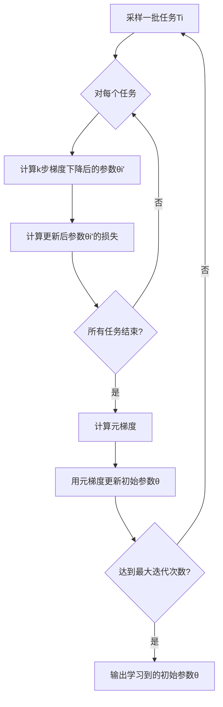

# Meta-Learning原理与代码实例讲解

## 1.背景介绍
### 1.1 什么是元学习 
元学习(Meta-Learning),又称为"Learning to Learn",是机器学习领域的一个重要分支。它的目标是让机器学习算法能够快速适应新的任务和环境,通过学习如何学习(learn how to learn)来提高学习的效率和效果。

### 1.2 元学习的研究意义
传统的机器学习需要大量的有标注数据和计算资源,难以快速适应新的任务。而元学习通过从以往学习的经验中总结规律,学习如何高效地学习,可以大大提高学习的效率,降低对数据和计算资源的依赖。这对于解决小样本学习、快速适应、持续学习等实际应用场景具有重要意义。

### 1.3 元学习的发展历程
元学习的概念最早由Jurgen Schmidhuber在1987年提出,之后Yoshua Bengio等人在1990年代对其进行了进一步的研究。近年来,随着深度学习的发展,元学习重新引起了广泛关注。一些代表性的工作包括:
- Andrychowicz等人在2016年提出了学习优化器的方法 
- Finn等人在2017年提出了MAML(Model-Agnostic Meta-Learning)算法
- Mishra等人在2018年提出了SNAIL(Simple Neural Attentive Learner)模型

## 2.核心概念与联系
### 2.1 元学习的分类
元学习主要可以分为三大类:
- 基于度量的元学习(Metric-based Meta-Learning):通过学习一个度量空间,来度量不同任务之间的相似性,从而实现快速适应。代表算法有Siamese Networks, Matching Networks, Prototypical Networks等。
- 基于模型的元学习(Model-based Meta-Learning):学习一个可以快速适应新任务的模型,代表算法有MAML, Reptile, LEO等。 
- 基于优化的元学习(Optimization-based Meta-Learning):学习一个优化过程,来指导模型快速适应新任务,代表算法有LSTM-based meta-learner, Meta-SGD等。

### 2.2 元学习与迁移学习、终身学习的关系
元学习与迁移学习、终身学习有一定的相似之处,都是为了提高模型的泛化和适应能力。但也有所区别:
- 迁移学习侧重于将已学习的知识迁移到新的相关任务,注重知识的重用。
- 终身学习侧重于在连续的学习过程中不断积累知识,注重知识的增量学习和不遗忘。 
- 元学习则侧重于学习"如何学习"的能力,从学习经验中总结规律,注重学习效率的提升。

它们之间也有一定的联系,元学习可以用于实现更有效的迁移学习和终身学习。通过元学习提取的学习策略,可以指导模型更高效地进行迁移和增量学习。

### 2.3 元学习的核心要素
元学习主要包含三个核心要素:
- 学习任务的分布:元学习需要构建一系列相关但不完全相同的学习任务,让学习器从中学习如何适应新任务。
- 学习器的结构:元学习需要设计一个学习器的结构,使其能够提取通用的学习策略。学习器可以是一个优化算法、一个RNN、一个度量函数等。
- 元优化过程:元学习通过元优化来最小化学习器在一系列任务上的损失,从而训练出一个通用的学习器。元优化一般采用二次优化的方式。

## 3.核心算法原理具体操作步骤
下面以MAML算法为例,详细讲解元学习的核心算法原理和操作步骤。

### 3.1 MAML算法原理
MAML(Model-Agnostic Meta-Learning)是一种基于梯度的元学习算法,其核心思想是学习一个模型的初始参数,使其能够通过少量步骤的梯度下降快速适应新任务。

具体来说,MAML的训练过程如下:
1. 在每个元训练步骤,从任务分布中采样一个batch的任务Ti。
2. 对每个任务Ti,计算模型参数θ经过k步梯度下降后的参数θi':
$$
\theta_i' = \theta - \alpha \nabla_\theta \mathcal{L}_{T_i}(f_\theta) 
$$
其中$\alpha$是内循环学习率,$\mathcal{L}_{T_i}$是任务Ti上的损失函数。通常取k=1。
3. 计算更新后参数θi'在任务Ti上的损失$\mathcal{L}_{T_i}(f_{\theta_i'})$。 
4. 对所有任务梯度求平均,计算元梯度:
$$
\nabla_\theta \sum_{T_i \sim p(\mathcal{T})} \mathcal{L}_{T_i}(f_{\theta_i'}) 
$$
5. 用元梯度更新初始参数θ:
$$
\theta \leftarrow \theta - \beta \nabla_\theta \sum_{T_i \sim p(\mathcal{T})} \mathcal{L}_{T_i}(f_{\theta_i'})
$$
其中$\beta$是元学习率。

经过多次元训练步骤,就可以学习到一个良好的初始参数θ,使模型能够通过少量步骤的微调快速适应新任务。

### 3.2 MAML算法流程图
下面是MAML算法的流程图:



### 3.3 MAML算法的优缺点
MAML算法的优点包括:
- 可以适用于各种模型结构,具有较好的通用性。
- 相比其他元学习方法,MAML具有更好的泛化性和稳定性。
- 实现简单,易于理解和应用。

MAML算法的缺点包括: 
- 计算开销大,需要二次梯度计算。
- 对初始参数敏感,容易收敛到不好的局部最优。
- 适用于小样本学习,但在大样本情况下优势不明显。

## 4.数学模型和公式详细讲解举例说明
为了更清晰地理解MAML的数学模型,下面我们以一个简单的Few-shot分类任务为例进行详细说明。

### 4.1 问题定义
假设我们要解决一个N-way K-shot的分类任务,即每个任务有N个类别,每个类别有K个样本。我们的目标是训练一个分类器,使其能够在给定K个样本的情况下,对新的类别进行分类。

我们用$\mathcal{T} = \{ (\mathbf{x}_1,y_1), \dots, (\mathbf{x}_{N\times K},y_{N\times K}) \}$表示一个任务,其中$\mathbf{x}_i \in \mathbb{R}^D$是D维的输入特征,$y_i \in \{1,\dots,N\}$是对应的类别标签。

### 4.2 模型结构
我们使用一个简单的线性分类器$f_\theta(\mathbf{x}) = \mathbf{W}\mathbf{x} + \mathbf{b}$作为我们的基础模型,其中$\theta = \{\mathbf{W}, \mathbf{b}\}$是模型的参数。$\mathbf{W} \in \mathbb{R}^{N\times D}$是权重矩阵,$\mathbf{b} \in \mathbb{R}^N$是偏置向量。

给定一个输入$\mathbf{x}$,模型的输出$f_\theta(\mathbf{x}) \in \mathbb{R}^N$表示$\mathbf{x}$属于每个类别的得分。我们可以用Softmax函数将其转化为概率分布:

$$
p(y|\mathbf{x};\theta) = \text{Softmax}(f_\theta(\mathbf{x}))_y = \frac{\exp(f_\theta(\mathbf{x})_y)}{\sum_{i=1}^N \exp(f_\theta(\mathbf{x})_i)}
$$

其中$p(y|\mathbf{x};\theta)$表示在参数$\theta$下,$\mathbf{x}$属于类别$y$的概率。

### 4.3 损失函数
对于一个任务$\mathcal{T}$,我们可以定义其损失函数为负对数似然:

$$
\mathcal{L}_{\mathcal{T}}(\theta) = -\frac{1}{NK} \sum_{(\mathbf{x},y)\in\mathcal{T}} \log p(y|\mathbf{x};\theta)
$$

### 4.4 MAML的适应过程
现在我们来看MAML算法在该任务上的适应过程。对于一个新的任务$\mathcal{T}$,我们首先从初始参数$\theta$出发,经过$k$步梯度下降得到适应后的参数$\theta'$:

$$
\begin{aligned}
\theta' &= \theta - \alpha \nabla_\theta \mathcal{L}_{\mathcal{T}}(\theta) \\
&= \theta - \alpha \nabla_\theta \left[ -\frac{1}{NK} \sum_{(\mathbf{x},y)\in\mathcal{T}} \log p(y|\mathbf{x};\theta) \right] \\
&= \theta + \frac{\alpha}{NK} \sum_{(\mathbf{x},y)\in\mathcal{T}} \nabla_\theta \log p(y|\mathbf{x};\theta)
\end{aligned}
$$

其中$\alpha$是适应学习率。直观地看,这个过程就是用任务$\mathcal{T}$的数据对初始参数$\theta$进行微调,得到适应后的参数$\theta'$。

### 4.5 MAML的元训练过程
在元训练阶段,我们的目标是找到一个好的初始参数$\theta$,使得经过上述适应过程后,模型能够在新任务上取得尽可能低的损失。

形式化地,我们要最小化所有任务上适应后损失的期望:

$$
\min_\theta \mathbb{E}_{\mathcal{T}\sim p(\mathcal{T})} [\mathcal{L}_{\mathcal{T}}(\theta')]
$$

其中$p(\mathcal{T})$是任务的分布,$\theta'$是经过适应后的参数。

根据链式法则,我们可以计算元梯度:

$$
\nabla_\theta \mathbb{E}_{\mathcal{T}\sim p(\mathcal{T})} [\mathcal{L}_{\mathcal{T}}(\theta')] = \mathbb{E}_{\mathcal{T}\sim p(\mathcal{T})} [\nabla_{\theta'} \mathcal{L}_{\mathcal{T}}(\theta') \cdot \nabla_\theta \theta']
$$

其中$\nabla_\theta \theta'$可以通过求导得到:

$$
\nabla_\theta \theta' = I - \alpha \nabla_\theta^2 \mathcal{L}_{\mathcal{T}}(\theta)
$$

这里$I$是单位矩阵,$\nabla_\theta^2 \mathcal{L}_{\mathcal{T}}(\theta)$是损失函数的海森矩阵。

有了元梯度,我们就可以用梯度下降法更新初始参数$\theta$:

$$
\theta \leftarrow \theta - \beta \nabla_\theta \mathbb{E}_{\mathcal{T}\sim p(\mathcal{T})} [\mathcal{L}_{\mathcal{T}}(\theta')]
$$

其中$\beta$是元学习率。

通过不断进行这个元训练过程,我们最终可以得到一个好的初始参数$\theta^*$,使得模型能够快速适应新的任务。

## 5.项目实践:代码实例和详细解释说明
下面我们通过一个简单的代码实例,来演示如何用PyTorch实现MAML算法。

### 5.1 任务构建
首先我们构建一个简单的Few-shot分类任务。我们使用Omniglot数据集,它包含了50个不同字母表中的1623个手写字符,每个字符有20个样本。

我们将任务定义为5-way 1-shot的分类,即每个任务有5个随机选择的字符类别,每个类别有1个样本用于适应,15个样本用于评估。

```python
import random
import numpy as np
from PIL import Image

class OmniglotTask:
    def __init__(self, data_path, n_way, k_shot, q_query):
        self.n_way = n_way
        self.k_shot = k_shot