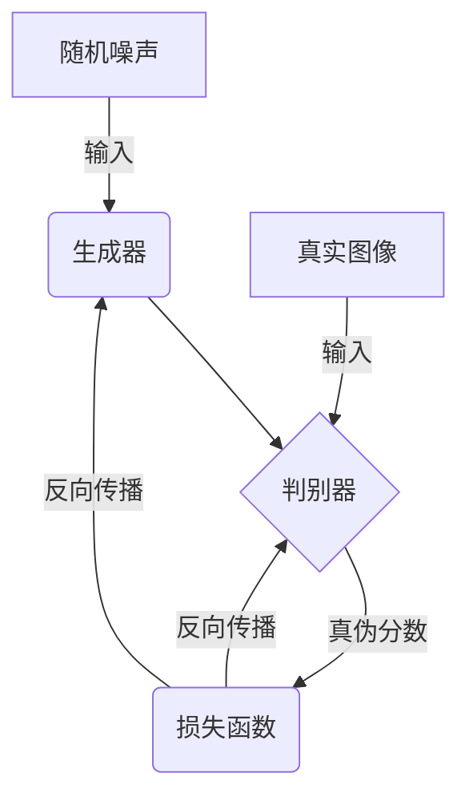
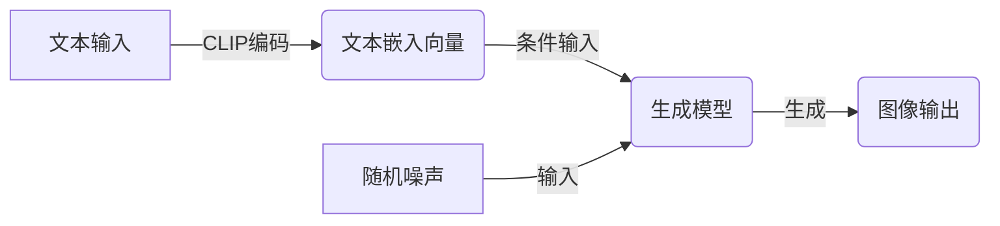

# Midjourney原理与代码实例讲解

## 1.背景介绍

### 1.1 什么是Midjourney

Midjourney是一款基于人工智能的文本到图像生成工具,它可以根据用户输入的文本描述,生成相应的图像。Midjourney由一家名为Midjourney的初创公司开发,于2022年7月首次向公众开放。

### 1.2 Midjourney的发展历程

Midjourney的发展可以追溯到2021年,当时它的创始人David Holz开始探索将人工智能与艺术创作相结合的可能性。经过一年多的努力,Midjourney终于在2022年7月向公众发布了第一个版本。

自发布以来,Midjourney迅速在艺术创作者和AI爱好者中间流行开来。截至2023年5月,Midjourney拥有超过300万用户,每天生成超过500万张图像,成为目前最受欢迎的文本到图像AI工具之一。

### 1.3 Midjourney的重要意义

Midjourney的出现标志着人工智能在艺术创作领域的又一重大突破。传统上,艺术创作被视为人类独有的能力,需要创造力、想象力和技巧。但Midjourney证明,通过训练合适的AI模型,机器也能生成出富有创意和艺术性的图像作品。

Midjourney不仅为艺术创作提供了新的可能性,也为人工智能在其他领域的应用打开了大门。它展示了通过提示工程(Prompt Engineering),人类可以更好地控制和引导AI模型的输出,使AI模型的能力发挥到极致。

## 2.核心概念与联系

### 2.1 生成式对抗网络(GAN)

Midjourney的核心技术是生成式对抗网络(Generative Adversarial Network, GAN)。GAN包含两个神经网络:生成器(Generator)和判别器(Discriminator)。

生成器的任务是从随机噪声中生成逼真的图像数据,而判别器的任务是区分生成器生成的图像和真实图像。生成器和判别器相互对抗,生成器不断努力生成更逼真的图像以欺骗判别器,而判别器也在不断提高对真伪图像的判断能力。

通过这种对抗训练,生成器最终能够生成出高度逼真、难以与真实图像区分的图像。



### 2.2 扩散模型(Diffusion Model)

除了GAN之外,Midjourney还采用了扩散模型(Diffusion Model)的技术。扩散模型是一种新兴的生成模型,可以学习复杂数据的概率分布,并从该分布中高质量地采样生成新数据。

扩散模型的工作原理是首先将数据(如图像)通过一系列扩散步骤转换为纯噪声,然后学习从噪声中重建原始数据的过程。在生成新数据时,模型从纯噪声开始,通过逆向的过程生成所需的输出。

相比GAN,扩散模型在生成高分辨率和复杂图像时表现更加出色,能够捕捉更多细节和结构信息。Midjourney结合了GAN和扩散模型的优势,从而实现了更高质量的图像生成能力。

### 2.3 文本到图像(Text-to-Image)

Midjourney属于文本到图像(Text-to-Image)的范畴,即根据用户输入的文本描述生成相应的图像。这需要将文本和图像两种不同模态的信息融合在一起。

Midjourney采用了一种称为CLIP(Contrastive Language-Image Pre-training)的技术来实现文本到图像的映射。CLIP是一种大规模的视觉语言预训练模型,它可以学习图像和文本之间的语义关联。

在生成图像时,Midjourney首先将用户输入的文本通过CLIP编码为一个文本嵌入向量,然后将该向量作为条件输入到生成模型(GAN或扩散模型)中,指导模型生成与文本描述相匹配的图像。



## 3.核心算法原理具体操作步骤

Midjourney的核心算法可以概括为以下几个主要步骤:

1. **文本编码**:将用户输入的文本描述通过CLIP模型编码为一个文本嵌入向量。

2. **噪声采样**:从一个高斯分布中采样一个随机噪声张量,作为生成模型的初始输入。

3. **条件注入**:将文本嵌入向量与噪声张量进行融合,作为生成模型的条件输入。

4. **迭代修正**:生成模型通过多次迭代,不断修正噪声张量,使其逐步逼近目标图像。每一次迭代都会参考文本嵌入向量,确保生成的图像与文本描述相匹配。

5. **图像生成**:当迭代次数达到预设值时,生成模型输出最终的图像结果。

6. **反馈优化**:用户可以根据生成的图像提供反馈,Midjourney会结合反馈信息,对文本嵌入向量进行微调,并重复上述步骤生成新的图像。

以上步骤在Midjourney的不同模型(如GAN或扩散模型)中的具体实现细节可能有所不同,但总的原理是相似的。

## 4.数学模型和公式详细讲解举例说明

### 4.1 生成式对抗网络(GAN)

生成式对抗网络(GAN)包含两个主要部分:生成器(Generator)G和判别器(Discriminator)D。生成器的目标是从一个潜在空间(latent space)中采样,生成逼真的数据样本;而判别器的目标是将真实数据和生成器生成的数据进行区分。

生成器G和判别器D通过一个minimax博弈来进行对抗训练,目标函数可以表示为:

$$\min_G \max_D V(D,G) = \mathbb{E}_{x\sim p_{data}(x)}[\log D(x)] + \mathbb{E}_{z\sim p_z(z)}[\log(1-D(G(z)))]$$

其中:
- $p_{data}(x)$是真实数据的分布
- $p_z(z)$是生成器输入噪声的先验分布,通常是高斯分布或均匀分布
- $G(z)$表示生成器从噪声$z$生成的数据样本
- $D(x)$表示判别器对数据$x$为真实数据的概率得分

在训练过程中,生成器G努力生成逼真的样本以欺骗判别器D,而判别器D则努力提高对真伪数据的判别能力。通过这种对抗训练,生成器最终能够捕获真实数据分布,生成高质量的样本。

### 4.2 扩散模型(Diffusion Model)

扩散模型的核心思想是通过学习从纯噪声到真实数据的逆向过程,从而实现数据生成。这个过程可以形式化为一个马尔可夫链,包含以下两个主要步骤:

1. **正向扩散过程**:将真实数据$x_0$通过$T$步扩散过程转化为纯噪声$x_T$,每一步扩散过程可表示为:

$$q(x_t|x_{t-1}) = \mathcal{N}(x_t;\sqrt{1-\beta_t}x_{t-1},\beta_tI)$$

其中$\beta_t$是一个预定义的扩散系数,控制每一步扩散的强度。

2. **逆向生成过程**:从纯噪声$x_T$出发,通过$T$步逆向过程生成目标数据$x_0$,每一步生成过程可表示为:

$$p_\theta(x_{t-1}|x_t) = \mathcal{N}(x_{t-1};\mu_\theta(x_t,t),\Sigma_\theta(x_t,t))$$

其中$\mu_\theta$和$\Sigma_\theta$是神经网络模型需要学习的均值和方差函数。

在训练过程中,模型的目标是最大化逆向生成过程的似然:

$$\max_\theta \mathbb{E}_{x_0,\epsilon}\left[\log p_\theta(x_0|\sqrt{\overline{\alpha}_T}x_T)\right]$$

其中$\overline{\alpha}_T = \prod_{t=1}^T \alpha_t$,而$\alpha_t = 1 - \beta_t$。

通过学习这个逆向过程,扩散模型能够从纯噪声中生成高质量的数据样本。

### 4.3 CLIP模型

CLIP(Contrastive Language-Image Pre-training)是一种大规模的视觉语言预训练模型,用于学习图像和文本之间的语义关联。

CLIP的核心思想是通过对比学习(Contrastive Learning)的方式,在大量的图像-文本对上进行预训练,使得图像和文本在同一个向量空间中具有相似的表示。

具体来说,给定一个图像-文本对$(i,t)$,CLIP模型包含两个编码器:图像编码器$f_I$和文本编码器$f_T$,分别将图像$i$和文本$t$编码为向量表示$f_I(i)$和$f_T(t)$。

然后,CLIP模型通过最大化图像-文本对的相似性得分,同时最小化图像-文本对的不相似性得分,来进行训练。具体的损失函数为:

$$\mathcal{L}_{i,t} = -\log\frac{e^{s(i,t)}}{e^{s(i,t)} + \sum_{t'\neq t}e^{s(i,t')}} - \log\frac{e^{s(i,t)}}{e^{s(i,t)} + \sum_{i'\neq i}e^{s(i',t)}}$$

其中$s(i,t) = f_I(i)^\top f_T(t) / \tau$是图像$i$和文本$t$的相似性得分,而$\tau$是一个温度超参数。

通过这种对比学习的方式,CLIP模型能够学习到图像和文本之间的语义关联,为文本到图像的生成任务提供有效的条件信息。

## 5.项目实践:代码实例和详细解释说明

在这一部分,我们将通过一个简单的代码示例,演示如何使用Python和相关库来实现一个基本的文本到图像生成系统,并解释关键代码的作用。

### 5.1 环境配置

首先,我们需要安装所需的Python库,包括PyTorch、Diffusers和Transformers等。可以使用pip进行安装:

```bash
pip install torch diffusers transformers
```

### 5.2 导入库

接下来,在Python代码中导入所需的库:

```python
import torch
from diffusers import StableDiffusionPipeline
from transformers import CLIPTextModel, CLIPTokenizer
```

- `torch`是PyTorch库,用于构建和训练神经网络模型。
- `StableDiffusionPipeline`是Diffusers库中的一个管道,用于运行稳定扩散模型进行文本到图像生成。
- `CLIPTextModel`和`CLIPTokenizer`是Transformers库中的CLIP模型和tokenizer,用于将文本编码为向量表示。

### 5.3 加载模型

然后,我们加载预训练的稳定扩散模型和CLIP模型:

```python
device = "cuda" if torch.cuda.is_available() else "cpu"
model_id = "runwayml/stable-diffusion-v1-5"

pipe = StableDiffusionPipeline.from_pretrained(model_id, torch_dtype=torch.float16, revision="fp16", use_auth_token=True)
pipe = pipe.to(device)

clip_model = CLIPTextModel.from_pretrained("openai/clip-vit-base-patch32")
tokenizer = CLIPTokenizer.from_pretrained("openai/clip-vit-base-patch32")
```

这里我们使用了`runwayml/stable-diffusion-v1-5`模型作为示例。`pipe`是稳定扩散模型的管道对象,而`clip_model`和`tokenizer`分别是CLIP模型和tokenizer。

### 5.4 文本编码

接下来,我们定义一个函数来将文本编码为CLIP向量表示:

```python
def encode_text(text):
    inputs = tokenizer(text, padding=True, return_tensors="pt")
    with torch.no_grad():
        embeddings = clip_model(**inputs