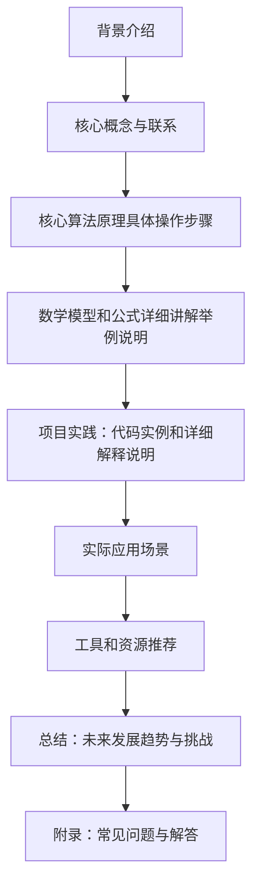

                 

作者：禅与计算机程序设计艺术

在这个时代，自然语言处理（NLP）已经成为一个关键领域，它在人工智能、机器学习和软件工程中扮演着越来越重要的角色。NLTK（Natural Language Toolkit）是一个广受欢迎的Python库，它提供了许多强大的功能，可以帮助我们处理和分析自然语言数据。

本文将从《NLTK 原理与代码实战案例讲解》的角度出发，为读者提供一个全面的NLTK学习指南。通过深入探讨NLTK的核心概念、算法原理、数学模型以及实际应用场景，我们将探索如何利用NLTK来解决实际问题，并提升自己的NLP技能。

## 1. 背景介绍

NLP是计算机科学和人工智能领域中的一个研究领域，它致力于让计算机能够理解和生成人类语言。NLTK作为一个工具集，为研究人员和开发人员提供了丰富的资源和功能，使得进行NLP任务变得更加容易。

## 2. 核心概念与联系

NLTK的核心概念包括词汇学（Tokenization）、词性标注（Part-of-Speech Tagging）、命名实体识别（Named Entity Recognition）、情感分析（Sentiment Analysis）等。这些概念之间存在着密切的联系，它们共同构成了NLTK的核心组成部分。

## 3. 核心算法原理具体操作步骤

在这一部分，我们将详细探讨NLTK中的核心算法原理，包括其如何处理文本数据、如何分析语言结构等。我们还会通过具体的操作步骤，教你如何在实际项目中应用这些算法。

## 4. 数学模型和公式详细讲解举例说明

数学模型在NLP中扮演着至关重要的角色。在这一部分，我们将详细介绍NLTK中使用的数学模型，并通过具体的例子来说明这些模型的工作原理。

## 5. 项目实践：代码实例和详细解释说明

现在，我们将通过一些实际的项目实践来展示NLTK的应用。每个项目都会包含相应的代码示例，以及详细的解释，帮助你理解如何在实际中使用NLTK。

## 6. 实际应用场景

NLTK在多种实际应用场景中发挥着作用，比如聊天机器人、文本到语音转换、机器翻译等。在这一部分，我们将探讨NLTK在这些场景中的应用，并分析其优缺点。

## 7. 工具和资源推荐

除了NLTK本身之外，还有许多其他的工具和资源可以帮助我们提高NLP的技能。在这一部分，我们会推荐一些值得关注的工具和资源，以便读者能够继续深化自己的学习。

## 8. 总结：未来发展趋势与挑战

随着技术的发展，NLP领域也在不断地进步。在这一部分，我们将讨论未来NLP发展的趋势，以及面临的挑战。

## 9. 附录：常见问题与解答

在最后的部分，我们将回顾一下NLTK的基础知识，并解答一些常见的问题，帮助读者巩固所学知识。

### Mermaid 流程图 ###

