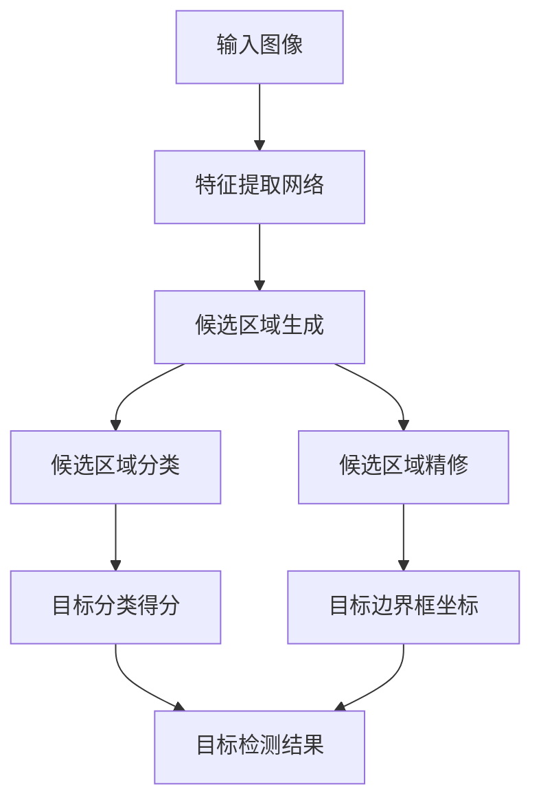

# Object Detection原理与代码实例讲解

## 1. 背景介绍

在当今的计算机视觉领域,对象检测(Object Detection)是一项非常重要和具有挑战性的任务。它旨在从给定的图像或视频中定位并识别出感兴趣的目标对象。对象检测技术广泛应用于各种领域,包括安防监控、自动驾驶、机器人视觉、人脸识别等。随着深度学习技术的不断发展,基于卷积神经网络(CNN)的对象检测算法取得了长足的进步,在准确率和效率方面都有了显著的提升。

### 1.1 对象检测的挑战

对象检测任务面临着诸多挑战,例如:

- 目标尺度变化:同一类别的目标在图像中可能呈现出不同的大小尺度
- 视角变化:目标可能出现在不同的视角和姿态
- 遮挡:目标可能被其他物体部分或完全遮挡
- 复杂背景:目标可能出现在复杂的背景环境中,增加了检测的难度
- 目标变形:非刚性目标可能发生形变,如人体姿态变化

### 1.2 对象检测的发展历程

对象检测算法经历了传统机器学习方法和深度学习方法两个主要阶段:

- 传统机器学习方法:基于手工设计的特征提取和分类器,如HOG+SVM、Deformable Part Model等,准确率有限
- 深度学习方法:基于卷积神经网络(CNN)的端到端学习,取得了革命性的突破,代表算法有R-CNN、Fast R-CNN、Faster R-CNN、YOLO、SSD等

## 2. 核心概念与联系 

对象检测算法通常由以下几个核心模块组成:



1. **特征提取网络**:利用卷积神经网络从输入图像中提取语义特征图,作为后续步骤的特征表示
2. **候选区域生成**:在特征图上生成一组可能包含目标的候选区域,通常使用选择性搜索、区域候选网络(RPN)等方法
3. **候选区域分类**:对每个候选区域进行二分类(前景或背景),获得目标分类得分
4. **候选区域精修**:根据候选区域的特征,精修调整目标边界框的位置和尺度
5. **目标检测结果**:根据分类得分和调整后的边界框输出最终的目标检测结果

不同的对象检测算法在上述模块的实现细节上有所差异,但总体遵循这一范式。接下来将详细介绍一些经典算法的原理和实现。

## 3. 核心算法原理具体操作步骤

### 3.1 R-CNN

R-CNN(Region-based Convolutional Neural Networks)是第一个将深度学习应用于对象检测的经典算法,它的主要步骤如下:

1. **选择性搜索(Selective Search)**:使用底层分割算法在输入图像上生成约2000个候选区域
2. **特征提取**:将每个候选区域缩放到固定尺寸,输入预训练的CNN(如AlexNet)提取特征
3. **分类器训练**:使用提取的特征,训练一个SVM分类器进行二分类(前景或背景)
4. **边界框回归**:训练一个线性回归模型,根据分类器得分调整候选区域的位置,获得最终的目标检测结果

R-CNN取得了当时最先进的检测精度,但由于需要对每个候选区域分别进行特征提取和分类,计算效率非常低下。

### 3.2 Fast R-CNN

为了提高R-CNN的效率,Fast R-CNN做出了以下改进:

1. **特征提取**:整个图像只需通过CNN提取一次特征图
2. **区域池化(RoI Pooling)**:使用区域池化层从特征图上提取候选区域的特征
3. **统一网络**:将分类和边界框回归整合到一个统一的网络中进行端到端的训练

Fast R-CNN将特征提取和分类预测统一到一个网络中,大大提高了计算效率,同时保持了较高的检测精度。

### 3.3 Faster R-CNN

Faster R-CNN在Fast R-CNN的基础上进一步引入了区域候选网络(RPN),实现了端到端的一体化目标检测:

1. **特征提取**:使用预训练的CNN(如VGG、ResNet等)提取整张图像的特征图
2. **区域候选网络(RPN)**:在特征图上滑动窗口,并行预测候选区域的分数和位置
3. **区域池化**:使用RPN生成的候选区域提取对应的特征
4. **分类和回归**:将提取的特征输入两个并行的全连接层,分别预测目标分类和边界框位置

Faster R-CNN将区域候选的生成和目标检测整合到一个统一的网络中,进一步提高了检测速度,成为目前主流的检测框架。

### 3.4 YOLO

YOLO(You Only Look Once)是一种基于回归的单阶段目标检测算法,其核心思想是将目标检测任务转化为一个回归问题,直接从图像像素预测目标边界框和类别,主要步骤如下:

1. **网格划分**:将输入图像划分为S×S个网格
2. **边界框预测**:每个网格预测B个边界框及其置信度
3. **类别预测**:每个网格预测C个类别概率
4. **非极大值抑制(NMS)**:使用NMS去除重复的边界框

YOLO的优点是速度快,能够实时处理视频流,但缺点是对小目标的检测精度较低。

### 3.5 SSD

SSD(Single Shot MultiBox Detector)是另一种流行的单阶段目标检测算法,其主要步骤包括:

1. **特征提取网络**:使用卷积网络(如VGG、ResNet等)提取多尺度特征图
2. **先验框生成**:在每个特征图上生成一组先验框(默认边界框)
3. **多尺度特征映射**:将来自不同层的特征图映射到同一维度
4. **密集预测**:对每个先验框同时预测其位置、置信度和类别
5. **非极大值抑制**:使用NMS去除重复检测结果

SSD在保持较高精度的同时,检测速度也很快,适合实时应用场景。

以上介绍了几种经典的对象检测算法,每种算法在原理、优缺点和应用场景上都有所不同。总的来说,两阶段算法(如Faster R-CNN)精度更高但速度较慢,而单阶段算法(如YOLO、SSD)则以牺牲一定精度为代价,获得了更快的检测速度。

## 4. 数学模型和公式详细讲解举例说明

对象检测算法中涉及到许多数学模型和公式,下面将详细介绍其中的几个核心部分。

### 4.1 anchor box(先验框)

先验框(anchor box)是对象检测算法中一个非常重要的概念,尤其在单阶段算法(如YOLO、SSD)中扮演着关键角色。先验框是一组预先定义好的、具有不同尺度和长宽比的参考框,用于匹配图像中的目标边界框。

在SSD算法中,先验框是通过手工设计的方式确定的。设图像尺寸为 $m\times n$,特征图的尺寸为 $a\times b$,那么每个先验框在图像上的实际尺寸为:

$$
box_{w} = m \times s_k \times \sqrt{a_r}
$$
$$
box_{h} = n \times s_k \times \sqrt{a_r}
$$

其中 $s_k$ 表示当前特征层相对于输入图像的尺度比例, $a_r$ 表示先验框的长宽比。通过设置不同的 $s_k$ 和 $a_r$,可以生成多种不同尺度和长宽比的先验框。

在 Faster R-CNN 算法中,先验框是通过数据驱动的方式自动学习得到的。具体来说,在区域候选网络(RPN)中,每个滑动窗口不仅预测前景/背景分数,还会并行预测 $k$ 个先验框的位置偏移量,从而获得最终的候选区域。这种方式避免了手工设计先验框的困难,可以自动适应数据分布。

### 4.2 IoU(交并比)

IoU(Intersection over Union)即交并比,是对象检测算法中常用的一种评估指标,用于衡量预测边界框与真实边界框之间的重叠程度。IoU的计算公式如下:

$$
IoU = \frac{Area\ of\ Overlap}{Area\ of\ Union}
$$

其中,Overlap表示预测框与真实框的交集区域,Union表示两个框的并集区域。IoU的取值范围在[0,1]之间,值越大表示预测越准确。

在对象检测算法的训练过程中,通常会设置一个IoU阈值(如0.5),当预测框与真实框的IoU大于该阈值时,才将其视为正样本,否则为负样本。这种基于IoU的正负样本划分方式,能够有效地约束模型学习更加精确的目标定位能力。

### 4.3 损失函数

对象检测算法的损失函数通常由分类损失和回归损失两部分组成:

$$
Loss = Loss_{cls} + \lambda Loss_{reg}
$$

其中 $Loss_{cls}$ 表示分类损失, $Loss_{reg}$ 表示回归损失,而 $\lambda$ 是一个权重系数,用于平衡两个损失项的重要性。

**分类损失**通常使用交叉熵损失(Cross Entropy Loss),公式如下:

$$
Loss_{cls}(p, p^*) = -\sum_{i}p_i^*\log(p_i)
$$

其中 $p$ 表示预测的类别概率分布, $p^*$ 表示真实的类别标签,对于二分类问题,只需要计算前景和背景两个类别的损失。

**回归损失**则用于约束预测的边界框位置,常用的有 $L1$ 损失和 $L2$ 损失,公式分别为:

$$
Loss_{reg}(t, t^*) = \sum_i\rho(t_i - t_i^*)
$$
$$
\rho(x) = 
\begin{cases}
0.5x^2, & \text{if }|x| < 1\\
|x| - 0.5, & \text{otherwise}
\end{cases}
$$

其中 $t$ 表示预测的边界框位置参数, $t^*$ 表示真实的边界框位置参数, $\rho$ 是平滑的 $L1$ 损失函数。

在实际训练中,通常还会引入一些其他的正则化项,如难例挖掘(Hard Example Mining)、在线难例挖掘(Online Hard Example Mining)等,以进一步提升模型的泛化能力。

## 5. 项目实践:代码实例和详细解释说明

为了更好地理解对象检测算法的原理和实现细节,我们将基于PyTorch框架,使用开源的COCO数据集,实现一个基于Faster R-CNN的对象检测项目。完整的代码实例可以在GitHub上获取: [https://github.com/CommanderRobot/object-detection-demo](https://github.com/CommanderRobot/object-detection-demo)

### 5.1 数据准备

首先,我们需要下载COCO数据集,并将其解压到指定目录。COCO数据集包含了80个常见物体类别的图像和标注信息。

```python
import torchvision

# 下载COCO数据集
dataset = torchvision.datasets.CocoDetection(root='data/coco', download=True)
```

### 5.2 模型定义

接下来,我们定义Faster R-CNN模型。PyTorch提供了预训练的ResNet和FPN(特征金字塔网络)backbone,我们将其与RPN和检测头(detection head)组合,构建完整的Faster R-CNN模型。

```python
import torchvision
from torchvision.models.detection.faster_rcnn import FastRCNNPredictor

# 加载预训练的ResNet-FPN backbone
backbone = torchvision.models.detection.backbone_utils.resnet_fpn_backbone('resnet50', pretrained=True)

# 定义RPN
rpn_anchor_generator = torchvision.models.detection.rpn.AnchorGenerator(sizes=(32, 64, 128, 256, 512), aspect_ratios=(