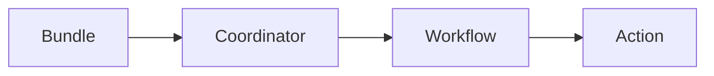

# Oozie工作流调度系统原理与代码实例讲解

## 1. 背景介绍

### 1.1 大数据处理的工作流调度需求
在大数据处理领域,我们经常需要按照一定的顺序执行多个任务,形成一个完整的数据处理流程。这就需要一个工作流调度系统来协调和管理这些任务的执行。

### 1.2 Oozie的诞生
Apache Oozie应运而生,它是一个可扩展的工作流调度系统,用于管理Hadoop任务。Oozie使用有向无环图(DAG)来定义工作流,支持多种类型的Hadoop任务,如MapReduce、Pig、Hive等,可以很好地满足大数据处理的工作流调度需求。

### 1.3 Oozie在大数据生态系统中的地位
Oozie已经成为Hadoop生态系统中不可或缺的一部分,被广泛应用于各种大数据处理场景。理解Oozie的原理和使用方法,对于大数据开发者来说非常重要。

## 2. 核心概念与联系

### 2.1 Workflow
Workflow定义了一系列的Action节点,按照指定的依赖关系组成一个DAG。

### 2.2 Action
Action是Workflow中的一个节点,代表一个具体的任务,如MapReduce、Pig等。

### 2.3 Coordinator
Coordinator用于定义基于时间触发的Workflow,比如每天定时执行一个Workflow。

### 2.4 Bundle
Bundle用于打包一组Coordinator,批量提交和管理。

### 2.5 核心概念之间的联系
下面是Oozie核心概念之间的联系图:


## 3. 核心算法原理具体操作步骤

### 3.1 Workflow的执行原理
1. Oozie解析Workflow的定义文件
2. 构建DAG
3. 按照DAG的依赖关系,依次提交和执行Action
4. 所有Action执行完成后,Workflow执行完成

### 3.2 Coordinator的调度原理  
1. Oozie解析Coordinator的定义文件
2. 根据定义的时间规则,生成一系列的Workflow实例
3. 按照时间顺序,依次提交Workflow实例给Oozie执行

### 3.3 具体操作步骤
1. 编写Workflow/Coordinator定义文件
2. 将定义文件打包成一个APP
3. 使用Oozie命令或API提交APP
4. 启动Coordinator(如果是Coordinator APP)
5. 监控Workflow/Coordinator的执行进度和状态

## 4. 数学模型和公式详细讲解举例说明

### 4.1 DAG模型
Oozie使用DAG模型来定义Workflow中各个Action的依赖关系。数学上,DAG可以表示为:
$$G=(V,E)$$
其中,$V$表示顶点的集合,$E$表示有向边的集合。对于Workflow来说,每个Action就是一个顶点。

### 4.2 定时调度模型
Coordinator中的定时调度可以使用类似crontab的时间表达式来定义,例如:
```
0 0 * * *
```
表示每天0点执行。Oozie使用Quartz框架来解析时间表达式并触发定时调度。

## 5. 项目实践：代码实例和详细解释说明

### 5.1 Workflow示例
下面是一个简单的Workflow定义文件示例:
```xml
<workflow-app xmlns="uri:oozie:workflow:0.5" name="sample-wf">
    <start to="mr-node"/>
    <action name="mr-node">
        <map-reduce>
            <job-tracker>${jobTracker}</job-tracker>
            <name-node>${nameNode}</name-node>
            <configuration>
                <property>
                    <name>mapred.mapper.class</name>
                    <value>org.myorg.SampleMapper</value>
                </property>
                <property>
                    <name>mapred.reducer.class</name>
                    <value>org.myorg.SampleReducer</value>
                </property>
                <property>
                    <name>mapred.input.dir</name>
                    <value>/user/foo/input</value>
                </property>
                <property>
                    <name>mapred.output.dir</name>
                    <value>/user/foo/output</value>
                </property>
            </configuration>
        </map-reduce>
        <ok to="end"/>
        <error to="fail"/>
    </action>
    <kill name="fail">
        <message>MapReduce failed</message>
    </kill>
    <end name="end"/>
</workflow-app>
```
这个Workflow包含一个MapReduce Action。

- `start`节点指定Workflow的起始Action
- `action`节点定义了一个MapReduce任务的配置
- MapReduce执行成功后转移到`end`节点,失败则转移到`fail`节点
- `kill`节点定义了失败时的错误处理逻辑
- `end`节点标志着Workflow的结束

### 5.2 Coordinator示例
下面是一个简单的Coordinator定义文件示例:
```xml
<coordinator-app name="sample-coord" frequency="${coord:days(1)}" start="2023-06-01T00:00Z" end="2023-06-30T00:00Z" timezone="UTC" xmlns="uri:oozie:coordinator:0.4">
    <action>
        <workflow>
            <app-path>hdfs://localhost:9000/user/oozie/workflows/sample-wf</app-path>
        </workflow>
    </action>
</coordinator-app>
```
这个Coordinator每天执行一次Workflow。

- `coordinator-app`节点定义了Coordinator的属性,如名称、执行频率、起止时间等
- `action`节点指定要执行的Workflow

## 6. 实际应用场景

### 6.1 数据仓库ETL
使用Oozie可以很方便地编排Hive、Spark等组件完成数据ETL的工作流。

### 6.2 机器学习Pipeline
使用Oozie可以将特征工程、模型训练、模型评估等步骤串联成一个工作流,实现端到端的机器学习Pipeline。

### 6.3 数据分析报表
使用Oozie可以定时调度数据分析任务,生成各种报表,实现报表的自动化。

## 7. 工具和资源推荐

### 7.1 Oozie官方文档
Oozie的官方文档是学习和使用Oozie的权威资料。
https://oozie.apache.org/docs/

### 7.2 Hue
Hue是一个开源的Hadoop UI系统,提供了Oozie的可视化编辑与管理功能,使用起来非常方便。

### 7.3 ODI
ODI (Oozie Designer Interface)是一个Eclipse插件,提供了可视化的Oozie工作流设计功能。

## 8. 总结：未来发展趋势与挑战

### 8.1 云原生支持
随着云计算的发展,Oozie面临着向云原生架构演进的趋势,需要更好地与Kubernetes等云平台集成。

### 8.2 多云协同
在多云环境下,如何协调不同云平台上的任务调度,是Oozie面临的一大挑战。

### 8.3 语言和组件扩展
Oozie需要持续扩展对新的计算框架和语言的支持,以适应快速变化的大数据生态。

## 9. 附录：常见问题与解答

### 9.1 Oozie支持哪些类型的Action?
Oozie支持多种类型的Action,包括MapReduce、Pig、Hive、Spark、Shell等。

### 9.2 Oozie的HA是如何实现的?
Oozie的HA是通过Active-Standby两个节点实现的。如果Active节点故障,Standby节点可以快速接管,继续提供服务。

### 9.3 如何查看Oozie任务的执行日志?
可以在Oozie Web UI中查看任务执行日志,也可以通过命令行接口查看:
```
oozie job -info <job-id>
```

作者：禅与计算机程序设计艺术 / Zen and the Art of Computer Programming