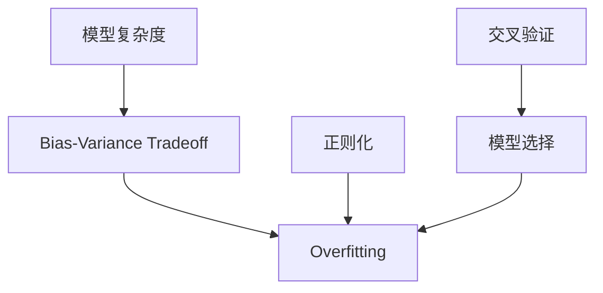

# Overfitting 原理与代码实战案例讲解

## 1. 背景介绍

### 1.1 什么是 Overfitting

Overfitting,中文称为"过拟合",是机器学习和统计学中的一个常见问题。它指的是模型过度拟合训练数据,以至于模型在训练集上表现很好,但在新的、看不见的数据上泛化能力很差的现象。

### 1.2 为什么会出现 Overfitting  

Overfitting 通常在模型复杂度过高,训练不足,或者训练数据有噪声的情况下发生。具体原因包括:

- 模型复杂度过高,参数过多
- 训练数据量太小
- 训练数据有噪声,标注错误等
- 训练轮数过多,模型过度拟合噪声

### 1.3 Overfitting 的危害

Overfitting 会导致以下问题:

- 模型泛化能力差,在新数据上表现不佳
- 模型可解释性差,可能学到一些无关特征
- 过度消耗计算资源

因此,我们需要采取一些措施来防止和缓解 Overfitting 问题。

## 2. 核心概念与联系

### 2.1 Bias-Variance Tradeoff

Bias-Variance Tradeoff 是理解 Overfitting 的核心概念。

- Bias: 模型的偏差,指模型的预测值与真实值之间的差异。Bias 越大,模型越简单,欠拟合。
- Variance: 模型的方差,指模型预测的变化范围。Variance 越大,模型越复杂,过拟合。

我们的目标是找到 Bias 和 Variance 的最佳平衡,得到泛化能力最好的模型。

### 2.2 模型复杂度

模型复杂度与 Overfitting 密切相关。模型越复杂,越容易过拟合。常见的模型复杂度包括:

- 参数数量: 模型参数越多,复杂度越高
- 模型深度: 神经网络层数越多,复杂度越高
- 特征维度: 特征维度越高,复杂度越高

### 2.3 正则化

正则化是缓解 Overfitting 的重要手段,通过对模型复杂度进行约束来控制 Overfitting。常见的正则化方法有:

- L1 正则化(Lasso): 使参数稀疏化
- L2 正则化(Ridge): 使参数值变小
- Dropout: 随机删除神经元,抑制过拟合

### 2.4 交叉验证 

交叉验证可以帮助我们选择最优模型,避免过拟合。常见的交叉验证方法有:

- K 折交叉验证: 将数据集分为 K 份,轮流作为验证集
- 留一交叉验证: 每次只留一个样本作为验证集

通过交叉验证,我们可以更准确地评估模型性能,选择泛化能力最好的模型。

以下是这些核心概念之间的联系:



## 3. 核心算法原理与具体操作步骤

### 3.1 L1/L2 正则化

L1 和 L2 正则化通过在损失函数中加入正则化项来约束模型复杂度。

- L1 正则化: 

$$J(\theta) = J(\theta) + \alpha \sum_{i=1}^n |\theta_i|$$

- L2 正则化:

$$J(\theta) = J(\theta) + \alpha \sum_{i=1}^n \theta_i^2$$

其中 $\alpha$ 是正则化系数,控制正则化强度。

具体步骤:
1. 定义带正则化项的损失函数
2. 选择合适的正则化系数 $\alpha$
3. 使用梯度下降等优化算法最小化损失函数
4. 评估模型性能,根据需要调整 $\alpha$

### 3.2 Dropout

Dropout 通过在训练过程中随机删除一部分神经元来抑制过拟合。

具体步骤:
1. 定义 Dropout 层,设置丢弃概率 $p$
2. 在训练过程中,以概率 $p$ 随机将神经元输出设为0  
3. 在测试过程中,将所有神经元输出乘以 $1-p$
4. 评估模型性能,根据需要调整 $p$

### 3.3 Early Stopping

Early Stopping 是一种通过提前停止训练来防止过拟合的方法。当验证集上的性能不再提升时,就停止训练。

具体步骤:
1. 将数据分为训练集和验证集
2. 定义合适的性能指标,如准确率、误差等
3. 在每个 epoch 结束时,在验证集上评估模型性能 
4. 如果连续几个 epoch 验证集性能都没有提升,则停止训练
5. 返回验证集性能最优的模型

## 4. 数学模型和公式详细讲解举例说明

### 4.1 L1/L2 正则化

- L1 正则化(Lasso)的数学模型:

$$\min_\theta \frac{1}{2m} \sum_{i=1}^m (h_\theta(x^{(i)}) - y^{(i)})^2 + \alpha \sum_{j=1}^n |\theta_j|$$

其中 $h_\theta(x)$ 是假设函数,$m$ 是样本数量,$n$ 是特征数量。

例如,对于线性回归模型 $h_\theta(x) = \theta^T x$,加入 L1 正则化后的损失函数为:

$$J(\theta) = \frac{1}{2m} \sum_{i=1}^m (\theta^T x^{(i)} - y^{(i)})^2 + \alpha \sum_{j=1}^n |\theta_j|$$

- L2 正则化(Ridge)的数学模型:

$$\min_\theta \frac{1}{2m} \sum_{i=1}^m (h_\theta(x^{(i)}) - y^{(i)})^2 + \alpha \sum_{j=1}^n \theta_j^2$$

例如,对于线性回归模型 $h_\theta(x) = \theta^T x$,加入 L2 正则化后的损失函数为:

$$J(\theta) = \frac{1}{2m} \sum_{i=1}^m (\theta^T x^{(i)} - y^{(i)})^2 + \alpha \sum_{j=1}^n \theta_j^2$$

### 4.2 Dropout

Dropout 的数学模型可以表示为:

$$r_j^{(l)} \sim \text{Bernoulli}(p)$$
$$\tilde{a}^{(l)} = r^{(l)} * a^{(l)}$$

其中 $r_j^{(l)}$ 是第 $l$ 层第 $j$ 个神经元的 Dropout 掩码,服从参数为 $p$ 的伯努利分布。$*$ 表示 element-wise 乘积。

在测试时,所有神经元输出需要乘以 $1-p$ 来补偿训练时丢弃的神经元:

$$a^{(l)} = (1-p) * a^{(l)}$$

例如,对于一个三层全连接神经网络,加入 Dropout 后的前向传播过程为:

$$a^{(1)} = x$$
$$z^{(2)} = W^{(1)} a^{(1)} + b^{(1)}$$
$$r^{(2)} \sim \text{Bernoulli}(p)$$  
$$\tilde{a}^{(2)} = r^{(2)} * \sigma(z^{(2)})$$
$$z^{(3)} = W^{(2)} \tilde{a}^{(2)} + b^{(2)}$$
$$y = \sigma(z^{(3)})$$

其中 $\sigma$ 是激活函数,如 sigmoid、ReLU 等。

## 5. 项目实践：代码实例和详细解释说明

下面是一些防止过拟合的 Python 代码实例。

### 5.1 L1/L2 正则化

以下是使用 Sklearn 实现 L1 和 L2 正则化的 Logistic 回归:

```python
from sklearn.linear_model import LogisticRegression

# L1 正则化
model_l1 = LogisticRegression(penalty='l1', C=1.0)
model_l1.fit(X_train, y_train)

# L2 正则化 
model_l2 = LogisticRegression(penalty='l2', C=1.0)
model_l2.fit(X_train, y_train)
```

其中 `penalty` 参数指定正则化类型,`C` 是正则化系数的倒数,越小正则化越强。

### 5.2 Dropout

以下是使用 Keras 实现 Dropout 的代码:

```python
from keras.models import Sequential
from keras.layers import Dense, Dropout

model = Sequential()
model.add(Dense(512, activation='relu', input_dim=num_features))
model.add(Dropout(0.5))
model.add(Dense(256, activation='relu'))
model.add(Dropout(0.5))
model.add(Dense(1, activation='sigmoid'))

model.compile(loss='binary_crossentropy',
              optimizer='adam', 
              metrics=['accuracy'])

model.fit(X_train, y_train, 
          epochs=20, batch_size=128,
          validation_data=(X_val, y_val))
```

在每个全连接层后添加一个 `Dropout` 层,`rate` 参数指定丢弃概率。

### 5.3 Early Stopping

以下是使用 Keras 实现 Early Stopping 的代码:

```python
from keras.callbacks import EarlyStopping

early_stopping = EarlyStopping(monitor='val_loss', patience=5)

model.fit(X_train, y_train,
          epochs=50, batch_size=128,
          validation_data=(X_val, y_val),
          callbacks=[early_stopping])
```

`EarlyStopping` 回调函数可以在验证集损失不再下降时提前终止训练。`monitor` 参数指定监控指标,`patience` 表示容忍多少个 epoch 没有提升。

## 6. 实际应用场景

Overfitting 在许多实际应用中都可能出现,例如:

- 垃圾邮件分类: 训练数据有限,模型可能过度拟合某些特殊词汇
- 图像识别: 训练样本有噪声,模型可能学到背景等无关特征
- 自然语言处理: 语料库较小,模型可能过拟合低频词汇

针对这些场景,我们可以采取以下策略:

- 增加训练样本,提高数据质量
- 使用正则化方法,如 L1/L2 正则化、Dropout 等
- 进行特征选择,去除无关特征
- 使用集成学习,结合多个模型的预测

## 7. 工具和资源推荐

以下是一些有助于理解和解决 Overfitting 问题的工具和资源:

- Scikit-learn: 机器学习库,提供了多种正则化模型
- Keras: 深度学习框架,内置 Dropout 等正则化技术
- TensorFlow: 端到端的机器学习平台,支持各种模型和正则化方法
- Regularization Explained: 图文并茂地解释正则化的博客文章
- Dropout: A Simple Way to Prevent Neural Networks from Overfitting: Dropout 的原始论文

## 8. 总结：未来发展趋势与挑战

### 8.1 趋势预测

- 更先进的正则化技术不断涌现,如 DropConnect、Zoneout 等
- 基于数据增强的方法越来越多,如 Mixup、Cutout 等
- 迁移学习可以利用预训练模型来减轻过拟合
- AutoML 技术帮助自动调参,减少人工尝试

### 8.2 面临的挑战

- 高维数据更容易过拟合,需要更有效的特征选择方法
- 样本噪声和标注错误影响模型泛化,需要数据清洗技术
- 模型可解释性有待提高,过拟合的原因有时难以分析
- 计算资源有限,大规模数据和模型的训练成本高

## 9. 附录：常见问题与解答

### Q1: 如何判断模型是否过拟合?

A: 通常看训练集和验证集上的性能差异。如果训练集上性能远好于验证集,则可能过拟合了。也可以观察学习曲线,过拟合时验证集误差会在某个点后上升。

### Q2: 正则化力度多大合适?

A: 可以通过交叉验证来选择最优正则化系数。太小则欠拟合,太大则过拟合。通常从一个较小值开始,逐渐增大直到验证集性能不再提升。

### Q3: Dropout 率设为多少合适?

A: 通常在 0.2 到 0.5 之间。可以根据验证集性能来调整。Dropout 率越大,正则化