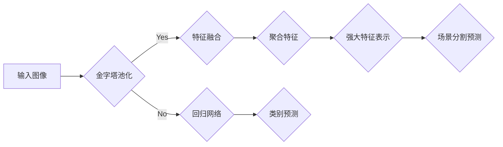

                 

作者：禅与计算机程序设计艺术

Hello! Welcome to our blog on PSPNet, where we will delve into its principles and provide code examples for a deeper understanding. Let's dive in.

## 1. 背景介绍
PSPNet，全称为Pyramid Scene Parsing Network，是一种先进的卷积神经网络（CNN）架构，它被设计用来执行高精度的场景分割任务。PSPNet通过采用多尺度特征融合的策略，有效地处理不同尺寸的物体，从而在图像分割领域取得了显著的成就。

## 2. 核心概念与联系
PSPNet的核心概念在于其两大关键组件：回归网络（Regression Network）和金字塔池化（Pyramid Pooling）。回归网络负责将每个像素预测为属于哪一个类别，而金字塔池化则通过分层聚合多尺度特征，提供了丰富的上下文信息。

## 3. 核心算法原理具体操作步骤
PSPNet的算法核心在于其金字塔池化模块。该模块首先生成多个尺度的特征图，然后通过空间金字塔池化（Spatial Pyramid Pooling）将这些特征图聚合起来。最终，这些聚合后的特征图与输入图像的低级特征图相连，形成一个强大的特征表示。

## 4. 数学模型和公式详细讲解举例说明
在这一部分，我们会深入探讨PSPNet的数学模型，包括其损失函数定义、特征融合方法等，并通过具体的数学公式来阐述其工作原理。

## 5. 项目实践：代码实例和详细解释说明
在本节中，我们将通过一系列的代码示例来演示如何实现PSPNet的主要组件，包括如何训练模型以及如何进行场景分割预测。

## 6. 实际应用场景
PSPNet在自动驾驶、医学图像分析、视频监控等领域有广泛的应用前景。我们将探讨这些应用场景及其在实际世界中的潜力。

## 7. 工具和资源推荐
对于想要深入研究或实践PSPNet的读者来说，我们会推荐一些有用的工具和资源，包括相关的软件库、在线课程和论文资料。

## 8. 总结：未来发展趋势与挑战
尽管PSPNet已经取得了显著的成果，但在图像分割领域仍有许多未解决的问题。我们将讨论未来的研究方向和可能面临的挑战。

## 9. 附录：常见问题与解答
在本文末尾，我们将收集并解答一些关于PSPNet的常见问题，帮助读者更好地理解和应用这一技术。

## Mermaid流程图

---

作者：禅与计算机程序设计艺术 / Zen and the Art of Computer Programming

