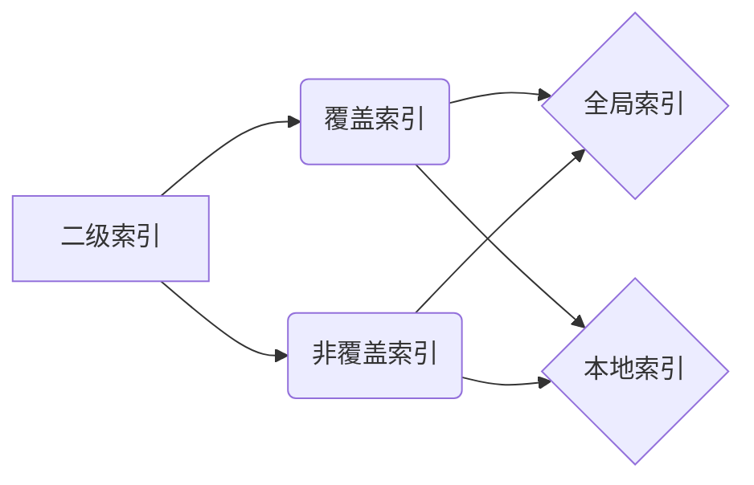

# Phoenix二级索引原理与代码实例讲解

## 1.背景介绍
### 1.1 什么是Phoenix
Apache Phoenix是构建在HBase之上的一个SQL层,能让我们使用标准的JDBC API而不是HBase客户端API来创建表,插入数据和对HBase数据进行查询。

### 1.2 为什么需要二级索引
HBase本身支持基于RowKey的快速查询,但是当我们需要根据其他列来检索数据时,就需要全表扫描,效率很低。为了解决这个问题,Phoenix引入了二级索引的概念,可以大大加快查询速度。

## 2.核心概念与联系
### 2.1 覆盖索引与非覆盖索引
Phoenix支持两种类型的二级索引:
- 覆盖索引(Covered Indexes):索引表中包含了所有查询需要返回的数据列,查询时无需再查主表。
- 非覆盖索引(Non-Covered Indexes):索引表中只包含索引列和主表RowKey,查询时需要再根据RowKey去主表中查询其他列数据。

### 2.2 全局索引与本地索引
根据索引表的分布方式,Phoenix的二级索引又分为:
- 全局索引(Global Indexes):索引表与主表的分布可以不同,可跨Region服务器。
- 本地索引(Local Indexes):索引表的数据与主表的数据是协同分布的,索引数据存储在相同的Region服务器。

它们的关系如下图:



## 3.核心算法原理具体操作步骤
### 3.1 创建全局索引
#### 3.1.1 覆盖全局索引
创建覆盖全局索引的语法:
```sql
CREATE INDEX my_index ON my_table (v1, v2) INCLUDE (v3)
```
其中,my_index是索引名,my_table是主表名,v1和v2是索引列,v3是覆盖列。

#### 3.1.2 非覆盖全局索引 
创建非覆盖全局索引的语法:
```sql
CREATE INDEX my_index ON my_table (v1, v2)
```

### 3.2 创建本地索引
#### 3.2.1 覆盖本地索引
创建覆盖本地索引的语法:
```sql
CREATE LOCAL INDEX my_index ON my_table (v1, v2) INCLUDE (v3)
```

#### 3.2.2 非覆盖本地索引
创建非覆盖本地索引的语法: 
```sql
CREATE LOCAL INDEX my_index ON my_table (v1, v2)
```

### 3.3 索引重建
当主表数据发生变化时,索引需要重建以保持同步。重建索引的语法:
```sql
ALTER INDEX my_index ON my_table REBUILD
```

### 3.4 删除索引
删除索引的语法:
```sql
DROP INDEX my_index ON my_table
```

## 4.数学模型和公式详细讲解举例说明
Phoenix索引的数学模型可以用集合论来表示。假设我们有主表 $T$,以及在列 $C$ 上建立的索引 $I$。

令 $R_T$ 表示主表的所有行构成的集合, $R_I$ 表示索引表的所有行构成的集合。$C$ 的值域为 $V_C$。

对于 $\forall c \in V_C$,令 $\sigma_{C=c}(R)$ 表示满足条件 $C=c$ 的所有行构成的集合,即:

$$
\sigma_{C=c}(R) = \{r \mid r \in R \wedge r.C=c\}
$$

则索引的数学模型可以表示为:

$$
R_I = \{(c,rowkey) \mid c \in V_C \wedge rowkey \in \sigma_{C=c}(R_T)\}
$$

即索引表的每一行由索引列的值 $c$ 和对应的主表rowkey组成。

举例说明,假设我们有如下的主表 $T$:

| RowKey | A | B | C |
|--------|---|---|---|
| 001    | a1| b1| c1|
| 002    | a2| b2| c1| 
| 003    | a3| b3| c2|
| 004    | a4| b4| c2|

在列 $C$ 上建立索引 $I$ 后,索引表数据如下:

| RowKey   | C |
|----------|---|
| c1_001   | c1|
| c1_002   | c1|
| c2_003   | c2|  
| c2_004   | c2|

其中,索引表的RowKey由索引列值和主表RowKey组合而成,用于关联索引表和主表的数据。

## 5.项目实践：代码实例和详细解释说明
下面通过一个具体的代码实例来演示Phoenix二级索引的使用。

### 5.1 创建主表
```sql
CREATE TABLE IF NOT EXISTS student(
  id VARCHAR PRIMARY KEY,
  name VARCHAR,
  age INTEGER,
  class VARCHAR
);
```

### 5.2 插入测试数据
```sql
UPSERT INTO student VALUES('1','Tom',18,'A');
UPSERT INTO student VALUES('2','Jerry',17,'A');
UPSERT INTO student VALUES('3','Jack',18,'B');
UPSERT INTO student VALUES('4','Rose',16,'B');
```

### 5.3 创建覆盖索引
在name和age列上创建覆盖索引,并包含class列:
```sql
CREATE INDEX idx_student_name_age ON student(name,age) INCLUDE(class);
```

### 5.4 创建非覆盖索引
在class列上创建非覆盖索引:
```sql
CREATE INDEX idx_student_class ON student(class);
```

### 5.5 查询测试
#### 5.5.1 使用覆盖索引查询
```sql
SELECT name,age,class FROM student WHERE name='Jack' AND age=18;
```
该查询可以直接通过覆盖索引idx_student_name_age获取结果,不需要再查主表。

#### 5.5.2 使用非覆盖索引查询
```sql
SELECT id,name,class FROM student WHERE class='A';
```
该查询首先通过非覆盖索引idx_student_class找到对应的主表RowKey,然后再通过RowKey查主表获取其他列。

### 5.6 索引重建
```sql
ALTER INDEX idx_student_name_age ON student REBUILD;
```

### 5.7 删除索引  
```sql
DROP INDEX idx_student_class ON student;
```

## 6.实际应用场景
Phoenix二级索引在以下场景中可以发挥重要作用:

### 6.1 数据仓库
在数据仓库中,经常需要根据各种维度组合对事实数据进行即席查询和分析。使用Phoenix二级索引,可以显著提高查询性能。

### 6.2 时序数据
对于时序数据,通常以时间戳作为主键,但分析时往往需要根据其他属性进行过滤。利用二级索引,可以加速此类查询。

### 6.3 日志分析
Web服务器日志、应用程序日志通常数据量巨大,使用Phoenix二级索引可以方便地对日志数据进行实时检索和分析。  

## 7.工具和资源推荐
- Apache Phoenix官网：http://phoenix.apache.org/
- Phoenix Github源码：https://github.com/apache/phoenix
- 《Apache Phoenix实战》- 杨曦 著
- 《HBase不睡觉书》- 杨曦 著
- CDSW公开课：https://edu.csdn.net/course/detail/27175

## 8.总结：未来发展趋势与挑战
### 8.1 与其他SQL on HBase方案的竞争
除Phoenix外,还有Kylin、Presto等SQL on HBase的解决方案。Phoenix需要在性能、易用性等方面持续提升,巩固其市场地位。

### 8.2 云原生化改造  
随着云计算的普及,Phoenix需要更好地适配各种云环境,实现平滑的云上迁移和弹性伸缩。

### 8.3 二级索引的优化
目前Phoenix二级索引在空间和维护成本上还有优化空间,可以考虑引入Adaptive Index、Learned Index等新的索引结构,在提高检索效率的同时降低开销。

### 8.4 HTAP支持
将Phoenix扩展为一个融合数据分析和事务处理的HTAP平台,支持更广泛的混合负载场景。

## 9.附录：常见问题与解答
### Q1:全局索引与本地索引的区别是什么？应该如何选择？
A1:全局索引的索引表可以与主表的分布不同,更新代价较高,但支持更复杂的查询;本地索引与主表数据协同分布,更新代价低,但只能满足特定Region的查询。需要根据数据规模、查询模式、更新频率等因素权衡。

### Q2:覆盖索引包含的列是否越多越好？  
A2:覆盖的列越多,索引的检索效率越高,但同时也会占用更多的存储空间,并增加索引维护成本。需要对查询模式进行分析,只覆盖必要的列。

### Q3:如何平衡索引的数量和查询性能？
A3:索引的创建会带来额外的存储和维护开销,因此索引并非越多越好。需要通过慢查询日志分析等手段,识别出最有价值的查询模式,有针对性地创建索引。对不再使用的索引要及时删除。

作者：禅与计算机程序设计艺术 / Zen and the Art of Computer Programming