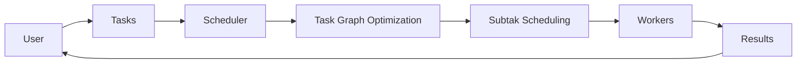

# Python机器学习实战：分布式机器学习框架Dask的入门与实战

## 1. 背景介绍

### 1.1 大数据时代对机器学习的挑战

在大数据时代,机器学习面临着前所未有的挑战。数据量的爆炸式增长使得传统的单机机器学习算法难以应对。当数据量超过单台机器的内存和计算能力时,就需要考虑分布式计算的解决方案。

### 1.2 分布式机器学习框架的兴起  

为了应对大数据挑战,一系列分布式机器学习框架应运而生。这些框架利用多台机器的计算资源,实现了机器学习算法的分布式训练和预测。其中,Dask作为一个灵活的分布式计算框架,在Python机器学习领域得到了广泛应用。

### 1.3 Dask框架简介

Dask是一个基于Python的灵活的分布式计算框架。它可以轻松地将NumPy、Pandas等常用的数据分析库扩展到多台机器上运行。Dask提供了一系列高层API,使得用户可以方便地进行大规模数据处理和机器学习任务。

## 2. 核心概念与联系

### 2.1 任务调度

Dask的核心是动态任务调度。当用户提交一个计算任务时,Dask会将其拆分成一系列子任务,并动态地将这些子任务分配到集群中的各个worker上执行。这种动态调度机制可以充分利用集群资源,提高计算效率。

### 2.2 延迟计算

Dask采用了延迟计算的策略。当用户定义了一个计算任务时,Dask并不会立即执行计算,而是生成一个任务图。只有当用户显式地触发计算时,Dask才会实际执行这个任务图。这种延迟计算的机制可以方便地进行任务的组合和优化。

### 2.3 数据集合

Dask提供了一组数据集合,用于处理大规模数据。其中,Dask Array用于处理大规模多维数组,Dask DataFrame用于处理大规模表格数据,Dask Bag用于处理大规模Python对象集合。这些数据集合与NumPy、Pandas等库的API高度兼容,使得用户可以轻松地将现有代码迁移到Dask上。

### 2.4 调度器与Worker

Dask的分布式计算依赖于调度器和Worker。调度器负责接收用户提交的任务,将其拆分成子任务,并动态地分配给Worker执行。每个Worker是一个独立的Python进程,负责实际执行计算任务。调度器和Worker通过网络进行通信,共同完成分布式计算。

下面是Dask核心概念之间关系的Mermaid流程图:



## 3. 核心算法原理具体操作步骤

### 3.1 任务拆分

当用户提交一个计算任务时,Dask会将其拆分成多个子任务。拆分的粒度取决于数据的分区方式。例如,对于一个大型数组,Dask会将其分割成多个小数组,每个小数组对应一个子任务。

### 3.2 任务图优化

在实际执行计算之前,Dask会对任务图进行优化。优化的目标是最小化数据传输和最大化并行度。常见的优化技术包括:

1. 任务融合:将多个子任务合并成一个,减少任务调度开销。
2. 数据本地化:尽量将任务调度到存储所需数据的机器上,减少网络传输。
3. 任务重排:调整任务的执行顺序,提高并行度。

### 3.3 子任务调度

优化后的任务图会被拆分成多个子任务,由调度器动态地分配给Worker执行。调度过程考虑了多个因素,如:

1. Worker的负载:调度器会将任务分配给负载较小的Worker,避免出现任务等待。
2. 数据局部性:调度器会尽量将任务分配给存储所需数据的Worker,减少数据传输。
3. 任务优先级:调度器会优先执行那些被下游任务依赖的关键任务。

### 3.4 结果收集

当所有子任务完成后,调度器会将它们的结果收集起来,组装成最终的计算结果,返回给用户。

## 4. 数学模型和公式详细讲解举例说明

在Dask中,很多算法都依赖于数学模型和公式。下面以线性回归为例,详细讲解其数学原理。

线性回归的目标是找到一个线性模型$y=wx+b$,使得模型预测值$\hat{y}$和真实值$y$之间的均方误差最小化:

$$
\min_{w,b} \frac{1}{N}\sum^N_{i=1}(\hat{y_i}-y_i)^2
$$

其中,$\hat{y_i}=wx_i+b$,是模型对第$i$个样本的预测值。

为了找到最优的模型参数$w$和$b$,需要对目标函数求导,令导数为0:

$$
\begin{aligned}
\frac{\partial}{\partial w} \frac{1}{N}\sum^N_{i=1}(\hat{y_i}-y_i)^2 &= \frac{2}{N}\sum^N_{i=1}x_i(\hat{y_i}-y_i) = 0 \\
\frac{\partial}{\partial b} \frac{1}{N}\sum^N_{i=1}(\hat{y_i}-y_i)^2 &= \frac{2}{N}\sum^N_{i=1}(\hat{y_i}-y_i) = 0
\end{aligned}
$$

化简上述方程组,可以得到$w$和$b$的闭式解:

$$
\begin{aligned}
w &= \frac{\sum^N_{i=1}(x_i-\bar{x})(y_i-\bar{y})}{\sum^N_{i=1}(x_i-\bar{x})^2} \\
b &= \bar{y} - w\bar{x}
\end{aligned}
$$

其中,$\bar{x}$和$\bar{y}$分别是$x$和$y$的均值。

在Dask中,可以用以下步骤实现分布式的线性回归:

1. 将数据分割成多个分区,每个分区对应一个Dask数组。
2. 在每个分区上计算$\sum^{N_p}_{i=1}x_i$,$\sum^{N_p}_{i=1}y_i$,$\sum^{N_p}_{i=1}x_i^2$,$\sum^{N_p}_{i=1}x_iy_i$。其中,$N_p$是分区内样本数。
3. 将各分区的结果聚合,得到$\sum^N_{i=1}x_i$,$\sum^N_{i=1}y_i$,$\sum^N_{i=1}x_i^2$,$\sum^N_{i=1}x_iy_i$。
4. 根据聚合结果,计算$w$和$b$。

这种分布式计算的方式可以显著加速线性回归在大数据上的训练过程。

## 5. 项目实践：代码实例和详细解释说明

下面通过一个具体的项目实践,演示如何使用Dask进行分布式机器学习。

项目目标是在一个大型数据集上训练线性回归模型。数据集包含1亿个样本,每个样本有100个特征。

首先,导入所需的库:

```python
import dask.array as da
from dask.distributed import Client
import numpy as np
```

然后,创建一个Dask集群,并初始化Client:

```python
client = Client('scheduler_address:8786')
```

接着,创建一个随机的数据集,并将其转换为Dask数组:

```python
N = 100000000  # 样本数
D = 100  # 特征维度
X = da.random.normal(size=(N, D), chunks=(1000000, D))  # 1000000行为一个数据块
y = da.random.normal(size=(N,), chunks=(1000000,))
```

定义一个函数,用于在每个数据块上计算局部的统计量:

```python
def local_stats(X, y):
    return np.array([X.sum(axis=0), y.sum(), (X**2).sum(axis=0), (X*y).sum(axis=0)])
```

使用Dask的map_blocks函数,在每个数据块上应用local_stats函数:

```python
stats = da.map_blocks(local_stats, X, y, dtype=float, chunks=(4, D+3))
```

聚合各个数据块的统计量:

```python
sum_stats = stats.sum(axis=0).compute()
```

从聚合的统计量中提取所需的值,并计算模型参数:

```python
sum_x, sum_y, sum_x2, sum_xy = sum_stats[0], sum_stats[1], sum_stats[2], sum_stats[3]
w = (N*sum_xy - sum_x*sum_y) / (N*sum_x2 - sum_x**2)
b = (sum_y - w*sum_x) / N
```

最后,打印出模型参数:

```python
print(f"Coefficients: {w}")
print(f"Intercept: {b}")
```

在这个项目中,我们首先创建了一个Dask集群,并在集群上初始化了一个Client。然后,我们创建了一个大型随机数据集,并将其转换为Dask数组。接着,我们定义了一个函数local_stats,用于在每个数据块上计算局部的统计量。使用Dask的map_blocks函数,我们可以方便地在每个数据块上应用这个函数。最后,我们聚合了各个数据块的统计量,并根据聚合结果计算出了模型参数。

通过这个项目,我们展示了如何使用Dask进行分布式机器学习。Dask的数据并行和任务并行能力,使得我们可以轻松地处理远超单机内存的大型数据集。

## 6. 实际应用场景

Dask在实际的机器学习应用中有广泛的应用场景,下面列举几个典型的例子:

### 6.1 推荐系统

在大型电商网站中,推荐系统需要处理海量的用户行为数据和商品数据。使用Dask,可以将推荐算法如协同过滤、矩阵分解等进行分布式实现,从而显著提升推荐系统的训练效率和预测能力。

### 6.2 金融风控

金融机构需要对大量的交易数据进行实时的风险评估和欺诈检测。Dask可以帮助金融机构构建分布式的机器学习管道,实时处理海量交易数据,识别潜在的风险和异常。

### 6.3 医疗影像分析

医疗影像数据如CT、MRI等通常体积很大。使用Dask,可以将深度学习模型如CNN等应用于分布式的医疗影像数据处理,加速模型的训练和预测,辅助医生进行疾病诊断。

### 6.4 气象预测

气象预测需要处理全球范围内的海量气象观测数据和模拟数据。Dask可以帮助气象学家构建分布式的数据处理和机器学习管道,提升数值天气预报模型的效率和准确性。

## 7. 工具和资源推荐

### 7.1 官方文档

Dask的官方文档是学习和使用Dask的最权威资源。文档提供了Dask各个模块的详细API说明,以及丰富的示例和教程。

链接: https://docs.dask.org/

### 7.2 Dask示例库

Dask示例库包含了大量使用Dask进行数据处理和机器学习的示例代码。这些示例涵盖了Dask的各个功能模块,是学习Dask的宝贵资源。

链接: https://examples.dask.org/

### 7.3 Dask博客

Dask博客定期发布Dask的最新特性介绍、使用技巧分享、实际应用案例等。关注Dask博客可以了解Dask的最新动态和实践经验。

链接: https://blog.dask.org/

### 7.4 Dask社区

Dask拥有一个活跃的开源社区。通过GitHub、Stack Overflow等渠道,用户可以与Dask的开发者和其他用户交流,获得帮助和支持。

GitHub: https://github.com/dask/dask
Stack Overflow: https://stackoverflow.com/questions/tagged/dask

## 8. 总结：未来发展趋势与挑战

Dask作为一个灵活的Python分布式计算框架,在机器学习领域展现出了广阔的应用前景。未来,Dask有望在以下几个方面得到进一步发展:

### 8.1 与机器学习库的深度集成

目