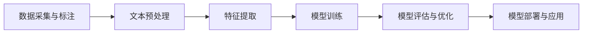

# Python机器学习实战：基于文本数据进行情感分析

## 1. 背景介绍
### 1.1 情感分析的重要性
在当今数据爆炸式增长的时代,社交媒体、电商评论、客户反馈等文本数据蕴含着大量有价值的情感信息。准确捕捉和分析这些情感对企业决策、产品优化、用户体验改善等方面至关重要。情感分析技术应运而生,它利用自然语言处理和机器学习方法,自动识别和提取文本中蕴含的情感倾向,如正面、负面或中性。

### 1.2 Python在情感分析中的优势
Python凭借其简洁的语法、丰富的库生态和强大的文本处理能力,已成为情感分析领域的首选编程语言。Python提供了诸如NLTK、spaCy、gensim等成熟的自然语言处理库,以及scikit-learn、TensorFlow、PyTorch等主流机器学习框架。借助Python,我们可以高效地实现文本预处理、特征工程、模型训练和评估等关键步骤。

### 1.3 本文的目标和贡献
本文旨在通过一个实战案例,深入探讨如何利用Python进行基于文本数据的情感分析。我们将详细介绍情感分析的核心概念、常用算法、数据预处理技巧以及模型训练和评估方法。同时,本文也将提供完整的Python代码示例,帮助读者快速上手并应用到实际项目中。

## 2. 核心概念与联系
### 2.1 情感分析的定义与分类
情感分析,又称观点挖掘,是自然语言处理领域的一个重要分支。它主要研究如何通过计算机自动识别和提取文本中表达的观点、情感、评价等主观信息。按照粒度,情感分析可分为以下三类:

- 文档级情感分析:判断整个文档的总体情感倾向
- 句子级情感分析:判断单个句子的情感倾向
- 属性级情感分析:提取文本中提及的属性(如产品特征)并判断相应的情感倾向

### 2.2 情感分析的一般流程
情感分析通常包括以下几个关键步骤:

- 数据采集与标注:从多个渠道收集文本数据,并对其情感倾向进行人工标注。
- 文本预处理:对原始文本进行清洗、分词、去除停用词、词形还原等处理。
- 特征提取:将文本转换为结构化的特征向量,常用方法包括词袋模型、TF-IDF、Word2Vec等。
- 模型训练:选择合适的机器学习算法(如朴素贝叶斯、支持向量机、深度学习等),并在训练集上进行训练。
- 模型评估与优化:在测试集上评估模型性能,并通过特征选择、参数调优等方式进行优化。
- 模型部署与应用:将训练好的模型部署到生产环境,对新的文本数据进行情感预测。

### 2.3 情感词典与机器学习方法的对比
情感分析可分为基于情感词典和基于机器学习两大类方法。

基于情感词典的方法预先构建情感词典,并根据文本中出现的情感词来判断其情感倾向。这种方法实现简单,但往往受限于词典的覆盖度和语境因素。

基于机器学习的方法通过带标签的训练数据训练分类器,可以更好地挖掘隐含的情感模式,适应不同领域。本文将重点探讨基于机器学习的情感分析方法。

## 3. 核心算法原理与具体操作步骤
### 3.1 朴素贝叶斯算法
朴素贝叶斯是一种基于贝叶斯定理的概率分类器,常用于文本分类任务。它的基本思想是:对于给定的文本,利用贝叶斯定理计算该文本属于各个类别的后验概率,并选择后验概率最大的类别作为预测结果。

朴素贝叶斯的具体操作步骤如下:

1. 计算先验概率P(c):即每个类别c在训练集中出现的频率。
2. 对于文本中的每个特征词w,计算其在各个类别中的条件概率P(w|c)。为避免零概率问题,通常采用拉普拉斯平滑。
3. 对于待分类的文本,利用贝叶斯公式计算其属于每个类别的后验概率:
$$ P(c|w_1, w_2, ..., w_n) = \frac{P(c) \prod_{i=1}^n P(w_i|c)}{P(w_1, w_2, ..., w_n)} $$
4. 选择后验概率最大的类别作为预测结果:
$$ c^* = \arg\max_{c \in C} P(c|w_1, w_2, ..., w_n) $$

朴素贝叶斯算法简单高效,适用于高维度特征,但其独立性假设在实际应用中往往难以满足。

### 3.2 支持向量机算法
支持向量机(SVM)是一种经典的监督学习算法,在文本分类中表现出色。它的基本思想是在特征空间中寻找一个最优的超平面,使得不同类别的样本能够被超平面最大程度地分开。

SVM的具体操作步骤如下:

1. 将文本特征向量映射到高维空间。
2. 在高维空间中寻找最优分类超平面,使得不同类别的样本间隔最大化。最优超平面可表示为:
$$ \mathbf{w} \cdot \mathbf{x} + b = 0 $$
其中$\mathbf{w}$为超平面的法向量,$b$为偏置项。
3. 引入松弛变量$\xi_i$和惩罚因子$C$,将问题转化为凸二次规划问题:
$$
\begin{aligned}
\min_{\mathbf{w},b,\xi} \quad & \frac{1}{2} \|\mathbf{w}\|^2 + C \sum_{i=1}^n \xi_i \\
\textrm{s.t.} \quad & y_i(\mathbf{w} \cdot \mathbf{x}_i + b) \geq 1 - \xi_i, \quad i=1,2,...,n \\
& \xi_i \geq 0, \quad i=1,2,...,n
\end{aligned}
$$
4. 求解上述优化问题,得到最优分类超平面的参数$\mathbf{w}^*$和$b^*$。
5. 对于新样本$\mathbf{x}$,根据其与超平面的符号关系进行分类:
$$ f(\mathbf{x}) = \textrm{sign}(\mathbf{w}^* \cdot \mathbf{x} + b^*) $$

SVM通过核技巧可以处理非线性分类问题,常用的核函数包括多项式核和高斯核(RBF)。SVM的优点是泛化能力强,但训练复杂度较高。

### 3.3 深度学习算法
近年来,深度学习在情感分析领域取得了瞩目成绩。相比传统机器学习方法,深度学习能够自动学习文本的高级特征表示,更好地捕捉语义信息。以下重点介绍几种常用的深度学习算法。

#### 3.3.1 卷积神经网络(CNN)
CNN通过卷积和池化操作,提取文本的局部特征并降低特征维度。具体步骤如下:

1. 将文本转换为词向量矩阵。
2. 使用不同尺寸的卷积核对词向量矩阵进行卷积操作,提取n-gram特征。
3. 对卷积结果应用激活函数(如ReLU)和最大池化,获得压缩后的特征图。
4. 将所有特征图拼接并通过全连接层映射到输出空间。
5. 使用softmax函数计算每个类别的概率,并选择概率最大的类别作为预测结果。

CNN能够有效捕捉文本的局部特征和词序信息,但难以建模长距离依赖关系。

#### 3.3.2 循环神经网络(RNN)
RNN是一种序列模型,能够处理任意长度的文本序列。其中,LSTM和GRU是两种常用的RNN变体,能够缓解梯度消失问题。以LSTM为例,其具体步骤如下:

1. 将文本转换为词向量序列。
2. 在时间步t,LSTM单元根据当前输入$x_t$和前一时间步的隐藏状态$h_{t-1}$,更新当前隐藏状态$h_t$:
$$
\begin{aligned}
f_t &= \sigma(W_f \cdot [h_{t-1}, x_t] + b_f) \\
i_t &= \sigma(W_i \cdot [h_{t-1}, x_t] + b_i) \\
\tilde{C}_t &= \tanh(W_C \cdot [h_{t-1}, x_t] + b_C) \\
C_t &= f_t * C_{t-1} + i_t * \tilde{C}_t \\
o_t &= \sigma(W_o \cdot [h_{t-1}, x_t] + b_o) \\
h_t &= o_t * \tanh(C_t)
\end{aligned}
$$
其中,$f_t$、$i_t$、$o_t$分别为遗忘门、输入门和输出门,$C_t$为记忆单元。
3. 将最后一个时间步的隐藏状态$h_T$通过全连接层映射到输出空间,并用softmax函数计算每个类别的概率。

RNN能够建模文本的长距离依赖关系,但训练过程中容易出现梯度消失或梯度爆炸问题。

#### 3.3.3 注意力机制与Transformer
注意力机制能够动态地为文本中的每个词分配权重,突出关键信息。常见的注意力机制包括:

- Additive Attention:
$$ \alpha_i = \frac{\exp(v^T \tanh(W_1 h_i + W_2 s))}{\sum_j \exp(v^T \tanh(W_1 h_j + W_2 s))} $$
- Dot-Product Attention:
$$ \alpha_i = \frac{\exp(h_i^T s)}{\sum_j \exp(h_j^T s)} $$

其中,$h_i$为第$i$个词的隐藏状态,$s$为查询向量,$\alpha_i$为第$i$个词的注意力权重。

Transformer是一种完全基于注意力机制的模型,通过自注意力和位置编码实现并行计算。其编码器和解码器均由多个自注意力层和前馈神经网络组成。Transformer在情感分析等任务中取得了优异表现。

## 4. 数学模型和公式详细讲解举例说明
### 4.1 词袋模型与TF-IDF
词袋模型将文本表示为一个词频向量,其中每个元素表示对应词在文本中出现的次数。假设词表大小为$n$,则文本$d$可表示为:
$$ \mathbf{d} = (tf_{1,d}, tf_{2,d}, ..., tf_{n,d}) $$
其中,$tf_{i,d}$为第$i$个词在文本$d$中的词频。

TF-IDF在词频的基础上引入了逆文档频率(IDF),旨在降低常见词的权重,突出重要词。第$i$个词的IDF定义为:
$$ idf_i = \log \frac{N}{df_i} $$
其中,$N$为文档总数,$df_i$为包含第$i$个词的文档数。

结合TF和IDF,文本$d$的TF-IDF向量表示为:
$$ \mathbf{d} = (tf_{1,d} \cdot idf_1, tf_{2,d} \cdot idf_2, ..., tf_{n,d} \cdot idf_n) $$

举例说明:假设有两个文本"I love this movie"和"I hate this movie",词表为\{"I", "love", "hate", "this", "movie"\}。
- 文本1的词频向量为(1, 1, 0, 1, 1),文本2的词频向量为(1, 0, 1, 1, 1)。
- 假设语料库中共有10个文档,"love"出现在2个文档中,"hate"出现在1个文档中,则它们的IDF分别为$\log(10/2)$和$\log(10/1)$。
- 结合TF和IDF,文本1的TF-IDF向量为$(1, \log(10/2), 0