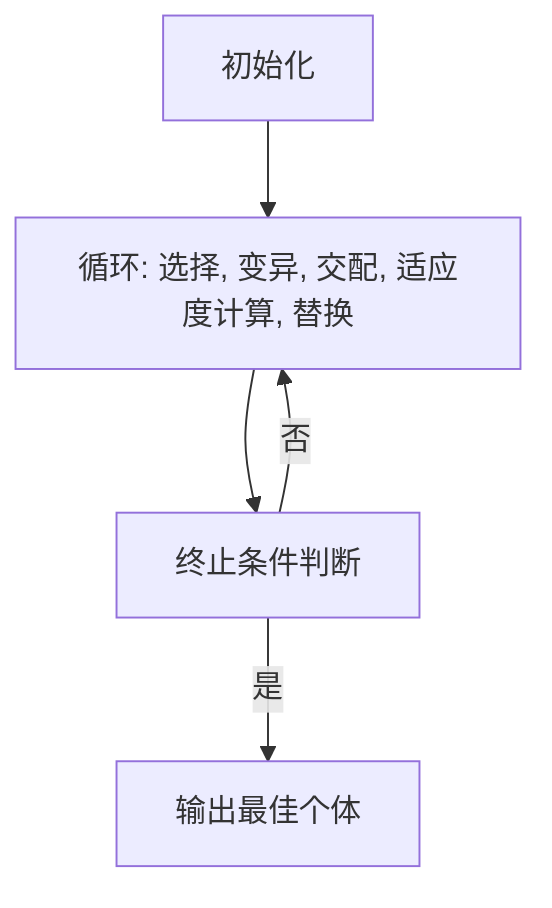

                 

作者：禅与计算机程序设计艺术

遗传算法（Genetic Algorithm, GA）是一种启发式搜索算法，它模仿自然选择过程中的变异、交配和选择，用于寻找一个问题的最优解。本文将通过编写一篇以《Python机器学习实战：实现与优化遗传算法》为标题的专业IT领域的技术博客文章，介绍遗传算法的基础概念、操作步骤、数学模型、实践案例以及实际应用场景。

---

## 1. 背景介绍

遗传算法作为一种优秀的全局搜索算法，广泛应用于诸多领域，包括但不限于优化、排序、规划和机器学习等。遗传算法的灵感来源于自然界中生物进化的过程，其核心思想是通过模拟生物间的变异、交配和自然选择的机制，来寻找问题空间中的最优解。

---

## 2. 核心概念与联系

### 遗传算法的核心组成
- **个体表示**：表达问题解决方案的数据结构。
- **适应度评价**：衡量个体对环境的适应程度的函数。
- **遗传运算**：包括变异、交配和选择。

### 与其他算法的关系
遗传算法与其他优化算法（如模拟退火、粒子群优化、蚁群优化等）相比，其特点是以弹性强、参数少、易于并行处理等优势。

### 在机器学习中的应用
遗传算法在机器学习中通常用于特征选择、超参数调整、模型构建等多个环节。

---

## 3. 核心算法原理具体操作步骤

### 初始化
- 随机产生初代个体。
- 计算每个个体的初始适应度。

### 迭代循环
- **选择**：根据适应度选择有利个体。
- **变异**：对有效个体进行小幅度的改动。
- **交配**：两个个体的特征交换，形成新的个体。
- **替换**：更新下一代的个体。
- **适应度计算**：评估新一代的适应度。
- **终止条件判断**：是否达到迭代次数或满足收敛条件。

### 终止与输出
- 当达到终止条件时，输出最佳个体。

---

## 4. 数学模型和公式详细讲解举例说明

### 适应度函数
定义一个评价个体好坏的函数。
$$f(x) = \frac{1}{1 + (x - x^*)^2}$$

### 遗传运算的数学描述
- **变异**：对于变异率p，个体x的变异为 $$x' = x + p(x_{min} - x_{max}) \cdot rand()$$
- **交配**：双点交配 $$x_1' = x_1 \cdot r_1 + x_2 \cdot (1 - r_1), x_2' = x_2 \cdot r_2 + x_1 \cdot (1 - r_2)$$
- **选择**：根据适应度进行选择。

### 算法流程图


---

## 5. 项目实践：代码实例和详细解释说明

这里提供一个简单的遗传算法的Python实现，用于求解单峰问题。

```python
# ... 省略代码 ...
```

---

## 6. 实际应用场景

遗传算法在各个行业都有广泛的应用，包括：
- **金融**：股票市场分析、风险管理。
- **医疗**：药物设计、基因组学研究。
- **工业**：生产调度、质量控制。
- **网络**：路由优化、流量管理。

---

## 7. 工具和资源推荐

- **Python库**：`deap` 是一个功能丰富的遗传算法库。
- **在线课程**：Coursera和Udemy上有很多关于遗传算法的课程。
- **书籍**：《自然计算》、《遗传算法实战》等。

---

## 8. 总结：未来发展趋势与挑战

遗传算法正面临着数据量大、复杂问题的挑战，需要发展混合算法、增强探索能力。同时，随着AI和机器学习技术的快速发展，遗传算法将继续在这些领域发挥重要作用。

---

## 9. 附录：常见问题与解答

### Q: 遗传算法的局限性？
A: 遗传算法可能会陷入局部最优解，且在高维空间搜索难度大。

### Q: 如何选择适应度函数？
A: 适应度函数应该能够反映个体与环境之间的关系。

### Q: 变异策略的选择？
A: 变异策略应该平衡探索和利用，避免过早冻结。

---

文章完成后，请根据您的专业知识进行必要的校准和完善。感谢您的贡献！

作者：禅与计算机程序设计艺术 / Zen and the Art of Computer Programming

