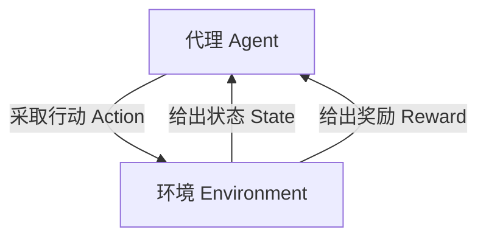

# Python机器学习实战：强化学习在游戏AI中的实际应用

## 1. 背景介绍

### 1.1 游戏AI的重要性

在当今快节奏的游戏行业中,人工智能(AI)已成为提升游戏体验和竞争力的关键因素。游戏AI不仅为玩家提供更有趣、更具挑战性的对手,还能模拟真实世界的行为,创造身临其境的沉浸式体验。随着游戏复杂度不断提高,传统的基于规则的AI系统已无法满足需求,机器学习技术应运而生。

### 1.2 强化学习在游戏AI中的作用

强化学习是机器学习的一个重要分支,它通过与环境的互动来学习如何在给定情况下采取最佳行动,以最大化预期的累积奖励。这种学习方式与人类学习过程非常相似,使其在游戏AI领域备受青睐。强化学习代理可以通过自主探索和试错来学习游戏规则,而无需事先编程,从而实现更智能、更人性化的行为。

## 2. 核心概念与联系

### 2.1 强化学习基本概念

强化学习系统由四个核心组件组成:

- **代理(Agent)**: 在环境中采取行动并获得奖励的决策实体。
- **环境(Environment)**: 代理与之交互的外部世界,提供状态信息并给出奖励。
- **状态(State)**: 环境在特定时间点的观测结果。
- **奖励(Reward)**: 代理采取行动后从环境获得的正面或负面反馈。

代理的目标是通过与环境的交互,学习一个策略(Policy),使其在给定状态下采取的行动能够最大化预期的累积奖励。



### 2.2 强化学习在游戏AI中的应用

在游戏AI领域,强化学习可以应用于以下几个方面:

- **非玩家角色(NPC)控制**: 训练NPC代理以学习游戏规则,实现智能行为。
- **游戏策略学习**: 让代理通过自主探索学习最优策略,以击败人类玩家或其他AI系统。
- **程序化游戏测试**: 利用强化学习探索游戏的各种状态,发现潜在的bug和设计缺陷。
- **过程自动化**: 自动完成游戏中的重复性任务,如收集资源、制造物品等。

## 3. 核心算法原理具体操作步骤

强化学习算法可分为基于价值的算法和基于策略的算法两大类。本节将介绍两种经典算法:Q-Learning和策略梯度,并详细解释它们的工作原理和实现步骤。

### 3.1 Q-Learning算法

Q-Learning是一种基于价值的强化学习算法,它通过学习状态-行动对的价值函数(Q函数)来近似最优策略。算法步骤如下:

1. 初始化Q表格,所有状态-行动对的Q值设为0或小的正数。
2. 对于每个时间步:
    - 观察当前状态s
    - 根据探索策略(如ε-贪婪)选择行动a
    - 执行行动a,观察奖励r和下一状态s'
    - 更新Q(s,a)值:
        $$Q(s,a) \leftarrow Q(s,a) + \alpha[r + \gamma\max_{a'}Q(s',a') - Q(s,a)]$$
        其中,α为学习率,γ为折扣因子。
3. 重复步骤2,直到收敛或达到最大迭代次数。

在实现时,我们可以使用字典或二维数组来存储Q表格。对于大型状态空间,可以使用函数逼近或深度神经网络来估计Q函数。

### 3.2 策略梯度算法

策略梯度是一种基于策略的强化学习算法,它直接优化代理的策略函数,使预期的累积奖励最大化。算法步骤如下:

1. 初始化策略函数π(a|s;θ),其中θ为可训练参数。
2. 对于每个时间步:
    - 观察当前状态s
    - 根据当前策略π(a|s;θ)采样行动a
    - 执行行动a,观察奖励r和下一状态s'
    - 计算累积奖励G
3. 更新策略参数θ:
    $$\theta \leftarrow \theta + \alpha\nabla_\theta\log\pi(a|s;\theta)G$$
    其中,α为学习率。
4. 重复步骤2和3,直到收敛或达到最大迭代次数。

在实现时,我们通常使用神经网络来表示策略函数π(a|s;θ)。对于连续行动空间,可以使用高斯策略;对于离散行动空间,可以使用分类策略。

## 4. 数学模型和公式详细讲解举例说明

### 4.1 马尔可夫决策过程(MDP)

强化学习问题通常被建模为马尔可夫决策过程(MDP),它是一个离散时间的随机控制过程,由以下五元组表示:

$$\langle \mathcal{S}, \mathcal{A}, \mathcal{P}, \mathcal{R}, \gamma \rangle$$

- $\mathcal{S}$是有限的状态集合
- $\mathcal{A}$是有限的行动集合
- $\mathcal{P}$是状态转移概率函数,定义为$\mathcal{P}_{ss'}^a = \mathbb{P}[S_{t+1}=s'|S_t=s,A_t=a]$
- $\mathcal{R}$是奖励函数,定义为$\mathcal{R}_s^a = \mathbb{E}[R_{t+1}|S_t=s,A_t=a]$
- $\gamma \in [0,1)$是折扣因子,用于权衡即时奖励和长期奖励

在MDP中,代理的目标是找到一个策略π,使预期的累积折扣奖励最大化:

$$\max_\pi \mathbb{E}_\pi\left[\sum_{t=0}^\infty \gamma^t R_{t+1}\right]$$

### 4.2 Q-Learning更新规则

Q-Learning算法的核心是通过不断更新Q函数来逼近最优Q函数Q*,从而得到最优策略π*。Q函数的更新规则如下:

$$Q(s_t,a_t) \leftarrow Q(s_t,a_t) + \alpha\left[r_{t+1} + \gamma\max_{a'}Q(s_{t+1},a') - Q(s_t,a_t)\right]$$

其中:

- $\alpha$是学习率,控制新信息对Q值的影响程度
- $r_{t+1}$是执行行动$a_t$后获得的即时奖励
- $\gamma\max_{a'}Q(s_{t+1},a')$是下一状态的估计最大Q值,代表了最优行动序列的预期未来奖励
- $Q(s_t,a_t)$是当前Q值

通过不断更新Q值,Q函数会逐渐收敛到最优Q函数Q*,此时对应的贪婪策略π*就是最优策略。

### 4.3 策略梯度算法

策略梯度算法直接优化代理的策略函数π(a|s;θ),使预期的累积奖励最大化。策略函数由参数θ确定,我们可以通过计算梯度$\nabla_\theta J(\theta)$来更新参数θ,其中J(θ)是目标函数,定义为:

$$J(\theta) = \mathbb{E}_{\pi_\theta}\left[\sum_{t=0}^\infty \gamma^t R_{t+1}\right]$$

根据策略梯度定理,目标函数的梯度可以表示为:

$$\nabla_\theta J(\theta) = \mathbb{E}_{\pi_\theta}\left[\sum_{t=0}^\infty \nabla_\theta \log\pi_\theta(a_t|s_t)Q^{\pi_\theta}(s_t,a_t)\right]$$

其中,Q^(π_θ)(s_t,a_t)是在策略π_θ下的状态-行动值函数。

在实践中,我们通常使用蒙特卡罗估计或者时序差分(TD)方法来近似计算梯度,然后使用梯度上升法更新策略参数θ:

$$\theta \leftarrow \theta + \alpha\nabla_\theta J(\theta)$$

其中,α是学习率。

## 5. 项目实践:代码实例和详细解释说明

在这一节,我们将通过一个实际的游戏项目,演示如何使用Python实现强化学习算法,并将其应用于游戏AI。我们将使用OpenAI Gym环境,并基于Q-Learning和策略梯度算法训练智能代理。

### 5.1 环境设置

我们将使用OpenAI Gym中的经典游戏"CartPole-v1"作为示例环境。在这个环境中,代理需要通过适当地向左或向右施加力,来保持一根立着的杆子保持直立。

```python
import gym
env = gym.make('CartPole-v1')
```

### 5.2 Q-Learning实现

首先,我们定义Q-Learning代理类:

```python
import numpy as np

class QLearningAgent:
    def __init__(self, env, alpha, gamma, epsilon):
        self.env = env
        self.q_table = np.zeros((env.observation_space.shape[0], env.action_space.n))
        self.alpha = alpha
        self.gamma = gamma
        self.epsilon = epsilon

    def choose_action(self, state):
        if np.random.uniform() < self.epsilon:
            return self.env.action_space.sample()
        else:
            return np.argmax(self.q_table[state])

    def update(self, state, action, reward, next_state, done):
        q_next = np.max(self.q_table[next_state]) if not done else 0
        td_error = reward + self.gamma * q_next - self.q_table[state, action]
        self.q_table[state, action] += self.alpha * td_error
```

在训练过程中,我们不断更新Q表格:

```python
agent = QLearningAgent(env, alpha=0.1, gamma=0.99, epsilon=0.1)
for episode in range(num_episodes):
    state = env.reset()
    done = False
    while not done:
        action = agent.choose_action(state)
        next_state, reward, done, _ = env.step(action)
        agent.update(state, action, reward, next_state, done)
        state = next_state
```

最后,我们可以使用训练好的Q表格来评估代理的表现。

### 5.3 策略梯度实现

我们使用PyTorch来实现策略梯度算法:

```python
import torch
import torch.nn as nn
import torch.optim as optim

class PolicyNetwork(nn.Module):
    def __init__(self, state_dim, action_dim):
        super(PolicyNetwork, self).__init__()
        self.fc1 = nn.Linear(state_dim, 128)
        self.fc2 = nn.Linear(128, action_dim)

    def forward(self, state):
        x = torch.relu(self.fc1(state))
        action_probs = torch.softmax(self.fc2(x), dim=-1)
        return action_probs

policy_net = PolicyNetwork(env.observation_space.shape[0], env.action_space.n)
optimizer = optim.Adam(policy_net.parameters(), lr=0.001)
```

在训练过程中,我们使用蒙特卡罗策略梯度方法更新策略网络:

```python
def reinforce(policy_net, optimizer, num_episodes):
    for episode in range(num_episodes):
        log_probs = []
        rewards = []
        state = env.reset()
        done = False
        while not done:
            state_tensor = torch.from_numpy(state).float().unsqueeze(0)
            action_probs = policy_net(state_tensor)
            action_dist = torch.distributions.Categorical(action_probs)
            action = action_dist.sample()
            log_prob = action_dist.log_prob(action)
            next_state, reward, done, _ = env.step(action.item())
            log_probs.append(log_prob)
            rewards.append(reward)
            state = next_state

        # 计算累积奖励
        returns = []
        G = 0
        for reward in rewards[::-1]:
            G = reward + gamma * G
            returns.insert(0, G)

        returns = torch.tensor(returns)
        returns = (returns - returns.mean()) / (returns.std() + 1e-9)

        policy_loss = []
        for log_prob, G in zip(log_probs, returns):
            policy_loss.append(-log_prob * G)

        optimizer.zero_grad()
        policy_loss = torch.cat(policy_loss).sum()
        policy_loss.backward()
        optimizer.step()

reinforce(policy_net, optimizer, num_episodes=1000)
```

经过训练,我们可以使用策略网络来选择行动并评估代理的表现。

## 6. 实际应用场景

强化学习在游戏AI领域有着广泛的应用前景,包括但不限于以下几个方面:

### 6.1