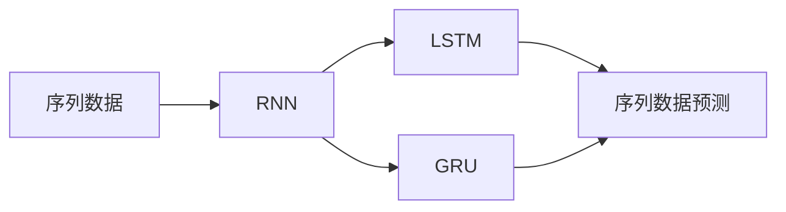

# Python深度学习实践：LSTM与GRU在序列数据预测中的应用

## 1. 背景介绍
### 1.1 序列数据预测的重要性
### 1.2 传统机器学习方法的局限性
### 1.3 深度学习在序列数据预测中的优势

## 2. 核心概念与联系
### 2.1 RNN(循环神经网络)
#### 2.1.1 RNN的基本结构
#### 2.1.2 RNN的前向传播与反向传播
#### 2.1.3 RNN的局限性
### 2.2 LSTM(长短期记忆网络)
#### 2.2.1 LSTM的基本结构
#### 2.2.2 LSTM的门控机制
#### 2.2.3 LSTM解决了RNN的局限性
### 2.3 GRU(门控循环单元)
#### 2.3.1 GRU的基本结构 
#### 2.3.2 GRU与LSTM的比较
### 2.4 LSTM与GRU在序列数据预测中的联系

## 3. 核心算法原理具体操作步骤
### 3.1 LSTM的前向传播
#### 3.1.1 输入门
#### 3.1.2 遗忘门
#### 3.1.3 输出门
#### 3.1.4 状态更新
### 3.2 LSTM的反向传播 
#### 3.2.1 时间反向传播
#### 3.2.2 梯度消失问题
### 3.3 GRU的前向传播
#### 3.3.1 更新门
#### 3.3.2 重置门
#### 3.3.3 状态更新
### 3.4 GRU的反向传播

## 4. 数学模型和公式详细讲解举例说明
### 4.1 LSTM的数学模型
#### 4.1.1 输入门
$$i_t = \sigma(W_i\cdot[h_{t-1},x_t] + b_i)$$
#### 4.1.2 遗忘门
$$f_t = \sigma(W_f\cdot[h_{t-1},x_t] + b_f)$$
#### 4.1.3 输出门
$$o_t = \sigma(W_o\cdot[h_{t-1},x_t] + b_o)$$
#### 4.1.4 状态更新
$$\tilde{C}_t = tanh(W_C\cdot[h_{t-1},x_t] + b_C)$$
$$C_t = f_t * C_{t-1} + i_t * \tilde{C}_t$$
$$h_t = o_t * tanh(C_t)$$

### 4.2 GRU的数学模型  
#### 4.2.1 更新门
$$z_t = \sigma(W_z\cdot[h_{t-1},x_t])$$
#### 4.2.2 重置门
$$r_t = \sigma(W_r\cdot[h_{t-1},x_t])$$
#### 4.2.3 状态更新
$$\tilde{h}_t = tanh(W\cdot[r_t*h_{t-1},x_t])$$
$$h_t = (1-z_t)*h_{t-1} + z_t*\tilde{h}_t$$

### 4.3 LSTM与GRU公式比较
#### 4.3.1 参数量的比较
#### 4.3.2 计算复杂度的比较

## 5. 项目实践：代码实例和详细解释说明
### 5.1 数据集介绍
#### 5.1.1 数据集的来源
#### 5.1.2 数据集的特点
#### 5.1.3 数据集的预处理
### 5.2 模型构建
#### 5.2.1 LSTM模型的构建
#### 5.2.2 GRU模型的构建
#### 5.2.3 模型参数的设置
### 5.3 模型训练
#### 5.3.1 训练集与验证集的划分
#### 5.3.2 模型训练的过程
#### 5.3.3 模型训练的结果
### 5.4 模型评估
#### 5.4.1 评估指标的选择
#### 5.4.2 LSTM模型的评估结果
#### 5.4.3 GRU模型的评估结果
### 5.5 模型预测
#### 5.5.1 LSTM模型的预测结果
#### 5.5.2 GRU模型的预测结果
#### 5.5.3 预测结果的可视化

## 6. 实际应用场景
### 6.1 股票价格预测
#### 6.1.1 股票价格预测的背景
#### 6.1.2 LSTM在股票价格预测中的应用
#### 6.1.3 GRU在股票价格预测中的应用
### 6.2 自然语言处理
#### 6.2.1 自然语言处理的背景
#### 6.2.2 LSTM在自然语言处理中的应用
#### 6.2.3 GRU在自然语言处理中的应用
### 6.3 异常检测
#### 6.3.1 异常检测的背景
#### 6.3.2 LSTM在异常检测中的应用
#### 6.3.3 GRU在异常检测中的应用

## 7. 工具和资源推荐
### 7.1 深度学习框架
#### 7.1.1 TensorFlow
#### 7.1.2 PyTorch
#### 7.1.3 Keras
### 7.2 数据集
#### 7.2.1 股票价格数据集
#### 7.2.2 自然语言处理数据集
#### 7.2.3 异常检测数据集
### 7.3 预训练模型
#### 7.3.1 LSTM预训练模型
#### 7.3.2 GRU预训练模型

## 8. 总结：未来发展趋势与挑战
### 8.1 LSTM与GRU的优缺点比较
### 8.2 LSTM与GRU在序列数据预测中的局限性
### 8.3 未来的研究方向
#### 8.3.1 模型结构的改进
#### 8.3.2 模型训练的优化
#### 8.3.3 模型解释性的提高

## 9. 附录：常见问题与解答
### 9.1 如何选择LSTM还是GRU？
### 9.2 如何调整LSTM和GRU的超参数？
### 9.3 如何处理梯度消失和梯度爆炸问题？
### 9.4 如何解释LSTM和GRU的预测结果？

作者：禅与计算机程序设计艺术 / Zen and the Art of Computer Programming