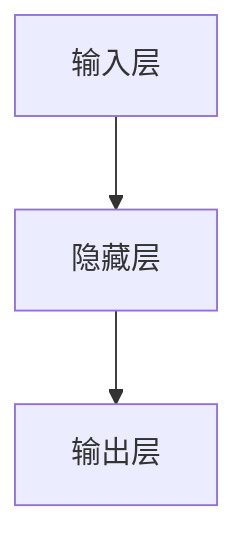
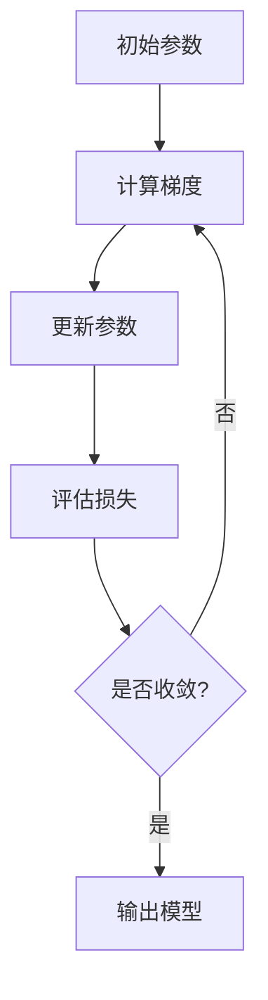

# Python深度学习实践：入门篇 - 你的第一个神经网络

## 1. 背景介绍

### 1.1 什么是深度学习？

深度学习(Deep Learning)是机器学习的一个子领域,它是一种基于人工神经网络的算法,能够从大量数据中自动学习特征表示,并用于解决复杂的任务,如计算机视觉、自然语言处理等。与传统的机器学习算法相比,深度学习模型能够自动从数据中提取特征,而不需要人工设计特征,从而在许多领域取得了突破性的进展。

### 1.2 神经网络的重要性

神经网络是深度学习的核心,它是一种受生物神经系统启发的计算模型。神经网络由大量互连的节点(神经元)组成,每个节点对输入数据进行加权求和,然后通过一个非线性激活函数产生输出。通过训练,神经网络可以学习识别输入数据中的模式,并对新的数据进行预测或决策。

### 1.3 Python在深度学习中的作用

Python是深度学习领域中最流行的编程语言之一。它具有简洁、易读的语法,同时拥有丰富的科学计算和数据处理库,如NumPy、Pandas、Matplotlib等。此外,Python还有许多优秀的深度学习框架,如TensorFlow、PyTorch、Keras等,这些框架极大地简化了深度学习模型的构建和训练过程。

## 2. 核心概念与联系

### 2.1 神经网络的基本结构

一个基本的神经网络由三种类型的层组成:输入层、隐藏层和输出层。



- 输入层接收原始数据,如图像像素或文本向量。
- 隐藏层对输入数据进行非线性变换,提取特征。一个神经网络可以有多个隐藏层。
- 输出层根据隐藏层的输出,生成最终的预测或决策结果。

### 2.2 前向传播和反向传播

神经网络的训练过程包括两个关键步骤:前向传播(Forward Propagation)和反向传播(Backward Propagation)。

1. **前向传播**:输入数据从输入层开始,经过隐藏层的变换,最终到达输出层,产生预测结果。

2. **反向传播**:将预测结果与真实标签进行比较,计算损失函数(Loss Function),然后沿着网络的反方向,调整每个神经元的权重和偏置,使损失函数最小化。这个过程被称为梯度下降(Gradient Descent)。

通过不断重复这两个步骤,神经网络可以逐渐学习到最优的参数,从而提高预测或决策的准确性。

### 2.3 激活函数

激活函数(Activation Function)是神经网络中的一个关键组成部分,它引入了非线性,使神经网络能够学习复杂的映射关系。常用的激活函数包括Sigmoid、Tanh、ReLU等。


激活函数的作用是对神经元的加权和进行非线性变换,产生激活值。不同的激活函数具有不同的特性,选择合适的激活函数对神经网络的性能有重要影响。

### 2.4 优化算法

优化算法(Optimization Algorithm)用于调整神经网络的参数,使损失函数最小化。常用的优化算法包括梯度下降(Gradient Descent)、动量优化(Momentum)、RMSProp、Adam等。



优化算法的选择和超参数的设置对神经网络的训练效果有重要影响。

## 3. 核心算法原理具体操作步骤

### 3.1 构建神经网络

在Python中,我们可以使用深度学习框架(如TensorFlow、PyTorch或Keras)来构建神经网络。以Keras为例,构建一个简单的全连接神经网络的代码如下:

```python
from keras.models import Sequential
from keras.layers import Dense

# 定义模型
model = Sequential()
model.add(Dense(units=64, activation='relu', input_dim=100))
model.add(Dense(units=10, activation='softmax'))

# 编译模型
model.compile(optimizer='sgd', loss='categorical_crossentropy', metrics=['accuracy'])
```

在这个例子中,我们定义了一个包含两个隐藏层的神经网络。第一个隐藏层有64个神经元,使用ReLU激活函数;第二个隐藏层(也是输出层)有10个神经元,使用Softmax激活函数。

### 3.2 训练神经网络

训练神经网络的步骤包括:

1. **准备数据**:将数据划分为训练集和测试集。
2. **构建模型**:定义神经网络的结构。
3. **编译模型**:选择损失函数、优化算法和评估指标。
4. **训练模型**:使用训练数据对模型进行训练,通常需要多次迭代(Epoch)。
5. **评估模型**:使用测试数据评估模型的性能。

以Keras为例,训练神经网络的代码如下:

```python
# 训练模型
model.fit(x_train, y_train, epochs=10, batch_size=32)

# 评估模型
loss, accuracy = model.evaluate(x_test, y_test)
print('Test accuracy:', accuracy)
```

在这个例子中,我们使用`model.fit()`函数对模型进行训练,设置了10个Epoch和32的批大小(Batch Size)。然后,使用`model.evaluate()`函数在测试集上评估模型的性能。

### 3.3 调整超参数

神经网络的性能受多个超参数(Hyperparameters)的影响,如隐藏层数量、神经元数量、学习率、批大小等。调整这些超参数对于获得更好的模型性能至关重要。

常见的调整超参数的方法包括:

1. **手动调整**:根据经验和直觉,手动尝试不同的超参数组合。
2. **网格搜索(Grid Search)**:在给定的超参数范围内,exhaustively搜索所有可能的组合。
3. **随机搜索(Random Search)**:在给定的超参数范围内,随机采样一定数量的超参数组合。
4. **贝叶斯优化(Bayesian Optimization)**:基于先验知识和模型性能,智能地搜索超参数空间。

以Keras为例,使用网格搜索调整学习率和隐藏层神经元数量的代码如下:

```python
from keras.wrappers.scikit_learn import KerasClassifier
from sklearn.model_selection import GridSearchCV

# 定义模型构建函数
def create_model(optimizer='rmsprop', init='glorot_uniform'):
    ...

# 创建KerasClassifier
model = KerasClassifier(build_fn=create_model, verbose=0)

# 定义超参数空间
batch_size = [5, 10, 20]
epochs = [10, 50, 100]
param_grid = dict(batch_size=batch_size, epochs=epochs)

# 执行网格搜索
grid = GridSearchCV(estimator=model, param_grid=param_grid)
grid_result = grid.fit(X, Y)

# 输出最佳超参数组合
print("Best: %f using %s" % (grid_result.best_score_, grid_result.best_params_))
```

在这个例子中,我们使用`KerasClassifier`将Keras模型封装为scikit-learn estimator,然后使用`GridSearchCV`执行网格搜索,找到最佳的批大小和Epoch数。

## 4. 数学模型和公式详细讲解举例说明

### 4.1 神经网络的数学表示

神经网络可以用数学公式来表示。假设我们有一个单层神经网络,输入为$\mathbf{x} = (x_1, x_2, \ldots, x_n)$,输出为$\mathbf{y} = (y_1, y_2, \ldots, y_m)$,权重矩阵为$\mathbf{W}$,偏置向量为$\mathbf{b}$,激活函数为$f$,则神经网络的输出可以表示为:

$$\mathbf{y} = f(\mathbf{W}^T\mathbf{x} + \mathbf{b})$$

其中,

- $\mathbf{W}^T\mathbf{x}$表示输入$\mathbf{x}$与权重矩阵$\mathbf{W}$的矩阵乘积,得到一个加权和向量。
- $\mathbf{b}$是偏置向量,用于调整每个神经元的激活程度。
- $f$是非线性激活函数,如Sigmoid、Tanh或ReLU。

对于多层神经网络,我们可以将每一层视为一个独立的函数,然后通过函数复合来表示整个网络。

### 4.2 损失函数

损失函数(Loss Function)用于衡量模型预测与真实标签之间的差异。常用的损失函数包括均方误差(Mean Squared Error, MSE)、交叉熵损失(Cross-Entropy Loss)等。

对于回归任务,我们通常使用均方误差作为损失函数:

$$\text{MSE} = \frac{1}{n}\sum_{i=1}^n (y_i - \hat{y}_i)^2$$

其中,$y_i$是真实标签,$\hat{y}_i$是模型预测值,n是样本数量。

对于分类任务,我们通常使用交叉熵损失作为损失函数:

$$\text{CrossEntropy} = -\frac{1}{n}\sum_{i=1}^n \sum_{j=1}^m y_{ij}\log(\hat{y}_{ij})$$

其中,$y_{ij}$是一个one-hot编码的向量,表示第i个样本属于第j类的标签,$\hat{y}_{ij}$是模型预测第i个样本属于第j类的概率,n是样本数量,m是类别数量。

### 4.3 反向传播算法

反向传播算法(Backpropagation Algorithm)是训练神经网络的核心算法,它通过计算损失函数对每个权重的梯度,并使用梯度下降法更新权重,从而最小化损失函数。

假设我们有一个单层神经网络,输入为$\mathbf{x}$,输出为$\mathbf{y}$,真实标签为$\mathbf{t}$,损失函数为$L$,权重矩阵为$\mathbf{W}$,偏置向量为$\mathbf{b}$,激活函数为$f$,学习率为$\eta$,则反向传播算法的步骤如下:

1. 前向传播,计算输出$\mathbf{y}$:

$$\mathbf{y} = f(\mathbf{W}^T\mathbf{x} + \mathbf{b})$$

2. 计算损失函数$L$:

$$L = L(\mathbf{y}, \mathbf{t})$$

3. 计算损失函数对输出$\mathbf{y}$的梯度:

$$\frac{\partial L}{\partial \mathbf{y}} = \frac{\partial L}{\partial \mathbf{y}}(\mathbf{y}, \mathbf{t})$$

4. 计算损失函数对权重$\mathbf{W}$和偏置$\mathbf{b}$的梯度:

$$\frac{\partial L}{\partial \mathbf{W}} = \frac{\partial L}{\partial \mathbf{y}} \cdot \frac{\partial \mathbf{y}}{\partial \mathbf{W}} = \frac{\partial L}{\partial \mathbf{y}} \cdot f'(\mathbf{W}^T\mathbf{x} + \mathbf{b}) \cdot \mathbf{x}^T$$

$$\frac{\partial L}{\partial \mathbf{b}} = \frac{\partial L}{\partial \mathbf{y}} \cdot \frac{\partial \mathbf{y}}{\partial \mathbf{b}} = \frac{\partial L}{\partial \mathbf{y}} \cdot f'(\mathbf{W}^T\mathbf{x} + \mathbf{b})$$

5. 更新权重和偏置:

$$\mathbf{W} \leftarrow \mathbf{W} - \eta \frac{\partial L}{\partial \mathbf{W}}$$

$$\mathbf{b} \leftarrow \mathbf{b} - \eta \frac{\partial L}{\partial \mathbf{b}}$$

对于多层神经网络,我们需要使用链式法则来计算每一层的梯度,然后从输出层开始,逐层进行反向传播,更新每一层的权重和偏置。

### 4.4 优化算法

除了基本的梯度下降法,还有许多优化算法可以加速神经网络的训练过程,如动量优化(