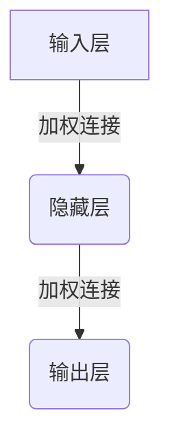

# Python深度学习实践：入门篇 - 你的第一个神经网络

## 1. 背景介绍

### 1.1 人工智能的兴起

人工智能(Artificial Intelligence, AI)是当代最具革命性和颠覆性的技术之一。它的发展已经渗透到我们生活的方方面面,从语音助手到自动驾驶汽车,从推荐系统到医疗诊断,AI无处不在。在AI的众多分支中,深度学习(Deep Learning)是最具影响力的技术之一,它模仿人脑神经网络的工作原理,通过大量数据训练,实现了令人惊叹的成就。

### 1.2 深度学习的重要性

深度学习已经成为人工智能领域的核心技术,在计算机视觉、自然语言处理、语音识别等领域取得了突破性进展。随着数据量的不断增加和计算能力的提高,深度学习将继续推动人工智能的发展,并在更多领域发挥重要作用。掌握深度学习不仅是技术人员的必备技能,也将成为未来社会中每个人都需要具备的基本素养。

### 1.3 Python在深度学习中的地位

在深度学习领域,Python是最流行和最广泛使用的编程语言。Python简单易学,拥有丰富的科学计算库和深度学习框架,如NumPy、Pandas、Matplotlib、TensorFlow和PyTorch等,使得构建和训练神经网络变得更加高效和便捷。本文将引导你使用Python,从零开始构建你的第一个神经网络,为你进入深度学习的奇妙世界打下坚实的基础。

## 2. 核心概念与联系

### 2.1 什么是神经网络?

神经网络(Neural Network)是一种受生物神经系统启发的计算模型。它由许多互连的节点(神经元)组成,这些节点通过加权连接进行信息传递和处理。神经网络的目标是通过学习过程,自动发现数据中的模式和特征,从而对新的输入数据进行预测或决策。



上图展示了一个简单的神经网络结构,包括输入层、隐藏层和输出层。每个神经元接收来自前一层的加权输入,经过激活函数的非线性转换,再传递到下一层。通过反复迭代和调整连接权重,神经网络可以逐步学习到输入和输出之间的映射关系。

### 2.2 监督学习与非监督学习

根据训练数据的性质,神经网络可以分为监督学习(Supervised Learning)和非监督学习(Unsupervised Learning)两种类型。

- **监督学习**:训练数据由输入和期望输出(标签)组成。神经网络的目标是学习输入到输出的映射关系,以便对新的输入数据进行准确预测。典型应用包括图像分类、语音识别和机器翻译等。
- **非监督学习**:训练数据只包含输入,没有对应的标签。神经网络的目标是从输入数据中发现潜在的模式和结构。典型应用包括聚类分析、降维和生成对抗网络(GAN)等。

本文将重点介绍监督学习,并引导你构建一个简单的分类神经网络。

### 2.3 激活函数

激活函数(Activation Function)是神经网络中一个关键组成部分,它引入了非线性,使神经网络能够学习复杂的映射关系。常见的激活函数包括Sigmoid函数、Tanh函数和ReLU(整流线性单元)函数等。

$$
\text{Sigmoid}(x) = \frac{1}{1 + e^{-x}}
$$

$$
\tanh(x) = \frac{e^x - e^{-x}}{e^x + e^{-x}}
$$

$$
\text{ReLU}(x) = \max(0, x)
$$

激活函数的选择对神经网络的性能有着重要影响。例如,ReLU函数在深层网络中表现更加出色,因为它可以有效缓解梯度消失问题。

### 2.4 损失函数和优化算法

在训练过程中,神经网络需要不断调整权重,使输出逐渐接近期望值。这个过程通过最小化损失函数(Loss Function)来实现,常见的损失函数包括均方误差(Mean Squared Error, MSE)和交叉熵损失(Cross-Entropy Loss)等。

为了最小化损失函数,神经网络采用优化算法(Optimization Algorithm)来更新权重。最常用的优化算法是梯度下降(Gradient Descent),它通过计算损失函数相对于权重的梯度,沿着梯度的反方向更新权重。

$$
w_{t+1} = w_t - \eta \frac{\partial L}{\partial w_t}
$$

其中,$w_t$表示当前权重,$\eta$是学习率(Learning Rate),控制着权重更新的步长。除了基本的梯度下降,还有一些改进的优化算法,如动量优化(Momentum)、RMSProp和Adam等,它们可以加快收敛速度并提高模型性能。

## 3. 核心算法原理具体操作步骤

现在,让我们一步步构建一个简单的神经网络分类器,并了解其核心算法原理和具体操作步骤。

### 3.1 准备数据

在开始之前,我们需要准备一些数据来训练和测试神经网络。为了简单起见,我们将使用著名的MNIST手写数字数据集,它包含60,000个训练样本和10,000个测试样本,每个样本是一个28x28像素的手写数字图像,标签为0到9之间的数字。

```python
import numpy as np
from keras.datasets import mnist
from keras.utils import np_utils

# 加载MNIST数据集
(X_train, y_train), (X_test, y_test) = mnist.load_data()

# 将图像数据归一化到0-1之间
X_train = X_train.reshape(60000, 784).astype('float32') / 255
X_test = X_test.reshape(10000, 784).astype('float32') / 255

# 将标签转换为One-Hot编码
y_train = np_utils.to_categorical(y_train, 10)
y_test = np_utils.to_categorical(y_test, 10)
```

### 3.2 构建神经网络模型

接下来,我们将使用Keras库构建一个简单的全连接神经网络模型。这个模型包含一个输入层、一个隐藏层和一个输出层。

```python
from keras.models import Sequential
from keras.layers import Dense

# 创建模型
model = Sequential()

# 添加输入层和第一个隐藏层
model.add(Dense(units=256, input_dim=784, activation='relu'))

# 添加输出层
model.add(Dense(units=10, activation='softmax'))

# 编译模型
model.compile(loss='categorical_crossentropy', optimizer='adam', metrics=['accuracy'])
```

在上面的代码中,我们首先创建了一个Sequential模型,然后添加了一个隐藏层,包含256个神经元,使用ReLU激活函数。接着,我们添加了一个输出层,包含10个神经元(对应0-9的数字),使用Softmax激活函数,用于多分类任务。最后,我们编译模型,指定损失函数为categorical_crossentropy(多分类交叉熵损失),优化器为Adam,并设置评估指标为准确率(accuracy)。

### 3.3 训练神经网络

现在,我们可以开始训练神经网络了。在训练过程中,模型将逐步调整权重,使损失函数最小化,从而提高预测准确率。

```python
# 训练模型
model.fit(X_train, y_train, epochs=10, batch_size=128, verbose=1, validation_data=(X_test, y_test))
```

在上面的代码中,我们调用model.fit()函数来训练模型。epochs参数指定训练迭代的次数,batch_size参数指定每次迭代使用的样本数量,verbose参数控制输出的详细程度。我们还传入了验证数据(X_test, y_test),以便在每个epoch后评估模型在测试集上的性能。

训练过程中,您将看到每个epoch的损失值和准确率,以及在测试集上的评估结果。随着训练的进行,模型的性能将逐渐提高。

### 3.4 评估和预测

训练完成后,我们可以评估模型在测试集上的整体性能,并对新的手写数字图像进行预测。

```python
# 评估模型在测试集上的性能
scores = model.evaluate(X_test, y_test, verbose=0)
print('测试集上的准确率: %.2f%%' % (scores[1] * 100))

# 对新的手写数字图像进行预测
import matplotlib.pyplot as plt

# 选择一个测试样本
digit = X_test[0].reshape(28, 28)

# 显示图像
plt.imshow(digit, cmap='gray')
plt.show()

# 进行预测
prediction = model.predict(X_test[:1])
print('预测结果:', np.argmax(prediction))
```

上面的代码首先评估模型在测试集上的准确率。然后,我们选择一个测试样本,显示它的图像,并使用模型对它进行预测。预测结果是一个概率分布,我们取概率最大的类别作为最终预测。

通过这个简单的示例,您已经学会了如何使用Python构建、训练和评估一个基本的神经网络分类器。虽然这只是深度学习的入门级别,但它为您进一步探索这个领域奠定了坚实的基础。

## 4. 数学模型和公式详细讲解举例说明

在上一节中,我们介绍了神经网络的基本概念和构建步骤。现在,让我们深入探讨神经网络背后的数学原理和公式,以便更好地理解它的工作机制。

### 4.1 神经元模型

神经网络的基本单元是神经元(Neuron),它模拟了生物神经元的工作原理。每个神经元接收来自前一层的加权输入,并通过激活函数进行非线性转换,产生输出。

设第j个神经元的输入为$x_1, x_2, \ldots, x_n$,对应的权重为$w_1, w_2, \ldots, w_n$,偏置为$b$,激活函数为$f$,则该神经元的输出$y_j$可以表示为:

$$
y_j = f\left(\sum_{i=1}^{n} w_i x_i + b\right)
$$

这个公式描述了神经元如何将加权输入求和,并通过激活函数进行非线性转换。激活函数的作用是引入非线性,使神经网络能够学习复杂的映射关系。

### 4.2 前向传播

在神经网络中,信息是从输入层经过隐藏层,一直传播到输出层。这个过程被称为前向传播(Forward Propagation)。

假设我们有一个包含一个隐藏层的神经网络,输入层有$n$个神经元,隐藏层有$m$个神经元,输出层有$k$个神经元。我们用$\mathbf{X}$表示输入向量,用$\mathbf{W}^{(1)}$和$\mathbf{W}^{(2)}$分别表示输入层到隐藏层和隐藏层到输出层的权重矩阵,用$\mathbf{b}^{(1)}$和$\mathbf{b}^{(2)}$表示相应的偏置向量。

前向传播过程可以表示为:

$$
\begin{aligned}
\mathbf{z}^{(1)} &= \mathbf{W}^{(1)} \mathbf{X} + \mathbf{b}^{(1)} \\
\mathbf{a}^{(1)} &= f^{(1)}\left(\mathbf{z}^{(1)}\right) \\
\mathbf{z}^{(2)} &= \mathbf{W}^{(2)} \mathbf{a}^{(1)} + \mathbf{b}^{(2)} \\
\mathbf{y} &= f^{(2)}\left(\mathbf{z}^{(2)}\right)
\end{aligned}
$$

其中,$\mathbf{z}^{(1)}$和$\mathbf{z}^{(2)}$分别表示隐藏层和输出层的加权输入,$\mathbf{a}^{(1)}$表示隐藏层的激活值,$\mathbf{y}$表示最终的输出向量,$f^{(1)}$和$f^{(2)}$分别表示隐藏层和输出层的激活函数。

通过前向传播,神经网络可以对给定的输入$\mathbf{X}$产生预测输出$\mathbf{y}$。

### 4.3 反向传播和梯度下降

为了训练神经网络,我们需要调整权重和偏置