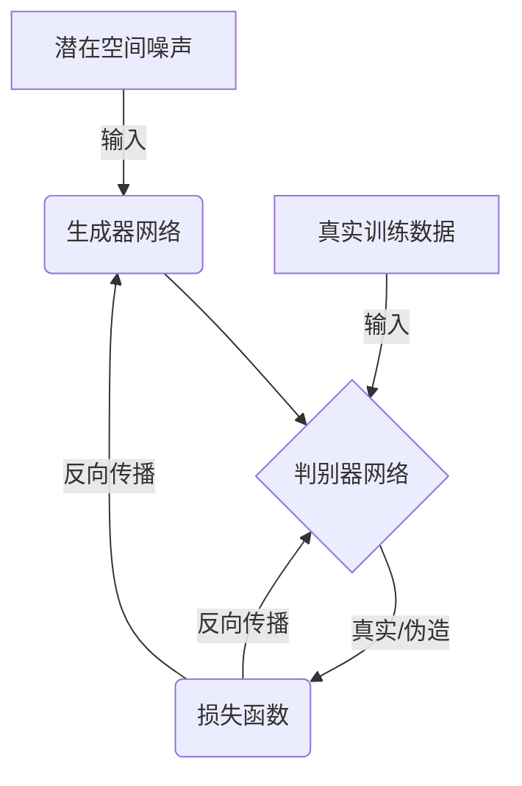
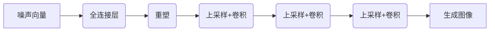
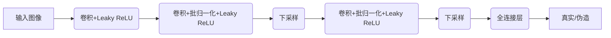

# Python深度学习实践：实现GAN生成自己的数字艺术品

## 1.背景介绍

### 1.1 什么是生成对抗网络？

生成对抗网络(Generative Adversarial Networks, GAN)是一种由Ian Goodfellow等人在2014年提出的全新的生成模型框架。GAN由两个神经网络模型组成:生成器(Generator)和判别器(Discriminator)。生成器的目标是学习数据分布,并生成与训练数据类似的新数据样本。判别器则负责判断生成器生成的数据样本是真实的还是伪造的。生成器和判别器相互对抗,相互博弈,最终达到一个纳什均衡,使生成器生成的数据无法被判别器识别为伪造数据。

### 1.2 GAN在数字艺术领域的应用

近年来,GAN在数字艺术领域得到了广泛应用,可以生成逼真的人脸、风景、动物等图像,甚至可以根据文字描述生成相应的图像。GAN为艺术创作提供了新的可能性,艺术家可以利用GAN生成大量图像素材,并将其融入到自己的艺术作品中,实现人工智能辅助艺术创作。

## 2.核心概念与联系

### 2.1 生成对抗网络的核心思想

GAN的核心思想是建立生成模型与判别模型之间的对抗过程。生成器网络的目标是从潜在空间(latent space)的噪声数据中生成逼真的样本数据,以欺骗判别器网络;而判别器网络则努力于识别生成器生成的样本是真实的还是伪造的。两个网络相互对抗、相互博弈,最终达到一个纳什均衡,使生成器生成的样本数据无法被判别器识别为伪造数据。



### 2.2 生成器和判别器网络

- **生成器网络(Generator)**: 生成器网络的输入是一个随机噪声向量,通过上采样(upsampling)和卷积操作,将噪声转换为目标图像。生成器网络的目标是生成逼真的图像样本,以欺骗判别器网络。

- **判别器网络(Discriminator)**: 判别器网络的输入是真实图像和生成器生成的伪造图像。判别器网络的目标是正确识别输入图像是真实的还是伪造的。

### 2.3 对抗训练过程

生成器网络和判别器网络通过对抗训练相互博弈,互相提升对方的性能。具体过程如下:

1. 从训练数据中采样出一批真实图像样本。
2. 从潜在空间(latent space)中采样出一批随机噪声向量,送入生成器网络生成一批伪造图像样本。
3. 将真实图像样本和伪造图像样本输入到判别器网络,判别器网络对每个样本做出真实/伪造的判断。
4. 计算判别器网络在真实样本和伪造样本上的损失函数,并对判别器网络的参数进行更新,提高判别能力。
5. 计算生成器网络欺骗判别器网络的损失函数,并对生成器网络的参数进行更新,提高生成能力。
6. 重复上述过程,直到生成器网络和判别器网络达到一个动态平衡。

## 3.核心算法原理具体操作步骤

### 3.1 生成器网络结构

生成器网络的主要任务是将噪声数据映射到目标图像空间。常见的生成器网络结构包括全卷积网络(DCGAN)、U-Net等。以DCGAN为例,其网络结构如下:



1. 输入是一个随机噪声向量,通过全连接层对噪声进行处理。
2. 将全连接层的输出重塑为一个三维张量,作为卷积层的输入。
3. 使用上采样(upsampling)和卷积操作逐步将低分辨率的特征图升维为高分辨率的图像。
4. 最后一层使用卷积操作和Tanh激活函数输出目标图像。

### 3.2 判别器网络结构

判别器网络的主要任务是判断输入图像是真实的还是伪造的。常见的判别器网络结构包括全卷积分类网络、U-Net等。以全卷积分类网络为例,其网络结构如下:



1. 输入是真实图像或生成器生成的伪造图像。
2. 使用卷积层、批归一化层、激活函数对输入图像进行特征提取。
3. 使用下采样(downsampling)操作逐步降低特征图的分辨率。
4. 最后通过全连接层和Sigmoid激活函数输出一个0到1之间的概率值,表示输入图像是真实的还是伪造的。

### 3.3 对抗训练算法步骤

对抗训练算法的具体步骤如下:

1. 初始化生成器网络G和判别器网络D的参数。
2. 对训练数据进行预处理,如归一化、数据增强等。
3. 对每个训练批次(batch)执行以下操作:
    a. 从训练数据中采样一批真实图像样本。
    b. 从潜在空间(latent space)中采样一批随机噪声向量,送入生成器网络生成一批伪造图像样本。
    c. 将真实图像样本和伪造图像样本输入到判别器网络,获取判别器网络对每个样本的真实/伪造判断结果。
    d. 计算判别器网络在真实样本和伪造样本上的损失函数,并对判别器网络的参数进行更新,提高判别能力。
    e. 计算生成器网络欺骗判别器网络的损失函数,并对生成器网络的参数进行更新,提高生成能力。
4. 重复步骤3,直到生成器网络和判别器网络达到一个动态平衡。

在训练过程中,生成器网络和判别器网络相互对抗、相互博弈,生成器网络努力生成更加逼真的图像样本以欺骗判别器网络,而判别器网络则努力提高区分真伪的能力。最终,生成器网络和判别器网络达到一个纳什均衡,生成器网络生成的图像样本无法被判别器网络识别为伪造数据。

## 4.数学模型和公式详细讲解举例说明

### 4.1 生成对抗网络的目标函数

生成对抗网络的目标函数可以表示为一个两玩家的minimax游戏,生成器网络G和判别器网络D相互对抗,寻找一个纳什均衡点。数学表达式如下:

$$\min_G \max_D V(D,G) = \mathbb{E}_{x\sim p_{data}(x)}[\log D(x)] + \mathbb{E}_{z\sim p_z(z)}[\log(1-D(G(z)))]$$

其中:
- $p_{data}(x)$表示真实数据的分布
- $p_z(z)$表示噪声数据的分布,通常是高斯分布或均匀分布
- $G(z)$表示生成器网络将噪声数据$z$映射到数据空间的过程
- $D(x)$表示判别器网络对输入数据$x$的真实/伪造判断结果,值域为[0,1]

上式的第一项$\mathbb{E}_{x\sim p_{data}(x)}[\log D(x)]$表示判别器网络正确识别真实数据样本的期望,目标是最大化这一项。第二项$\mathbb{E}_{z\sim p_z(z)}[\log(1-D(G(z)))]$表示判别器网络正确识别生成器生成的伪造数据样本的期望,目标是最大化这一项。

生成器网络G的目标是最小化上式,即最小化判别器网络正确判断的期望,从而欺骗判别器网络。判别器网络D的目标是最大化上式,即最大化正确判断的期望,提高区分真伪的能力。

### 4.2 交叉熵损失函数

在实践中,通常使用交叉熵损失函数(Cross Entropy Loss)来优化生成器网络和判别器网络。对于判别器网络,交叉熵损失函数可表示为:

$$L_D = -\mathbb{E}_{x\sim p_{data}(x)}[\log D(x)] - \mathbb{E}_{z\sim p_z(z)}[\log(1-D(G(z)))]$$

对于生成器网络,交叉熵损失函数可表示为:

$$L_G = -\mathbb{E}_{z\sim p_z(z)}[\log D(G(z))]$$

在训练过程中,我们需要最小化判别器网络的损失函数$L_D$,最大化生成器网络的损失函数$L_G$,从而达到对抗训练的目标。

### 4.3 其他损失函数

除了交叉熵损失函数,还有一些其他损失函数可用于优化生成对抗网络,如最小二乘损失函数(Least Squares Loss)、Wasserstein损失函数等。不同的损失函数会影响模型的训练稳定性和生成结果的质量。

例如,最小二乘损失函数定义如下:

$$L_D = \frac{1}{2}\mathbb{E}_{x\sim p_{data}(x)}[(D(x)-1)^2] + \frac{1}{2}\mathbb{E}_{z\sim p_z(z)}[D(G(z))^2]$$
$$L_G = \frac{1}{2}\mathbb{E}_{z\sim p_z(z)}[(D(G(z))-1)^2]$$

使用最小二乘损失函数可以提高训练的稳定性,但可能会影响生成结果的质量。

### 4.4 模型评估指标

评估生成对抗网络的性能通常使用以下指标:

- **inception分数(Inception Score)**: 该指标衡量生成图像的质量和多样性。分数越高,表示生成图像的质量和多样性越好。
- **Fréchet inception距离(Fréchet Inception Distance, FID)**: 该指标测量生成数据分布与真实数据分布之间的相似程度。距离越小,表示生成数据分布与真实数据分布越相似。
- **核密度估计(Kernel Density Estimation)**: 使用核密度估计方法估计生成数据分布和真实数据分布,并计算两个分布之间的统计距离。

## 5.项目实践:代码实例和详细解释说明

在这一部分,我们将使用PyTorch框架实现一个简单的GAN模型,用于生成手写数字图像。我们将逐步介绍生成器网络、判别器网络的代码实现,以及对抗训练的代码实现。

### 5.1 导入所需库

```python
import torch
import torch.nn as nn
import torchvision
import torchvision.transforms as transforms
import matplotlib.pyplot as plt
import numpy as np
```

### 5.2 加载MNIST数据集

```python
# 下载MNIST数据集
transform = transforms.Compose([transforms.ToTensor(), transforms.Normalize((0.5,), (0.5,))])
trainset = torchvision.datasets.MNIST(root='./data', train=True, download=True, transform=transform)
trainloader = torch.utils.data.DataLoader(trainset, batch_size=128, shuffle=True)
```

### 5.3 定义生成器网络

```python
class Generator(nn.Module):
    def __init__(self, z_dim=100, img_dim=28*28):
        super(Generator, self).__init__()
        self.z_dim = z_dim
        
        self.gen = nn.Sequential(
            nn.Linear(z_dim, 256),
            nn.LeakyReLU(0.2),
            nn.Linear(256, img_dim),
            nn.Tanh()
        )
        
    def forward(self, z):
        img =