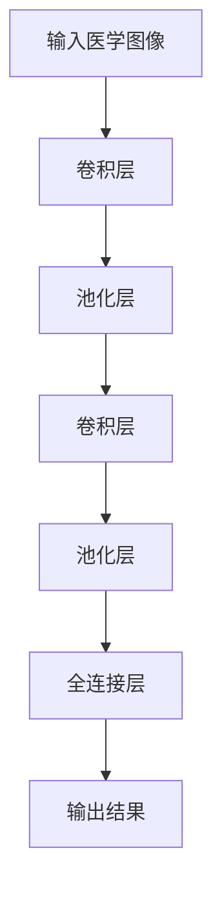
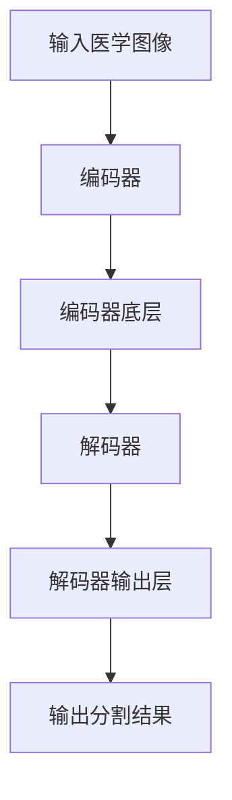
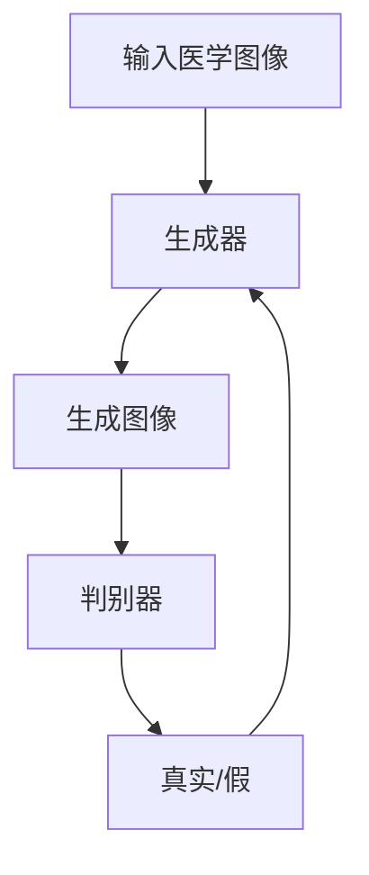

# Python深度学习实践：深度学习在医学图像分析中的运用

## 1.背景介绍

### 1.1 医学图像分析的重要性

医学图像分析是医疗保健领域中不可或缺的一个环节,它能够为医生提供宝贵的诊断信息,帮助他们更好地了解患者的病情,制定适当的治疗方案。随着医学影像设备的不断发展,如X射线、CT、MRI等,产生的医学图像数据呈指数级增长,人工分析这些海量数据已经变得越来越困难。因此,需要借助计算机辅助分析技术来提高医学图像分析的效率和准确性。

### 1.2 深度学习在医学图像分析中的应用

深度学习作为一种有效的机器学习方法,在图像识别、目标检测等计算机视觉任务中表现出色,因此也被广泛应用于医学图像分析领域。利用深度学习模型对医学图像进行智能分析,可以自动检测病灶、肿瘤等异常区域,辅助医生进行疾病诊断,提高诊断的准确率。此外,深度学习还可以用于医学图像的分割、配准、增强等预处理任务,为后续的分析奠定基础。

### 1.3 Python在深度学习中的作用

Python作为一种简单易学、功能强大的编程语言,在人工智能和数据科学领域备受青睐。Python提供了众多优秀的深度学习框架,如TensorFlow、PyTorch、Keras等,极大地降低了深度学习模型的开发难度。利用Python及其生态系统中的工具和库,我们可以高效地构建、训练和部署深度学习模型,应用于医学图像分析等领域。

## 2.核心概念与联系

### 2.1 卷积神经网络

卷积神经网络(Convolutional Neural Network, CNN)是一种常用的深度学习模型,在图像分类、目标检测等计算机视觉任务中表现出色。CNN由多个卷积层、池化层和全连接层组成,能够自动从图像中提取特征,并进行分类或回归。

在医学图像分析中,CNN可以用于病灶检测、肿瘤分割等任务。例如,我们可以训练一个CNN模型来识别CT图像中的肺结节,为肺癌的早期诊断提供帮助。

### 2.2 U-Net

U-Net是一种常用的医学图像分割模型,它采用了编码器-解码器的结构,能够精准地将图像分割为不同的区域或器官。U-Net在许多医学图像分割任务中表现出色,如肝脏分割、肾脏分割等。

### 2.3 生成对抗网络

生成对抗网络(Generative Adversarial Network, GAN)是一种无监督学习模型,它由生成器和判别器两个神经网络组成,通过对抗训练的方式生成逼真的图像数据。在医学图像分析中,GAN可以用于数据增强、图像去噪、图像重建等任务。

例如,我们可以使用GAN生成合成的医学图像数据,用于扩充训练集,提高模型的泛化能力。同时,GAN也可以用于医学图像的去噪和重建,提高图像质量,为后续的分析提供更清晰的输入。

### 2.4 迁移学习

迁移学习是一种机器学习技术,它可以将在一个领域训练好的模型迁移到另一个相关领域,加速模型在新领域的训练过程。在医学图像分析中,我们可以利用在自然图像数据集上预训练的模型作为起点,通过在医学图像数据集上进行微调,快速获得一个适用于医学图像分析的模型。

迁移学习不仅可以节省训练时间,还能在数据量有限的情况下提高模型的性能,因此在医学图像分析领域具有重要的应用价值。

## 3.核心算法原理具体操作步骤

### 3.1 卷积神经网络原理

卷积神经网络(CNN)是一种前馈神经网络,它的工作原理可以概括为以下几个步骤:

1. **卷积层**:通过卷积核(滤波器)在输入图像上滑动,提取局部特征。卷积层可以自动学习到图像的低级特征,如边缘、纹理等。
2. **池化层**:对卷积层的输出进行下采样,减小特征图的分辨率,提取主要特征,降低计算量。常用的池化操作有最大池化和平均池化。
3. **全连接层**:将前面卷积层和池化层提取的特征进行整合,并输出分类或回归结果。全连接层类似于传统的人工神经网络。
4. **反向传播**:根据损失函数计算误差,通过反向传播算法更新网络权重,实现模型训练。

CNN的核心思想是通过局部连接和权重共享,提取输入图像的空间和时间上的层次特征,从而实现对图像的有效识别和分类。

### 3.2 U-Net算法步骤

U-Net是一种常用的医学图像分割模型,它的工作流程如下:

1. **编码器(Contracting Path)**:输入图像经过一系列卷积操作和池化操作,特征图的分辨率逐渐降低,但特征的语义信息逐渐增强。
2. **编码器底层(Bottleneck)**:在编码器的最底层,特征图的分辨率最小,但包含了最丰富的语义信息。
3. **解码器(Expansive Path)**:在解码器阶段,特征图的分辨率逐渐恢复,同时通过跳跃连接(Skip Connection)融合来自对应编码器层的低级特征信息。
4. **输出层**:最后一层是一个卷积层,输出与输入图像同样大小的分割掩码,每个像素对应一个类别。

U-Net的核心思想是利用编码器-解码器结构和跳跃连接,实现了精确的像素级分割,同时保留了足够的上下文信息,使得模型能够很好地捕捉目标物体的形状和边界。

### 3.3 生成对抗网络原理

生成对抗网络(GAN)由生成器(Generator)和判别器(Discriminator)两个神经网络组成,它们通过对抗训练的方式相互博弈,最终达到生成逼真图像的目的。GAN的工作流程如下:

1. **生成器**:生成器从随机噪声输入开始,通过上采样、卷积等操作生成假的图像样本。
2. **判别器**:判别器接收真实图像和生成器生成的假图像作为输入,并输出一个概率值,表示输入图像是真实的还是假的。
3. **对抗训练**:生成器和判别器进行对抗训练,生成器的目标是生成足以欺骗判别器的假图像,而判别器的目标是能够正确区分真实图像和假图像。
4. **损失函数**:生成器和判别器各自有一个损失函数,生成器试图最小化判别器对其生成图像的真实性评分,而判别器试图最大化对真实图像和生成图像的正确分类。

通过这种对抗训练过程,生成器和判别器相互促进,最终生成器能够生成逼真的图像样本。GAN在医学图像分析中可以用于数据增强、图像去噪等任务。

### 3.4 迁移学习步骤

迁移学习的核心思想是利用在源领域训练好的模型,将其迁移到目标领域,加速模型在新领域的训练过程。在医学图像分析中应用迁移学习的一般步骤如下:

1. **选择预训练模型**:根据任务的性质,选择在大型自然图像数据集(如ImageNet)上预训练的模型,如VGG、ResNet、Inception等。
2. **冻结部分层**:将预训练模型的部分层(通常是底层)的权重冻结,防止在新领域的训练过程中被破坏。
3. **微调模型**:在医学图像数据集上对预训练模型进行微调,即继续训练模型的部分层(通常是顶层),使其适应新的医学图像数据。
4. **超参数调整**:根据实际情况调整学习率、批量大小等超参数,以获得最佳的模型性能。
5. **模型评估**:在验证集或测试集上评估微调后模型的性能,确保其能够很好地泛化到新的医学图像数据。

迁移学习的优点在于可以利用预训练模型提取的通用特征,加快模型在新领域的收敛速度,同时降低了对大量标注数据的需求,因此在医学图像分析等数据量有限的领域具有重要的应用价值。

## 4.数学模型和公式详细讲解举例说明

### 4.1 卷积运算

卷积运算是卷积神经网络的核心操作,它通过卷积核(滤波器)在输入特征图上滑动,提取局部特征。卷积运算的数学表达式如下:

$$
y_{ij} = \sum_{m}\sum_{n}x_{m+i,n+j}w_{mn} + b
$$

其中:
- $y_{ij}$是输出特征图上的元素
- $x_{m+i,n+j}$是输入特征图上的元素
- $w_{mn}$是卷积核的权重
- $b$是偏置项

卷积运算的过程可以看作是在输入特征图上滑动卷积核,对每个位置的局部区域进行加权求和,得到输出特征图上对应位置的值。通过学习卷积核的权重,卷积层可以自动提取输入图像的低级特征,如边缘、纹理等。

例如,对于一个3×3的卷积核,在输入特征图上滑动时,每次会涉及9个元素的加权求和运算。假设输入特征图的大小为5×5,卷积核的步长为1,则输出特征图的大小为3×3,计算过程如下:

$$
\begin{bmatrix}
y_{11} & y_{12} & y_{13} \\
y_{21} & y_{22} & y_{23} \\
y_{31} & y_{32} & y_{33}
\end{bmatrix}
=
\begin{bmatrix}
\sum\limits_{m=0}^{2}\sum\limits_{n=0}^{2}x_{m+1,n+1}w_{mn} & \sum\limits_{m=0}^{2}\sum\limits_{n=0}^{2}x_{m+1,n+2}w_{mn} & \sum\limits_{m=0}^{2}\sum\limits_{n=0}^{2}x_{m+1,n+3}w_{mn} \\
\sum\limits_{m=0}^{2}\sum\limits_{n=0}^{2}x_{m+2,n+1}w_{mn} & \sum\limits_{m=0}^{2}\sum\limits_{n=0}^{2}x_{m+2,n+2}w_{mn} & \sum\limits_{m=0}^{2}\sum\limits_{n=0}^{2}x_{m+2,n+3}w_{mn} \\
\sum\limits_{m=0}^{2}\sum\limits_{n=0}^{2}x_{m+3,n+1}w_{mn} & \sum\limits_{m=0}^{2}\sum\limits_{n=0}^{2}x_{m+3,n+2}w_{mn} & \sum\limits_{m=0}^{2}\sum\limits_{n=0}^{2}x_{m+3,n+3}w_{mn}
\end{bmatrix}
$$

通过卷积运算,我们可以从输入图像中提取出不同的特征,如边缘、纹理、形状等,为后续的特征整合和分类任务奠定基础。

### 4.2 池化运算

池化运算是卷积神经网络中的另一个重要操作,它用于降低特征图的分辨率,提取主要特征,减少计算量和防止过拟合。池化运算的数学表达式如下:

$$
y_{ij} = \operatorname{pool}(x_{m+i