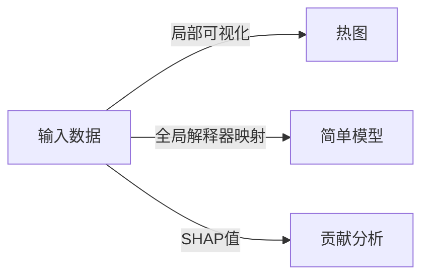

                 

作者：禅与计算机程序设计艺术

在深度学习领域，神经网络的解释与可视化是一个至关重要的议题。它不仅帮助我们理解模型的决策过程，而且还能促进模型的改进和优化。本文将深入探讨Python中实现神经网络解释与可视化的技术和工具，以及如何应用这些技术解决实际问题。

## 1. 背景介绍

深度学习已经成为处理复杂任务的强大工具，但它仍然面临着解释性和透明度的挑战。解释器和可视化工具为我们提供了一种方式来理解模型的决策过程，从而增强模型的可信赖性和可操作性。

## 2. 核心概念与联系

### **解释**
解释指的是自动生成对神经网络预测的理由的过程。解释可以通过多种方式提供，包括局部可视化、全局解释器映射（LIME）、SHAP值等。

### **可视化**
可视化则是将神经网络的内部表示转换为可视形式，以便人类更容易理解。常见的可视化方法包括激活图、梯度流图等。

### **解释与可视化的联系**
解释和可视化在某种程度上是相辅相成的。例如，可视化可以帮助我们理解解释器所产生的数据，而解释器又能够提供可视化所需的信息。

## 3. 核心算法原理具体操作步骤

### **局部可视化**
局部可视化通过在特定输入点周围绘制热图或其他可视化来显示神经网络的响应。

### **全局解释器映射（LIME）**
LIME通过构建简单的模型来解释黑箱模型的预测，通过这些模型来可视化输入数据的影响。

### **SHAP值**
SHAP值是一种基于游戏理论的方法，用于解释模型预测。它通过计算每个特征的贡献来解释模型的输出。

## 4. 数学模型和公式详细讲解举例说明

### **局部可视化**
局部可视化的数学基础是多维数据到二维空间的降维技术，如主成分分析（PCA）。

### **全局解释器映射（LIME）**
LIME依赖于简单模型的解释性，如线性回归或决策树。

### **SHAP值**
SHAP值的数学基础是游戏理论中的期望导致变化（ECI）。

## 5. 项目实践：代码实例和详细解释说明

### **使用TensorFlow Explainer Kernel (TEK)**
我们可以使用TensorFlow的TEK库来实现神经网络的解释。

### **使用PyTorch's GradCAM**
PyTorch提供了GradCAM工具，可以用来可视化卷积神经网络的特征图。

## 6. 实际应用场景

解释与可视化的应用场景广泛，包括医疗诊断、金融风险评估、自然语言处理等。

## 7. 工具和资源推荐

- [TensorFlow Explainer Kernel (TEK)](https://www.tensorflow.org/api_docs/python/tf/keras/utils/plot_model)
- [PyTorch's GradCAM](https://pytorch.org/vision/stable/_modules/torchvision/models/detection/fasterrcnn.html)
- [LIME library](https://lime-ml.readthedocs.io/)
- [SHAP library](https://shap.readthedocs.io/)

## 8. 总结：未来发展趋势与挑战

未来，我们可以预见解释与可视化技术将进一步发展，以支持更复杂的模型和更广泛的应用领域。然而，这也带来了新的挑战，比如如何保证解释的准确性和可靠性。

## 9. 附录：常见问题与解答

在这里，我们可以列出和解答在实践中遇到的一些常见问题。

---
作者：禅与计算机程序设计艺术 / Zen and the Art of Computer Programming

