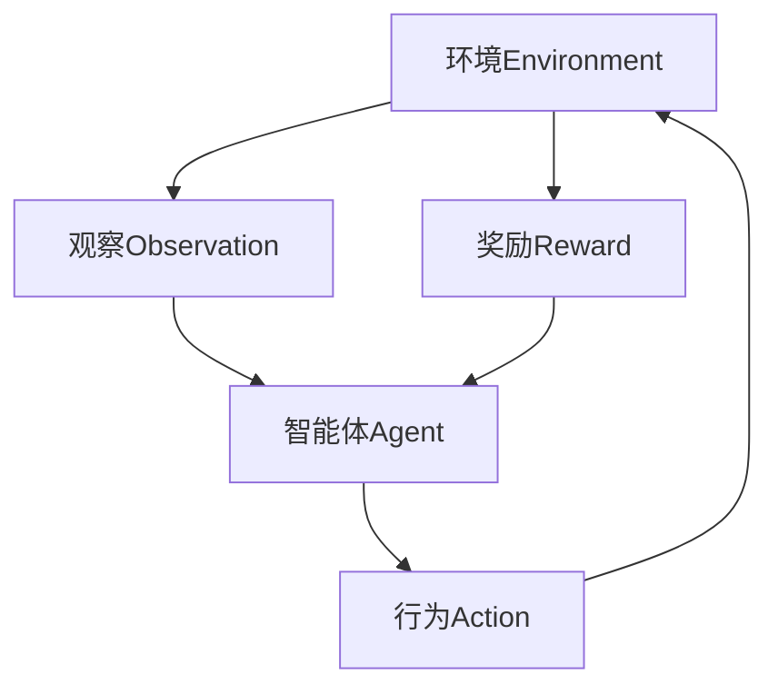

# Q-Learning - 原理与代码实例讲解

## 1. 背景介绍

在人工智能和机器学习领域中,强化学习(Reinforcement Learning)是一种非常重要和有影响力的范式。它允许智能体(Agent)通过与环境(Environment)的交互来学习,并根据获得的反馈(Reward)不断优化其行为策略。Q-Learning作为强化学习中的一种经典算法,具有广泛的应用场景,如机器人控制、游戏AI、资源管理等。

Q-Learning的核心思想是估计一个行为价值函数(Action-Value Function),也称为Q函数(Q-Function),该函数能够为每个状态-行为对(State-Action Pair)赋予一个期望的累积奖励值。通过不断更新和优化这个Q函数,智能体就能够逐步学习到一个最优的行为策略,从而在给定环境中获得最大的长期累积奖励。

### Mermaid 流程图



上图展示了Q-Learning中智能体与环境之间的交互过程。智能体根据当前状态选择一个行为,环境会根据这个行为转移到下一个状态,并给出相应的奖励信号。智能体的目标就是学习一个策略,使得在环境中获得的长期累积奖励最大化。

## 2. 核心概念与联系

### 2.1 马尔可夫决策过程(Markov Decision Process, MDP)

Q-Learning是建立在马尔可夫决策过程(MDP)的基础之上的。MDP由以下几个要素组成:

- 状态集合(State Space) $\mathcal{S}$
- 行为集合(Action Space) $\mathcal{A}$
- 转移概率(Transition Probability) $\mathcal{P}_{ss'}^a = \mathcal{P}(s' | s, a)$
- 奖励函数(Reward Function) $\mathcal{R}_s^a = \mathcal{E}[R | s, a]$
- 折扣因子(Discount Factor) $\gamma \in [0, 1)$

在MDP中,智能体处于某个状态$s \in \mathcal{S}$,选择一个行为$a \in \mathcal{A}(s)$,然后根据转移概率$\mathcal{P}_{ss'}^a$转移到下一个状态$s'$,并获得相应的奖励$r = \mathcal{R}_s^a$。智能体的目标是找到一个策略$\pi: \mathcal{S} \rightarrow \mathcal{A}$,使得期望的累积折扣奖励最大化:

$$\max_\pi \mathbb{E}_\pi \left[ \sum_{t=0}^\infty \gamma^t r_{t+1} \right]$$

其中$r_{t+1}$是在时间$t$执行行为$a_t$后获得的奖励。

### 2.2 Q函数(Q-Function)

Q函数定义为在状态$s$执行行为$a$后,能够获得的期望累积折扣奖励:

$$Q^\pi(s, a) = \mathbb{E}_\pi \left[ \sum_{t=0}^\infty \gamma^t r_{t+1} | s_0 = s, a_0 = a \right]$$

Q函数实际上是对策略$\pi$的评估。如果我们能够得到最优的Q函数$Q^*(s, a)$,那么对应的最优策略$\pi^*$就是在每个状态$s$选择使$Q^*(s, a)$最大化的行为$a$:

$$\pi^*(s) = \arg\max_a Q^*(s, a)$$

因此,Q-Learning的核心目标就是找到这个最优的Q函数$Q^*$。

## 3. 核心算法原理具体操作步骤

Q-Learning算法的核心思想是通过不断探索和利用,逐步更新Q函数的估计值,直至收敛到最优Q函数$Q^*$。算法的具体步骤如下:

1. 初始化Q函数的估计值$Q(s, a)$,通常将所有$(s, a)$对应的值初始化为0或一个较小的常数。
2. 对于每一个时间步$t$:
    a. 根据当前策略(如$\epsilon$-贪婪策略)选择一个行为$a_t$
    b. 执行选定的行为$a_t$,观察环境的反馈(下一个状态$s_{t+1}$和即时奖励$r_{t+1}$)
    c. 更新Q函数的估计值:
    
    $$Q(s_t, a_t) \leftarrow Q(s_t, a_t) + \alpha \left[ r_{t+1} + \gamma \max_{a'} Q(s_{t+1}, a') - Q(s_t, a_t) \right]$$
    
    其中$\alpha$是学习率(Learning Rate),控制了新信息对Q函数估计值的影响程度。
3. 重复步骤2,直到Q函数收敛或达到停止条件。

### Mermaid 流程图

```mermaid
graph TD
    A[初始化Q函数] --> B[选择行为a]
    B --> C[执行行为a获取r和s']
    C --> D[更新Q(s,a)]
    D --> E{是否停止?}
    E -->|是| F[输出最终Q函数]
    E -->|否| B
```

上图展示了Q-Learning算法的基本流程。通过不断探索和利用,算法逐步更新Q函数的估计值,直至收敛到最优Q函数。

需要注意的是,在实际应用中,我们通常无法获知环境的完整马尔可夫决策过程,因此Q-Learning属于一种基于模型自由(Model-Free)的强化学习算法。

## 4. 数学模型和公式详细讲解举例说明

### 4.1 Q函数的贝尔曼方程(Bellman Equation)

Q函数满足以下贝尔曼方程:

$$Q^*(s, a) = \mathbb{E}_{s' \sim \mathcal{P}(\cdot | s, a)} \left[ r + \gamma \max_{a'} Q^*(s', a') \right]$$

该方程反映了Q函数的递推关系。对于任意一个状态-行为对$(s, a)$,其最优Q值等于在该状态下执行该行为所获得的即时奖励$r$,加上未来状态$s'$下所有可能行为的最大Q值的折扣期望。

我们以一个简单的网格世界(GridWorld)环境为例,来解释Q函数的贝尔曼方程:

```python
GRID = [
    [0, 0, 0, 1],
    [0, 'x', 0, -1],
    [0, 0, 0, 0]
]

actions = ['U', 'D', 'L', 'R']  # 上下左右
rewards = {
    0: -0.04,  # 空地奖励
    1: 1,      # 目标奖励
    -1: -1,    # 障碍惩罚
    'x': None  # 出界
}
```

假设智能体当前位于$(1, 1)$状态,执行向右移动的行为'R'。由于$(2, 1)$位置是障碍物,智能体将无法移动,并获得惩罚奖励$r = -1$。根据贝尔曼方程:

$$Q^*((1, 1), 'R') = -1 + \gamma \max_{a'} Q^*((1, 1), a')$$

其中$\gamma$是折扣因子,用于权衡即时奖励和未来奖励的重要性。通常取值在$[0.8, 0.99]$之间。

由于智能体无法移动,未来状态仍为$(1, 1)$,因此上式可以进一步化简为:

$$Q^*((1, 1), 'R') = -1 + \gamma \max \{ Q^*((1, 1), 'U'), Q^*((1, 1), 'D'), Q^*((1, 1), 'L'), Q^*((1, 1), 'R') \}$$

这个等式说明,在$(1, 1)$状态执行'R'行为的最优Q值,等于立即获得的惩罚奖励$-1$,加上在$(1, 1)$状态下所有可能行为的最大Q值的折扣期望。

通过不断更新和优化Q函数,使其满足贝尔曼方程,就能够逐步收敛到最优Q函数$Q^*$。

### 4.2 Q-Learning更新规则

Q-Learning算法的核心更新规则如下:

$$Q(s_t, a_t) \leftarrow Q(s_t, a_t) + \alpha \left[ r_{t+1} + \gamma \max_{a'} Q(s_{t+1}, a') - Q(s_t, a_t) \right]$$

其中:

- $\alpha$是学习率(Learning Rate),控制了新信息对Q函数估计值的影响程度,通常取值在$[0.1, 0.5]$之间。
- $r_{t+1}$是执行行为$a_t$后获得的即时奖励。
- $\gamma$是折扣因子,用于权衡即时奖励和未来奖励的重要性,通常取值在$[0.8, 0.99]$之间。
- $\max_{a'} Q(s_{t+1}, a')$是在下一个状态$s_{t+1}$下,所有可能行为的最大Q值估计。

我们以上面的网格世界环境为例,假设智能体从$(0, 0)$出发,执行一系列行为:

1. 在$(0, 0)$状态下,执行'R'行为,转移到$(0, 1)$状态,获得奖励$r = -0.04$。
2. 在$(0, 1)$状态下,执行'R'行为,转移到$(0, 2)$状态,获得奖励$r = -0.04$。
3. 在$(0, 2)$状态下,执行'R'行为,转移到$(0, 3)$状态,获得奖励$r = 1$(到达目标)。

假设学习率$\alpha = 0.5$,折扣因子$\gamma = 0.9$,初始Q函数估计值全部为0。那么在第一个时间步,Q函数的更新过程如下:

$$Q((0, 0), 'R') \leftarrow 0 + 0.5 \left[ -0.04 + 0.9 \max_{a'} Q((0, 1), a') - 0 \right]$$

由于$(0, 1)$状态下所有行为的Q值估计初始都为0,因此$\max_{a'} Q((0, 1), a') = 0$,所以:

$$Q((0, 0), 'R') \leftarrow 0 + 0.5 \times (-0.04) = -0.02$$

同理,在第二个时间步:

$$Q((0, 1), 'R') \leftarrow 0 + 0.5 \left[ -0.04 + 0.9 \max_{a'} Q((0, 2), a') - 0 \right]$$

由于$(0, 2)$状态下所有行为的Q值估计初始都为0,因此$\max_{a'} Q((0, 2), a') = 0$,所以:

$$Q((0, 1), 'R') \leftarrow 0 + 0.5 \times (-0.04) = -0.02$$

在第三个时间步:

$$Q((0, 2), 'R') \leftarrow 0 + 0.5 \left[ 1 + 0.9 \max_{a'} Q((0, 3), a') - 0 \right]$$

由于$(0, 3)$是目标状态,所以$\max_{a'} Q((0, 3), a') = 0$,因此:

$$Q((0, 2), 'R') \leftarrow 0 + 0.5 \times (1 + 0) = 0.5$$

通过不断更新和优化,Q函数的估计值就会逐步收敛到最优Q函数$Q^*$。

## 5. 项目实践: 代码实例和详细解释说明

下面是一个使用Python实现的Q-Learning代码示例,用于解决上述网格世界环境的问题。

```python
import numpy as np

# 定义网格世界环境
GRID = [
    [0, 0, 0, 1],
    [0, 'x', 0, -1],
    [0, 0, 0, 0]
]

# 定义行为空间
actions = ['U', 'D', 'L', 'R']

# 定义奖励函数
rewards = {
    0: -0.04,  # 空地奖励
    1: 1,      # 目标奖励
    -1: -1,    # 障碍惩罚
    'x': None  # 出界
}

# 定义折扣因子和学习率
gamma = 0.9
alpha = 0.5

# 初始化Q函数
Q = {}
for i in range(len(GRID)):
    for j in range(len(GRID[0])):
        Q[(i, j)] = {}
        for a in actions:
            Q[(i, j)][a] = 0

# 定义获取下一个状态和奖励的函数
def get_next_state_and_reward(state, action