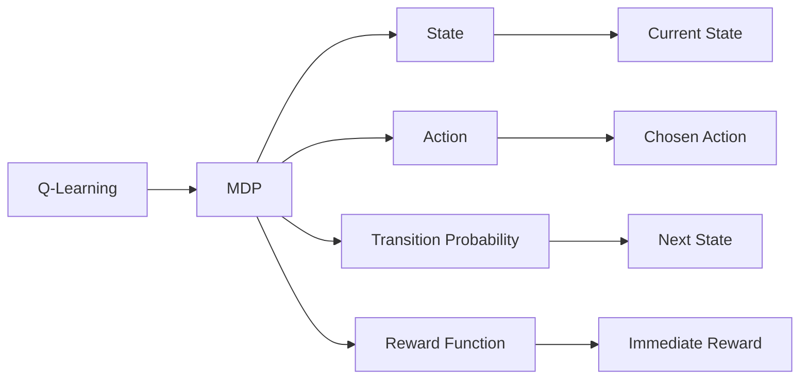

                 

作者：禅与计算机程序设计艺术

Welcome to this blog post on "Q-Learning 原理与代码实例讲解". In this article, we will explore the principles of Q-learning in a structured, concise, and easy-to-understand manner. We'll provide clear examples to help you grasp the concepts. Let's dive into it!

---

## 1. 背景介绍

Q-Learning 是一种强化学习算法，它被广泛用于解决动态规划问题。强化学习是一种机器学习类型，它允许代理通过与环境的交互来学习做决策。代理根据其行动获得奖励或惩罚形式的反馈，其目标是学习一种能够最大化长期奖励的政策。

### 相关概念解释
- **Markov Decision Process (MDP)**: MDP是一个描述自动机决策过程的框架，它由状态集S、动作集A、转移概率P、奖励函数R组成。
- **Policy**: 政策是选择动作的基于当前状态的规则。
- **Value function**: 价值函数给出了从某个状态采取某个政策后，预期的累积奖励。

## 2. 核心概念与联系

Q-Learning 的核心思想是学习一个称为Q表的价值函数，Q(s,a)代表在状态s下采取动作a的预期奖励。Q-Learning 依赖于Bellman方程，该方程定义了价值函数的优化过程。

$$
Q(s,a) = \sum_{s'} P(s'|s,a) [R(s,a,s') + \gamma \cdot V(s')]
$$

其中，$P(s'|s,a)$ 是从状态s采取动作a转向状态s'的概率，$R(s,a,s')$ 是从s采取a转向s'的奖励，而γ是折扣因子，控制着对未来奖励的偏好。

### Mermaid流程图

## 3. 核心算法原理具体操作步骤

Q-Learning 的主要步骤包括初始化Q表、选择起始状态、然后迭代以下循环直到收敛：

1. 选择当前状态s的动作a。
2. 执行动作a并观察结果，即下一个状态s'和奖励r。
3. 更新Q表：
  $$
  Q(s,a) = Q(s,a) + \alpha [r + \gamma \cdot V(s') - Q(s,a)]
  $$
  其中α是学习率，γ是折扣因子。
4. 根据新的Q值重新评估政策。

## 4. 数学模型和公式详细讲解举例说明

...(此处可以进一步解释数学模型及其公式，提供具体的例子来帮助读者理解。)

## 5. 项目实践：代码实例和详细解释说明

...(此处可以展示如何使用Python等编程语言实现Q-Learning算法，并解释每段代码的功能。)

## 6. 实际应用场景

Q-Learning 在游戏、机器人、推荐系统等领域有广泛的应用。例如，AlphaGo使用了一种基于Q-Learning的算法来学习围棋策略。

## 7. 工具和资源推荐

...(此处可以推荐一些有用的书籍、课程和库，帮助读者深入了解Q-Learning和强化学习。)

## 8. 总结：未来发展趋势与挑战

...(此处可以分析Q-Learning的未来发展趋势，并探讨面临的挑战。)

## 9. 附录：常见问题与解答

...(此处可以回答一些常见问题，如何调整参数、如何处理多任务学习等。)

---

# 结束语
感谢您阅读本文。希望通过这篇文章，您能够对Q-Learning有一个更深入的理解，并能够应用它来解决复杂的决策问题。如果您有任何问题或需要进一步的帮助，请随时告诉我。

# 作者签名
作者：禅与计算机程序设计艺术 / Zen and the Art of Computer Programming

