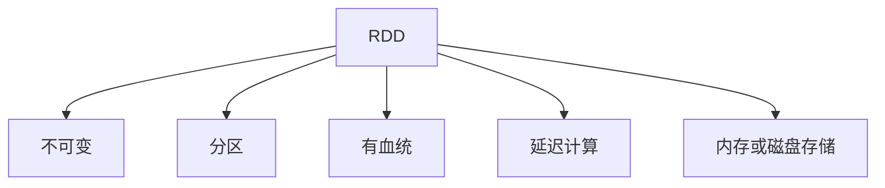
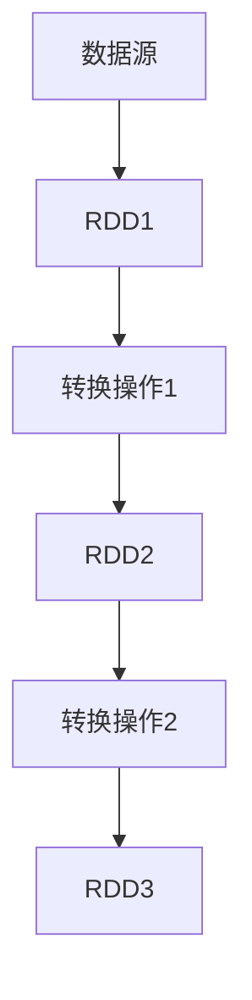

# RDD 原理与代码实例讲解

## 1.背景介绍

在大数据时代,数据处理和分析成为了一个关键的挑战。Apache Spark 作为一种快速、通用的大规模数据处理引擎,凭借其优秀的性能和易用性,受到了广泛关注和应用。Spark 的核心抽象就是弹性分布式数据集(Resilient Distributed Dataset,RDD)。RDD 是 Spark 中最基础的数据结构,理解 RDD 的原理和使用方式,对于高效利用 Spark 进行数据处理至关重要。

## 2.核心概念与联系

### 2.1 RDD 的定义

RDD 是一个不可变、分区的记录集合,可以并行操作。RDD 具有以下几个关键特性:

1. **不可变性(Immutable)**: RDD 中的数据在创建后就不能被修改,只能通过转换操作生成新的 RDD。这种设计保证了 RDD 的一致性和容错性。

2. **分区(Partitioned)**: RDD 由多个分区组成,每个分区存储在集群的不同节点上,可以并行执行操作。

3. **有血统(Lineage)**: RDD 通过记录它是如何从其他 RDD 或数据源派生而来的转换操作,从而实现了容错和优化。

4. **延迟计算(Lazy Evaluation)**: RDD 的转换操作是延迟计算的,只有在需要计算结果时才会真正执行。

5. **内存或磁盘存储**: RDD 可以选择存储在内存或磁盘上,以实现不同的性能和容错级别。



### 2.2 RDD 的创建

RDD 可以通过两种方式创建:

1. **从集群外部数据源创建**: 如本地文件系统、HDFS、HBase 等。Spark 提供了多种数据源连接器,可以方便地从不同数据源创建 RDD。

2. **从 Spark 程序内部数据创建**: 通过并行化驱动程序中的集合数据来创建 RDD。

```scala
// 从文件创建 RDD
val rdd = sc.textFile("path/to/file")

// 从集合并行化创建 RDD
val rdd = sc.parallelize(List(1, 2, 3, 4, 5))
```

### 2.3 RDD 的转换操作

RDD 支持丰富的转换操作,用于对数据进行过滤、映射、排序、分组等处理。常见的转换操作包括:

- `map`、`flatMap`、`filter`、`distinct`、`union`、`intersection`、`subtract`、`cartesian` 等
- `groupByKey`、`reduceByKey`、`aggregateByKey`、`foldByKey`、`combineByKey` 等
- `mapValues`、`flatMapValues`、`join`、`leftOuterJoin`、`rightOuterJoin`、`cogroup` 等
- `repartition`、`coalesce`、`repartitionAndSortWithinPartitions` 等

这些转换操作都是延迟计算的,只有在需要计算结果时才会真正执行。

### 2.4 RDD 的行动操作

行动操作用于从 RDD 中获取结果数据或将结果数据写入外部数据源。常见的行动操作包括:

- `reduce`、`fold`、`aggregate`、`treeReduce`、`treeAggregate` 等
- `collect`、`count`、`first`、`take`、`takeSample`、`takeOrdered` 等
- `saveAsTextFile`、`saveAsSequenceFile`、`saveAsObjectFile` 等
- `foreach`、`foreachPartition` 等

行动操作会触发 Spark 作业的执行,并计算出最终结果。

## 3.核心算法原理具体操作步骤

### 3.1 RDD 的分区原理

RDD 由多个分区组成,每个分区存储在集群的不同节点上。分区的数量决定了 RDD 的并行度,通常情况下,分区数量应该设置为集群中可用的核心数量的 2-3 倍。

RDD 的分区可以通过多种方式进行划分:

1. **HashPartitioner**: 根据键的哈希值对记录进行分区,常用于 `groupByKey` 和 `reduceByKey` 等操作。

2. **RangePartitioner**: 根据键的范围对记录进行分区,常用于排序操作。

3. **自定义分区器**: 用户可以根据特定的业务逻辑实现自定义的分区器。

```scala
// 使用 HashPartitioner
val rdd = sc.parallelize(List((1, 'a'), (2, 'b'), (3, 'c'), (4, 'd')))
val partitioned = rdd.partitionBy(new HashPartitioner(2))

// 使用 RangePartitioner
val rdd = sc.parallelize(List((1, 'a'), (10, 'b'), (3, 'c'), (7, 'd')))
val partitioned = rdd.partitionBy(new RangePartitioner(2, rdd))
```

### 3.2 RDD 的血统原理

RDD 通过记录它是如何从其他 RDD 或数据源派生而来的转换操作,从而实现了容错和优化。当某个 RDD 的分区数据丢失时,Spark 可以根据该 RDD 的血统重新计算出丢失的数据分区。

RDD 的血统由一系列确定性操作组成,这些操作可以从一个或多个父 RDD 计算出子 RDD。Spark 会自动记录这些操作,并在需要时重新执行它们。



在上图中,`RDD3` 的血统包括从数据源创建 `RDD1`,然后执行转换操作 1 得到 `RDD2`,再执行转换操作 2 得到 `RDD3`。如果 `RDD3` 的某个分区丢失,Spark 可以根据这个血统重新计算出丢失的分区。

### 3.3 RDD 的缓存原理

为了提高计算效率,RDD 支持将中间结果缓存在内存或磁盘中。当需要重复使用某个 RDD 时,可以将它缓存起来,避免重复计算。

RDD 的缓存分为两种级别:

1. **内存缓存**: 将 RDD 的分区数据缓存在执行器的内存中,可以提供最快的数据访问速度。

2. **磁盘缓存**: 将 RDD 的分区数据缓存在执行器的磁盘上,比内存缓存慢,但可以缓存更多的数据。

```scala
// 将 RDD 缓存在内存中
rdd.cache()

// 将 RDD 缓存在磁盘上
rdd.persist(StorageLevel.DISK_ONLY)
```

RDD 的缓存策略还可以设置为内存和磁盘的组合,以实现不同的性能和容错级别。

### 3.4 RDD 的容错机制

由于 RDD 的不可变性和有血统的特性,Spark 可以实现有效的容错机制。当某个 RDD 的分区数据丢失时,Spark 可以根据该 RDD 的血统重新计算出丢失的数据分区。

Spark 会自动跟踪 RDD 的血统,并在需要时重新执行相关的转换操作。这种基于血统的容错机制避免了数据复制的开销,同时也保证了计算的正确性和容错性。

## 4.数学模型和公式详细讲解举例说明

在 Spark 中,一些常见的数据处理操作可以用数学模型和公式来表示。下面是一些常见的数学模型和公式:

### 4.1 Map 操作

Map 操作将一个函数应用于 RDD 中的每个元素,生成一个新的 RDD。

设有一个 RDD `rdd`,其中包含 $n$ 个元素 $\{x_1, x_2, \ldots, x_n\}$,我们希望对每个元素应用一个函数 $f$,生成一个新的 RDD `mapped_rdd`。

数学模型如下:

$$mapped\_rdd = \{f(x_1), f(x_2), \ldots, f(x_n)\}$$

例如,如果我们有一个包含整数的 RDD `rdd = [1, 2, 3, 4, 5]`,并希望对每个元素进行平方操作,可以使用 `map` 操作:

```scala
val squared = rdd.map(x => x * x)
// squared: [1, 4, 9, 16, 25]
```

### 4.2 ReduceByKey 操作

ReduceByKey 操作将一个函数应用于每个键对应的值序列,生成一个新的 RDD。

设有一个键值对 RDD `rdd`,其中包含 $m$ 个键值对 $\{(k_1, v_{1,1}), (k_1, v_{1,2}), \ldots, (k_m, v_{m,n_m})\}$,我们希望对每个键对应的值序列应用一个函数 $f$,生成一个新的 RDD `reduced_rdd`。

数学模型如下:

$$reduced\_rdd = \{(k_1, f(v_{1,1}, v_{1,2}, \ldots)), (k_2, f(v_{2,1}, v_{2,2}, \ldots)), \ldots, (k_m, f(v_{m,1}, v_{m,2}, \ldots, v_{m,n_m}))\}$$

例如,如果我们有一个包含单词计数的 RDD `rdd = [("a", 1), ("b", 1), ("a", 1), ("c", 1), ("a", 1)]`,并希望对每个单词对应的计数进行求和,可以使用 `reduceByKey` 操作:

```scala
val wordCounts = rdd.reduceByKey((x, y) => x + y)
// wordCounts: [("a", 3), ("b", 1), ("c", 1)]
```

### 4.3 Join 操作

Join 操作将两个 RDD 中的键值对进行连接,生成一个新的 RDD。

设有两个键值对 RDD `rdd1` 和 `rdd2`,其中 `rdd1` 包含 $m$ 个键值对 $\{(k_1, v_{1,1}), (k_1, v_{1,2}), \ldots, (k_m, v_{m,1})\}$,`rdd2` 包含 $n$ 个键值对 $\{(k_1, w_{1,1}), (k_2, w_{2,1}), \ldots, (k_n, w_{n,1})\}$,我们希望将两个 RDD 中具有相同键的值进行连接,生成一个新的 RDD `joined_rdd`。

数学模型如下:

$$joined\_rdd = \{(k_i, (v_{i,j}, w_{i,1})) \mid k_i \in rdd1 \cap rdd2, 1 \leq i \leq m, 1 \leq j \leq n_i\}$$

其中 $n_i$ 表示 `rdd1` 中键 $k_i$ 对应的值的个数。

例如,如果我们有两个 RDD `rdd1 = [("a", 1), ("b", 2), ("c", 3)]` 和 `rdd2 = [("b", 4), ("c", 5), ("d", 6)]`,并希望将两个 RDD 中具有相同键的值进行连接,可以使用 `join` 操作:

```scala
val joined = rdd1.join(rdd2)
// joined: [("b", (2, 4)), ("c", (3, 5))]
```

### 4.4 聚合操作

聚合操作将一个 RDD 中的元素进行组合,生成一个新的值。常见的聚合操作包括 `reduce`、`fold`、`aggregate` 等。

设有一个 RDD `rdd`,其中包含 $n$ 个元素 $\{x_1, x_2, \ldots, x_n\}$,我们希望将这些元素进行组合,生成一个新的值 $y$。

数学模型如下:

$$y = f(x_1, x_2, \ldots, x_n)$$

其中 $f$ 是一个二元函数,用于将两个元素组合成一个新的元素。

例如,如果我们有一个包含整数的 RDD `rdd = [1, 2, 3, 4, 5]`,并希望对这些整数进行求和,可以使用 `reduce` 操作:

```scala
val sum = rdd.reduce((x, y) => x + y)
// sum: 15
```

在上面的例子中,二元函数 $f(x, y) = x + y$ 用于将两个整数相加。

## 5.项目实践:代码实例和详细解释说明

下面是一个使用 Spark 进行单词计数的完整示例,展示了如何创建 RDD、执行转换操