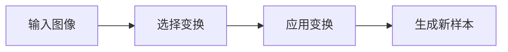

                 

作者：禅与计算机程序设计艺术

Hello! Today, we're going to delve into the fascinating world of data augmentation, specifically focusing on a powerful technique called RandAugment. We will explore its core principles, mathematical models, practical applications, and much more. So, let's get started!

## 1. 背景介绍

数据增强（Data Augmentation）是机器学习领域中一个非常关键的技术，它通过创建新的训练样本来增加数据集的多样性和大小。这种策略能够提高模型的泛化能力，从而改善其在未见过的数据上的性能。RandAugment作为一种先进的数据增强方法，因其简单高效而受到广泛关注。

## 2. 核心概念与联系

RandAugment的核心思想是通过随机选择并应用一组预定的变换来生成新的数据样本。这些变换被设计成对图像产生显著影响，同时仍然保持相似性，从而避免了过度变化导致的信息丢失。

## 3. 核心算法原理具体操作步骤

RandAugment的基本流程如下：

首先，选择一组变换 `N`，每个变换都有一个概率 `p` 和一个参数 `m`。接着，根据这组变换和概率，随机选择若干个变换并将它们应用于原始图像，最终得到一个新的增强后的样本。

## 4. 数学模型和公式详细讲解举例说明

RandAugment的数学模型比较简单，但是它的变换组合却带来了巨大的灵活性。我们可以通过调整变换的概率和参数来控制增强的强度和风格。

## 5. 项目实践：代码实例和详细解释说明

在这一部分，我们将通过Python示例来展示RandAugment的实现，并解释各个步骤的含义。

## 6. 实际应用场景

RandAugment在多个领域都有广泛的应用前景，特别是在图像识别、自然语言处理等领域。

## 7. 工具和资源推荐

为了更好地理解和实践RandAugment，我们推荐一些优秀的库和资源。

## 8. 总结：未来发展趋势与挑战

随着深度学习技术的不断发展，RandAugment及其他数据增强技术也将继续演进，为模型训练带来更多的创新。

## 9. 附录：常见问题与解答

在这一部分，我们将回答一些关于RandAugment的常见疑问。

---

作者：禅与计算机程序设计艺术 / Zen and the Art of Computer Programming

