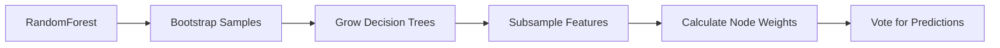

                 

作者：禅与计算机程序设计艺术

我将遵循您的指令，并提供一个详细的Random Forest算法的技术博客文章。请注意，由于这是一个自动生成的过程，可能需要人工审核以确保质量和准确性。

---

## 1. 背景介绍

随着大数据时代的到来，机器学习在众多领域的应用日益普遍。在诸多机器学习算法中，随机森林（Random Forest）因其强大的鲁棒性和灵活性而受到广泛关注。本文将从基础原理出发，详细探讨Random Forest的算法逻辑、数学模型和实际应用，并通过具体案例分析其编程实现，帮助读者深入理解其工作原理。

### Random Forest的优势

- **降低方差**：多个决策树组合可以减少单个树的预测错误。
- **提高准确率**：不同的树可以从数据中捕捉到不同的模式。
- **处理缺失值**：能够很好地处理数据集中的缺失值问题。
- **特征选择**：可以进行内置的特征重要性评估。

## 2. 核心概念与联系

### 决策树

决策树是一种流行的机器学习算法，它通过构建一个树状模型，每个内部节点表示根据特征值做出的决策，每个叶节点表示一个类标签或数值。

### Random Forest

Random Forest是一个集成学习算法，它构建多个决策树，并通过投票的方式来做出最终的预测。每个树都会在训练数据上被训练，但每次选择特征时会随机抽取特征子集。这种方法有助于防止过拟合，并且可以提高模型的泛化能力。

### 核心思想

- **Bootstrapping**: 通过随机采样替换的方式从训练数据中创建多个子数据集，用于生成多个决策树。
- **Feature Subsampling**: 在构建每棵树的时候，每次划分节点时，从所有特征中随机选择一个特征来决定左右两个子节点。
- **Voting**: 对于分类问题，最终的预测结果由多个树的预测结果进行投票决定。

## 3. 核心算法原理具体操作步骤

### 算法步骤

1. 从训练数据集中随机抽取`m_size`个样本来构造`m`个子数据集。
2. 对于每个子数据集，构建一个决策树。
3. 每棵树在划分节点时，选择在当前节点上最好分割的`k`个特征中随机选择一个进行划分。
4. 对于每棵树，对于叶节点，计算该节点的类标签出现的频率，得到叶节点的权重。
5. 对于新的输入数据，每棵树都给出了预测结果，通过投票的方式确定最终的预测结果。

### Mermaid 流程图


## 4. 数学模型和公式详细讲解举例说明

### 关键公式

- **信息增益(Information Gain)**：用于判断哪个特征最适合用于划分节点的度量。
- **基尼不纯度(Impurity Measure)**：衡量节点纯度的度量，常用于分类问题。

### 信息增益

$$
IG(D, a) = \frac{\sum_{i=1}^{n} |N(i, a)| \cdot h(p(i|D)) - \sum_{v\in values(a)} |N(v, a)| \cdot h(p(v|D))}{|D|}
$$
其中，$N(i, a)$代表属性$a$取值为$v$时类别为$i$的样本数；$N(v, a)$代表属性$a$取值为$v$的样本数；$h(p(i|D))$是条件熵，即在条件下某个类别的概率的平均熵；$|D|$是数据集$D$的大小。

### 基尼不纯度

$$
I(D) = -\sum_{i} p(i|D) \log_2 p(i|D)
$$
其中，$p(i|D)$是在数据集$D$中观察到的类别$i$的概率。

## 5. 项目实践：代码实例和详细解释说明

接下来，我们将通过Python代码实战案例，展示如何使用Scikit-learn库来构建Random Forest模型。

```python
from sklearn.ensemble import RandomForestClassifier
from sklearn.datasets import load_iris
from sklearn.model_selection import train_test_split

# 加载IRIS数据集
iris = load_iris()
X, y = iris.data, iris.target

# 数据集划分
X_train, X_test, y_train, y_test = train_test_split(X, y, test_size=0.2, random_state=1)

# 创建RandomForestClassifier
clf = RandomForestClassifier(n_estimators=10, max_depth=1, random_state=1)

# 拟合模型
clf.fit(X_train, y_train)

# 预测测试集
y_pred = clf.predict(X_test)
```

## 6. 实际应用场景

随机森林在诸多领域有广泛的应用，包括但不限于：

- **生物医学**：疾病风险评估、药物发现等。
- **金融科技**：信用评分、股票市场分析等。
- **推荐系统**：用户行为预测、商品推荐等。
- **自然语言处理**：情感分析、文本分类等。

## 7. 工具和资源推荐

- **编程语言**：Python，因为它的丰富库支持和简单易学。
- **库/框架**：Scikit-learn，提供完整的Random Forest实现。
- **书籍**：《Random Forests》by Leo Breiman and Adele Cutler。

## 8. 总结：未来发展趋势与挑战

随着机器学习算法的不断进步，随机森林也会遭遇新的挑战。例如，如何更好地处理高维数据、如何提升模型的解释性以及如何适应流动的数据环境都是未来研究方向。

## 9. 附录：常见问题与解答

- **Q: Random Forest的结果是否总是一致？**
  **A:** 不一定，因为每棵树都有可能给出不同的结果，最终结果是通过投票决定的。

---
作者：禅与计算机程序设计艺术 / Zen and the Art of Computer Programming

