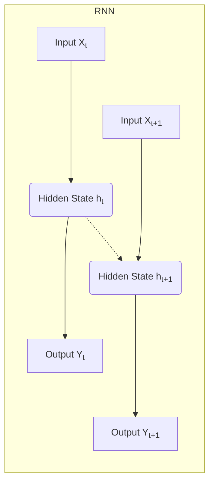

# Recurrent Neural Networks (RNN) 原理与代码实战案例讲解

## 1.背景介绍

### 1.1 序列数据处理的重要性

在现实世界中,我们经常会遇到各种序列数据,例如自然语言处理中的文本序列、语音识别中的音频序列、视频数据中的图像序列等。传统的机器学习算法如决策树、支持向量机等,通常将输入数据视为独立同分布的样本,难以很好地捕捉序列数据中的时间或空间依赖关系。

### 1.2 循环神经网络的产生

为了更好地处理序列数据,循环神经网络(Recurrent Neural Networks,RNN)应运而生。与前馈神经网络不同,RNN在隐藏层之间增加了循环连接,使得网络具有"记忆"能力,能够捕捉序列数据中的长期依赖关系。

### 1.3 RNN 的应用领域

循环神经网络在自然语言处理、语音识别、机器翻译、图像描述生成等领域有着广泛的应用。它们能够更好地处理变长序列数据,并在许多任务上取得了令人瞩目的成绩。

## 2.核心概念与联系

### 2.1 RNN 的基本结构

循环神经网络的核心思想是在隐藏层之间增加循环连接,使得网络能够捕捉序列数据中的时间或空间依赖关系。RNN 的基本结构如下图所示:

在上图中,RNN 在每个时间步 t 接收输入 $X_t$,并根据当前输入和上一时间步的隐藏状态 $h_{t-1}$ 计算当前时间步的隐藏状态 $h_t$。然后,RNN 使用当前隐藏状态 $h_t$ 生成当前时间步的输出 $Y_t$。这种循环结构使得 RNN 能够捕捉序列数据中的长期依赖关系。

### 2.2 RNN 的计算过程

RNN 在每个时间步 t 的计算过程可以表示为:

$$h_t = f_W(X_t, h_{t-1})$$
$$Y_t = g_V(h_t)$$

其中:
- $X_t$ 是时间步 t 的输入
- $h_t$ 是时间步 t 的隐藏状态
- $h_{t-1}$ 是前一时间步的隐藏状态
- $Y_t$ 是时间步 t 的输出
- $f_W$ 是计算隐藏状态的函数,通常是一个非线性函数,如 tanh 或 ReLU
- $g_V$ 是计算输出的函数,通常是一个线性函数或 softmax 函数

通过上述递归计算,RNN 能够捕捉序列数据中的长期依赖关系。然而,在实践中,传统 RNN 存在梯度消失或梯度爆炸的问题,难以学习长期依赖关系。为了解决这个问题,研究人员提出了长短期记忆网络(LSTM)和门控循环单元(GRU)等改进的 RNN 变体。

### 2.3 RNN 与其他神经网络模型的联系

RNN 是一种特殊的神经网络模型,它与其他神经网络模型有着密切的联系:

- 前馈神经网络(Feed-Forward Neural Networks,FFNNs): FFNNs 是最基本的神经网络模型,它们没有循环连接,无法捕捉序列数据中的时间或空间依赖关系。
- 卷积神经网络(Convolutional Neural Networks,CNNs): CNNs 通过卷积和池化操作来提取输入数据的空间特征,常用于图像识别等任务。RNN 则更适合于处理序列数据。
- transformer 模型: transformer 模型是一种基于注意力机制的序列模型,它不依赖于递归计算,因此可以并行化训练,在某些任务上表现优于 RNN。但 RNN 在某些场景下仍然具有优势。

总的来说,RNN 是一种专门用于处理序列数据的神经网络模型,它与其他神经网络模型在结构和应用场景上有所不同,但都属于深度学习的范畴。

## 3.核心算法原理具体操作步骤

### 3.1 RNN 的前向传播过程

RNN 的前向传播过程是一个递归计算过程,具体步骤如下:

1. 初始化隐藏状态 $h_0$,通常将其设置为全 0 向量。
2. 对于每个时间步 t:
   - 计算当前时间步的隐藏状态 $h_t$:
     $$h_t = f_W(X_t, h_{t-1})$$
     其中 $f_W$ 是一个非线性函数,如 tanh 或 ReLU。
   - 计算当前时间步的输出 $Y_t$:
     $$Y_t = g_V(h_t)$$
     其中 $g_V$ 是一个线性函数或 softmax 函数。
3. 重复步骤 2,直到处理完整个序列。

在上述过程中,RNN 通过递归计算捕捉了序列数据中的时间或空间依赖关系。然而,传统 RNN 在实践中存在梯度消失或梯度爆炸的问题,难以学习长期依赖关系。

### 3.2 LSTM 的前向传播过程

为了解决传统 RNN 的梯度问题,研究人员提出了长短期记忆网络(LSTM)。LSTM 引入了门控机制,使得网络能够更好地控制信息的流动,从而缓解梯度消失或梯度爆炸的问题。

LSTM 的前向传播过程包括以下步骤:

1. 初始化隐藏状态 $h_0$ 和细胞状态 $c_0$,通常将它们设置为全 0 向量。
2. 对于每个时间步 t:
   - 计算遗忘门 $f_t$:
     $$f_t = \sigma(W_f \cdot [h_{t-1}, x_t] + b_f)$$
   - 计算输入门 $i_t$:
     $$i_t = \sigma(W_i \cdot [h_{t-1}, x_t] + b_i)$$
   - 计算候选细胞状态 $\tilde{c}_t$:
     $$\tilde{c}_t = \tanh(W_c \cdot [h_{t-1}, x_t] + b_c)$$
   - 更新细胞状态 $c_t$:
     $$c_t = f_t \odot c_{t-1} + i_t \odot \tilde{c}_t$$
   - 计算输出门 $o_t$:
     $$o_t = \sigma(W_o \cdot [h_{t-1}, x_t] + b_o)$$
   - 计算隐藏状态 $h_t$:
     $$h_t = o_t \odot \tanh(c_t)$$
   - 计算当前时间步的输出 $Y_t$:
     $$Y_t = g_V(h_t)$$
3. 重复步骤 2,直到处理完整个序列。

在上述过程中,LSTM 通过门控机制控制了信息的流动,从而缓解了梯度消失或梯度爆炸的问题,使得网络能够更好地捕捉长期依赖关系。

### 3.3 GRU 的前向传播过程

门控循环单元(Gated Recurrent Unit,GRU)是另一种改进的 RNN 变体,它相比 LSTM 结构更加简单。GRU 的前向传播过程包括以下步骤:

1. 初始化隐藏状态 $h_0$,通常将其设置为全 0 向量。
2. 对于每个时间步 t:
   - 计算重置门 $r_t$:
     $$r_t = \sigma(W_r \cdot [h_{t-1}, x_t] + b_r)$$
   - 计算更新门 $z_t$:
     $$z_t = \sigma(W_z \cdot [h_{t-1}, x_t] + b_z)$$
   - 计算候选隐藏状态 $\tilde{h}_t$:
     $$\tilde{h}_t = \tanh(W_h \cdot [r_t \odot h_{t-1}, x_t] + b_h)$$
   - 更新隐藏状态 $h_t$:
     $$h_t = (1 - z_t) \odot h_{t-1} + z_t \odot \tilde{h}_t$$
   - 计算当前时间步的输出 $Y_t$:
     $$Y_t = g_V(h_t)$$
3. 重复步骤 2,直到处理完整个序列。

GRU 通过重置门和更新门控制了隐藏状态的更新,从而实现了类似于 LSTM 的效果,但结构更加简单。在某些任务上,GRU 的性能可以与 LSTM 相当,甚至更好。

## 4.数学模型和公式详细讲解举例说明

在前面的章节中,我们介绍了 RNN、LSTM 和 GRU 的核心算法原理和计算过程。接下来,我们将通过具体的数学模型和公式,进一步详细讲解和举例说明这些模型的工作原理。

### 4.1 RNN 的数学模型

RNN 的核心数学模型可以表示为:

$$h_t = f_W(X_t, h_{t-1})$$
$$Y_t = g_V(h_t)$$

其中:
- $X_t$ 是时间步 t 的输入向量
- $h_t$ 是时间步 t 的隐藏状态向量
- $h_{t-1}$ 是前一时间步的隐藏状态向量
- $Y_t$ 是时间步 t 的输出向量
- $f_W$ 是计算隐藏状态的函数,通常是一个非线性函数,如 tanh 或 ReLU
- $g_V$ 是计算输出的函数,通常是一个线性函数或 softmax 函数

我们可以将 $f_W$ 具体表示为:

$$f_W(X_t, h_{t-1}) = \tanh(W_{hh} h_{t-1} + W_{xh} X_t + b_h)$$

其中:
- $W_{hh}$ 是隐藏状态到隐藏状态的权重矩阵
- $W_{xh}$ 是输入到隐藏状态的权重矩阵
- $b_h$ 是隐藏状态的偏置向量

同样,我们可以将 $g_V$ 具体表示为:

$$g_V(h_t) = W_{hy} h_t + b_y$$

其中:
- $W_{hy}$ 是隐藏状态到输出的权重矩阵
- $b_y$ 是输出的偏置向量

通过上述数学模型,我们可以更清晰地理解 RNN 是如何捕捉序列数据中的时间或空间依赖关系的。

### 4.2 LSTM 的数学模型

LSTM 的数学模型相对于 RNN 更加复杂,因为它引入了门控机制。LSTM 的核心数学模型可以表示为:

$$f_t = \sigma(W_f \cdot [h_{t-1}, x_t] + b_f)$$
$$i_t = \sigma(W_i \cdot [h_{t-1}, x_t] + b_i)$$
$$\tilde{c}_t = \tanh(W_c \cdot [h_{t-1}, x_t] + b_c)$$
$$c_t = f_t \odot c_{t-1} + i_t \odot \tilde{c}_t$$
$$o_t = \sigma(W_o \cdot [h_{t-1}, x_t] + b_o)$$
$$h_t = o_t \odot \tanh(c_t)$$
$$Y_t = g_V(h_t)$$

其中:
- $f_t$ 是遗忘门,控制了细胞状态 $c_t$ 中保留多少来自前一时间步的信息
- $i_t$ 是输入门,控制了细胞状态 $c_t$ 中吸收多少来自当前输入和隐藏状态的信息
- $\tilde{c}_t$ 是候选细胞状态,表示基于当前输入和隐藏状态计算出的新的细胞状态信息
- $c_t$ 是当前时间步的细胞状态,由前一时间步的细胞状态 $c_{t-1}$ 和当前候选细胞状态 $\tilde{c}_t$ 计算得到