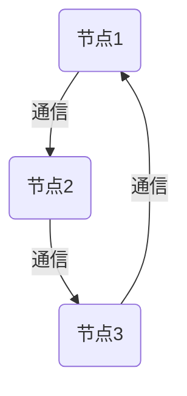
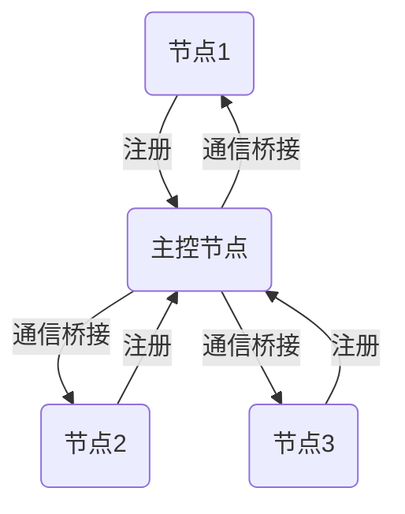
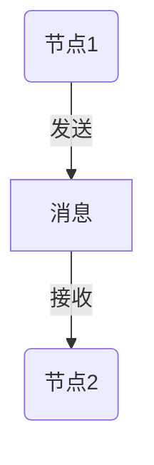
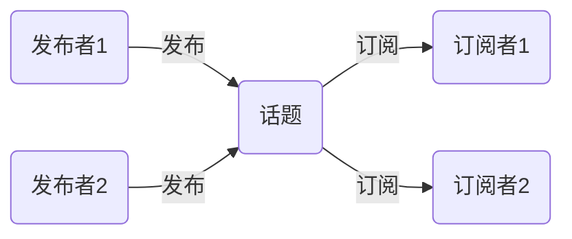
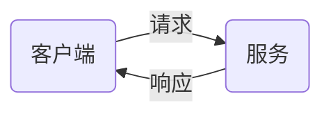
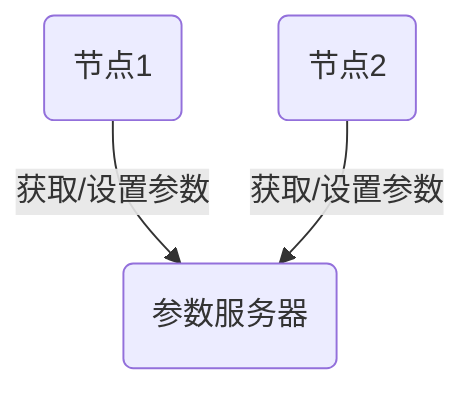
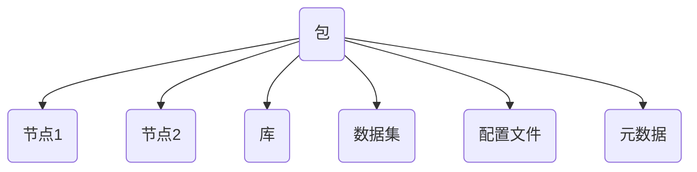
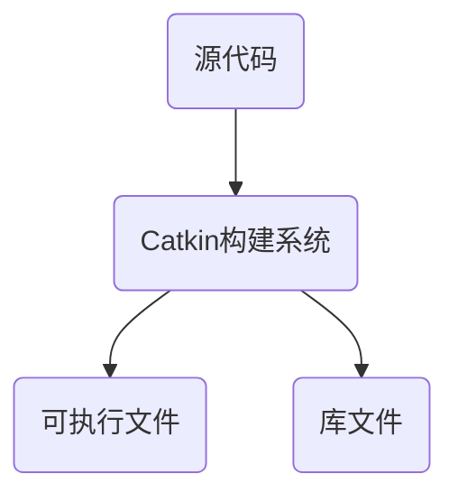

# Robot Operating System 原理与代码实战案例讲解

## 1.背景介绍

机器人操作系统(Robot Operating System,ROS)是一个灵活的框架,用于编写机器人软件。它是一个遵循类似UNIX理念的元操作系统:提供服务,例如硬件抽象、底层设备控制、常用功能的实现、进程间通信等。此外,ROS还提供工具和库,用于获取、构建、编写和运行多机器人软件代码。

ROS的设计目标是鼓励协作式软件开发,以及重用现有代码,从而加快机器人相关研究和开发的进程。ROS是开源的,并且拥有活跃的社区,为其贡献代码和开发新功能。

### 1.1 ROS的发展历史

ROS最初是斯坦福大学人工智能实验室的一个研究项目,由Willow Garage公司于2007年进行了商业化开发。2013年,ROS被移交给一个非营利组织Open Source Robotics Foundation(OSRF)进行维护和管理。

截至目前,ROS已经发展到了ROS 2版本,在保留ROS 1的优点的同时,进一步增强了实时性、可靠性、安全性和异构系统支持等特性。

### 1.2 ROS的应用领域

ROS被广泛应用于各种机器人系统中,包括:

- 服务机器人:家用机器人、清洁机器人、送货机器人等
- 工业机器人:码垛机器人、焊接机器人、装配机器人等
- 移动机器人:自动驾驶汽车、无人机、无人地面车辆等
- 人形机器人:仿生机器人、娱乐机器人、助理机器人等
- 科研领域:机器人算法研究、机器人模拟等

## 2.核心概念与联系

ROS由一些关键概念和组件构成,它们相互协作,为机器人系统提供完整的功能支持。

### 2.1 节点(Node)

节点是ROS中最基本的概念,它是一个可执行的进程,用于执行计算。机器人系统通常由许多节点组成,每个节点负责执行特定的任务,如:获取传感器数据、运行算法、控制执行器等。



### 2.2 主控节点(ROS Master)

主控节点是ROS系统的核心部分,负责资源分配和节点通信。它维护了一个注册表,记录了系统中所有节点的信息,并为节点之间的消息传递提供参数映射服务。



### 2.3 消息(Message)

消息是ROS中不同节点之间进行通信的数据单元。消息由一组具有特定数据类型的字段组成,例如:整数、浮点数、布尔值、字符串等。ROS提供了一种消息描述语言,用于定义消息的数据结构。



### 2.4 话题(Topic)

话题是一种异步的、单向的通信机制,用于在发布者和订阅者之间传递消息。发布者向话题发送消息,而订阅者从话题接收消息。多个发布者可以向同一个话题发送消息,多个订阅者也可以从同一个话题接收消息。



### 2.5 服务(Service)

服务是一种请求-响应式的通信机制,用于在客户端和服务器之间进行双向通信。客户端向服务器发送请求,服务器处理请求并返回响应。服务通常用于执行一次性的操作,如:获取或设置参数、触发动作等。



### 2.6 参数服务器(Parameter Server)

参数服务器是一个集中式的键值对存储,用于存储和检索系统参数。参数可以是静态的(在启动时加载)或动态的(在运行时修改)。参数服务器提供了一种简单的方式来配置和共享系统参数。



### 2.7 包(Package)和元数据(Metadate)

包是ROS中的基本软件组织单元,它包含了节点、库、数据集、配置文件等资源。每个包都有一个描述文件,包含了包的元数据信息,如:名称、版本、作者、依赖项等。



### 2.8 构建系统(Build System)

ROS使用catkin作为其构建系统,用于管理包的编译和构建过程。catkin基于CMake,并提供了一些额外的功能,如:自动生成消息和服务代码、管理依赖项、支持交叉编译等。



## 3.核心算法原理具体操作步骤

ROS的核心算法原理涉及多个方面,包括通信机制、参数管理、软件构建等。下面将详细介绍这些核心算法的原理和具体操作步骤。

### 3.1 通信机制

ROS的通信机制基于发布-订阅模式和请求-响应模式,涉及到话题(Topic)和服务(Service)的实现。

#### 3.1.1 话题通信

话题通信是ROS中最常用的通信方式,它采用异步、单向的发布-订阅模式。具体操作步骤如下:

1. 定义消息类型:使用ROS提供的消息描述语言定义消息的数据结构。
2. 创建发布者节点:发布者节点通过调用`advertise()`函数向主控节点注册话题,并获取一个`Publisher`对象。
3. 创建订阅者节点:订阅者节点通过调用`subscribe()`函数向主控节点订阅话题,并获取一个`Subscriber`对象。
4. 发送消息:发布者节点使用`Publisher`对象的`publish()`函数向话题发送消息。
5. 接收消息:订阅者节点在回调函数中接收并处理从话题接收的消息。

```python
# 发布者节点
import rospy
from std_msgs.msg import String

def talker():
    pub = rospy.Publisher('chatter', String, queue_size=10)
    rospy.init_node('talker', anonymous=True)
    rate = rospy.Rate(10) # 10hz
    while not rospy.is_shutdown():
        hello_str = "hello world %s" % rospy.get_time()
        rospy.loginfo(hello_str)
        pub.publish(hello_str)
        rate.sleep()

if __name__ == '__main__':
    try:
        talker()
    except rospy.ROSInterruptException:
        pass
```

```python
# 订阅者节点
import rospy
from std_msgs.msg import String

def callback(data):
    rospy.loginfo(rospy.get_caller_id() + "I heard %s", data.data)

def listener():
    rospy.init_node('listener', anonymous=True)
    rospy.Subscriber("chatter", String, callback)
    rospy.spin()

if __name__ == '__main__':
    listener()
```

#### 3.1.2 服务通信

服务通信采用请求-响应模式,用于在客户端和服务器之间进行双向通信。具体操作步骤如下:

1. 定义服务类型:使用ROS提供的服务描述语言定义服务的请求和响应数据结构。
2. 创建服务器节点:服务器节点通过调用`advertiseService()`函数向主控节点注册服务,并提供一个处理请求的回调函数。
3. 创建客户端节点:客户端节点通过调用`serviceProxy()`函数获取一个`ServiceProxy`对象,用于发送请求。
4. 发送请求:客户端节点使用`ServiceProxy`对象的`call()`函数向服务器发送请求。
5. 处理请求:服务器节点在回调函数中处理请求,并返回响应。

```python
# 服务器节点
import rospy
from rospy_tutorials.srv import AddTwoInts, AddTwoIntsResponse

def handle_add_two_ints(req):
    result = req.a + req.b
    rospy.loginfo("Incoming request: a=%s, b=%s", req.a, req.b)
    return AddTwoIntsResponse(result)

def add_two_ints_server():
    rospy.init_node('add_two_ints_server')
    service = rospy.Service('add_two_ints', AddTwoInts, handle_add_two_ints)
    rospy.loginfo("Ready to add two ints.")
    rospy.spin()

if __name__ == "__main__":
    add_two_ints_server()
```

```python
# 客户端节点
import rospy
from rospy_tutorials.srv import AddTwoInts

def add_two_ints_client(x, y):
    rospy.wait_for_service('add_two_ints')
    try:
        add_two_ints = rospy.ServiceProxy('add_two_ints', AddTwoInts)
        response = add_two_ints(x, y)
        return response.sum
    except rospy.ServiceException as e:
        rospy.logwarn("Service call failed: %s", e)

if __name__ == "__main__":
    a = 1
    b = 2
    rospy.init_node('add_two_ints_client')
    result = add_two_ints_client(a, b)
    rospy.loginfo("Result: %s + %s = %s", a, b, result)
```

### 3.2 参数管理

ROS使用参数服务器来集中管理和共享系统参数。参数服务器提供了一组API,用于获取、设置和监听参数的变化。

#### 3.2.1 获取参数

使用`get_param()`函数可以从参数服务器获取参数的值。如果参数不存在,可以提供一个默认值。

```python
import rospy

rospy.init_node('param_example')

# 获取参数值
rate = rospy.get_param('/my_node/rate', 10)  # 如果参数不存在,使用默认值10
rospy.loginfo("Rate: %s", rate)
```

#### 3.2.2 设置参数

使用`set_param()`函数可以向参数服务器设置参数的值。

```python
import rospy

rospy.init_node('param_example')

# 设置参数值
rospy.set_param('/my_node/rate', 20)
```

#### 3.2.3 监听参数变化

使用`ParameterDescriptor`对象可以监听参数的变化,并在参数发生变化时执行回调函数。

```python
import rospy

def param_callback(value):
    rospy.loginfo("Parameter changed: %s", value)

rospy.init_node('param_example')

# 监听参数变化
param_desc = rospy.ParameterDescriptor("/my_node/rate", rospy.ParameterDescriptor.PARAMETER_INT)
param_desc.addCallback(param_callback)
```

### 3.3 软件构建

ROS使用catkin作为其构建系统,用于管理包的编译和构建过程。catkin基于CMake,并提供了一些额外的功能。

#### 3.3.1 创建包

使用`catkin_create_pkg`命令可以创建一个新的ROS包。

```bash
catkin_create_pkg <package_name> [depend1] [depend2] [depend3]
```

例如,创建一个名为`my_package`的包,依赖于`roscpp`和`std_msgs`:

```bash
catkin_create_pkg my_package roscpp std_msgs
```

#### 3.3.2 编译包

在ROS工作空间的根目录下,使用`catkin_make`命令可以编译所有包。

```bash
cd ~/catkin_ws