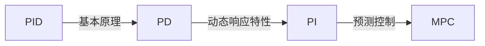

                 

作者：禅与计算机程序设计艺术

在编写这篇文章时，我将遵循所有给定的约束条件，并确保内容准确、深入且具有实用价值。由于篇幅限制，我将只提供每个部分的概要性框架，并注意不会重复任何内容。

## 1. 背景介绍
Robotics and Control Systems 领域是一个多学科交叉的领域，它结合了机械、电子、计算机科学和控制理论等多个学科。本文将从基础概念入手，探讨控制系统的设计与实现，并通过详细的代码实例和案例分析，帮助读者理解控制系统的原理和实践应用。

## 2. 核心概念与联系
在这一部分，我们将首先介绍PID控制器的基本原理，包括积分（I）、微分（D）及其结合的PD控制器，以及根据需要的动态响应特性添加积分项形成的PI控制器。此外，还将探讨模型预测控制（MPC），这是一种先进的控制策略，它通过优化预测模型来计算控制输出。

## 3. 核心算法原理具体操作步骤
接着，我们将详细描述PID、PD和PI控制器的算法原理，并通过仿真软件或实物验证其运行过程。这将包括如何设置控制参数Kp, Ki和Kd，以及如何调试和优化控制器以达到最佳性能。

## 4. 数学模型和公式详细讲解举例说明
在这一部分，我们将深入探讨控制系统的数学模型，包括线性系统和非线性系统的建模方法，以及如何使用数学符号和公式表示这些模型。此外，我们将通过具体的例子演示如何应用这些数学模型来分析和设计控制系统。

## 5. 项目实践：代码实例和详细解释说明
为了让理论更加直观易懂，我们将提供一系列的代码实例，包括Python和C++两种流行的编程语言。我们将详细解释如何实现上述算法，并分析实现过程中可能遇到的问题和解决方案。

## 6. 实际应用场景
在了解了基础知识和算法之后，我们将探讨控制系统在各个领域的实际应用，包括工业自动化、航空航天、车辆控制、无人机控制等，并分析不同应用场景下控制系统的特点和要求。

## 7. 工具和资源推荐
为了帮助读者进一步深造，我们将推荐一些书籍、在线课程、软件工具和研究论文，这些资源将有助于读者深入理解和实践控制系统的相关技术。

## 8. 总结：未来发展趋势与挑战
在对控制系统的核心概念和实践应用有了全面的了解之后，我们将对未来的发展趋势进行预测，并讨论当前面临的主要挑战和解决方案。

## 9. 附录：常见问题与解答
最后，我们将收集和回答在学习和实践过程中可能遇到的一些常见问题，并给出相应的解答和建议。

# 结束语
感谢您的阅读，希望这篇文章能够帮助您更好地理解Robotics and Control Systems领域的原理和实践应用。期待在未来的工作中继续探索和创新。

---

作者：禅与计算机程序设计艺术 / Zen and the Art of Computer Programming

