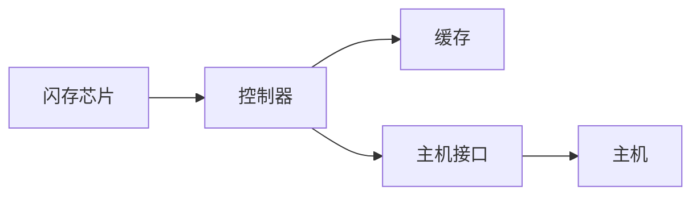

# SSD原理与代码实例讲解

## 1. 背景介绍

### 1.1 SSD的发展历程
#### 1.1.1 传统机械硬盘的局限性
#### 1.1.2 SSD的诞生与早期发展
#### 1.1.3 SSD技术的不断成熟与普及

### 1.2 SSD的优势与应用场景
#### 1.2.1 SSD相比传统机械硬盘的优势
#### 1.2.2 SSD在个人电脑领域的应用
#### 1.2.3 SSD在服务器与数据中心的应用

## 2. 核心概念与联系

### 2.1 SSD的核心组件
#### 2.1.1 闪存芯片(Flash Memory)
#### 2.1.2 控制器(Controller)
#### 2.1.3 缓存(Cache)

### 2.2 SSD的关键技术
#### 2.2.1 闪存存储技术
#### 2.2.2 坏块管理与磨损平衡
#### 2.2.3 垃圾回收与TRIM指令

### 2.3 SSD与其他存储技术的联系
#### 2.3.1 SSD与机械硬盘的区别
#### 2.3.2 SSD与内存的区别
#### 2.3.3 SSD与新兴存储技术(如3D XPoint)的比较

## 3. 核心算法原理具体操作步骤

### 3.1 SSD读写操作原理
#### 3.1.1 页(Page)与块(Block)的概念
#### 3.1.2 读操作的具体步骤
#### 3.1.3 写操作的具体步骤

### 3.2 FTL(Flash Translation Layer)算法
#### 3.2.1 FTL的作用与必要性
#### 3.2.2 页映射(Page Mapping)算法
#### 3.2.3 块映射(Block Mapping)算法
#### 3.2.4 混合映射(Hybrid Mapping)算法

### 3.3 垃圾回收(Garbage Collection)算法
#### 3.3.1 垃圾回收的触发条件
#### 3.3.2 垃圾回收的具体步骤
#### 3.3.3 垃圾回收对SSD性能的影响

## 4. 数学模型和公式详细讲解举例说明

### 4.1 SSD性能指标的数学表示
#### 4.1.1 IOPS(Input/Output Operations Per Second)
#### 4.1.2 吞吐量(Throughput)
#### 4.1.3 延迟(Latency)

### 4.2 SSD可靠性数学模型
#### 4.2.1 MTBF(Mean Time Between Failures)
#### 4.2.2 UBER(Uncorrectable Bit Error Rate) 
#### 4.2.3 数据保留时间(Data Retention)

### 4.3 磨损平衡算法的数学原理
#### 4.3.1 静态磨损平衡
#### 4.3.2 动态磨损平衡
#### 4.3.3 磨损平衡算法举例

## 5. 项目实践：代码实例和详细解释说明

### 5.1 使用Python模拟SSD的基本读写操作
#### 5.1.1 定义Page与Block类
#### 5.1.2 模拟读操作
#### 5.1.3 模拟写操作

### 5.2 简单的FTL算法实现
#### 5.2.1 页映射算法的Python实现
#### 5.2.2 块映射算法的Python实现
#### 5.2.3 混合映射算法的Python实现

### 5.3 垃圾回收算法的代码实现
#### 5.3.1 识别无效页
#### 5.3.2 选择目标块进行垃圾回收
#### 5.3.3 复制有效页并擦除块

## 6. 实际应用场景

### 6.1 个人电脑中SSD的应用
#### 6.1.1 提升系统启动速度
#### 6.1.2 加快应用程序加载
#### 6.1.3 提高大文件读写性能

### 6.2 服务器与数据中心中SSD的应用
#### 6.2.1 数据库性能优化
#### 6.2.2 虚拟化环境中的SSD应用
#### 6.2.3 高性能计算中的SSD应用

### 6.3 嵌入式系统中SSD的应用
#### 6.3.1 工业控制设备
#### 6.3.2 车载信息娱乐系统
#### 6.3.3 移动设备存储

## 7. 工具和资源推荐

### 7.1 SSD性能测试工具
#### 7.1.1 CrystalDiskMark
#### 7.1.2 AS SSD Benchmark
#### 7.1.3 ATTO Disk Benchmark

### 7.2 SSD健康状态监测工具 
#### 7.2.1 CrystalDiskInfo
#### 7.2.2 SSD-Z
#### 7.2.3 Samsung Magician(针对三星SSD)

### 7.3 SSD相关的开源项目
#### 7.3.1 OpenSSD项目
#### 7.3.2 SSD Simulator项目
#### 7.3.3 FTL算法的开源实现

## 8. 总结：未来发展趋势与挑战

### 8.1 SSD技术的发展趋势
#### 8.1.1 更高的存储密度
#### 8.1.2 更快的读写速度
#### 8.1.3 更长的使用寿命

### 8.2 SSD面临的挑战
#### 8.2.1 成本压力
#### 8.2.2 数据安全与加密
#### 8.2.3 新兴存储技术的竞争

### 8.3 SSD的未来展望
#### 8.3.1 与新兴存储技术的融合
#### 8.3.2 在人工智能与大数据领域的应用
#### 8.3.3 个人云存储设备的普及

## 9. 附录：常见问题与解答

### 9.1 SSD的使用与维护
#### 9.1.1 如何正确安装与初始化SSD？
#### 9.1.2 如何延长SSD的使用寿命？
#### 9.1.3 SSD固件升级的注意事项

### 9.2 SSD的选购指南
#### 9.2.1 如何选择合适容量的SSD？
#### 9.2.2 如何选择适合自己需求的SSD型号？
#### 9.2.3 SSD的品牌与质量对比

### 9.3 SSD的数据恢复与安全
#### 9.3.1 SSD数据恢复的可行性分析
#### 9.3.2 如何安全地清除SSD数据？
#### 9.3.3 SSD加密的必要性与实现方式



以上是SSD的核心组件与架构示意图。闪存芯片负责存储数据，控制器负责管理闪存并与主机通信，缓存用于加速读写，主机接口(如SATA、PCIe)用于连接主机。

SSD的读写操作与传统机械硬盘有很大不同。以写操作为例，具体步骤如下：

1. 主机发送写请求给SSD控制器
2. 控制器根据FTL算法，将逻辑地址转换为物理地址 
3. 控制器读取目标页(Page)所在的块(Block)到缓存
4. 控制器修改缓存中的数据
5. 控制器将缓存中的整个块写入闪存的新位置
6. 控制器更新FTL映射表，记录逻辑地址与新物理地址的对应关系

由于闪存的特性，不能直接覆盖旧数据，只能写入空白页。长期使用会产生大量无效页，需要通过垃圾回收来清理。垃圾回收的基本步骤如下：

1. 识别出无效页所在的块
2. 将有效页复制到其他块的空闲页
3. 擦除原始块，使其变为可写的空闲块

以下是一个简单的Python代码，模拟SSD的写操作：

```python
class Page:
    def __init__(self, data=None):
        self.data = data

class Block:
    def __init__(self, pages_per_block):
        self.pages = [Page() for _ in range(pages_per_block)]

class SSD:
    def __init__(self, blocks, pages_per_block):
        self.blocks = [Block(pages_per_block) for _ in range(blocks)]
        
    def write(self, block_id, page_id, data):
        # 读取目标块到缓存
        block = self.blocks[block_id]
        
        # 修改缓存中的数据
        block.pages[page_id].data = data
        
        # 将缓存写入新的空闲块
        new_block_id = self.allocate_free_block()
        self.blocks[new_block_id] = block
        
        # 更新映射表(此处省略)
        # ...
        
    def allocate_free_block(self):
        # 寻找空闲块(此处省略具体实现)
        # ...
        return free_block_id
        
# 创建一个包含10个块、每个块4个页的SSD
ssd = SSD(blocks=10, pages_per_block=4)

# 向第1个块的第2个页写入数据
ssd.write(block_id=1, page_id=2, data="Hello, SSD!")
```

以上代码简单展示了SSD写操作的基本流程。实际的SSD固件中，还会涉及更复杂的FTL算法、垃圾回收策略、错误处理等。

SSD凭借其优异的性能，在个人电脑、服务器、数据中心等领域得到了广泛应用。以数据库为例，使用SSD作为存储设备，可以大幅提升数据库的查询与事务处理性能。这得益于SSD较低的访问延迟与较高的IOPS。

为了发挥SSD的最佳性能，需要选择合适的SSD型号，并进行必要的优化配置。以MySQL数据库为例，可以考虑以下几点：

1. 选择支持TRIM指令的SSD，及时回收无效空间
2. 设置合适的Innodb_buffer_pool_size，平衡内存与SSD的使用
3. 调整Innodb_flush_log_at_trx_commit等参数，优化事务写入策略
4. 开启Binary Log与Redo Log的SSD优化模式

未来，SSD技术还将继续发展，朝着更高密度、更快速度、更长寿命的方向进步。同时，也面临着成本压力、数据安全等挑战。一些新兴存储技术，如3D XPoint、MRAM等，也可能对SSD形成竞争。

无论如何，SSD已经成为当前最主流的高性能存储设备之一。深入理解SSD的原理与特性，对于优化存储系统性能、提升应用体验至关重要。相信通过技术创新与产业合作，SSD还将在更多领域发挥重要作用。

作者：禅与计算机程序设计艺术 / Zen and the Art of Computer Programming