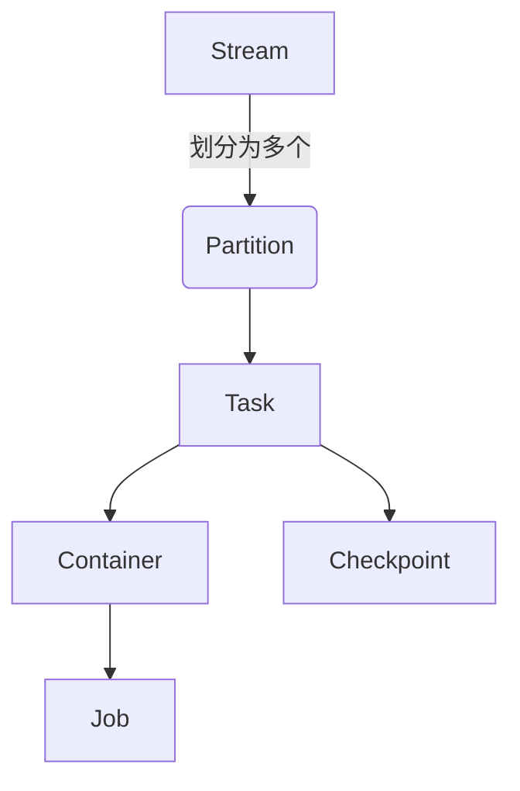
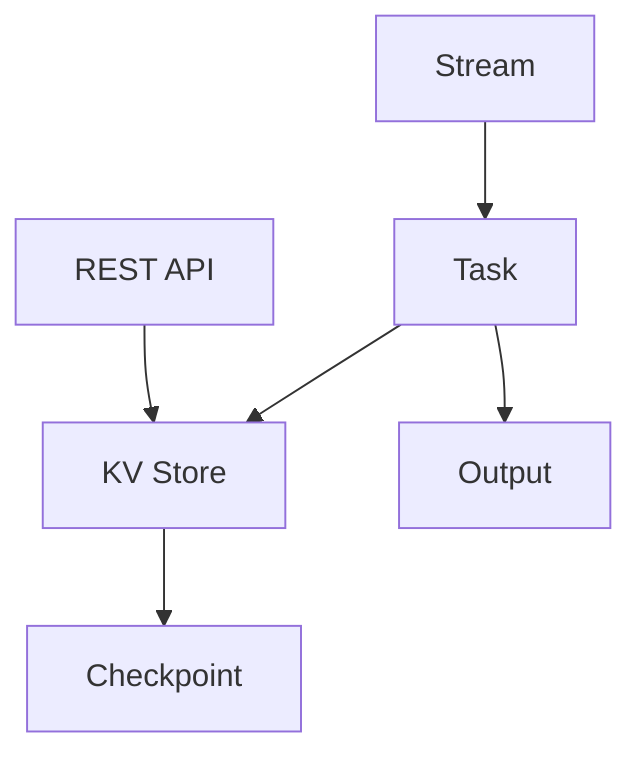

# Samza KV Store原理与代码实例讲解

## 1.背景介绍

### 1.1 什么是Samza?

Apache Samza是一个分布式的流处理系统,最初由LinkedIn公司开发并开源。它基于Apache Kafka消息队列,使用Kafka的持久化日志作为消息源,并提供了一个易于构建无状态或有状态的流处理应用的框架。Samza可以从Kafka持久化日志中消费数据,并执行低延迟、高吞吐量的实时处理,同时还具有容错、横向扩展等特性。

### 1.2 Samza的应用场景

Samza非常适合用于处理实时大数据流,如网络活动数据流、物联网传感器数据流、金融交易数据流等。它可以用于构建各种流处理应用,包括:

- 实时数据分析和监控
- 实时数据转换和路由
- 实时异常检测
- 实时推荐系统
- 实时风控系统

### 1.3 Samza KV Store介绍

Samza KV Store(键值存储)是Samza提供的一种状态存储机制,允许开发者在流处理应用中维护内存中的本地键值对数据。KV Store提供了类似Java Map的接口,开发者可以在Samza任务中读写键值对数据,并在处理流数据时查询或更新这些数据。

KV Store的主要特点包括:

- 内存存储,提供低延迟访问
- 支持RocksDB等外部数据库作为存储引擎
- 支持Checkpoint和Restore机制,保证故障恢复
- 支持Cache Eviction策略,有效利用内存

KV Store在Samza流处理应用中扮演着重要角色,可以用于维护状态数据、缓存数据、构建数据模型等,从而提高应用的处理能力和性能。

## 2.核心概念与联系

### 2.1 Samza流处理核心概念

为了理解Samza KV Store,我们首先需要了解Samza流处理的一些核心概念:

1. **Stream(流)**: 一个持续不断的数据序列,如网络活动日志流、传感器数据流等。

2. **Job(作业)**: 一个Samza流处理应用,由一个或多个Task组成。

3. **Task**: 作业的基本执行单元,负责从输入流消费数据并执行处理逻辑。

4. **Container**: 一个JVM进程,包含一个或多个Task实例。

5. **Partition(分区)**: 输入流被划分为多个Partition,每个Task只消费一个Partition的数据。

6. **Checkpoint(检查点)**: 任务的状态数据定期写入持久化存储,用于故障恢复。

这些概念之间的关系如下所示:



### 2.2 Samza KV Store在流处理中的作用

在Samza流处理应用中,KV Store主要用于以下几个方面:

1. **维护状态数据**: 对于有状态的流处理应用,KV Store可以用于存储中间计算结果、聚合数据等状态信息。

2. **缓存数据**: KV Store可以充当缓存,存储一些需要频繁访问的数据,提高查询性能。

3. **构建数据模型**: 开发者可以在KV Store中构建复杂的数据模型,如图、树等,为流处理逻辑提供支持。

4. **联机查询**: 除了在Task内部访问KV Store,Samza还提供了通过REST API远程查询KV Store的功能。

KV Store与Samza流处理的其他组件之间的关系如下:



可以看到,KV Store紧密集成在Samza的流处理架构中,为开发有状态的流处理应用提供了重要支持。

## 3.核心算法原理具体操作步骤 

### 3.1 KV Store的工作原理

Samza KV Store的工作原理可以概括为以下几个步骤:

1. **初始化**: 在Task启动时,KV Store会根据配置初始化存储引擎(如RocksDB)。

2. **数据读写**: Task在处理流数据时,可以通过KV Store提供的接口读写键值对数据。

3. **Checkpoint**: 定期将KV Store中的数据写入Checkpoint文件系统,用于故障恢复。

4. **Restore**: 在Task重启或发生故障时,KV Store会从最近的Checkpoint文件中恢复数据。

5. **Cache Eviction**: 当KV Store内存使用量超过阈值时,会根据配置的策略淘汰部分数据。

6. **关闭**: Task结束时,KV Store会正确关闭并释放资源。

这个过程中,KV Store与Samza的其他组件(如Checkpoint管理器、容错管理器等)也有交互。

### 3.2 KV Store核心算法

KV Store的核心算法包括以下几个方面:

1. **数据存储**: KV Store使用高性能的键值数据库(如RocksDB)作为底层存储引擎,提供高效的数据读写能力。

2. **索引结构**: KV Store内部使用高效的索引结构(如前缀树、哈希表等)来组织和查找键值对数据。

3. **Cache策略**: KV Store支持多种Cache Eviction策略,如LRU、LFU等,用于在内存受限时淘汰部分数据。

4. **并发控制**: KV Store使用适当的并发控制机制(如读写锁、CAS等)来确保多线程访问的正确性。

5. **Checkpoint算法**: KV Store使用增量Checkpoint算法,只需将自上次Checkpoint后的数据变更写入新文件。

6. **Restore算法**: KV Store在Restore时,会先从最近的全量Checkpoint文件恢复数据快照,再应用增量Checkpoint文件。

7. **压缩和编码**: KV Store在持久化数据时,会对数据进行压缩和编码,以节省存储空间。

这些算法的具体实现细节在Samza的源代码中可以找到,感兴趣的读者可以进一步研究。

## 4.数学模型和公式详细讲解举例说明

在Samza KV Store中,有一些数学模型和公式用于描述和优化其性能,下面将对几个重要的模型和公式进行详细讲解。

### 4.1 Cache命中率模型

Cache命中率是衡量缓存效率的一个重要指标。对于KV Store,我们可以使用下面的数学模型来描述Cache命中率:

$$
H = \frac{N_h}{N_h + N_m}
$$

其中:
- $H$ 表示Cache命中率
- $N_h$ 表示命中次数
- $N_m$ 表示未命中次数

命中率越高,说明缓存效率越好,能够更多地利用内存加速数据访问。

我们可以通过调整KV Store的Cache策略和大小来优化命中率。例如,对于一个访问模式符合80/20规则的工作负载,使用LRU策略可以获得较高的命中率。

### 4.2 Cache内存使用模型

KV Store的内存使用量是一个重要的性能参数,它决定了可以缓存多少数据。我们可以使用下面的模型来估计内存使用量:

$$
M = N \times (K_s + V_s + O_s)
$$

其中:
- $M$ 表示内存使用量
- $N$ 表示键值对数量
- $K_s$ 表示每个键的平均大小
- $V_s$ 表示每个值的平均大小
- $O_s$ 表示每个键值对的其他开销(如元数据)

根据这个模型,我们可以通过限制键值对数量、压缩数据等方式来控制内存使用量。

### 4.3 Checkpoint性能模型

Checkpoint是KV Store的一个重要功能,它决定了故障恢复的效率。我们可以使用下面的模型来估计Checkpoint的性能开销:

$$
T = N \times (R_t + W_t) + S_t
$$

其中:
- $T$ 表示Checkpoint的总时间开销
- $N$ 表示需要Checkpoint的键值对数量
- $R_t$ 表示读取一个键值对的平均时间
- $W_t$ 表示写入一个键值对的平均时间
- $S_t$ 表示其他固定开销(如文件操作)

根据这个模型,我们可以通过优化读写性能、压缩数据等方式来减少Checkpoint的开销。

以上是Samza KV Store中几个重要的数学模型,它们可以帮助我们理解和优化KV Store的性能。在实际应用中,我们还需要结合具体的工作负载和硬件条件,进行测试和调优。

## 5.项目实践:代码实例和详细解释说明

在这一部分,我们将通过一个实际的代码示例,展示如何在Samza流处理应用中使用KV Store。我们将构建一个简单的实时词频统计应用,它从Kafka消费文本数据流,并实时统计每个单词出现的次数。

### 5.1 项目结构

我们的项目使用Maven进行构建,主要包含以下几个部分:

```
word-count-app
├── pom.xml
├── src
│   ├── main
│   │   ├── java
│   │   │   └── com/mycompany/wordcount
│   │   │       ├── WordCountApp.java
│   │   │       ├── WordCountTask.java
│   │   │       └── ...
│   │   └── resources
│   │       └── log4j.xml
│   └── test
│       └── ...
└── ...
```

- `WordCountApp.java`: Samza应用的主入口
- `WordCountTask.java`: 实现流处理逻辑的Task类
- `pom.xml`: Maven构建文件
- `log4j.xml`: 日志配置文件

### 5.2 WordCountTask代码解析

`WordCountTask`是我们的核心处理逻辑所在,它继承自`StreamTask`类,并覆写了`process`方法来实现词频统计。

```java
public class WordCountTask implements StreamTask, InitableTask {
    private KeyValueStore<String, Integer> kvStore;

    @Override
    public void init(Context context) {
        // 获取KV Store实例
        kvStore = context.getTaskContext().getStore("word-count");
    }

    @Override
    public void process(IncomingMessageEnvelope envelope, MessageCollector collector, TaskCoordinator coordinator) {
        String message = (String) envelope.getMessage();
        String[] words = message.split("\\s+");

        for (String word : words) {
            // 从KV Store中获取当前计数
            Integer oldCount = kvStore.get(word);
            if (oldCount == null) {
                oldCount = 0;
            }

            // 更新计数并写回KV Store
            Integer newCount = oldCount + 1;
            kvStore.put(word, newCount);
        }
    }
}
```

代码解释:

1. 在`init`方法中,我们从`Context`获取了一个名为"word-count"的KV Store实例。

2. 在`process`方法中,我们首先将输入消息拆分为单词列表。

3. 对于每个单词,我们先从KV Store中获取其当前计数,如果不存在则初始化为0。

4. 然后将计数加1,并将新的计数值写回KV Store。

通过这种方式,我们就实现了实时的词频统计功能。由于KV Store存储在内存中,查询和更新操作都是低延迟的。

### 5.3 配置KV Store

在Samza作业的配置文件中,我们需要配置KV Store的相关参数,例如:

```properties
# 启用KV Store
task.opt-in-for-kv-store=true

# 设置KV Store工厂类
task.kv.store.factory=org.apache.samza.storage.kv.RocksDbKeyValueStorageEngineFactory

# 设置RocksDB配置
task.kv.storage.rocksdb.config.block-cache-size=1073741824
task.kv.storage.rocksdb.config.write-buffer-size=268435456

# 设置Checkpoint目录
task.kv.storage.rocksdb.checkpoint.dir=checkpoint
```

这些配置项包括:

- 启用KV Store功能
- 设置KV Store的存储引擎工厂类(这里使用RocksDB)
- 配置RocksDB的参数,如块缓存大小、写缓冲区大小等
- 设置Checkpoint目录

根据实际需求,我们可以调整这些参数来优化KV Store的性能和资源使用。

### 5.4 运行和测试

在完成代码和配置后,我们可以按照Samza的标准流程构建并运行应用。在运行过程中,我们可以查看Task的日志输出,观察KV Store的使用情况。

我们还可以通过