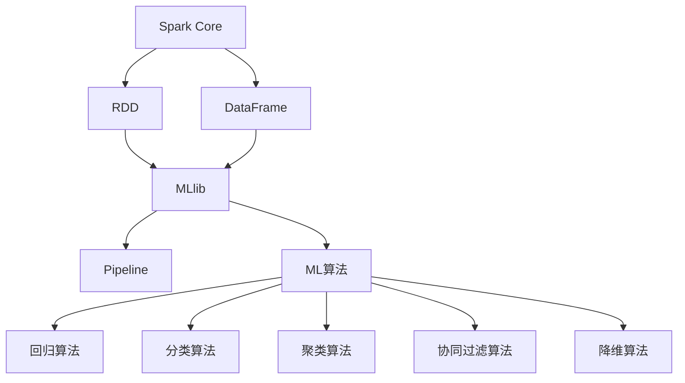
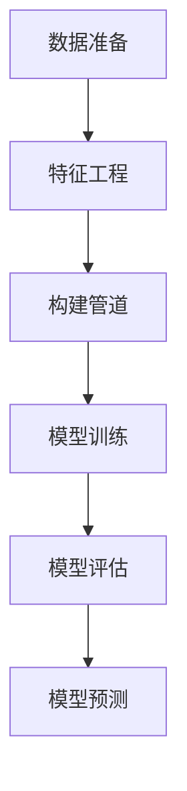

# Spark MLlib原理与代码实例讲解

## 1.背景介绍

在当今大数据时代,机器学习(Machine Learning)已经成为数据科学和人工智能领域中最重要的技术之一。Apache Spark是一个开源的大数据处理框架,它提供了MLlib(Machine Learning Library)机器学习库,支持多种机器学习算法的实现和部署。Spark MLlib不仅性能出色,而且能够与Spark生态系统无缝集成,可以高效地处理大规模数据集。

Spark MLlib的设计目标是使机器学习算法能够在大规模数据集上高效运行。它基于Spark的分布式内存计算模型,将数据加载到内存中进行并行处理,从而大幅提高了计算速度。同时,MLlib还提供了丰富的机器学习算法库,涵盖了监督学习、非监督学习、推荐系统等多个领域,能够满足各种机器学习任务的需求。

## 2.核心概念与联系

### 2.1 Spark Core

Spark Core是Spark的核心模块,提供了分布式内存计算、任务调度和容错等基础功能。MLlib构建在Spark Core之上,利用其分布式计算能力来实现高效的机器学习算法。

### 2.2 RDD和DataFrame

RDD(Resilient Distributed Dataset)和DataFrame是Spark中两种重要的数据抽象。RDD是一种分布式的、不可变的数据集合,而DataFrame则是一种以行和列组织的分布式数据集。MLlib可以直接操作这两种数据结构,方便了数据的加载、转换和处理。

### 2.3 Pipeline

Pipeline是MLlib中的一个重要概念,它将多个数据处理步骤串联起来,形成一个完整的机器学习工作流。Pipeline能够自动化数据处理过程,提高了开发效率和模型的可重用性。

### 2.4 ML算法

MLlib提供了多种机器学习算法,包括:

- 回归算法:线性回归、逻辑回归等
- 分类算法:决策树、随机森林、支持向量机等
- 聚类算法:K-Means、高斯混合模型等
- 协同过滤算法:交替最小二乘法等
- 降维算法:主成分分析等

这些算法可以应用于各种机器学习任务,如预测、分类、聚类和推荐系统等。



## 3.核心算法原理具体操作步骤

### 3.1 线性回归

线性回归是一种常用的监督学习算法,用于预测连续值的目标变量。它假设目标变量和特征变量之间存在线性关系,并通过最小化残差平方和来拟合回归系数。

Spark MLlib中的线性回归算法基于随机梯度下降(SGD)或LBFGS等优化方法,可以处理大规模数据集。其具体操作步骤如下:

1. 数据准备:将数据转换为RDD或DataFrame格式。
2. 特征工程:对特征进行标准化、one-hot编码等预处理。
3. 构建管道:创建线性回归估计器,并将其与特征处理步骤组合成一个Pipeline。
4. 模型训练:使用训练数据拟合线性回归模型。
5. 模型评估:在测试数据上评估模型性能,计算指标如均方根误差(RMSE)等。
6. 模型预测:使用训练好的模型对新数据进行预测。

### 3.2 逻辑回归

逻辑回归是一种常用的分类算法,用于预测二元或多元分类问题。它基于对数几率(logit)函数,将特征变量的线性组合映射到0到1之间的概率值,从而实现分类。

Spark MLlib中的逻辑回归算法也基于优化方法如LBFGS和Newton方法。其操作步骤与线性回归类似,但需要注意以下几点:

1. 标签编码:对于二元分类问题,标签需要编码为0或1;对于多元分类问题,需要使用one-hot编码。
2. 评估指标:常用的评估指标包括准确率、精确率、召回率和F1分数等。
3. 概率阈值:根据具体问题,可能需要调整分类概率阈值。

### 3.3 决策树

决策树是一种常用的分类和回归算法,它通过递归地构建决策树模型来进行预测。决策树易于解释,并且能够自动处理特征交互。

Spark MLlib中的决策树算法基于信息增益或基尼系数等指标,通过递归分割特征空间来构建树模型。其操作步骤包括:

1. 设置算法参数:如最大深度、最小实例数等。
2. 特征处理:对于分类特征,需要进行one-hot编码或字符串索引化。
3. 模型训练:使用训练数据构建决策树模型。
4. 模型评估:在测试数据上评估模型性能。
5. 模型预测:使用训练好的模型对新数据进行预测。

### 3.4 随机森林

随机森林是一种集成学习算法,它通过构建多个决策树,并对它们的预测结果进行平均或投票,从而提高模型的准确性和鲁棒性。

Spark MLlib中的随机森林算法基于决策树算法,但在构建每棵树时,都会随机选择一部分特征进行训练。其操作步骤包括:

1. 设置算法参数:如树的数量、特征子集比例等。
2. 特征处理:与决策树算法相同。
3. 模型训练:并行构建多棵决策树,形成随机森林模型。
4. 模型评估:在测试数据上评估模型性能。
5. 模型预测:使用训练好的随机森林模型对新数据进行预测。

### 3.5 K-Means聚类

K-Means是一种常用的无监督学习算法,用于对数据进行聚类。它通过迭代优化簇心位置和数据点的簇分配,最终将数据划分为K个簇。

Spark MLlib中的K-Means算法基于并行计算,能够高效处理大规模数据集。其操作步骤包括:

1. 设置算法参数:如簇的数量K、最大迭代次数等。
2. 特征处理:对特征进行标准化或归一化处理。
3. 模型训练:初始化簇心,并迭代优化簇心位置和数据点簇分配。
4. 模型评估:计算簇内平方和等评估指标。
5. 模型预测:使用训练好的模型对新数据进行簇分配预测。



## 4.数学模型和公式详细讲解举例说明

### 4.1 线性回归

线性回归假设目标变量 $y$ 和特征变量 $\vec{x}$ 之间存在线性关系,可以表示为:

$$y = \theta_0 + \theta_1x_1 + \theta_2x_2 + \cdots + \theta_nx_n + \epsilon$$

其中, $\theta_0$ 是常数项, $\theta_1, \theta_2, \cdots, \theta_n$ 是特征系数, $\epsilon$ 是误差项。

目标是通过最小化残差平方和来估计参数 $\theta$:

$$\min_\theta \sum_{i=1}^m (y^{(i)} - \hat{y}^{(i)})^2$$

其中, $m$ 是训练样本数, $y^{(i)}$ 是第 $i$ 个样本的真实目标值, $\hat{y}^{(i)}$ 是第 $i$ 个样本的预测值。

常用的优化算法包括梯度下降法、最小二乘法等。

### 4.2 逻辑回归

逻辑回归用于二元或多元分类问题。对于二元分类,我们使用对数几率(logit)函数将线性组合 $\theta^T\vec{x}$ 映射到0到1之间的概率值:

$$h_\theta(x) = \frac{1}{1 + e^{-\theta^T\vec{x}}}$$

其中, $\theta$ 是参数向量。

对于给定的训练数据 $\{(\vec{x}^{(i)}, y^{(i)})\}$ ,我们通过最大化似然函数或等价地最小化代价函数来估计参数 $\theta$:

$$\min_\theta -\frac{1}{m}\sum_{i=1}^m \Big[y^{(i)}\log h_\theta(\vec{x}^{(i)}) + (1 - y^{(i)})\log(1 - h_\theta(\vec{x}^{(i)}))\Big]$$

对于多元分类问题,我们可以使用 one-vs-rest 策略将其转化为多个二元分类问题。

### 4.3 决策树

决策树算法通过递归地构建决策树模型来进行预测。对于每个节点,我们根据某个特征的值将数据集划分为两个子集,使得子集内的样本尽可能属于同一类别。

常用的特征选择标准包括:

- 分类树:信息增益或信息增益比
- 回归树:方差减少

信息增益定义为:

$$\text{Gain}(D, a) = \text{Entropy}(D) - \sum_{v \in \text{Values}(a)} \frac{|D^v|}{|D|} \text{Entropy}(D^v)$$

其中, $D$ 是当前数据集, $a$ 是特征, $D^v$ 是根据特征 $a$ 的值 $v$ 划分的子集, $\text{Entropy}(D)$ 是数据集 $D$ 的熵。

我们递归地构建树,直到满足停止条件,如最大深度、最小实例数等。

### 4.4 K-Means聚类

K-Means算法的目标是将 $n$ 个数据点 $\{x_1, x_2, \cdots, x_n\}$ 划分为 $K$ 个簇 $\{C_1, C_2, \cdots, C_K\}$ ,使得簇内数据点相似度高,簇间数据点相似度低。

我们定义簇内平方和作为目标函数:

$$J = \sum_{k=1}^K \sum_{x \in C_k} \|x - \mu_k\|^2$$

其中, $\mu_k$ 是簇 $C_k$ 的质心。

K-Means算法的步骤如下:

1. 随机初始化 $K$ 个簇心 $\{\mu_1, \mu_2, \cdots, \mu_K\}$
2. 对每个数据点 $x$,计算其与各簇心的距离,将其分配到最近的簇
3. 对每个簇,重新计算簇心 $\mu_k = \frac{1}{|C_k|} \sum_{x \in C_k} x$
4. 重复步骤2和3,直到簇分配不再发生变化

通过上述迭代过程,算法将收敛到局部最优解。

## 5.项目实践:代码实例和详细解释说明

### 5.1 线性回归示例

```python
from pyspark.ml.regression import LinearRegression

# 加载数据
data = spark.read.csv("data.csv", header=True, inferSchema=True)

# 特征工程
feature_cols = ["feature1", "feature2", "feature3"]
assembler = VectorAssembler(inputCols=feature_cols, outputCol="features")
data = assembler.transform(data)

# 切分数据集
train_data, test_data = data.randomSplit([0.8, 0.2], seed=42)

# 构建管道
lr = LinearRegression(featuresCol="features", labelCol="label")
pipeline = Pipeline(stages=[assembler, lr])

# 模型训练
model = pipeline.fit(train_data)

# 模型评估
predictions = model.transform(test_data)
evaluator = RegressionEvaluator(labelCol="label", predictionCol="prediction", metricName="rmse")
rmse = evaluator.evaluate(predictions)
print(f"RMSE on test data = {rmse:.2f}")

# 模型预测
new_data = spark.createDataFrame([
    (10.0, 20.0, 30.0)
], ["feature1", "feature2", "feature3"])
new_data = assembler.transform(new_data)
prediction = model.transform(new_data)
print(f"Prediction: {prediction.select('prediction').collect()[0][0]}")
```

在这个示例中,我们首先加载数据并进行特征工程。然后,我们构建线性回归估计器