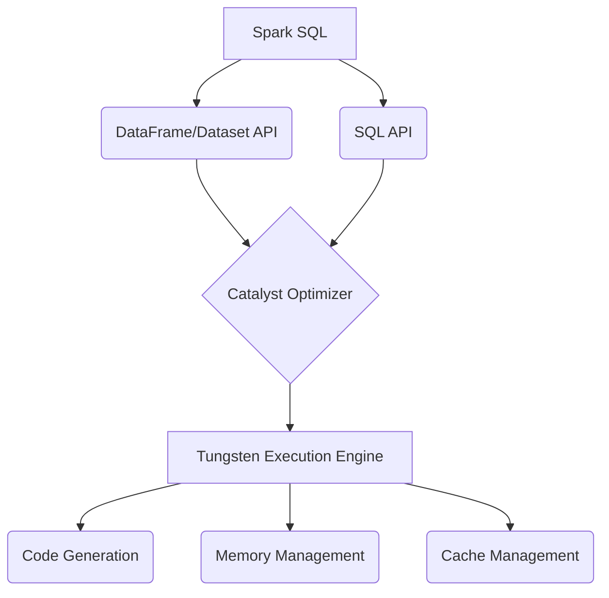

# Spark SQL 原理与代码实例讲解

## 1.背景介绍

Apache Spark 是一种快速、通用、可扩展的大数据处理引擎,它提供了一种统一的编程模型,可以用于批处理、流处理、机器学习和SQL工作负载。Spark SQL是Spark中用于结构化数据处理的模块,它提供了一种基于Spark的分布式SQL查询引擎。

Spark SQL允许使用SQL或者Dataset/DataFrame API与结构化数据进行交互,并支持多种数据源,包括Hive、Parquet、JSON、CSV等。它的核心是一个优化的查询执行引擎,可以利用Spark的内存计算优势,从而实现高效的数据处理。

## 2.核心概念与联系

### 2.1 DataFrame

DataFrame是Spark SQL中处理结构化和半结构化数据的分布式数据集。它由具有相同schema的行组成,类似于关系数据库中的表或R/Python中的data frame。DataFrame可以从各种数据源构建,如结构化数据文件、Hive表、外部数据库或现有的RDD。

### 2.2 Dataset

Dataset是Spark 1.6中引入的新接口,它是DataFrame的一种类型安全的视图。与DataFrame一样,Dataset也是由行组成的分布式数据集,但它在编译时会对数据类型进行检查,从而避免了在运行时出现某些常见错误。

### 2.3 Catalyst Optimizer

Catalyst Optimizer是Spark SQL中的查询优化器,它将逻辑计划转换为高效的物理计划。Catalyst基于函数式编程模型构建,支持通过一系列规则和模式进行查询优化。

### 2.4 Tungsten

Tungsten是Spark SQL中的内存管理和CPU代码生成组件。它通过高效的二进制内存格式和代码生成技术,显著提升了Spark SQL的内存和CPU效率。

### 2.5 Mermaid 架构流程图



## 3.核心算法原理具体操作步骤

Spark SQL在执行查询时,会经历以下几个主要步骤:

1. **解析和绑定**:将SQL语句或DataFrame/Dataset操作解析为抽象语法树(AST),并将其绑定到实际的表或列。

2. **逻辑计划分析**:基于绑定的AST构建逻辑查询计划。

3. **逻辑优化**:Catalyst Optimizer对逻辑查询计划进行一系列规则和模式匹配优化,生成优化后的逻辑查询计划。

4. **物理计划生成**:根据优化后的逻辑查询计划生成物理执行计划。

5. **代码生成**:Tungsten根据物理执行计划,利用代码生成技术生成高效的内存计算代码。

6. **任务调度和执行**:将生成的代码分发到各个Spark执行器上,并行执行查询任务。

## 4.数学模型和公式详细讲解举例说明

在查询优化过程中,Catalyst Optimizer会应用各种规则和模式来优化逻辑查询计划。其中一种常用的优化技术是代价模型(Cost Model),它根据统计信息估算不同执行计划的代价,并选择代价最小的计划。

代价模型通常由以下几个部分组成:

- 统计信息收集: $$STATS = f(data, queries)$$
- 代价估算函数: $$COST = g(plan, STATS)$$ 
- 代价比较: $$plan_{optimal} = \underset{plan}{\mathrm{argmin}}\ COST(plan)$$

其中:

- $STATS$表示收集的数据统计信息,如行数、数据大小等,它是代价估算的基础。
- $COST$是一个代价估算函数,它根据执行计划和统计信息,估算该计划的代价(如CPU、IO、网络等开销)。
- $plan_{optimal}$是通过比较不同执行计划的代价,选择出代价最小的最优执行计划。

以下是一个简单的代价估算示例,假设有一个连接查询:

```sql
SELECT * FROM table1 JOIN table2 ON table1.key = table2.key;
```

其中table1有N1行,table2有N2行。我们可以估算不同连接算法的代价:

- **Nested Loop Join**:
  $$COST_{nested} = N_1 \times N_2 \times C_{proc}$$

- **Sort Merge Join**:
  $$COST_{sort} = N_1 \times \log(N_1) + N_2 \times \log(N_2) + (N_1 + N_2) \times C_{proc}$$

- **Broadcast Hash Join**:
  $$COST_{broadcast} = N_1 + N_2 + (N_1 \times \log(N_2)) \times C_{proc}$$

其中$C_{proc}$是每次比较或处理一对行的CPU开销。可以看出,不同连接算法的代价估算公式不同,Catalyst会选择代价最小的算法作为物理执行计划。

通过这种代价模型优化,Spark SQL可以自动选择最优的查询执行策略,提高查询性能。

## 5.项目实践:代码实例和详细解释说明

让我们通过一个简单的例子,了解如何使用Spark SQL进行交互式数据分析。

### 5.1 创建SparkSession

```scala
import org.apache.spark.sql.SparkSession

val spark = SparkSession.builder()
  .appName("SparkSQLExample")
  .getOrCreate()
```

SparkSession是Spark 2.0引入的新入口点,它代表了与Spark的连接。我们可以使用builder模式创建一个SparkSession实例。

### 5.2 创建DataFrame

```scala
val df = spark.read.json("examples/src/main/resources/people.json")
df.show()
```

我们可以使用SparkSession的read API从JSON文件中创建一个DataFrame。show()方法将打印出DataFrame的前几行数据。

### 5.3 SQL查询

```scala
df.createOrReplaceTempView("people")

val adults = spark.sql("SELECT name, age FROM people WHERE age >= 18")
adults.show()
```

我们可以使用createOrReplaceTempView()方法,基于DataFrame创建一个临时视图,然后使用SQL查询这个视图。上面的例子查询了年龄大于等于18的人的姓名和年龄。

### 5.4 DataFrame操作

```scala
import org.apache.spark.sql.functions._

val countsByAge = df.groupBy("age").agg(count("*").alias("numPeople"))
countsByAge.show()
```

我们也可以使用DataFrame API进行数据转换,上面的例子计算了每个年龄的人数。groupBy()对数据进行分组,agg()执行聚合操作,alias()给列重命名。

通过这个简单的示例,我们可以看到Spark SQL提供了SQL和DataFrame/Dataset两种编程接口,并支持从各种数据源读取数据,以及进行交互式数据分析和转换。

## 6.实际应用场景

Spark SQL在实际应用中有着广泛的用途,下面列举了一些典型场景:

1. **数据湖分析**:使用Spark SQL可以高效地查询和处理存储在数据湖(如HDFS、S3等)中的各种格式数据,如Parquet、ORC、JSON等。

2. **ETL工作负载**:Spark SQL可以用于提取、转换和加载(ETL)工作负载,从各种数据源读取数据,进行清理、转换和加载到数据仓库或其他系统。

3. **交互式数据分析**:借助Spark SQL的SQL和DataFrame/Dataset API,数据分析师可以进行交互式的数据探索和分析。

4. **机器学习管道**:Spark SQL可以与Spark MLlib无缝集成,用于构建端到端的机器学习管道,包括数据准备、特征工程和模型训练等步骤。

5. **流式处理**:结合Spark Structured Streaming,Spark SQL可以用于流式数据处理,如实时数据分析和ETL。

6. **数据仓库/数据湖替代方案**:Spark SQL可以作为传统数据仓库或数据湖的替代方案,提供高性能、低成本的大数据分析解决方案。

## 7.工具和资源推荐

在使用Spark SQL时,以下工具和资源可能会很有帮助:

1. **Spark UI**:Spark自带的Web UI,可以监控和诊断Spark应用程序的执行情况,包括作业进度、任务信息、内存使用情况等。

2. **Apache Zeppelin**:一个基于Web的交互式数据分析笔记本,支持Spark SQL、Scala、Python等多种语言,方便进行数据探索和可视化。

3. **DataBricks**:一个基于云的数据分析平台,提供了Spark集群管理、笔记本协作、作业调度等功能,并集成了Spark SQL。

4. **Spark SQL性能优化指南**:Databricks提供的一份详细的Spark SQL性能优化指南,介绍了各种优化技术和最佳实践。

5. **Spark官方文档**:Spark SQL模块的官方文档,包含了详细的概念介绍、API参考和示例代码。

6. **Spark用户邮件列表**:可以在Spark用户邮件列表上提问并获得社区支持。

7. **StackOverflow**:一个广受欢迎的技术问答网站,可以在上面搜索和提问Spark SQL相关的问题。

## 8.总结:未来发展趋势与挑战

Spark SQL作为Spark生态系统中的核心模块,在未来仍将持续发展和完善。一些潜在的发展趋势和挑战包括:

1. **性能优化**:持续优化Spark SQL的查询执行性能,包括优化器、代码生成、内存管理等方面。

2. **云原生支持**:加强对云原生环境(如Kubernetes)的支持,实现更好的资源管理和弹性伸缩。

3. **流批一体化**:进一步融合流式处理和批处理,提供统一的API和运行时,简化应用程序开发。

4. **机器学习集成**:加强与Spark MLlib的集成,提供更好的机器学习管道支持。

5. **数据湖管理**:提供更好的数据湖管理功能,如数据治理、元数据管理和安全性。

6. **SQL标准支持**:增强对SQL标准的支持,提高与其他系统的互操作性。

7. **性能诊断**:提供更好的性能诊断和调优工具,帮助用户优化查询性能。

8. **社区参与**:鼓励更多的社区参与,包括贡献代码、文档和用例。

总的来说,Spark SQL将继续作为大数据处理和分析的核心引擎,并不断evolve以满足不断变化的需求。

## 9.附录:常见问题与解答

1. **Spark SQL与Hive有什么区别?**

Spark SQL和Hive都是用于处理结构化数据的引擎,但它们有以下一些主要区别:

- 执行引擎:Spark SQL使用Spark作为底层执行引擎,而Hive使用MapReduce。Spark的内存计算模型通常比MapReduce更高效。
- 延迟:Spark SQL是一个低延迟的查询引擎,而Hive更适合批处理工作负载。
- 标准支持:Spark SQL支持Hive元数据、数据格式和UDF,并且对SQL标准的支持更好。
- 生态系统:Spark SQL是Spark生态系统的一部分,与Spark的其他模块(如Streaming、MLlib)集成良好。

2. **如何选择使用DataFrame还是SQL?**

DataFrame API和SQL都可以用于结构化数据处理,选择哪一种取决于具体的使用场景和开发人员的偏好:

- 如果你更习惯面向对象的编程风格,或者需要在查询中使用复杂的数据转换逻辑,DataFrame API可能更合适。
- 如果你更习惯SQL,或者需要与其他SQL工具进行集成,使用SQL可能更方便。
- 对于交互式数据探索和原型开发,SQL通常更加简洁和易于使用。
- 对于生产环境的批处理工作负载,DataFrame API可能更高效。

总的来说,两种方式都可以达到相似的目的,可以根据具体需求进行选择。

3. **如何优化Spark SQL的性能?**

优化Spark SQL性能的一些技巧包括:

- 启用统计信息收集,让优化器做出更好的决策。
- 合理设置shuffle分区数,避免过多或过少的分区。
- 对输入数据进行分区和存储优化,如使用Parquet列式存储格式。
- 尽量避免不必要的shuffle操作,如过滤和投影下推。
- 对于大型广播连接,可以考虑使用广播连接提示。
-