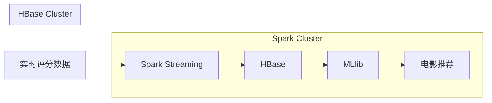

# Spark-HBase整合原理与代码实例讲解

## 1.背景介绍

随着大数据时代的到来,海量数据的存储和处理成为了一个巨大的挑战。Apache Spark和Apache HBase作为两个优秀的大数据解决方案,它们的整合可以发挥两者的优势,提供高效的大数据处理能力。

Apache Spark是一个快速、通用的大数据处理引擎,具有高度的容错性和可扩展性。它支持批处理、流处理、机器学习和图计算等多种计算模型,可以高效地处理海量数据。

Apache HBase是一个分布式的、面向列的开源NoSQL数据库,它建立在Hadoop文件系统之上,具有高可靠性、高性能、可伸缩性和易于管理等优点。HBase非常适合存储和管理结构化的大数据,并支持实时的随机读写访问。

将Spark与HBase整合,可以充分利用Spark的高效计算能力和HBase的海量数据存储能力,构建一个强大的大数据处理平台。Spark可以高效地从HBase读取数据进行处理,也可以将处理结果写回HBase,实现数据的高效存储和计算。

## 2.核心概念与联系

在了解Spark-HBase整合原理之前,我们需要先掌握一些核心概念:

### 2.1 Spark核心概念

- **RDD(Resilient Distributed Dataset)**:Spark的基础数据结构,是一个不可变、分区的记录集合。
- **DataFrame**:基于Spark SQL的分布式数据集,提供了结构化的数据抽象。
- **SparkContext**:Spark应用程序的入口点,用于创建RDD、累加器和广播变量等。
- **Executor**:Spark集群中执行任务的工作节点,负责运行任务的task。

### 2.2 HBase核心概念

- **Region**:HBase表的水平分区,每个Region维护着一个行键范围的数据。
- **RegionServer**:HBase集群中的工作节点,用于存储和管理Region。
- **HMaster**:HBase集群的主节点,负责监控RegionServer并协调Region的分配和迁移。
- **RowKey**:HBase表中每行数据的唯一标识符。

### 2.3 Spark-HBase整合的关键点

- **数据读取**:Spark可以通过HBase的InputFormat从HBase读取数据,将其转换为RDD或DataFrame进行处理。
- **数据写入**:Spark可以将处理后的结果数据写入HBase,通过HBase的OutputFormat将RDD或DataFrame的数据持久化到HBase表中。
- **数据更新**:Spark可以读取HBase中的数据,进行计算和转换,然后将更新后的数据写回HBase,实现数据的更新操作。

## 3.核心算法原理具体操作步骤

Spark-HBase整合的核心算法原理包括数据读取、数据写入和数据更新三个方面,下面我们将详细介绍它们的具体操作步骤。

### 3.1 数据读取

Spark从HBase读取数据的过程如下:

1. 创建Spark的`SparkContext`和`HBaseConfiguration`对象。
2. 通过`HBaseConfiguration`设置HBase集群的连接信息。
3. 使用`newAPIHadoopRDD`方法从HBase表中创建一个RDD,指定表名、扫描范围和其他选项。
4. 可选:将RDD转换为DataFrame,方便使用Spark SQL进行处理。

```scala
import org.apache.spark.{SparkConf, SparkContext}
import org.apache.hadoop.hbase.HBaseConfiguration
import org.apache.hadoop.hbase.client.Scan
import org.apache.hadoop.hbase.mapreduce.TableInputFormat
import org.apache.spark.sql.SparkSession

val conf = HBaseConfiguration.create()
conf.set("hbase.zookeeper.quorum", "zkHost1,zkHost2,zkHost3")
conf.set(TableInputFormat.INPUT_TABLE, "tableName")

val scan = new Scan()
scan.setCaching(500)
scan.setCacheBlocks(false)

val rdd = sc.newAPIHadoopRDD(conf, TableInputFormat.forClass(classOf[org.apache.hadoop.hbase.client.Result]),
                             classOf[org.apache.hadoop.hbase.io.ImmutableBytesWritable],
                             classOf[org.apache.hadoop.hbase.client.Result],
                             new JobConf(conf))
                 .map(_.getSecond)

val spark = SparkSession.builder().getOrCreate()
val df = spark.createDataFrame(rdd)
```

### 3.2 数据写入

Spark将数据写入HBase的过程如下:

1. 创建Spark的`SparkContext`和`HBaseConfiguration`对象。
2. 通过`HBaseConfiguration`设置HBase集群的连接信息。
3. 将RDD或DataFrame转换为`(ImmutableBytesWritable, Put)`对的RDD。
4. 使用`saveAsNewAPIHadoopDataset`方法将RDD写入HBase表。

```scala
import org.apache.spark.{SparkConf, SparkContext}
import org.apache.hadoop.hbase.HBaseConfiguration
import org.apache.hadoop.hbase.client.Put
import org.apache.hadoop.hbase.io.ImmutableBytesWritable
import org.apache.hadoop.hbase.mapreduce.TableOutputFormat
import org.apache.hadoop.mapreduce.Job

val conf = HBaseConfiguration.create()
conf.set("hbase.zookeeper.quorum", "zkHost1,zkHost2,zkHost3")
conf.set(TableOutputFormat.OUTPUT_TABLE, "tableName")

val rdd = df.rdd.map(row => {
  val put = new Put(row.getAs[String]("rowKey").getBytes)
  put.addColumn("cf".getBytes, "col1".getBytes, row.getAs[String]("col1").getBytes)
  put.addColumn("cf".getBytes, "col2".getBytes, row.getAs[Int]("col2").toString.getBytes)
  (new ImmutableBytesWritable, put)
})

rdd.saveAsNewAPIHadoopDataset(conf)
```

### 3.3 数据更新

Spark更新HBase中的数据的过程如下:

1. 从HBase读取数据,创建RDD或DataFrame。
2. 对RDD或DataFrame进行转换和计算,生成新的数据集。
3. 将新的数据集写入HBase,覆盖或合并原有数据。

```scala
// 读取数据
val rdd = sc.newAPIHadoopRDD(...)
val df = spark.createDataFrame(rdd)

// 转换和计算
val newDF = df.withColumn("col3", df("col1") + df("col2"))

// 写入数据
val newRDD = newDF.rdd.map(...)
newRDD.saveAsNewAPIHadoopDataset(conf)
```

## 4.数学模型和公式详细讲解举例说明

在大数据处理中,我们经常需要对数据进行统计和建模。以下是一些常见的数学模型和公式,以及在Spark-HBase整合中的应用示例。

### 4.1 平均值和标准差

计算一个数据集的平均值和标准差是一项基本的统计任务。在Spark中,我们可以使用`mean`和`stddev`函数来计算:

$$
\begin{align}
\text{平均值} &= \frac{1}{n}\sum_{i=1}^n x_i \\
\text{标准差} &= \sqrt{\frac{1}{n}\sum_{i=1}^n (x_i - \mu)^2}
\end{align}
$$

其中,$n$是数据集的大小,$x_i$是第$i$个数据点,$\mu$是平均值。

```scala
import org.apache.spark.sql.functions._

val df = spark.read.format("org.apache.hadoop.hbase.spark")
              .option("hbase.table", "tableName")
              .load()

val mean = df.select(mean("col1")).first().getDouble(0)
val stddev = df.select(stddev("col1")).first().getDouble(0)
```

### 4.2 线性回归

线性回归是一种常见的机器学习模型,用于预测连续型目标变量。线性回归的数学模型如下:

$$
y = \beta_0 + \beta_1 x_1 + \beta_2 x_2 + \cdots + \beta_n x_n + \epsilon
$$

其中,$y$是目标变量,$x_i$是特征变量,$\beta_i$是回归系数,$\epsilon$是误差项。

在Spark中,我们可以使用MLlib库中的`LinearRegression`算法来训练线性回归模型:

```scala
import org.apache.spark.ml.regression.LinearRegression

val df = spark.read.format("org.apache.hadoop.hbase.spark")
              .option("hbase.table", "tableName")
              .load()

val lr = new LinearRegression()
            .setMaxIter(10)
            .setRegParam(0.3)
            .setElasticNetParam(0.8)

val lrModel = lr.fit(df)
println(s"Coefficients: ${lrModel.coefficients} Intercept: ${lrModel.intercept}")
```

## 5.项目实践:代码实例和详细解释说明

为了更好地理解Spark-HBase整合的原理和应用,我们将通过一个实际的项目案例来进行讲解。这个项目是一个简单的电影评分系统,用户可以对电影进行评分,系统会根据用户的历史评分数据为用户推荐合适的电影。

### 5.1 数据模型

我们将使用HBase作为数据存储,包含两张表:

- `movie`表:存储电影信息,包括电影ID、电影名称、类型等。
- `rating`表:存储用户对电影的评分记录,包括用户ID、电影ID和评分。

```
movie:
+--------+------------+--------+
| rowKey | name       | genre  |
+--------+------------+--------+
| m1     | Inception  | Sci-Fi |
| m2     | The Matrix | Sci-Fi |
| m3     | Forrest... | Drama  |
+--------+------------+--------+

rating:
+---------------+----------+-------+
| rowKey        | movieId  | score |
+---------------+----------+-------+
| u1-m1         | m1       | 4     |
| u1-m2         | m2       | 5     |
| u2-m1         | m1       | 3     |
| u2-m3         | m3       | 4     |
+---------------+----------+-------+
```

### 5.2 项目架构

我们将使用Spark Streaming接收实时的评分数据,并将其存储到HBase中。同时,我们会定期从HBase中读取历史评分数据,使用协同过滤算法为用户推荐电影。



### 5.3 代码实现

#### 5.3.1 创建HBase表

```scala
import org.apache.hadoop.hbase.{HBaseConfiguration, HTableDescriptor, TableName}
import org.apache.hadoop.hbase.client.{Admin, ConnectionFactory, Put}
import org.apache.hadoop.hbase.util.Bytes

val conf = HBaseConfiguration.create()
conf.set("hbase.zookeeper.quorum", "zkHost1,zkHost2,zkHost3")

val connection = ConnectionFactory.createConnection(conf)
val admin = connection.getAdmin

// 创建movie表
val movieTable = TableName.valueOf("movie")
val movieDescriptor = new HTableDescriptor(movieTable)
admin.createTable(movieDescriptor)

// 创建rating表
val ratingTable = TableName.valueOf("rating")
val ratingDescriptor = new HTableDescriptor(ratingTable)
ratingDescriptor.addFamily(Bytes.toBytes("rating"))
admin.createTable(ratingDescriptor)
```

#### 5.3.2 导入电影数据

```scala
import org.apache.hadoop.hbase.client.{Put, Table}
import org.apache.hadoop.hbase.util.Bytes

val movieTable: Table = connection.getTable(TableName.valueOf("movie"))

val put1 = new Put(Bytes.toBytes("m1"))
put1.addColumn(Bytes.toBytes("info"), Bytes.toBytes("name"), Bytes.toBytes("Inception"))
put1.addColumn(Bytes.toBytes("info"), Bytes.toBytes("genre"), Bytes.toBytes("Sci-Fi"))
movieTable.put(put1)

// 添加其他电影数据...

movieTable.close()
```

#### 5.3.3 实时接收评分数据

```scala
import org.apache.spark.streaming.{Seconds, StreamingContext}
import org.apache.hadoop.hbase.client.{Put, Table}
import org.apache.hadoop.hbase.util.Bytes

val ssc = new StreamingContext(sc, Seconds(5))
val ratingStream = ssc.socketTextStream("localhost", 9999)

ratingStream.foreachRDD(rdd => {
  rdd.foreach(rating => {
    val parts = rating.split(",")
    val userId = parts(0)
    val movieId = parts(1)
    val score = parts(2).toInt

    val ratingTable: Table = connection.getTable(TableName.valueOf("rating"))
    val put = new Put(Bytes.toBytes(s"$userId-$movieId"))
    put.addColumn(Bytes.toBytes("rating"), Bytes.toBytes("movieId"), Bytes.toBytes(movieId))
    put.addColumn(Bytes.toBytes("rating"), Bytes.toBytes("score"), Bytes.toBytes(score))
    ratingTable.put(put)
    ratingTable.close()
  })
})

ssc.start()
ssc.awaitTermination()
```

#### 5.3.4 电影推荐