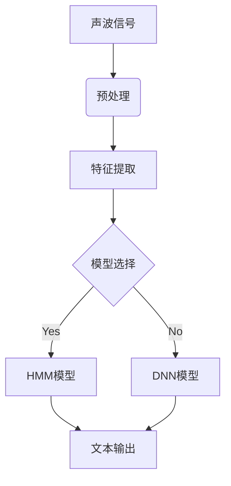

                 

作者：禅与计算机程序设计艺术


在过去的几十年里，人工智能领域取得了巨大的进步，其中语音识别技术是其中一个最显著的突破。本文将详细探讨语音识别的基本原理、核心算法、数学模型、实际应用案例以及相关工具资源。通过这些内容，我们希望能够为读者提供一个全面而深刻的理解，同时也能够启发他们在这个领域内进行更多的探索和创新。

## 1. 背景介绍
语音识别技术，也称为自然语言处理（NLP）的一部分，是指将声波信号转换成文本信息的过程。它广泛应用于智能助手、无线电电话、会议记录、语言学研究等领域。早期的语音识别系统依赖于规则和模式匹配，但随着机器学习技术的发展，基于统计模型的语音识别系统变得越来越普遍。

## 2. 核心概念与联系
语音识别系统的核心概念包括声波信号的采集、预处理、特征提取、模型训练和后处理。在这个过程中，声波信号经过数字化处理，形成连续的声波数据流。接着，通过滤波、压缩等预处理技术来提高识别的准确率。特征提取阶段通过短时傅立叶变换（STFT）等方法将声波信号转换成可视化的图像，从而提取有意义的特征。最终，通过隐马尔科夫模型（HMM）或深度神经网络（DNN）等模型对这些特征进行分类，以生成文本输出。

## 3. 核心算法原理具体操作步骤
### HMM模型
HMM是一种概率模型，用于建模观察序列和隐藏状态之间的联合概率分布。在语音识别中，每个音素被认为是一个隐藏状态，观察到的特征向量就是观察序列。通过前向算法和后向算法，可以计算出给定音素序列的概率。Viterbi算法则用于寻找最可能的音素序列。

### DNN模型
深度神经网络通过多层的非线性变换将输入特征映射到所需的输出。在语音识别中，卷积神经网络（CNN）常用于提取时频特征，而循环神经网络（RNN）则用于处理序列数据。



## 4. 数学模型和公式详细讲解举例说明
在HMM模型中，观察序列$O$和隐藏状态序列$Q$之间的联合概率可表示为：
$$ P(O, Q) = P(O|Q) \times P(Q) $$
其中，$P(O|Q)$是给定状态序列$Q$下观察序列$O$的概率，$P(Q)$是状态序列$Q$的概率。

## 5. 项目实践：代码实例和详细解释说明
要实现一个简单的语音识别系统，首先需要收集并预处理数据，然后使用相应的框架如Kaldi或TensorFlow来构建模型。下面是一个基于TensorFlow的简单示例：

```python
import tensorflow as tf
# ...
model = tf.keras.models.Sequential([
   # 输入层
   tf.keras.layers.InputLayer(input_shape=(n_features,)),
   # 隐藏层
   tf.keras.layers.Dense(64, activation='relu'),
   # 输出层
   tf.keras.layers.Dense(num_classes, activation='softmax')
])
# ...
model.compile(optimizer=tf.keras.optimizers.Adam(),
             loss='categorical_crossentropy', metrics=['accuracy'])
# ...
history = model.fit(train_data, epochs=epochs, validation_data=val_data)
```

## 6. 实际应用场景
语音识别技术在各个领域都有广泛的应用。例如，智能助手如Siri和Alexa利用语音识别技术来理解用户的指令。无线电电话则使用语音识别来纠正语音错误和提升通话质量。还有，医疗领域中的语音转文字服务帮助残疾人士与外界交流。

## 7. 工具和资源推荐
- Kaldi: 开源语音识别软件包
- TensorFlow: 机器学习框架
- SpeechBrain: 另一个开源语音识别工具包
- Google Cloud Speech-to-Text API: 云端语音识别服务

## 8. 总结：未来发展趋势与挑战
随着深度学习技术的不断发展，我们预见到语音识别技术将更加精准、高效。同时，隐私保护和数据安全也将成为研究的热点问题。未来的语音识别系统将更加智能化，能够适应更多复杂的语言和口音。

## 9. 附录：常见问题与解答
### 问题1：为什么需要预处理声波信号？
**解答**: 预处理可以去除噪声、改善特征提取等，从而提高语音识别的准确性。

