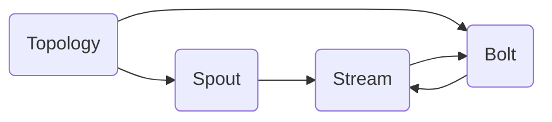

# Storm原理与代码实例讲解

## 1. 背景介绍

### 1.1 大数据处理的挑战
在当今大数据时代,海量数据的实时处理已成为企业面临的重大挑战。传统的批处理模式难以满足实时性要求,而Storm作为一个分布式实时计算系统应运而生。

### 1.2 Storm的诞生
Storm由Twitter的BackType团队开发,于2011年开源,2014年成为Apache顶级项目。它为实时数据流处理提供了一套完整的解决方案,可应用于实时分析、在线机器学习、连续计算等领域。

### 1.3 Storm的应用现状
目前Storm已被众多互联网公司广泛应用,如Twitter、阿里巴巴、雅虎等,特别适合处理高并发、低延迟的实时数据流。

## 2. 核心概念与联系

### 2.1 Topology（拓扑）
Topology是Storm中的一个抽象概念,代表"计算任务"。它是Spout和Bolt的集合,通过Stream将它们连接成一个拓扑结构。

### 2.2 Stream（流）
Stream是Storm中的核心数据结构,由一系列连续的Tuple序列组成。每个Tuple可包含一个或多个键值对。Stream在Spout和Bolt之间传递。

### 2.3 Spout（数据源）
Spout是Topology的消息源,负责从外部数据源读取数据,并将其封装成Stream发射出去。常见的Spout包括KafkaSpout、TwitterSpout等。

### 2.4 Bolt（处理单元）
Bolt是Stream的处理单元,它从一个或多个Stream中接收数据,执行转换操作,并可将结果发送给下一个Bolt。Bolt可以执行过滤、聚合、函数操作、数据库操作等。

### 2.5 核心概念关系图


## 3. 核心算法原理具体操作步骤

### 3.1 并行度与任务分配
Storm采用并行计算,每个Spout和Bolt都可以指定并行度,即同时处理一个组件的线程数。Storm根据并行度将Tuple分配给具体的Task,实现负载均衡。

### 3.2 数据分组与流分组策略
为控制Tuple在Bolt之间的流向,Storm提供了分组策略:
- Shuffle Grouping:随机分组,负载均衡
- Fields Grouping:按字段分组,保证相同字段值进入同一Task
- All Grouping:广播发送
- Global Grouping:所有Tuple进入同一Task
- None Grouping:不关心分组方式,等同于Shuffle

### 3.3 数据可靠性保证
Storm通过Acker机制确保数据处理的可靠性。Spout在发射一个Tuple时,会为其生成一个MessageID。当Tuple被Bolt成功处理时,会向Acker发送确认信息。如果在超时时间内没收到全部确认,则Spout会重新发射该Tuple。

### 3.4 数据处理算子
Storm提供了丰富的内置算子,如基础的Filter、Map、FlatMap等,聚合类的ReduceByKey、CountByKey等,还支持自定义算子,以满足复杂的计算逻辑。

## 4. 数学模型和公式详细讲解举例说明

### 4.1 Shuffle Grouping的数学模型
Shuffle Grouping的本质是一个随机过程,其数学模型可用概率论来描述。假设有 $n$ 个Task,每个Tuple以相等的概率 $p=\frac{1}{n}$ 被发送到每个Task。从数学期望的角度看,每个Task将接收 $\frac{m}{n}$ 个Tuple,其中 $m$ 为Tuple总数。

### 4.2 Fields Grouping的模运算
Fields Grouping根据指定字段的哈希值将Tuple路由到对应的Task。设有 $n$ 个Task,字段值为 $x$ 的Tuple将被发送到第 $i$ 个Task:

$$i = hash(x) \bmod n$$

其中 $hash(x)$ 为字段值的哈希函数,通常采用一致性哈希以获得更好的负载均衡。这保证了具有相同字段值的Tuple总是被发送到同一个Task。

## 5. 项目实践：代码实例和详细解释说明

下面通过一个词频统计的例子,展示Storm的基本用法。

### 5.1 创建Topology
```java
TopologyBuilder builder = new TopologyBuilder();
builder.setSpout("spout", new SentenceSpout(), 1);
builder.setBolt("split", new SplitSentenceBolt(), 4).shuffleGrouping("spout");
builder.setBolt("count", new WordCountBolt(), 4).fieldsGrouping("split", new Fields("word"));
```
这里创建了一个包含一个Spout和两个Bolt的Topology。SentenceSpout发射句子,SplitSentenceBolt将句子切分为单词并随机分发,WordCountBolt对单词进行计数。

### 5.2 实现Spout
```java
public class SentenceSpout extends BaseRichSpout {
    private SpoutOutputCollector collector;
    private String[] sentences = {...};
    private int index = 0;
    
    public void open(Map conf, TopologyContext context, SpoutOutputCollector collector) {
        this.collector = collector;
    }
    
    public void nextTuple() {
        String sentence = sentences[index];
        collector.emit(new Values(sentence));
        index++;
        if (index >= sentences.length) {
            index = 0;
        }
        Thread.sleep(1);
    }
    
    public void declareOutputFields(OutputFieldsDeclarer declarer) {
        declarer.declare(new Fields("sentence"));
    }
}
```
SentenceSpout在open方法中初始化了SpoutOutputCollector,nextTuple方法中周期性地发射句子,通过declareOutputFields声明输出的字段。

### 5.3 实现SplitSentenceBolt
```java
public class SplitSentenceBolt extends BaseRichBolt {
    private OutputCollector collector;
        
    public void prepare(Map conf, TopologyContext context, OutputCollector collector) {
        this.collector = collector;
    }
    
    public void execute(Tuple tuple) {
        String sentence = tuple.getStringByField("sentence");
        for(String word: sentence.split(" ")) {
            collector.emit(new Values(word));
        }
    }
        
    public void declareOutputFields(OutputFieldsDeclarer declarer) {
        declarer.declare(new Fields("word"));
    }
}
```
SplitSentenceBolt在execute方法中接收句子,并将其拆分为单词发送出去。prepare方法和declareOutputFields与Spout类似。

### 5.4 实现WordCountBolt
```java
public class WordCountBolt extends BaseRichBolt {
    private OutputCollector collector;
    private Map<String, Integer> counts = new HashMap<>();
    
    public void prepare(Map conf, TopologyContext context, OutputCollector collector) {
        this.collector = collector;
    }
    
    public void execute(Tuple tuple) {
        String word = tuple.getStringByField("word");
        Integer count = counts.get(word);
        if (count == null)
            count = 0;
        count++;
        counts.put(word, count);
        collector.emit(new Values(word, count));
    }
    
    public void declareOutputFields(OutputFieldsDeclarer declarer) {
        declarer.declare(new Fields("word", "count"));
    }
}
```
WordCountBolt在内存中维护了一个HashMap用于统计词频,execute方法中根据单词查询并更新计数,将结果发送出去。

## 6. 实际应用场景

Storm 在实际生产环境中有非常广泛的应用,下面列举几个典型场景:

### 6.1 实时日志分析
网站的点击流日志、服务器系统日志等可以通过Storm实时处理,进行访问统计、异常检测等分析,及时发现问题。

### 6.2 实时推荐
电商网站可利用Storm对用户的浏览、购买行为进行实时分析,更新用户画像,给出实时的个性化推荐。

### 6.3 金融风控
银行、证券等金融机构利用Storm对交易数据进行实时计算,结合规则或机器学习模型,实现欺诈检测、风险预警等功能。

### 6.4 物联网数据处理
工业设备、车联网等物联网场景产生海量的传感器数据,Storm可以对其进行实时的清洗、统计、预测性维护等处理。

## 7. 工具和资源推荐

### 7.1 官方文档
Storm的官方网站 http://storm.apache.org/ 提供了非常完善的文档,包括教程、概念解释、API文档等。

### 7.2 Storm UI
Storm提供了一个UI组件,可以实时查看Topology的运行状态、Spout和Bolt的执行统计信息等,是调试和监控的利器。

### 7.3 集成开发工具
大多数IDE如IntelliJ IDEA、Eclipse都提供了Storm的开发插件,方便编写和调试Storm Topology。

### 7.4 第三方库
许多第三方库如storm-kafka、storm-hdfs、storm-hbase等,使得Storm与其他大数据组件的集成更加便捷。

### 7.5 社区资源
Github上有许多Storm的示例项目,用于学习参考。Storm的邮件列表 user@storm.apache.org 是交流和求助的好去处。

## 8. 总结：未来发展趋势与挑战

Storm作为流式计算领域的先驱,仍在不断发展:
- 与Flink、Spark Streaming的竞争推动Storm在易用性、吞吐量等方面不断优化
- 跨语言支持的改进,提供更友好的非JVM语言API
- 与云平台的进一步集成,提供更好的弹性伸缩
- 更多机器学习算法的分布式实现

同时,Storm也面临一些挑战:
- 流式SQL支持较弱,用户需要更多编程工作
- 状态管理功能仍待加强,难以支持一些有状态的复杂计算
- 反压机制有待完善,应对上下游算子性能不匹配的情况

总的来说,实时流计算在大数据时代扮演着越来越重要的角色,Storm作为该领域的重要框架,仍值得学习和应用。

## 9. 附录：常见问题与解答

### 9.1 Storm适合哪些数据量级?
Storm对数据量没有限制,主要取决于集群的大小。当数据量增大时,可通过增加资源来提升性能。

### 9.2 Storm的容错机制是怎样的?
Storm通过Acker机制保证数据处理的可靠性。如果一个Tuple在一定时间内没有被完全处理,Spout会重新发射它。另外,Supervisor会检测Worker的心跳,如果Worker挂掉会自动重启。

### 9.3 Storm的吞吐量如何?
Storm的单节点吞吐量可达到每秒几十万条消息。整个Topology的吞吐量取决于Spout、Bolt的并行度设置。一般通过Benchmark找出最佳的并行度。

### 9.4 Storm支持exactly-once语义吗?
Storm默认保证at-least-once语义,即每个消息至少被处理一次。通过Trident以及与事务性存储系统结合,Storm也可以支持exactly-once语义,即每个消息恰好被处理一次。

### 9.5 Storm与Kafka如何集成?
Storm提供了storm-kafka组件,包含了KafkaSpout,可以很方便地从Kafka读取数据。同时,Bolt处理的结果也可以写回Kafka,forming a complete pipeline.

作者：禅与计算机程序设计艺术 / Zen and the Art of Computer Programming