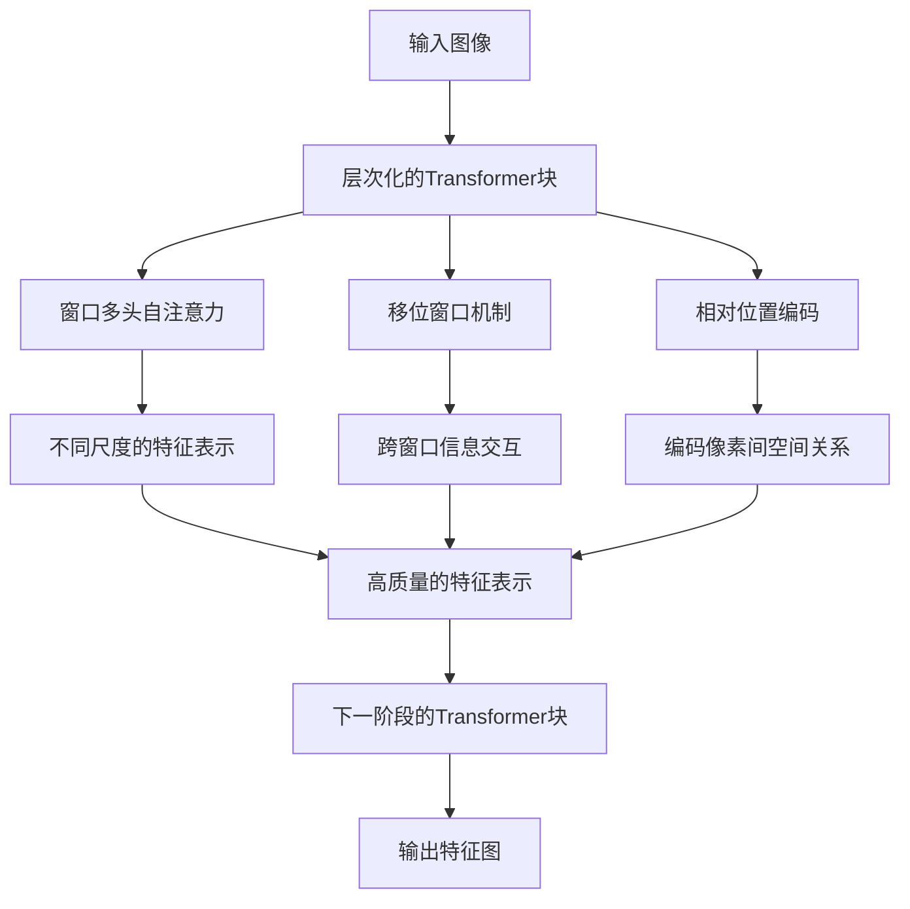

# Swin Transformer原理与代码实例讲解

## 1. 背景介绍
### 1.1 Transformer的发展历程
#### 1.1.1 Transformer的诞生
#### 1.1.2 Transformer在计算机视觉领域的应用
#### 1.1.3 Vision Transformer的提出
### 1.2 Swin Transformer的提出背景
#### 1.2.1 Vision Transformer的局限性
#### 1.2.2 Swin Transformer的创新点
#### 1.2.3 Swin Transformer的优势

## 2. 核心概念与联系
### 2.1 Transformer的核心概念
#### 2.1.1 自注意力机制
#### 2.1.2 多头注意力
#### 2.1.3 位置编码
### 2.2 Swin Transformer的核心概念
#### 2.2.1 层次化的Transformer块
#### 2.2.2 移位窗口机制
#### 2.2.3 相对位置编码
### 2.3 Swin Transformer与其他模型的联系
#### 2.3.1 与CNN的比较
#### 2.3.2 与Vision Transformer的比较
#### 2.3.3 与其他Transformer变体的比较

## 3. 核心算法原理具体操作步骤
### 3.1 Swin Transformer的整体架构
### 3.2 层次化的Transformer块
#### 3.2.1 窗口多头自注意力
#### 3.2.2 移位窗口机制
#### 3.2.3 相对位置编码
### 3.3 Patch Merging
### 3.4 Swin Transformer的前向传播过程

## 4. 数学模型和公式详细讲解举例说明
### 4.1 自注意力机制的数学表示
### 4.2 多头注意力的数学表示
### 4.3 相对位置编码的数学表示
### 4.4 Swin Transformer的数学模型

## 5. 项目实践：代码实例和详细解释说明
### 5.1 Swin Transformer的PyTorch实现
#### 5.1.1 模型定义
#### 5.1.2 窗口注意力机制的实现
#### 5.1.3 移位窗口机制的实现
#### 5.1.4 相对位置编码的实现
#### 5.1.5 Patch Merging的实现
### 5.2 在图像分类任务上的应用
#### 5.2.1 数据集准备
#### 5.2.2 模型训练
#### 5.2.3 模型评估
### 5.3 在目标检测任务上的应用
#### 5.3.1 数据集准备
#### 5.3.2 模型训练
#### 5.3.3 模型评估

## 6. 实际应用场景
### 6.1 图像分类
### 6.2 目标检测
### 6.3 语义分割
### 6.4 实例分割
### 6.5 人体姿态估计
### 6.6 医学图像分析

## 7. 工具和资源推荐
### 7.1 代码实现
#### 7.1.1 官方实现
#### 7.1.2 第三方实现
### 7.2 预训练模型
### 7.3 数据集
### 7.4 论文和教程

## 8. 总结：未来发展趋势与挑战
### 8.1 Swin Transformer的优势总结
### 8.2 Swin Transformer面临的挑战
### 8.3 未来的研究方向
#### 8.3.1 模型效率的提升
#### 8.3.2 与其他视觉任务的结合
#### 8.3.3 更大规模的预训练模型

## 9. 附录：常见问题与解答
### 9.1 Swin Transformer与Vision Transformer的区别是什么？
### 9.2 Swin Transformer为什么采用层次化的设计？
### 9.3 移位窗口机制的作用是什么？
### 9.4 相对位置编码与绝对位置编码有何不同？
### 9.5 如何在其他视觉任务中应用Swin Transformer？

---

Swin Transformer是计算机视觉领域近期提出的一种基于Transformer的新型网络架构,旨在克服Vision Transformer在处理高分辨率图像时存在的局限性。Swin Transformer通过引入层次化的Transformer块、移位窗口机制和相对位置编码等创新设计,在保持Transformer强大建模能力的同时,显著提升了模型在各种视觉任务上的性能表现。

Swin Transformer的核心思想是将输入图像划分为不重叠的窗口,并在每个窗口内应用多头自注意力机制。与标准的Transformer不同,Swin Transformer采用了层次化的设计,即在网络的不同阶段使用不同大小的窗口和不同的注意力头数。这种设计使得模型能够在不同尺度上捕捉图像的局部和全局信息,从而提高了特征表示的质量。

为了进一步增强不同窗口之间的信息交互,Swin Transformer引入了移位窗口机制。在相邻的两个Transformer块之间,窗口的划分方式会发生偏移,使得每个窗口能够与其周围的窗口进行信息融合。这种机制有效地扩大了每个窗口的感受野,使得模型能够更好地捕捉图像中的长程依赖关系。

此外,Swin Transformer还采用了相对位置编码来替代标准Transformer中的绝对位置编码。相对位置编码通过计算每个像素与其所在窗口内其他像素的相对位置关系,来编码像素之间的空间信息。这种方式不仅减少了位置编码的参数量,而且使得模型具有更好的平移不变性和泛化能力。

下面是Swin Transformer的核心概念和原理的Mermaid流程图:

在实际应用中,Swin Transformer已经在多个视觉任务上取得了显著的性能提升。例如,在ImageNet图像分类任务上,Swin Transformer以更少的参数量和计算量超越了许多先进的CNN模型和Vision Transformer变体。在COCO目标检测和实例分割任务上,以Swin Transformer为骨干网络的检测器也达到了业界领先的精度。

为了便于读者理解和实践,本文提供了Swin Transformer的PyTorch代码实现示例。通过详细的代码解释和注释,读者可以深入了解Swin Transformer的各个组件是如何实现的,并学习如何将其应用于自己的项目中。此外,本文还总结了Swin Transformer在不同视觉任务中的应用方法,为读者提供了实践指导。

展望未来,Swin Transformer作为一种全新的视觉建模范式,还有许多值得探索的研究方向。如何进一步提高模型的计算效率、如何将Swin Transformer扩展到更多的视觉任务中、如何构建更大规模的预训练模型等,都是值得关注的问题。随着研究的不断深入,相信Swin Transformer及其衍生模型将在计算机视觉领域发挥越来越重要的作用。

总之,Swin Transformer是一个具有里程碑意义的视觉模型,它开启了Transformer在计算机视觉领域的新纪元。通过本文的讲解,希望读者能够全面了解Swin Transformer的原理、实现和应用,并为进一步的研究和实践提供参考。让我们共同期待Swin Transformer在计算机视觉领域带来更多惊喜和突破!

作者：禅与计算机程序设计艺术 / Zen and the Art of Computer Programming