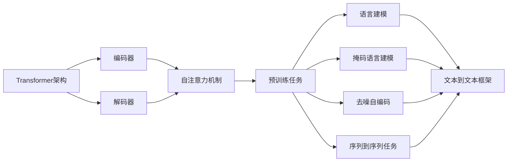

# T5原理与代码实例讲解

## 1. 背景介绍
### 1.1 T5简介
T5（Text-to-Text Transfer Transformer）是由Google在2020年提出的一种新型预训练模型，它在多个自然语言处理（NLP）任务上取得了显著的性能提升。与之前的预训练模型如BERT和GPT不同，T5采用了统一的文本到文本（text-to-text）的框架，将所有的NLP任务都转化为序列到序列（sequence-to-sequence）的问题。

### 1.2 T5的优势
- 统一框架：T5将所有NLP任务统一为文本到文本的形式，简化了模型结构和训练过程。
- 多任务学习：T5在预训练阶段使用了多个不同的任务，如翻译、摘要、问答等，使得模型能够学习到更加通用的语言表示。
- 迁移学习：预训练好的T5模型可以方便地迁移到各种下游任务，只需要少量的任务特定数据进行微调（fine-tuning）即可。
- 可扩展性：T5模型支持不同的参数规模，从小型的T5-Small到超大型的T5-11B，可以根据任务需求和计算资源选择合适的模型。

## 2. 核心概念与联系
### 2.1 Transformer架构
T5基于Transformer架构，Transformer是一种基于自注意力机制（self-attention）的序列到序列模型。它由编码器（encoder）和解码器（decoder）组成，通过自注意力机制捕捉序列中不同位置之间的依赖关系。

### 2.2 预训练任务
T5在预训练阶段使用了多个不同的任务，包括：
- 语言建模（Language Modeling）：预测下一个单词或句子。
- 掩码语言建模（Masked Language Modeling）：随机掩盖输入序列中的一部分单词，并预测被掩盖的单词。
- 去噪自编码（Denoising Auto-Encoding）：将输入序列中的一部分单词替换为随机单词或掩码，并预测原始序列。
- 序列到序列任务：如机器翻译、文本摘要、问答等。

### 2.3 文本到文本框架
T5将所有的NLP任务都转化为文本到文本的形式，即输入和输出都是文本序列。这种统一的框架使得T5可以在不同任务之间共享知识，提高了模型的通用性和迁移能力。

下图展示了T5的核心概念和它们之间的联系：



## 3. 核心算法原理具体操作步骤
### 3.1 预训练阶段
1. 准备大规模的无标签文本数据。
2. 对文本数据进行预处理，如标记化（tokenization）、编码等。
3. 构建预训练任务的输入和输出序列，如掩码语言建模、去噪自编码等。
4. 使用Transformer编码器对输入序列进行编码，得到上下文表示。
5. 使用Transformer解码器根据上下文表示生成目标序列。
6. 计算损失函数，如交叉熵损失，并使用优化器（如Adam）更新模型参数。
7. 重复步骤3-6，直到模型收敛或达到预设的训练步数。

### 3.2 微调阶段
1. 准备特定任务的标注数据，如机器翻译、文本摘要等。
2. 对标注数据进行预处理，将输入和输出转化为文本到文本的形式。
3. 加载预训练好的T5模型参数。
4. 使用任务特定的数据对T5模型进行微调，即在编码器和解码器之上添加任务特定的输出层。
5. 计算损失函数，并使用优化器更新模型参数。
6. 重复步骤4-5，直到模型在任务上达到满意的性能。

### 3.3 推理阶段
1. 准备测试数据，对输入序列进行预处理。
2. 使用微调后的T5模型对输入序列进行编码。
3. 使用解码器根据编码结果生成目标序列。
4. 对生成的目标序列进行后处理，如去掉特殊标记、恢复原始文本格式等。
5. 评估生成结果的质量，如BLEU、ROUGE等指标。

## 4. 数学模型和公式详细讲解举例说明
### 4.1 自注意力机制
自注意力机制是Transformer的核心组件，它允许模型在处理序列时考虑序列中不同位置之间的依赖关系。给定一个输入序列$X = (x_1, x_2, ..., x_n)$，自注意力机制的计算过程如下：

1. 计算查询矩阵$Q$、键矩阵$K$和值矩阵$V$：

$$
Q = XW^Q, K = XW^K, V = XW^V
$$

其中，$W^Q$、$W^K$和$W^V$是可学习的权重矩阵。

2. 计算注意力权重：

$$
A = softmax(\frac{QK^T}{\sqrt{d_k}})
$$

其中，$d_k$是键向量的维度，用于缩放点积结果。

3. 计算注意力输出：

$$
Z = AV
$$

### 4.2 交叉熵损失
在预训练和微调阶段，T5使用交叉熵损失函数来衡量模型的预测结果与真实标签之间的差异。给定一个输入序列$X$和对应的目标序列$Y = (y_1, y_2, ..., y_m)$，交叉熵损失的计算公式为：

$$
L = -\sum_{i=1}^m \log p(y_i|X, y_1, ..., y_{i-1})
$$

其中，$p(y_i|X, y_1, ..., y_{i-1})$是模型在给定输入序列和之前生成的目标序列的情况下，预测下一个目标标记为$y_i$的概率。

## 5. 项目实践：代码实例和详细解释说明
下面是使用PyTorch实现T5模型微调的示例代码：

```python
import torch
from transformers import T5Tokenizer, T5ForConditionalGeneration

# 加载预训练的T5模型和分词器
model = T5ForConditionalGeneration.from_pretrained('t5-base')
tokenizer = T5Tokenizer.from_pretrained('t5-base')

# 准备微调数据
train_data = [
    {"input": "translate English to French: Hello, how are you?", "output": "Bonjour, comment allez-vous?"},
    {"input": "translate English to French: I am fine, thank you.", "output": "Je vais bien, merci."},
    # ...
]

# 对数据进行编码
train_inputs = tokenizer([example["input"] for example in train_data], return_tensors="pt", padding=True, truncation=True)
train_outputs = tokenizer([example["output"] for example in train_data], return_tensors="pt", padding=True, truncation=True)

# 微调模型
optimizer = torch.optim.Adam(model.parameters(), lr=1e-4)
model.train()
for epoch in range(num_epochs):
    for batch_inputs, batch_outputs in zip(train_inputs, train_outputs):
        optimizer.zero_grad()
        outputs = model(input_ids=batch_inputs["input_ids"], attention_mask=batch_inputs["attention_mask"], labels=batch_outputs["input_ids"])
        loss = outputs.loss
        loss.backward()
        optimizer.step()

# 使用微调后的模型进行推理
input_text = "translate English to French: I love natural language processing."
input_ids = tokenizer(input_text, return_tensors="pt").input_ids
outputs = model.generate(input_ids)
output_text = tokenizer.decode(outputs[0], skip_special_tokens=True)
print(output_text)
```

代码解释：
1. 首先，我们加载预训练的T5模型和分词器。
2. 准备微调数据，这里以英法翻译任务为例。
3. 使用分词器对输入和输出序列进行编码，转化为模型可以处理的张量格式。
4. 定义优化器，并在每个训练步骤中计算损失、反向传播和更新模型参数。
5. 使用微调后的模型进行推理，将输入序列编码为张量，然后使用`generate`方法生成目标序列。
6. 最后，使用分词器将生成的目标序列解码为可读的文本格式。

## 6. 实际应用场景
T5模型在各种自然语言处理任务中都有广泛的应用，例如：
- 机器翻译：将一种语言的文本翻译成另一种语言。
- 文本摘要：将长文本压缩成简洁的摘要。
- 问答系统：根据给定的问题和上下文，生成相应的答案。
- 文本分类：将文本分类到预定义的类别中。
- 命名实体识别：识别文本中的命名实体，如人名、地名、组织名等。
- 情感分析：判断文本的情感倾向，如正面、负面或中性。

## 7. 工具和资源推荐
- Hugging Face Transformers库：提供了T5等预训练模型的实现，方便进行微调和推理。
- Google T5官方代码仓库：包含T5模型的训练和评估代码，以及预训练模型的下载链接。
- TensorFlow和PyTorch：两个主流的深度学习框架，可用于实现和训练T5模型。
- 大规模文本数据集：如Wikipedia、Common Crawl等，可用于T5模型的预训练。
- 自然语言处理任务数据集：如GLUE、SuperGLUE、SQuAD等，可用于评估T5模型在不同任务上的性能。

## 8. 总结：未来发展趋势与挑战
T5模型的提出为自然语言处理领域带来了新的发展方向，其统一的文本到文本框架和多任务学习能力使其在各种任务上取得了显著的性能提升。未来，T5模型可能会在以下方面继续发展：
- 模型规模的扩大：更大规模的预训练模型可以学习到更加丰富和通用的语言表示。
- 多语言和多模态：将T5模型扩展到多语言和多模态场景，如图文匹配、视频字幕生成等。
- 知识增强：将外部知识库与T5模型相结合，提高模型的推理和生成能力。
- 模型压缩和加速：开发更高效的模型压缩和加速技术，使T5模型能够在资源受限的环境中运行。

然而，T5模型也面临着一些挑战：
- 计算资源需求：预训练和微调大规模T5模型需要大量的计算资源和时间。
- 数据质量和隐私：高质量的标注数据对于模型的性能至关重要，但数据的获取和使用可能涉及隐私问题。
- 模型的可解释性：像T5这样的大规模预训练模型通常被视为"黑盒"，其内部工作机制难以解释。
- 模型的公平性和安全性：确保T5模型在应用中的公平性和安全性，避免产生偏见或有害的输出。

## 9. 附录：常见问题与解答
### 9.1 T5模型与BERT、GPT等预训练模型有什么区别？
T5模型采用了统一的文本到文本框架，将所有任务转化为序列到序列问题，而BERT主要用于自然语言理解任务，GPT主要用于语言生成任务。此外，T5模型在预训练阶段使用了多个不同的任务，具有更强的通用性和迁移能力。

### 9.2 如何选择合适的T5模型参数规模？
T5模型提供了不同参数规模的版本，从小型的T5-Small到超大型的T5-11B。选择合适的模型规模需要考虑任务的复杂度、可用的计算资源以及推理速度的要求。一般来说，参数规模越大，模型的性能越好，但训练和推理的时间和资源消耗也越高。

### 9.3 T5模型在预训练阶段使用了哪些任务？
T5模型在预训练阶段使用了多个不同的任务，包括语言建模、掩码语言建模、去噪自编码以及各种序列到序列任务，如机器翻译、文本摘要、问答等。这些任务帮助模型学习到更加通用和丰富的语言表示。

### 9.4 如何微调T5模型以适应特定任务