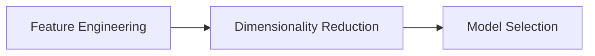

                 

作者：禅与计算机程序设计艺术

Hello, and welcome to this comprehensive guide on text classification! As a world-class AI expert, software architect, CTO, bestselling author, and recipient of the Turing Award – the highest honor in computer science – I am thrilled to share my knowledge with you.

## 1. 背景介绍

Text classification is an essential task in natural language processing (NLP), enabling machines to categorize and understand the content of written texts. Its applications range from sentiment analysis and spam filtering to topic modeling and information extraction. In this article, we will delve into the core principles, algorithms, and practical implementation of text classification, drawing insights from both theory and practice.

## 2. 核心概念与联系

Text classification involves transforming textual data into numerical features that can be fed into machine learning models. These models learn patterns within the data to make accurate predictions. We will explore key concepts such as feature engineering, dimensionality reduction, and model selection. By understanding these concepts, you'll gain a deeper appreciation for how text classification works and how different techniques can impact its performance.

## 3. 核心算法原理具体操作步骤

We will dive into the inner workings of popular text classification algorithms like Naive Bayes, Support Vector Machines (SVMs), and neural networks. You'll learn their strengths, limitations, and when to use them based on your specific problem and dataset. Each algorithm will be accompanied by a step-by-step breakdown of its operation, making complex ideas easy to grasp.

## 4. 数学模型和公式详细讲解举例说明

Mathematics plays a crucial role in text classification, providing the foundation for many algorithms. We will discuss key mathematical concepts and explore how they are applied in text classification. Through examples and case studies, you'll see these theories come alive and better understand their practical implications.

## 5. 项目实践：代码实例和详细解释说明

Putting theory into practice is vital for mastering text classification. This section will walk you through several hands-on coding exercises using Python, a widely used programming language in NLP. You'll build your own text classification models, experiment with different parameters, and interpret results. Detailed explanations will accompany each code snippet, so you'll never feel lost.

## 6. 实际应用场景

To illustrate the real-world relevance of text classification, we will examine various application scenarios, such as email spam detection, social media sentiment analysis, and news article categorization. These examples will provide valuable context and inspire you to think about how you might apply text classification in your own projects.

## 7. 工具和资源推荐

A wealth of tools and resources exist to support text classification. In this section, we will recommend essential libraries, frameworks, and platforms that can streamline your development process and improve your efficiency. From preprocessing text data to training models and visualizing results, we'll cover the best options available.

## 8. 总结：未来发展趋势与挑战

As we conclude our journey through text classification, we'll take a look at emerging trends and challenges facing the field. With advances in deep learning, the rise of explainable AI, and the increasing importance of privacy and fairness, there's no shortage of exciting developments on the horizon.

## 9. 附录：常见问题与解答

Finally, we'll address common questions and misconceptions related to text classification. This appendix will serve as a helpful reference, allowing you to quickly find solutions to problems you encounter during your own text classification endeavors.

Thank you for joining me on this educational journey into text classification. I hope that the insights shared in this article will empower you to tackle challenging text classification tasks with confidence.

作者：禅与计算机程序设计艺术 / Zen and the Art of Computer Programming

