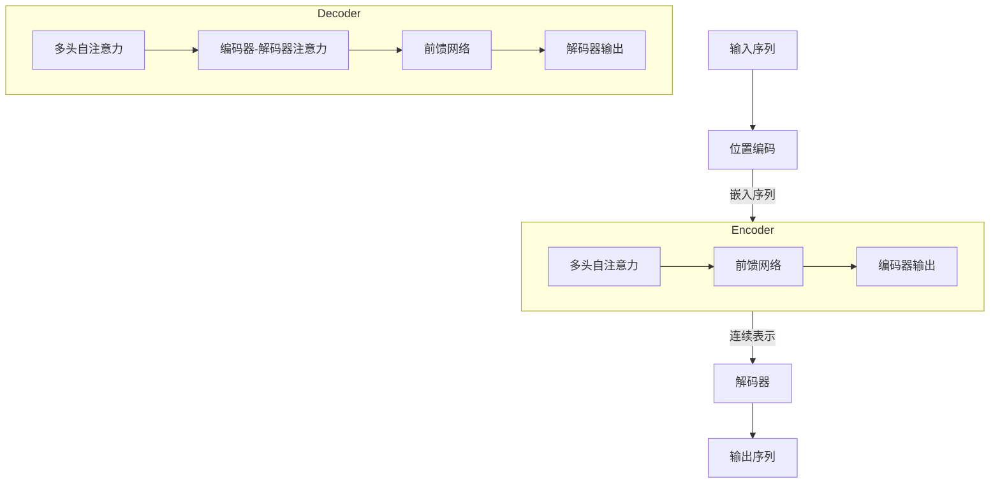

# Transformer原理与代码实战案例讲解

## 1.背景介绍

在自然语言处理(NLP)和机器学习领域,Transformer模型是一种革命性的架构,它完全依赖于注意力机制来捕捉输入序列中的长程依赖关系,从而有效地解决了传统循环神经网络(RNN)在处理长序列时存在的梯度消失和梯度爆炸问题。Transformer最初由Google的Vaswani等人在2017年提出,用于机器翻译任务,取得了出色的性能。自此,Transformer模型及其变体在NLP的各种下游任务中大放异彩,如文本生成、阅读理解、对话系统等,并逐渐扩展到计算机视觉、语音识别等其他领域。

Transformer架构的核心思想是利用自注意力机制(Self-Attention)来捕获序列中任意两个位置之间的依赖关系,从而更好地建模长期依赖。与RNN不同,Transformer完全放弃了递归结构,而是通过并行计算来处理序列数据,这使得它在训练时可以充分利用现代硬件(如GPU)的并行计算能力,从而大大提高了训练效率。此外,由于没有递归结构,Transformer也避免了RNN中的梯度消失/爆炸问题。

Transformer模型的出现不仅推动了NLP领域的发展,也为机器学习领域带来了新的研究方向和思路。本文将深入探讨Transformer的原理、关键组件、训练技巧,并通过实战案例帮助读者掌握如何使用Transformer模型解决实际问题。

## 2.核心概念与联系

### 2.1 自注意力机制(Self-Attention)

自注意力机制是Transformer的核心组件,它能够捕捉输入序列中任意两个位置之间的依赖关系。与RNN中的序列结构不同,自注意力机制通过计算查询(Query)、键(Key)和值(Value)之间的相似性来确定不同位置之间的关联程度。

在自注意力计算过程中,查询、键和值都是通过线性变换从输入序列中得到的。具体来说,对于序列中的每个位置,我们计算其与所有其他位置的相似性得分(注意力分数),然后使用这些分数对值进行加权求和,得到该位置的注意力表示。这种方式允许模型直接关注与当前位置最相关的其他位置,而不受位置之间距离的限制。

自注意力机制可以形式化表示如下:

$$\text{Attention}(Q, K, V) = \text{softmax}(\frac{QK^T}{\sqrt{d_k}})V$$

其中,$Q$表示查询矩阵,$K$表示键矩阵,$V$表示值矩阵,$d_k$是缩放因子,用于防止内积过大导致的梯度不稳定问题。

### 2.2 多头注意力(Multi-Head Attention)

为了进一步提高模型的表现力,Transformer引入了多头注意力机制。多头注意力将查询、键和值分别线性投影到不同的子空间,然后在每个子空间中执行缩放点积注意力,最后将所有子空间的注意力结果进行拼接。这种方式允许模型从不同的表示子空间中捕获不同的相关性,提高了模型对复杂关系的建模能力。

多头注意力可以表示为:

$$\text{MultiHead}(Q, K, V) = \text{Concat}(head_1, ..., head_h)W^O$$
$$\text{where } head_i = \text{Attention}(QW_i^Q, KW_i^K, VW_i^V)$$

其中,$W_i^Q$、$W_i^K$和$W_i^V$分别是查询、键和值的线性投影矩阵,$W^O$是最终的线性变换矩阵。

### 2.3 位置编码(Positional Encoding)

由于Transformer没有递归结构,因此需要一种机制来注入序列的位置信息。Transformer使用位置编码来实现这一目的。位置编码是一种将位置信息编码为向量的方法,它将被加到输入的嵌入向量中,使得模型能够区分不同位置的输入。

常用的位置编码方法是正弦位置编码,它使用不同频率的正弦函数来编码不同的位置:

$$PE_{(pos, 2i)} = \sin(pos / 10000^{2i / d_{model}})$$
$$PE_{(pos, 2i+1)} = \cos(pos / 10000^{2i / d_{model}})$$

其中,$pos$是序列位置,$i$是维度索引,$d_{model}$是嵌入维度。

### 2.4 编码器-解码器架构(Encoder-Decoder Architecture)

Transformer采用了经典的编码器-解码器架构,用于序列到序列(Seq2Seq)任务,如机器翻译。编码器将源序列映射到一个连续的表示,解码器则根据该表示生成目标序列。

编码器由多个相同的层组成,每一层包含两个子层:多头自注意力层和全连接前馈网络层。解码器也由多个相同的层组成,不同之处在于它还包含一个额外的多头交叉注意力子层,用于关注编码器的输出表示。

编码器和解码器的计算过程如下所示:

## 3.核心算法原理具体操作步骤

在了解了Transformer的核心概念后,我们来具体分析一下Transformer模型的工作原理和算法流程。

### 3.1 输入表示

对于给定的输入序列$X = (x_1, x_2, ..., x_n)$,我们首先需要将其转换为嵌入向量表示$E = (e_1, e_2, ..., e_n)$,其中$e_i$是$x_i$的嵌入向量。然后,我们将位置编码$PE$加到嵌入向量上,得到最终的输入表示$X' = E + PE$。

### 3.2 编码器

编码器由$N$个相同的层组成,每一层包含两个子层:多头自注意力子层和前馈网络子层。

1. **多头自注意力子层**

   在多头自注意力子层中,我们首先将输入$X'$分别线性投影到查询$Q$、键$K$和值$V$空间,然后计算多头注意力:

   $$\begin{aligned}
   Q &= X'W^Q \\
   K &= X'W^K \\
   V &= X'W^V \\
   \text{MultiHead}(Q, K, V) &= \text{Concat}(head_1, ..., head_h)W^O
   \end{aligned}$$

   其中,$W^Q$、$W^K$和$W^V$是可学习的线性投影矩阵,$head_i$是第$i$个注意力头,计算方式如下:

   $$head_i = \text{Attention}(QW_i^Q, KW_i^K, VW_i^V)$$

   注意力函数$\text{Attention}(\cdot)$是缩放点积注意力:

   $$\text{Attention}(Q, K, V) = \text{softmax}(\frac{QK^T}{\sqrt{d_k}})V$$

   其中,$d_k$是缩放因子,用于防止内积过大导致的梯度不稳定问题。

   最后,我们对多头注意力的结果执行残差连接和层归一化,得到该子层的输出。

2. **前馈网络子层**

   前馈网络子层包含两个全连接层,具有ReLU激活函数:

   $$\text{FFN}(x) = \max(0, xW_1 + b_1)W_2 + b_2$$

   其中,$W_1$、$W_2$、$b_1$和$b_2$是可学习的参数。同样,我们对前馈网络的输出执行残差连接和层归一化,得到该子层的输出。

经过$N$个编码器层的处理,我们得到了编码器的最终输出$C$,它将被用作解码器的输入。

### 3.3 解码器

解码器的结构与编码器类似,也由$N$个相同的层组成。每一层包含三个子层:

1. **多头自注意力子层**

   这一子层的计算方式与编码器中的多头自注意力子层相同,不同之处在于,我们需要在计算自注意力时引入掩码(mask),以确保每个位置只能关注之前的位置。

2. **编码器-解码器注意力子层**

   在这一子层中,我们计算查询向量与编码器输出$C$之间的多头注意力,以捕获输入序列和输出序列之间的依赖关系:

   $$\text{MultiHead}(Q, C, C) = \text{Concat}(head_1, ..., head_h)W^O$$
   $$\text{where } head_i = \text{Attention}(QW_i^Q, CW_i^K, CW_i^V)$$

3. **前馈网络子层**

   这一子层的计算方式与编码器中的前馈网络子层相同。

经过$N$个解码器层的处理,我们得到了解码器的最终输出$Y'$。对于序列生成任务,我们可以将$Y'$通过线性层和softmax层转换为词汇分布$P(y_t | y_1, ..., y_{t-1}, X)$,并根据该分布生成下一个词。

## 4.数学模型和公式详细讲解举例说明

在上一节中,我们介绍了Transformer的核心算法原理和具体操作步骤。现在,让我们进一步深入探讨Transformer中的数学模型和公式。

### 4.1 自注意力机制

自注意力机制是Transformer的核心组件,它能够捕捉输入序列中任意两个位置之间的依赖关系。自注意力的计算过程可以表示为:

$$\text{Attention}(Q, K, V) = \text{softmax}(\frac{QK^T}{\sqrt{d_k}})V$$

其中,$Q$表示查询矩阵,$K$表示键矩阵,$V$表示值矩阵,$d_k$是缩放因子,用于防止内积过大导致的梯度不稳定问题。

让我们用一个具体的例子来解释自注意力机制的工作原理。假设我们有一个长度为5的输入序列$X = (x_1, x_2, x_3, x_4, x_5)$,我们希望计算第三个位置$x_3$的注意力表示。

1. 首先,我们将输入序列$X$线性投影到查询$Q$、键$K$和值$V$空间,得到:

   $$\begin{aligned}
   Q &= [q_1, q_2, q_3, q_4, q_5] \\
   K &= [k_1, k_2, k_3, k_4, k_5] \\
   V &= [v_1, v_2, v_3, v_4, v_5]
   \end{aligned}$$

2. 然后,我们计算查询向量$q_3$与所有键向量$k_i$的点积,并除以缩放因子$\sqrt{d_k}$,得到注意力分数:

   $$\text{score}(q_3, k_i) = \frac{q_3 \cdot k_i}{\sqrt{d_k}}, \quad i = 1, 2, ..., 5$$

3. 将注意力分数通过softmax函数归一化,得到注意力权重:

   $$\alpha_i = \text{softmax}(\text{score}(q_3, k_i)), \quad i = 1, 2, ..., 5$$

4. 最后,我们将值向量$v_i$加权求和,得到第三个位置的注意力表示:

   $$\text{attn}(x_3) = \sum_{i=1}^5 \alpha_i v_i$$

通过这种方式,自注意力机制能够自动捕捉输入序列中不同位置之间的依赖关系,而不受位置距离的限制。

### 4.2 多头注意力

为了进一步提高模型的表现力,Transformer引入了多头注意力机制。多头注意力