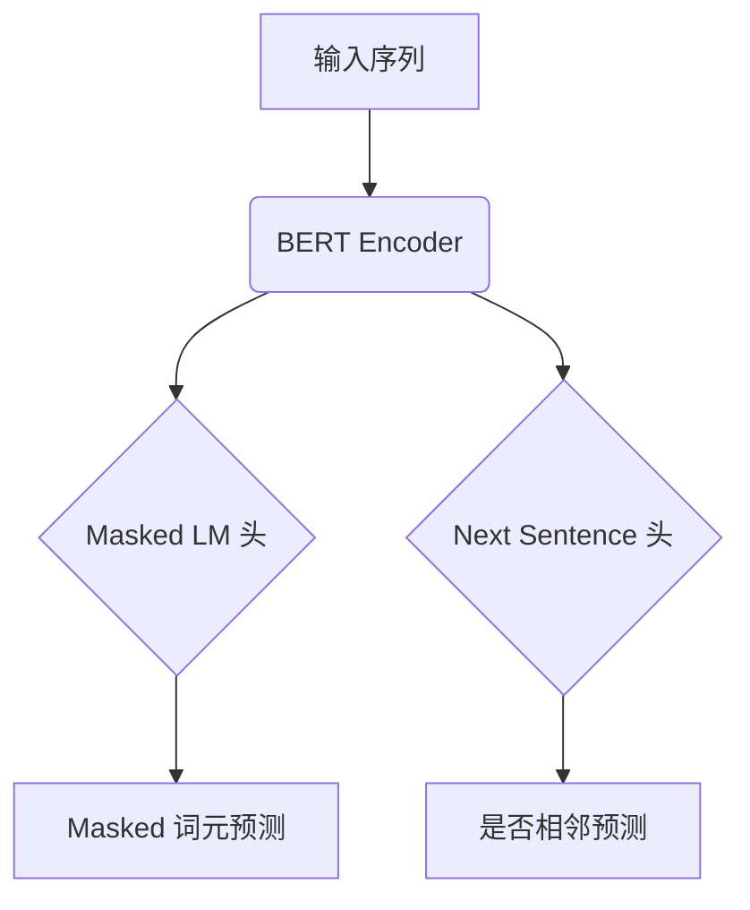
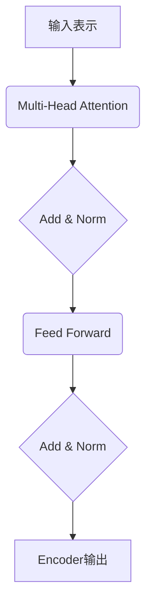

# Transformer大模型实战 BERT 的工作原理

## 1.背景介绍

随着深度学习在自然语言处理领域的不断发展,Transformer模型凭借其卓越的性能成为了语言模型的主流架构。其中,BERT(Bidirectional Encoder Representations from Transformers)是一种基于Transformer的预训练语言模型,在多项NLP任务中表现出色,成为了语言模型的新标杆。

BERT的出现源于对序列建模的需求。传统的语言模型通常是基于循环神经网络(RNN)或卷积神经网络(CNN)的单向语言模型,只能获取单向上下文信息。而BERT则采用Transformer的encoder结构,能够同时获取双向上下文信息,从而更好地理解句子的语义。

## 2.核心概念与联系

### 2.1 Transformer模型

Transformer是一种全新的基于注意力机制的序列建模架构,不再依赖RNN或CNN。它完全基于注意力机制来捕获输入和输出之间的全局依赖关系,避免了RNN的长期依赖问题。

Transformer由编码器(encoder)和解码器(decoder)组成。编码器将输入序列映射到一个连续的表示空间,解码器则从该表示空间生成输出序列。

### 2.2 BERT模型

BERT是一种基于Transformer的双向编码器表示,旨在通过预训练获得通用的语言表示,为下游NLP任务提供强大的语义表示。它包含以下核心思想:

1. **Masked Language Model(MLM)**: 对部分词元进行遮蔽,模型需要根据上下文预测被遮蔽的词元。这种双向预训练能捕获更丰富的上下文信息。

2. **Next Sentence Prediction(NSP)**: 判断两个句子是否相邻,用于捕获句子间的关系。

3. **Transformer Encoder**: BERT使用了Transformer的编码器结构,通过多头注意力机制捕获长距离依赖关系。

BERT在大规模语料上进行了预训练,获得了强大的语义表示能力。通过在特定任务上进行微调(fine-tuning),BERT可以显著提升下游任务的性能。



## 3.核心算法原理具体操作步骤

### 3.1 输入表示

BERT接收一个序列作为输入,该序列由词元(WordPiece)组成。每个序列以特殊的[CLS]词元开头,用于表示整个序列,并以[SEP]词元分隔句子。

对于给定词元,BERT将其映射到对应的词元嵌入、位置嵌入和句子嵌入之和,作为该词元的输入表示。

### 3.2 Multi-Head Attention

BERT使用了Transformer中的Multi-Head Attention机制。对于每个词元,注意力机制会计算其与输入序列中所有其他词元的注意力权重,并将加权求和作为该词元的表示。

Multi-Head Attention将注意力机制运行多次(多头),每次使用不同的注意力权重投影,最后将多头注意力的结果拼接起来,增强了表示能力。

### 3.3 Position-wise Feed-Forward Network

每个子层的输出会通过一个全连接的前馈网络,对每个位置上的表示进行相同的操作,为模型增加非线性能力。

### 3.4 编码器层

BERT使用了Transformer的编码器结构,包含多个相同的编码器层。每个编码器层由两个子层组成:

1. **Multi-Head Attention 子层**: 对输入执行Self-Attention操作。
2. **Position-wise Feed-Forward 子层**: 对上一步的输出执行全连接前馈网络操作。

每个子层的输出都会进行残差连接,并执行层归一化(Layer Normalization),以防止梯度消失或爆炸。



### 3.5 预训练

BERT在大规模语料上进行了两种无监督预训练任务:

1. **Masked LM(MLM)**: 随机遮蔽输入序列中的15%词元,模型需要根据上下文预测被遮蔽的词元。

2. **Next Sentence Prediction(NSP)**: 判断两个句子是否相邻,捕获句子间的关系。

通过这两种预训练任务,BERT可以学习到通用的语言表示,为下游任务提供强大的语义表示能力。

### 3.6 微调

在完成预训练后,BERT可以通过在特定任务上进行微调(fine-tuning)来适应该任务。微调过程中,BERT的大部分参数保持不变,只对最后一层添加一个输出层,并根据任务目标对该层进行训练。

由于BERT已经学习到了通用的语言表示,只需要对少量参数进行微调,就可以快速适应新任务,大幅提高了下游任务的性能。

## 4.数学模型和公式详细讲解举例说明

### 4.1 注意力机制(Attention Mechanism)

注意力机制是BERT中的核心机制,用于捕获输入和输出之间的长距离依赖关系。给定一个查询(query)向量$q$和一组键(key)-值(value)对 $(k_i, v_i)$,注意力机制会计算查询与每个键的相似性,并据此分配注意力权重,最后将值向量加权求和作为注意力输出:

$$\mathrm{Attention}(Q, K, V) = \mathrm{softmax}\left(\frac{QK^T}{\sqrt{d_k}}\right)V$$

其中,$d_k$是缩放因子,用于防止内积过大导致的梯度饱和。

在Multi-Head Attention中,注意力机制会运行多次,每次使用不同的线性投影,最后将多头注意力的结果拼接起来:

$$\begin{aligned}
\mathrm{MultiHead}(Q, K, V) &= \mathrm{Concat}(\mathrm{head}_1, \dots, \mathrm{head}_h)W^O\\
\mathrm{where\ head}_i &= \mathrm{Attention}(QW_i^Q, KW_i^K, VW_i^V)
\end{aligned}$$

其中,$W_i^Q, W_i^K, W_i^V$是不同头的线性投影矩阵,$W^O$是最终的线性变换矩阵。

### 4.2 位置编码(Positional Encoding)

由于Transformer没有捕获序列顺序的内在机制,因此需要一种位置编码方式来注入序列顺序信息。BERT采用了sine和cosine函数对词元位置进行编码:

$$\begin{aligned}
\mathrm{PE}_{(pos, 2i)} &= \sin\left(\frac{pos}{10000^{2i/d_{\mathrm{model}}}}\right)\\
\mathrm{PE}_{(pos, 2i+1)} &= \cos\left(\frac{pos}{10000^{2i/d_{\mathrm{model}}}}\right)
\end{aligned}$$

其中,$pos$是词元在序列中的位置,$i$是维度索引。这种编码方式可以让模型更容易学习相对位置,而不是绝对位置。

### 4.3 层归一化(Layer Normalization)

为了防止梯度消失或爆炸,BERT在每个子层的输出上执行层归一化(Layer Normalization)操作:

$$y = \frac{x - \mathbb{E}[x]}{\sqrt{\mathrm{Var}[x] + \epsilon}} * \gamma + \beta$$

其中,$\gamma$和$\beta$是可学习的缩放和偏移参数,用于保持表示的平均值和方差在合理范围内。

## 5.项目实践:代码实例和详细解释说明

以下是使用Hugging Face的Transformers库对BERT进行微调的Python代码示例,用于文本分类任务:

```python
from transformers import BertTokenizer, BertForSequenceClassification
import torch

# 加载预训练模型和分词器
model = BertForSequenceClassification.from_pretrained('bert-base-uncased')
tokenizer = BertTokenizer.from_pretrained('bert-base-uncased')

# 示例输入
text = "This is a great movie!"
encoding = tokenizer.encode_plus(
    text,
    add_special_tokens=True,
    return_tensors='pt'
)

# 前向传播
output = model(**encoding)
logits = output.logits

# 预测类别
predicted_class = logits.argmax().item()
print(f"Predicted class: {predicted_class}")
```

代码解释:

1. 首先,我们加载预训练的BERT模型和分词器。这里使用的是`bert-base-uncased`版本,是BERT的基础英文模型。

2. 对输入文本进行编码,将其转换为BERT可以处理的输入格式。`encode_plus`函数会在序列两端添加特殊词元[CLS]和[SEP],并生成词元ID、注意力掩码和词元类型ID等输入张量。

3. 将编码后的输入传递给BERT模型,执行前向传播,得到logits输出。

4. 从logits中取出最大值的索引,即预测的类别标签。

通过上述代码,我们可以在文本分类任务上对BERT进行微调。在实际应用中,你还需要准备标注好的训练数据集,定义损失函数和优化器,并进行多轮训练,以使模型适应特定任务。

## 6.实际应用场景

BERT作为一种通用的语言表示模型,可以应用于广泛的自然语言处理任务,包括但不限于:

- **文本分类**: 新闻分类、情感分析、垃圾邮件检测等。
- **序列标注**: 命名实体识别、关系抽取、词性标注等。
- **问答系统**: 阅读理解、开放域问答等。
- **文本生成**: 文本摘要、机器翻译、对话系统等。
- **其他**: 如语音识别、代码理解等领域。

BERT已被广泛应用于工业界和学术界,成为NLP领域的基础模型之一。许多知名公司和组织,如Google、微软、Facebook等,都在使用或基于BERT进行研究和产品开发。

## 7.工具和资源推荐

- **Hugging Face Transformers**: 一个提供多种预训练Transformer模型(包括BERT)的开源库,支持PyTorch和TensorFlow后端,提供了便捷的模型加载、微调和评估功能。
- **Google AI BERT**: Google官方提供的BERT模型和代码库,包含了多种预训练模型和示例代码。
- **BERT-Related Papers**: 一个整理了与BERT相关的论文列表,帮助深入理解BERT的理论基础和发展历程。
- **The Illustrated BERT**: 一个以直观的插图形式解释BERT原理的在线资源,非常适合初学者入门。

## 8.总结:未来发展趋势与挑战

BERT的出现为NLP领域带来了巨大的突破,但仍然存在一些需要继续改进的地方:

1. **模型大小和计算资源**: 大型语言模型需要消耗大量的计算资源进行训练和推理,这对硬件要求较高,并且会产生较大的碳足迹。未来需要探索模型压缩和高效推理等技术,在保持性能的同时降低资源消耗。

2. **长序列建模能力**: 由于注意力机制的计算复杂度与序列长度的平方成正比,BERT在处理长序列时会遇到性能瓶颈。需要设计更高效的注意力机制或序列建模方法,以提高长序列处理能力。

3. **多模态学习**: 目前BERT主要关注文本数据,但现实世界中的数据通常是多模态的(如图像、视频等)。未来需要发展多模态预训练模型,能够同时学习不同模态的表示。

4. **可解释性**: 虽然BERT取得了卓越的性能,但其内部的决策过程仍然是一个黑箱,缺乏可解释性。提高模型的可解释性有助于我们更好地理解模型,并进一步改进模型。

5. **鲁棒性和公平性**: 现有的语言模型可能会受到一些偏见和噪声的影响,导致不公平或不鲁棒的表现。未来需要设计更加公平和鲁棒的模型,确保其在各种情况下都能保持良好的性能。

总的来说,BERT开启了一个新的NLP时代,但仍有许多值得探索和改进的空间。未来,随着硬件的发展和算法的进步,