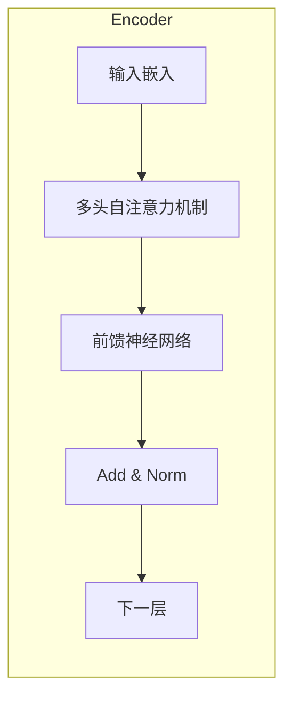
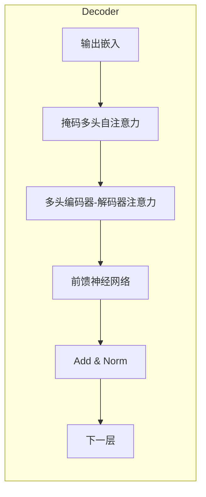

# Transformer大模型实战 M-BERT 模型的多语言表现

## 1.背景介绍

### 1.1 自然语言处理的重要性

在当今信息时代,自然语言处理(NLP)已成为人工智能领域中最具挑战和应用价值的研究方向之一。NLP旨在使计算机能够理解和生成人类语言,实现人机自然交互,为各行业带来革命性的变革。

### 1.2 Transformer模型的崛起

2017年,Transformer模型被提出,其基于注意力机制,摆脱了RNN的局限性,在机器翻译等任务中取得了突破性进展。自此,Transformer成为NLP领域的主流模型架构。

### 1.3 多语言处理的重要性

随着全球化进程的加速,多语言处理的需求日益增长。传统的NLP模型大多专注于单一语言,难以满足现实需求。因此,构建高效的多语言NLP模型成为当前研究的热点课题。

## 2.核心概念与联系

### 2.1 Transformer模型

Transformer是一种全新的基于注意力机制的序列到序列模型,主要由编码器(Encoder)和解码器(Decoder)两部分组成。

#### 2.1.1 编码器(Encoder)

编码器的主要作用是将输入序列映射为一系列连续的向量表示,称为"注意力表示"。编码器由多个相同的层组成,每一层包括两个子层:

1. 多头自注意力机制(Multi-Head Attention)
2. 前馈神经网络(Feed-Forward Neural Network)

#### 2.1.2 解码器(Decoder)

解码器的作用是根据编码器的输出和目标序列生成最终的输出序列。解码器的结构与编码器类似,但增加了一个注意力子层,用于关注编码器的输出。

### 2.2 BERT模型

BERT(Bidirectional Encoder Representations from Transformers)是一种基于Transformer的预训练语言模型,在NLP任务中表现卓越。BERT的核心思想是利用大量无监督语料进行预训练,获得通用的语义表示,然后在下游任务上进行微调(fine-tuning)。

#### 2.2.1 预训练任务

BERT采用两种无监督预训练任务:

1. 掩码语言模型(Masked Language Model)
2. 下一句预测(Next Sentence Prediction)

#### 2.2.2 模型结构

BERT的模型结构由多层Transformer编码器组成,输入为词元(Token)序列,输出为对应的上下文表示向量。

### 2.3 M-BERT模型

M-BERT(Multilingual BERT)是BERT的多语言版本,使用Wikipedia的104种语言语料进行预训练,旨在支持跨语言的语义表示和迁移。

M-BERT在下游任务中表现优异,特别是在跨语言场景下,能够有效地利用不同语言之间的语义关联。

## 3.核心算法原理具体操作步骤

### 3.1 自注意力机制(Self-Attention)

自注意力机制是Transformer模型的核心,它允许模型在计算目标词的表示时关注整个输入序列。

#### 3.1.1 计算过程

1. 将输入序列 $X = (x_1, x_2, ..., x_n)$ 映射为查询(Query)、键(Key)和值(Value)向量:

$$
\begin{aligned}
Q &= XW^Q\\
K &= XW^K\\
V &= XW^V
\end{aligned}
$$

其中 $W^Q, W^K, W^V$ 为可训练的权重矩阵。

2. 计算注意力分数:

$$
\text{Attention}(Q, K, V) = \text{softmax}(\frac{QK^T}{\sqrt{d_k}})V
$$

其中 $d_k$ 为缩放因子,用于防止内积过大导致梯度消失。

3. 多头注意力机制通过并行计算多个注意力头,最后将它们的结果拼接:

$$
\text{MultiHead}(Q, K, V) = \text{Concat}(head_1, ..., head_h)W^O
$$

其中 $head_i = \text{Attention}(QW_i^Q, KW_i^K, VW_i^V)$, $W_i^Q, W_i^K, W_i^V$ 为对应头的权重矩阵。

#### 3.1.2 掩码自注意力(Masked Self-Attention)

在解码器中,为了防止关注未来的位置,需要对注意力分数进行掩码操作,确保每个位置只能关注之前的位置。

### 3.2 位置编码(Positional Encoding)

由于Transformer没有循环或卷积结构,因此需要一种方法来注入序列的位置信息。位置编码就是为每个位置分配一个向量,将其与词嵌入相加,从而使模型能够捕获序列的顺序信息。

$$
\text{PE}_{pos, 2i} = \sin(pos / 10000^{2i/d_{model}})\\
\text{PE}_{pos, 2i+1} = \cos(pos / 10000^{2i/d_{model}})
$$

其中 $pos$ 为位置索引, $i$ 为维度索引, $d_{model}$ 为模型维度。

### 3.3 BERT 预训练

BERT的预训练过程包括两个阶段:

#### 3.3.1 掩码语言模型(Masked Language Model)

1. 随机选择输入序列中的 15% 的词元进行掩码
2. 对于被掩码的词元,模型需要基于上下文预测其原始词元
3. 最大化掩码词元的预测概率作为训练目标

#### 3.3.2 下一句预测(Next Sentence Prediction)

1. 为输入序列添加特殊分隔符 [SEP]
2. 50% 的时候将两个实际连续的句子并列
3. 50% 的时候将两个无关的句子并列
4. 训练模型预测两个句子是否连续

### 3.4 微调(Fine-tuning)

对于下游任务,BERT模型需要进行微调。微调过程包括:

1. 添加特定于任务的输入表示(如序列标记、分隔符等)
2. 根据任务类型,设计输出层(如分类、序列标注等)
3. 在标注数据上进行端到端的模型微调

## 4.数学模型和公式详细讲解举例说明

### 4.1 注意力分数计算

注意力分数的计算公式为:

$$
\text{Attention}(Q, K, V) = \text{softmax}(\frac{QK^T}{\sqrt{d_k}})V
$$

其中:

- $Q \in \mathbb{R}^{n \times d_k}$ 为查询矩阵
- $K \in \mathbb{R}^{m \times d_k}$ 为键矩阵
- $V \in \mathbb{R}^{m \times d_v}$ 为值矩阵
- $n$ 为查询的序列长度
- $m$ 为键值对的序列长度
- $d_k$ 为键的维度
- $d_v$ 为值的维度

计算步骤:

1. 计算查询和键的点积: $QK^T \in \mathbb{R}^{n \times m}$
2. 对点积结果进行缩放: $\frac{QK^T}{\sqrt{d_k}}$
3. 对每一行进行 softmax 操作,得到注意力分数矩阵: $\text{softmax}(\frac{QK^T}{\sqrt{d_k}}) \in \mathbb{R}^{n \times m}$
4. 将注意力分数矩阵与值矩阵相乘,得到注意力输出: $\text{Attention}(Q, K, V) \in \mathbb{R}^{n \times d_v}$

例如,假设有一个查询序列 $Q = [q_1, q_2]$,一个键值对序列 $K = [k_1, k_2, k_3], V = [v_1, v_2, v_3]$,其中 $d_k = d_v = 3$,则注意力计算过程为:

$$
\begin{aligned}
QK^T &= \begin{bmatrix}
q_1 \cdot k_1^T & q_1 \cdot k_2^T & q_1 \cdot k_3^T\\
q_2 \cdot k_1^T & q_2 \cdot k_2^T & q_2 \cdot k_3^T
\end{bmatrix}\\
\text{softmax}(\frac{QK^T}{\sqrt{3}}) &= \begin{bmatrix}
0.3 & 0.4 & 0.3\\
0.6 & 0.2 & 0.2
\end{bmatrix}\\
\text{Attention}(Q, K, V) &= \begin{bmatrix}
0.3v_1 + 0.4v_2 + 0.3v_3\\
0.6v_1 + 0.2v_2 + 0.2v_3
\end{bmatrix}
\end{aligned}
$$

可见,注意力机制通过计算查询与键的相关性,为每个查询分配一个注意力分数,然后根据注意力分数对值进行加权求和,从而获得查询的表示。

### 4.2 多头注意力

多头注意力机制通过并行计算多个注意力头,最后将它们的结果拼接,公式如下:

$$
\text{MultiHead}(Q, K, V) = \text{Concat}(head_1, ..., head_h)W^O
$$

其中 $head_i = \text{Attention}(QW_i^Q, KW_i^K, VW_i^V)$, $W_i^Q \in \mathbb{R}^{d_{model} \times d_k}, W_i^K \in \mathbb{R}^{d_{model} \times d_k}, W_i^V \in \mathbb{R}^{d_{model} \times d_v}$ 为对应头的投影矩阵, $W^O \in \mathbb{R}^{hd_v \times d_{model}}$ 为输出矩阵。

多头注意力的作用是捕捉不同的子空间表示,提高模型的表达能力。例如,假设有 $h = 2$ 个注意力头,输入序列为 $X = [x_1, x_2, x_3]$,其中 $x_i \in \mathbb{R}^{d_{model}}$,则多头注意力计算过程为:

$$
\begin{aligned}
Q_1 &= XW_1^Q, K_1 = XW_1^K, V_1 = XW_1^V\\
Q_2 &= XW_2^Q, K_2 = XW_2^K, V_2 = XW_2^V\\
head_1 &= \text{Attention}(Q_1, K_1, V_1)\\
head_2 &= \text{Attention}(Q_2, K_2, V_2)\\
\text{MultiHead}(Q, K, V) &= \text{Concat}(head_1, head_2)W^O
\end{aligned}
$$

可见,多头注意力通过不同的投影矩阵,从不同的子空间捕捉序列的表示,然后将这些表示拼接起来,最终映射回原始空间。

### 4.3 位置编码

位置编码的公式为:

$$
\text{PE}_{pos, 2i} = \sin(pos / 10000^{2i/d_{model}})\\
\text{PE}_{pos, 2i+1} = \cos(pos / 10000^{2i/d_{model}})
$$

其中 $pos$ 为位置索引, $i$ 为维度索引, $d_{model}$ 为模型维度。

位置编码的作用是为每个位置分配一个唯一的向量,使模型能够捕捉序列的顺序信息。例如,对于一个长度为 5 的序列,当 $d_{model} = 4$ 时,其位置编码矩阵为:

$$
\text{PE} = \begin{bmatrix}
\sin(0) & \cos(0) & \sin(0) & \cos(0)\\
\sin(1) & \cos(1) & \sin(2) & \cos(2)\\
\sin(2) & \cos(2) & \sin(4) & \cos(4)