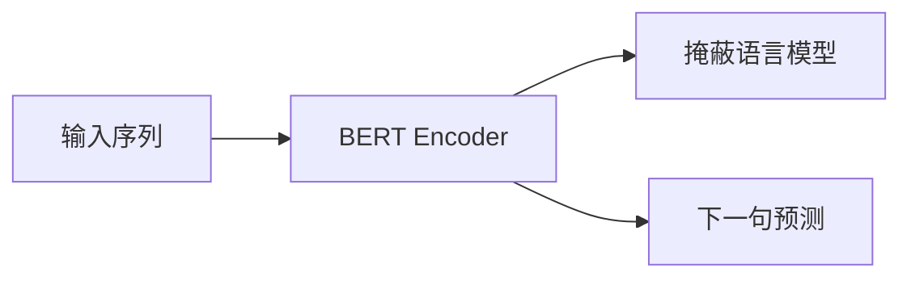
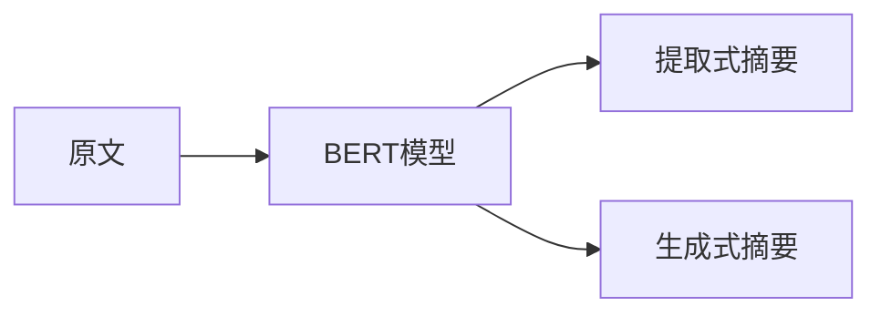

# Transformer大模型实战 为文本摘要任务微调BERT模型

## 1. 背景介绍

### 1.1 文本摘要任务的重要性

在当今信息时代,我们每天都会接收海量的文本数据,包括新闻报道、社交媒体帖子、技术文档等。有效地总结和提取这些文本的关键信息对于提高工作效率和决策质量至关重要。文本摘要任务旨在自动生成文本的简明摘要,为人类提供快速获取核心内容的途径。

### 1.2 传统文本摘要方法的局限性

传统的文本摘要方法主要包括提取式摘要和基于规则的生成式摘要。提取式摘要直接从原文中选取一些重要句子作为摘要,但无法很好地概括文本的核心内容。基于规则的生成式摘要则需要手动设计复杂的规则,难以适应不同领域和风格的文本。

### 1.3 BERT在文本摘要任务中的应用

随着自然语言处理领域的快速发展,基于深度学习的文本摘要模型展现出了巨大的潜力。BERT(Bidirectional Encoder Representations from Transformers)是一种革命性的预训练语言模型,它能够有效地捕捉文本的上下文语义信息。通过对BERT进行微调,我们可以将其应用于文本摘要任务,生成高质量、信息丰富的摘要。

## 2. 核心概念与联系

### 2.1 Transformer模型

Transformer是一种全新的基于注意力机制的序列到序列模型,它完全放弃了传统的循环神经网络和卷积神经网络结构。Transformer模型由编码器(Encoder)和解码器(Decoder)两个主要部分组成,能够并行处理输入序列,大大提高了训练效率。


### 2.2 BERT模型

BERT是一种基于Transformer的双向编码器表示,它通过掩蔽语言模型(Masked Language Model)和下一句预测(Next Sentence Prediction)两个预训练任务,学习到了深层次的语义表示。BERT模型可以很好地捕捉文本的上下文信息,为下游的自然语言处理任务提供强大的语义表示能力。



### 2.3 文本摘要任务

文本摘要任务可以分为提取式摘要和生成式摘要两种类型。提取式摘要是从原文中选取一些重要句子作为摘要,而生成式摘要则是基于原文生成一个全新的摘要文本。BERT模型可以通过微调的方式应用于这两种类型的文本摘要任务。



## 3. 核心算法原理具体操作步骤

### 3.1 BERT模型的微调

为了将BERT应用于文本摘要任务,我们需要对预训练的BERT模型进行微调(Fine-tuning)。微调的过程包括以下几个步骤:

1. **准备数据集**: 首先需要准备用于微调的文本摘要数据集,包括原文和对应的摘要文本。

2. **数据预处理**: 对原文和摘要文本进行分词、填充等预处理操作,将其转换为BERT模型可以接受的输入格式。

3. **构建模型**: 根据任务类型(提取式或生成式摘要),选择合适的BERT模型结构,并添加必要的输出层。

4. **模型训练**: 使用准备好的数据集对BERT模型进行微调训练,优化模型参数以适应文本摘要任务。

5. **模型评估**: 在验证集上评估微调后的模型性能,根据指标(如ROUGE分数)进行模型选择。

6. **模型部署**: 将训练好的模型部署到生产环境,用于实际的文本摘要任务。

### 3.2 提取式文本摘要

对于提取式文本摘要任务,我们可以将其建模为一个序列标注问题。BERT模型的输出将是一个标签序列,表示每个句子是否应该被包含在摘要中。具体步骤如下:

1. **输入表示**: 将原文作为BERT的输入序列,添加特殊标记[CLS]和[SEP]。

2. **BERT编码器**: 原文经过BERT编码器得到上下文语义表示。

3. **序列标注层**: 在BERT的输出上添加一个序列标注层,用于预测每个句子的标签(0或1)。

4. **训练目标**: 最小化序列标注层的交叉熵损失,使模型能够正确预测哪些句子应该包含在摘要中。

5. **生成摘要**: 根据预测的标签序列,从原文中提取出标记为1的句子,拼接成最终的摘要文本。

### 3.3 生成式文本摘要

对于生成式文本摘要任务,我们可以将其建模为一个序列到序列的生成问题。BERT模型的编码器用于捕捉原文的语义表示,解码器则根据编码器的输出生成摘要文本。具体步骤如下:

1. **输入表示**: 将原文作为BERT编码器的输入序列,添加特殊标记[CLS]和[SEP]。

2. **BERT编码器**: 原文经过BERT编码器得到上下文语义表示。

3. **解码器**: 使用BERT的解码器模块,将编码器的输出作为初始状态,生成摘要文本的标记序列。

4. **训练目标**: 最小化解码器的交叉熵损失,使模型能够生成与参考摘要接近的文本。

5. **生成摘要**: 在推理阶段,将原文输入到编码器,然后利用解码器生成摘要文本序列。

6. **梯度裁剪**: 由于文本摘要任务的输入和输出长度可能不固定,需要采用梯度裁剪等技术来稳定训练过程。

## 4. 数学模型和公式详细讲解举例说明

### 4.1 Transformer的注意力机制

Transformer模型中的核心组件是多头注意力(Multi-Head Attention)机制,它能够有效地捕捉序列中不同位置之间的长程依赖关系。给定一个查询向量$\boldsymbol{q}$、键向量$\boldsymbol{K}$和值向量$\boldsymbol{V}$,注意力机制的计算过程如下:

$$\text{Attention}(\boldsymbol{Q}, \boldsymbol{K}, \boldsymbol{V}) = \text{softmax}\left(\frac{\boldsymbol{Q}\boldsymbol{K}^\top}{\sqrt{d_k}}\right)\boldsymbol{V}$$

其中$d_k$是缩放因子,用于防止点积过大导致梯度消失或爆炸。多头注意力机制将注意力计算过程分成多个子空间,并将结果拼接起来,从而捕捉更丰富的依赖关系:

$$\text{MultiHead}(\boldsymbol{Q}, \boldsymbol{K}, \boldsymbol{V}) = \text{Concat}(\text{head}_1, \dots, \text{head}_h)\boldsymbol{W}^O$$
$$\text{where } \text{head}_i = \text{Attention}(\boldsymbol{Q}\boldsymbol{W}_i^Q, \boldsymbol{K}\boldsymbol{W}_i^K, \boldsymbol{V}\boldsymbol{W}_i^V)$$

这种注意力机制使Transformer模型能够有效地建模长距离的依赖关系,为文本摘要任务提供了强大的语义表示能力。

### 4.2 BERT的掩蔽语言模型

BERT模型在预训练阶段使用了掩蔽语言模型(Masked Language Model)任务,通过预测被掩蔽的词来学习深层次的语义表示。给定一个包含掩蔽标记[MASK]的输入序列$\boldsymbol{X}$,BERT模型的目标是最大化掩蔽位置的条件概率:

$$\mathcal{L}_\text{MLM} = -\mathbb{E}_{\boldsymbol{X}, \theta}\left[\sum_{i=1}^n \log P(x_i | \boldsymbol{X}_{\backslash i}; \theta)\right]$$

其中$\theta$表示BERT模型的参数,$\boldsymbol{X}_{\backslash i}$表示除了第$i$个位置之外的其他位置。通过这种方式,BERT模型能够学习到上下文语义信息,为下游的自然语言处理任务提供强大的语义表示能力。

### 4.3 文本摘要任务的损失函数

对于提取式文本摘要任务,我们可以将其建模为一个序列标注问题,使用交叉熵损失函数来优化模型参数:

$$\mathcal{L}_\text{ext} = -\frac{1}{N}\sum_{i=1}^N\sum_{j=1}^{L_i} y_{ij}\log(p_{ij}) + (1 - y_{ij})\log(1 - p_{ij})$$

其中$N$是批次大小,$L_i$是第$i$个样本的句子数量,$y_{ij}$是第$i$个样本第$j$个句子的真实标签(0或1),$p_{ij}$是模型预测的概率。

对于生成式文本摘要任务,我们可以将其建模为一个序列到序列的生成问题,使用负对数似然损失函数来优化模型参数:

$$\mathcal{L}_\text{gen} = -\frac{1}{N}\sum_{i=1}^N\sum_{j=1}^{L_i}\log P(y_{ij} | \boldsymbol{X}_i, y_{i<j}; \theta)$$

其中$\boldsymbol{X}_i$是第$i$个样本的原文输入序列,$y_{ij}$是第$i$个样本第$j$个位置的目标词,$P(\cdot)$是模型预测的条件概率分布。通过最小化这些损失函数,我们可以有效地训练BERT模型,使其适应文本摘要任务。

## 5. 项目实践：代码实例和详细解释说明

在这一部分,我们将提供一个使用PyTorch实现的文本摘要项目实践示例,包括数据预处理、模型构建、训练和评估等步骤。

### 5.1 数据预处理

```python
import torch
from transformers import BertTokenizer

# 加载BERT分词器
tokenizer = BertTokenizer.from_pretrained('bert-base-uncased')

# 文本和摘要样例
text = "This is a sample text for text summarization task. ..."
summary = "Sample summary of the text."

# 对文本和摘要进行分词和编码
encoded_text = tokenizer.encode_plus(text, padding='max_length', truncation=True, return_tensors='pt')
encoded_summary = tokenizer.encode_plus(summary, padding='max_length', truncation=True, return_tensors='pt')
```

在这个示例中,我们首先加载了预训练的BERT分词器。然后,我们对样例文本和摘要进行了分词和编码,将它们转换为BERT模型可以接受的输入格式。`encode_plus`函数会自动添加特殊标记([CLS]和[SEP])并进行填充和截断操作。

### 5.2 模型构建

```python
from transformers import BertForSequenceClassification, BertForSeq2SeqLM

# 提取式摘要模型
extraction_model = BertForSequenceClassification.from_pretrained('bert-base-uncased', num_labels=2)

# 生成式摘要模型
generation_model = BertForSeq2SeqLM.from_pretrained('bert-base-uncased')
```

对于提取式文本摘要任务,我们使用`BertForSequenceClassification`模型,它在BERT的输出上添加了一个序列标注层,用于预测每个句子是否应该包含在摘要中。对于生成式文本摘要任务,我们使用`BertForSeq2SeqLM`模型,它包含了BERT的编码器和解码器模块,可以生成摘要文本序列。

### 5.3 模型训练

```python
from transformers import AdamW

# 设置训练参数
epochs = 5
batch_size = 16
learning_rate = 2e-5

# 定义优化器和损失函数
optimizer = AdamW(model.parameters(), lr=learning_rate)
criterion = nn.CrossEntropyLoss()

# 训练循环
for epoch in range(epochs):
    for batch in data_loader:
        # 准备输入数据
        input_ids, attention_mask, labels = batch
        
        # 前向传播