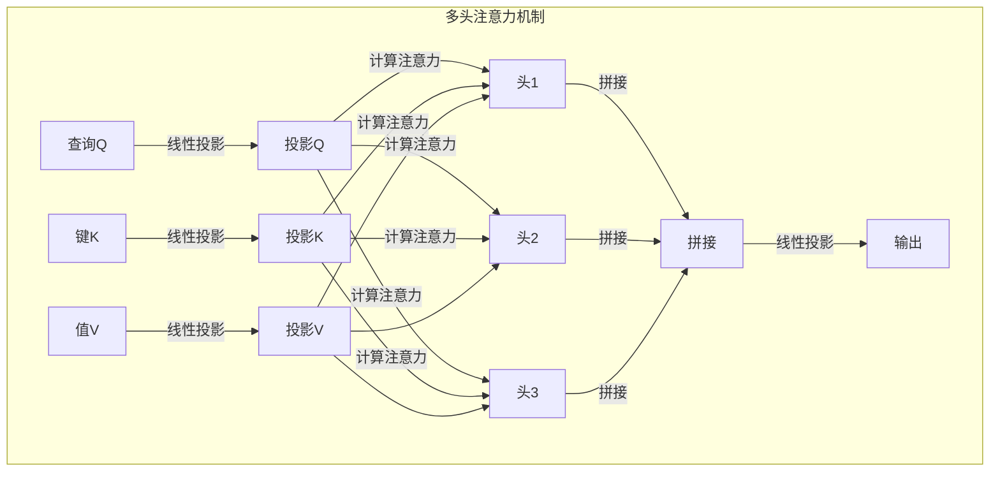

# Transformer大模型实战 多头注意力层

## 1.背景介绍

随着深度学习的不断发展,Transformer模型在自然语言处理、计算机视觉等领域取得了卓越的成就。作为Transformer模型的核心组件,多头注意力机制(Multi-Head Attention)通过捕捉输入序列中元素之间的相关性,有效地建模了长距离依赖关系,从而显著提高了模型的表现能力。

### 1.1 注意力机制的兴起

传统的序列模型如RNN(循环神经网络)和LSTM(长短期记忆网络)在处理长序列时存在梯度消失、梯度爆炸等问题,难以有效捕捉长距离依赖关系。注意力机制(Attention Mechanism)应运而生,通过计算查询(Query)与键(Key)的相关性,选择性地聚焦于与当前位置相关的值(Value),从而实现对长距离依赖的建模。

### 1.2 Transformer模型的革命性贡献

2017年,Transformer模型在论文"Attention Is All You Need"中被正式提出,它完全抛弃了RNN结构,纯粹基于注意力机制构建了一种全新的序列模型架构。Transformer模型在机器翻译、文本生成等任务上取得了超越RNN的性能,引领了NLP领域的新潮流。

### 1.3 多头注意力机制的作用

多头注意力机制是Transformer模型的核心,它将注意力机制进行了多路复制,每一路称为一个"头"(Head),不同的头可以关注输入序列的不同位置,从而更全面地捕捉序列中的信息。多头注意力机制通过合并多个头的结果,能够更有效地建模输入序列的复杂依赖关系。

## 2.核心概念与联系

### 2.1 注意力机制(Attention Mechanism)

注意力机制的核心思想是通过计算查询(Query)与键(Key)的相关性分数,对值(Value)进行加权求和,从而获取当前位置所需关注的信息。具体来说,给定一个查询向量$\boldsymbol{q}$,键向量$\boldsymbol{k}$和值向量$\boldsymbol{v}$,注意力机制计算如下:

$$\text{Attention}(\boldsymbol{q}, \boldsymbol{k}, \boldsymbol{v}) = \text{softmax}\left(\frac{\boldsymbol{q}\boldsymbol{k}^\top}{\sqrt{d_k}}\right)\boldsymbol{v}$$

其中,$d_k$是键向量的维度,用于缩放点积的值,防止过大的值导致softmax函数饱和。

### 2.2 多头注意力机制(Multi-Head Attention)

多头注意力机制将注意力机制进行了多路复制,每一路称为一个"头"。具体来说,将查询向量$\boldsymbol{q}$、键向量$\boldsymbol{k}$和值向量$\boldsymbol{v}$分别线性投影到$h$个子空间,对于第$i$个子空间,计算:

$$\text{head}_i = \text{Attention}(\boldsymbol{q}\boldsymbol{W}_i^Q, \boldsymbol{k}\boldsymbol{W}_i^K, \boldsymbol{v}\boldsymbol{W}_i^V)$$

其中,$\boldsymbol{W}_i^Q\in\mathbb{R}^{d_\text{model}\times d_k}$,$\boldsymbol{W}_i^K\in\mathbb{R}^{d_\text{model}\times d_k}$和$\boldsymbol{W}_i^V\in\mathbb{R}^{d_\text{model}\times d_v}$分别是查询、键和值的线性投影矩阵。

最后,将所有头的结果进行拼接并线性投影,得到多头注意力的输出:

$$\text{MultiHead}(\boldsymbol{q}, \boldsymbol{k}, \boldsymbol{v}) = \text{Concat}(\text{head}_1, \cdots, \text{head}_h)\boldsymbol{W}^O$$

其中,$\boldsymbol{W}^O\in\mathbb{R}^{hd_v\times d_\text{model}}$是输出的线性投影矩阵。

通过多头注意力机制,模型可以从不同的子空间获取不同的注意力表示,捕捉输入序列中更加丰富的依赖关系。

上图展示了多头注意力机制的计算流程,首先将查询(Query)、键(Key)和值(Value)分别进行线性投影,然后在不同的子空间中计算注意力头,最后将所有头的结果拼接并进行线性投影,得到最终的多头注意力输出。

## 3.核心算法原理具体操作步骤

多头注意力机制的计算过程可以分为以下几个步骤:

1. **线性投影**:将输入的查询(Query)、键(Key)和值(Value)分别投影到不同的子空间,以获取不同的表示。

   $$\begin{aligned}
   \boldsymbol{Q} &= \boldsymbol{X}\boldsymbol{W}^Q &\in\mathbb{R}^{n\times d_k} \\
   \boldsymbol{K} &= \boldsymbol{X}\boldsymbol{W}^K &\in\mathbb{R}^{n\times d_k} \\
   \boldsymbol{V} &= \boldsymbol{X}\boldsymbol{W}^V &\in\mathbb{R}^{n\times d_v}
   \end{aligned}$$

   其中,$\boldsymbol{X}\in\mathbb{R}^{n\times d_\text{model}}$是输入序列,$\boldsymbol{W}^Q\in\mathbb{R}^{d_\text{model}\times d_k}$,$\boldsymbol{W}^K\in\mathbb{R}^{d_\text{model}\times d_k}$和$\boldsymbol{W}^V\in\mathbb{R}^{d_\text{model}\times d_v}$分别是查询、键和值的线性投影矩阵。

2. **计算注意力分数**:对于每个头,计算查询与键的点积,并进行缩放和softmax操作,得到注意力分数矩阵。

   $$\boldsymbol{A}_i = \text{softmax}\left(\frac{\boldsymbol{Q}\boldsymbol{K}^\top}{\sqrt{d_k}}\right)$$

   其中,$\boldsymbol{A}_i\in\mathbb{R}^{n\times n}$是第$i$个头的注意力分数矩阵。

3. **计算注意力头输出**:将注意力分数矩阵与值矩阵相乘,得到每个头的注意力输出。

   $$\text{head}_i = \boldsymbol{A}_i\boldsymbol{V}$$

4. **拼接注意力头**:将所有头的注意力输出拼接在一起。

   $$\text{MultiHead} = \text{Concat}(\text{head}_1, \cdots, \text{head}_h)$$

5. **线性投影**:对拼接后的注意力输出进行线性投影,得到多头注意力机制的最终输出。

   $$\boldsymbol{Y} = \text{MultiHead}\boldsymbol{W}^O$$

   其中,$\boldsymbol{W}^O\in\mathbb{R}^{hd_v\times d_\text{model}}$是输出的线性投影矩阵。

通过上述步骤,多头注意力机制能够从不同的子空间捕捉输入序列中的依赖关系,并将这些信息融合到最终的输出中。

## 4.数学模型和公式详细讲解举例说明

为了更好地理解多头注意力机制的计算过程,我们来看一个具体的例子。假设输入序列$\boldsymbol{X}$为:

$$\boldsymbol{X} = \begin{bmatrix}
1 & 2 & 3\\
4 & 5 & 6\\
7 & 8 & 9
\end{bmatrix}$$

我们设置模型参数为:$d_\text{model}=9$,$d_k=3$,$d_v=3$,头数$h=2$。

### 4.1 线性投影

首先,我们将输入序列$\boldsymbol{X}$分别投影到查询、键和值的子空间:

$$\begin{aligned}
\boldsymbol{Q} &= \boldsymbol{X}\boldsymbol{W}^Q &= \begin{bmatrix}
1 & 2 & 3\\
4 & 5 & 6\\
7 & 8 & 9
\end{bmatrix}\begin{bmatrix}
1 & 2 & 3\\
4 & 5 & 6\\
7 & 8 & 9
\end{bmatrix} &= \begin{bmatrix}
30 & 36 & 42\\
66 & 81 & 96\\
102 & 126 & 150
\end{bmatrix} \\
\boldsymbol{K} &= \boldsymbol{X}\boldsymbol{W}^K &= \begin{bmatrix}
1 & 2 & 3\\
4 & 5 & 6\\
7 & 8 & 9
\end{bmatrix}\begin{bmatrix}
1 & 4 & 7\\
2 & 5 & 8\\
3 & 6 & 9
\end{bmatrix} &= \begin{bmatrix}
30 & 72 & 114\\
66 & 165 & 264\\
102 & 258 & 414
\end{bmatrix} \\
\boldsymbol{V} &= \boldsymbol{X}\boldsymbol{W}^V &= \begin{bmatrix}
1 & 2 & 3\\
4 & 5 & 6\\
7 & 8 & 9
\end{bmatrix}\begin{bmatrix}
1 & 7 & 4\\
2 & 8 & 5\\
3 & 9 & 6
\end{bmatrix} &= \begin{bmatrix}
30 & 78 & 51\\
66 & 180 & 117\\
102 & 282 & 183
\end{bmatrix}
\end{aligned}$$

其中,$\boldsymbol{W}^Q$,$\boldsymbol{W}^K$和$\boldsymbol{W}^V$分别是查询、键和值的线性投影矩阵。

### 4.2 计算注意力分数

接下来,我们计算每个头的注意力分数矩阵:

$$\begin{aligned}
\boldsymbol{A}_1 &= \text{softmax}\left(\frac{\boldsymbol{Q}_1\boldsymbol{K}_1^\top}{\sqrt{3}}\right) \\
&= \text{softmax}\left(\frac{1}{\sqrt{3}}\begin{bmatrix}
30 & 66 & 102\\
30 & 66 & 102\\
30 & 66 & 102
\end{bmatrix}\begin{bmatrix}
30 & 66 & 102\\
72 & 165 & 258\\
114 & 264 & 414
\end{bmatrix}\right) \\
&= \begin{bmatrix}
0.33 & 0.33 & 0.33\\
0.33 & 0.33 & 0.33\\
0.33 & 0.33 & 0.33
\end{bmatrix} \\
\boldsymbol{A}_2 &= \text{softmax}\left(\frac{\boldsymbol{Q}_2\boldsymbol{K}_2^\top}{\sqrt{3}}\right) \\
&= \text{softmax}\left(\frac{1}{\sqrt{3}}\begin{bmatrix}
36 & 81 & 126\\
36 & 81 & 126\\
36 & 81 & 126
\end{bmatrix}\begin{bmatrix}
72 & 165 & 258\\
72 & 165 & 258\\
72 & 165 & 258
\end{bmatrix}\right) \\
&= \begin{bmatrix}
0.33 & 0.33 & 0.33\\
0.33 & 0.33 & 0.33\\
0.33 & 0.33 & 0.33
\end{bmatrix}
\end{aligned}$$

其中,$\boldsymbol{Q}_i$和$\boldsymbol{K}_i$分别表示第$i$个头的查询和键。在这个例子中,由于查询和键之间的点积相等,所以注意力分数矩阵是均匀分布的。

### 4.3 计算注意力头输出

然后,我们计算每个头的注意力输出:

$$\begin{aligned}
\text{head}_1 &= \boldsymbol{A}_1\boldsymbol{V}_