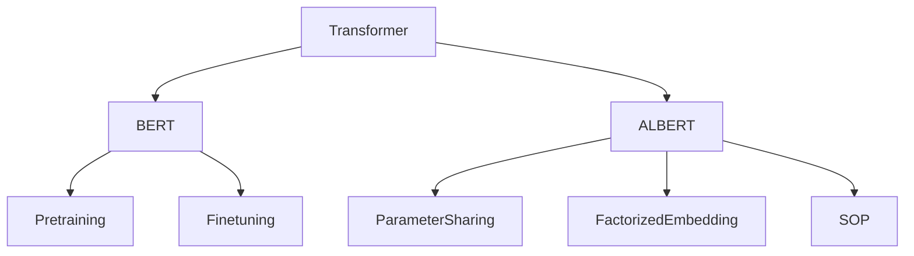

# Transformer大模型实战 对比ALBERT与BERT

## 1. 背景介绍
### 1.1 Transformer模型的发展历程
### 1.2 BERT和ALBERT模型的诞生背景
### 1.3 BERT和ALBERT在NLP领域的重要地位

## 2. 核心概念与联系
### 2.1 Transformer架构详解
#### 2.1.1 Encoder结构
#### 2.1.2 Decoder结构  
#### 2.1.3 Attention机制
### 2.2 BERT模型核心思想
#### 2.2.1 双向Transformer Encoder
#### 2.2.2 预训练任务MLM和NSP
#### 2.2.3 微调Fine-tuning
### 2.3 ALBERT模型的创新点
#### 2.3.1 参数共享 
#### 2.3.2 因式分解嵌入参数
#### 2.3.3 句间连贯性损失函数SOP



## 3. 核心算法原理与操作步骤
### 3.1 BERT预训练
#### 3.1.1 Masked Language Model(MLM)
#### 3.1.2 Next Sentence Prediction(NSP)
### 3.2 ALBERT预训练
#### 3.2.1 Cross-layer Parameter Sharing
#### 3.2.2 Factorized Embedding Parameterization
#### 3.2.3 Sentence Order Prediction(SOP)
### 3.3 下游任务微调
#### 3.3.1 数据准备
#### 3.3.2 模型微调
#### 3.3.3 推理预测

## 4. 数学模型与公式详解
### 4.1 Self-Attention计算
$$Attention(Q,K,V) = softmax(\frac{QK^T}{\sqrt{d_k}})V$$
其中$Q$是查询向量，$K$是键向量，$V$是值向量，$d_k$是$K$的维度。
### 4.2 Transformer Encoder计算
$$Encoder(X) = LayerNorm(X+SelfAttention(X))$$
$$Encoder(X) = LayerNorm(X+FeedForward(X))$$
### 4.3 BERT损失函数
$$\mathcal{L}_{BERT} = \mathcal{L}_{MLM} + \mathcal{L}_{NSP}$$
其中$\mathcal{L}_{MLM}$是MLM任务的交叉熵损失，$\mathcal{L}_{NSP}$是NSP任务的交叉熵损失。
### 4.4 ALBERT参数共享
$$W_i = W, \forall i \in [1,M]$$
其中$W_i$表示第$i$层的参数，$M$是总层数。所有层共享同一组参数$W$。
### 4.5 ALBERT因式分解嵌入
$$E = PQ$$
其中$E$是词嵌入矩阵，$P$是低秩矩阵，$Q$是上下文无关的token嵌入矩阵。通过矩阵分解降低参数量。

## 5. 项目实践：代码实例与详解
### 5.1 安装Transformers库
```python
!pip install transformers
```
### 5.2 加载预训练模型
```python
from transformers import BertModel, BertTokenizer, AlbertModel, AlbertTokenizer

# 加载BERT
bert_model = BertModel.from_pretrained('bert-base-uncased') 
bert_tokenizer = BertTokenizer.from_pretrained('bert-base-uncased')

# 加载ALBERT 
albert_model = AlbertModel.from_pretrained('albert-base-v2')
albert_tokenizer = AlbertTokenizer.from_pretrained('albert-base-v2')
```
### 5.3 文本编码
```python
text = "Hello, this is a test sentence."

# BERT编码
bert_inputs = bert_tokenizer(text, return_tensors="pt")
bert_outputs = bert_model(**bert_inputs)

# ALBERT编码  
albert_inputs = albert_tokenizer(text, return_tensors="pt")
albert_outputs = albert_model(**albert_inputs)
```
### 5.4 微调下游任务
```python
from transformers import BertForSequenceClassification, AlbertForSequenceClassification
from transformers import AdamW

# 加载微调模型
bert_classifier = BertForSequenceClassification.from_pretrained('bert-base-uncased') 
albert_classifier = AlbertForSequenceClassification.from_pretrained('albert-base-v2')

# 优化器
bert_optimizer = AdamW(bert_classifier.parameters(), lr=2e-5)
albert_optimizer = AdamW(albert_classifier.parameters(), lr=2e-5)  

# 训练
for epoch in range(3):
    for batch in train_dataloader:
        bert_outputs = bert_classifier(batch['input_ids'], attention_mask=batch['attention_mask'], labels=batch['labels'])
        albert_outputs = albert_classifier(batch['input_ids'], attention_mask=batch['attention_mask'], labels=batch['labels'])
        
        bert_loss = bert_outputs.loss
        albert_loss = albert_outputs.loss
        
        bert_loss.backward()
        albert_loss.backward()
        
        bert_optimizer.step()
        albert_optimizer.step()
```

## 6. 实际应用场景
### 6.1 情感分析
利用BERT/ALBERT对商品评论、电影评论等文本进行积极/消极情感判断。
### 6.2 命名实体识别
识别文本中的人名、地名、机构名等命名实体。
### 6.3 问答系统
基于BERT/ALBERT构建问答系统，从大规模文本语料中寻找问题的答案。
### 6.4 文本分类
对新闻文章、论文摘要等文本进行主题分类。

## 7. 工具和资源推荐
- Transformers：方便使用BERT、ALBERT等预训练模型的Python库。
- PyTorch/TensorFlow：流行的深度学习框架，支持Transformer模型。 
- Google Colab：免费的云端GPU环境，方便运行大模型。
- HuggingFace社区：分享各种Transformer模型和下游任务的资源平台。

## 8. 总结：未来发展趋势与挑战
### 8.1 模型参数量与计算效率的平衡
### 8.2 预训练数据和任务的进一步探索 
### 8.3 模型解释性与鲁棒性
### 8.4 知识增强与多模态学习

## 9. 附录：常见问题与解答
### Q1: BERT和ALBERT的主要区别是什么？
A1: ALBERT通过参数共享和嵌入矩阵分解减少了参数量，同时使用SOP代替了NSP预训练任务。
### Q2: 在下游任务微调时，BERT和ALBERT有什么注意点？
A2: 学习率要设置得较小，一般在2e-5到5e-5之间。另外要注意Batch Size和Max Length对GPU显存的占用。
### Q3: BERT和ALBERT在实际应用中如何选择？
A3: 对于资源受限的场景或者对模型大小敏感的应用，优先选择ALBERT。对于对效果要求极高的场景，可以优先尝试BERT，同时要权衡训练和推理成本。

作者：禅与计算机程序设计艺术 / Zen and the Art of Computer Programming