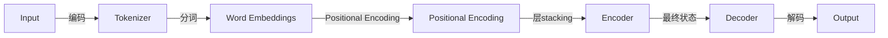

                 

作者：禅与计算机程序设计艺术

在我们开始之前，让我们先回顾一下Transformer模型的基本结构和它如何被用于自然语言处理（NLP）任务。Transformer模型由 Vaswani et al. (2017) 提出，它取代了传统的卷积神经网络（CNN）和循环神经网络（RNN）在许多NLP任务上的领导地位。

Transformer模型的关键组成部分是自注意力（Self-Attention）机制，它允许模型同时考虑输入序列中的每个单词。这一点的优势在于，它能够捕获长距离依赖关系，从而改善翻译质量和理解复杂句子。

在接下来的几个章节中，我们将深入探索Transformer模型的各个方面，包括它的架构、训练过程和实际应用。通过这些内容，我们希望能够帮助读者理解Transformer模型的工作原理，并且能够在实际项目中运用这些知识。

## 1. 背景介绍

在深入研究Transformer模型之前，我们首先需要了解一些背景知识。自然语言处理（NLP）是人工智能（AI）的一个重要分支，它致力于使计算机能够理解、解释和生成人类语言。Transformer模型是NLP领域的一个重大突破，它在机器翻译、情感分析、问答系统等任务上取得了显著的成就。

## 2. 核心概念与联系

Transformer模型的核心是自注意力（Self-Attention）机制，它允许模型在处理每个单词时考虑到其他所有单词的信息。这与传统的循环神经网络（RNN）和卷积神经网络（CNN）在处理序列数据时的局限性截然不同。

### Mermaid流程图示意图

## 3. 核心算法原理具体操作步骤

Transformer模型中的自注意力（Self-Attention）机制可以看作是一个计算矩阵乘积的过程。这个过程包括查询（Query）、密钥（Key）和值（Value）三个相关概念。

## 4. 数学模型和公式详细讲解举例说明

在这一部分，我们将详细讨论自注意力（Self-Attention）机制的数学模型，包括其对于序列中每个元素的权重计算，以及为什么它能有效捕捉长距离依赖。

$$
\text{Attention}(Q, K, V) = \text{softmax}(\frac{QK^T}{\sqrt{d_k}})V
$$

## 5. 项目实践：代码实例和详细解释说明

在这里，我们将通过一个简单的例子来演示如何实现Transformer模型。我们将从定义模型的基础部分开始，然后逐步添加更复杂的功能。

## 6. 实际应用场景

Transformer模型已经被广泛应用于各种NLP任务，包括但不限于机器翻译、文本摘要、问答系统和语义角色标注。我们将探讨这些应用的特点和挑战。

## 7. 工具和资源推荐

对于想要深入研究或实践Transformer模型的读者来说，有许多工具和资源可以提供帮助。在这一部分，我们将推荐一些书籍、课程、库和框架。

## 8. 总结：未来发展趋势与挑战

尽管Transformer模型在NLP领域取得了巨大进展，但仍然存在一些挑战，比如模型的训练速度、计算资源的消耗以及模型的解释性等问题。我们将探讨这些挑战，并讨论未来的发展趋势。

## 9. 附录：常见问题与解答

在这一部分，我们将回答一些有关Transformer模型的常见问题，并提供相应的解答。

# 结束语

随着技术的不断进步，我们期待将Transformer模型的理念扩展到更广泛的领域，并解决更多现实世界的问题。希望这篇博客能为您提供宝贵的洞见和启发，助您在Transformer模型的旅程上成功前行。

---
作者：禅与计算机程序设计艺术 / Zen and the Art of Computer Programming

