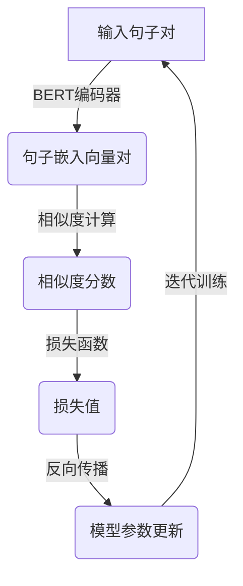

# Transformer大模型实战 用Sentence-BERT模型寻找类似句子

## 1.背景介绍

在自然语言处理(NLP)领域中,寻找语义相似的句子是一项非常重要的任务。它在诸多应用场景中扮演着关键角色,例如问答系统、文本聚类、信息检索等。传统的方法通常依赖于词袋模型(Bag-of-Words)或者 N-gram 模型来计算句子之间的相似度,但这些方法存在明显缺陷,无法很好地捕捉语义层面的相似性。

随着深度学习技术的不断发展,基于神经网络的句子嵌入模型(Sentence Embedding)应运而生,它能够将一个句子映射到一个固定长度的密集向量空间中,使得语义相似的句子在该向量空间中彼此靠近。Sentence-BERT 就是一种先进的句子嵌入模型,它建立在 BERT 的基础之上,通过对预训练的 BERT 模型进行微调,使其能够生成更加精确的句子嵌入向量,从而提高了句子相似度计算的准确性。

### 1.1 句子嵌入的重要性

句子嵌入模型在自然语言处理领域扮演着重要角色,主要有以下几个原因:

1. **语义保留**: 句子嵌入能够很好地保留句子的语义信息,使得语义相似的句子在向量空间中彼此靠近。这为后续的相似度计算和语义理解奠定了基础。

2. **数据压缩**: 将一个可变长度的句子映射到一个固定长度的向量空间中,实现了数据的压缩和简化,降低了后续处理的复杂度。

3. **数据表示**: 将文本数据映射到连续的向量空间中,使得它们可以被机器学习模型高效地处理和理解。

4. **迁移学习**: 预训练的句子嵌入模型可以作为其他自然语言处理任务的基础模型,通过微调的方式快速适应新的任务,提高了模型的泛化能力。

### 1.2 Sentence-BERT 模型简介

Sentence-BERT 是一种基于 BERT 的句子嵌入模型,它通过对预训练的 BERT 模型进行微调,使其能够生成更加精确的句子嵌入向量。与传统的 BERT 模型不同,Sentence-BERT 在训练过程中采用了一种新颖的损失函数,旨在使得语义相似的句子在向量空间中彼此靠近,而语义不相似的句子则相距较远。

Sentence-BERT 模型的核心思想是将句子对作为输入,通过 BERT 编码器生成句子嵌入向量,然后计算这些向量之间的相似度。在训练过程中,模型会最小化语义相似的句子对之间的相似度损失,同时最大化语义不相似的句子对之间的相似度损失。通过这种方式,Sentence-BERT 能够学习到更加精确的句子表示,从而提高了句子相似度计算的准确性。

## 2.核心概念与联系

### 2.1 BERT 模型

BERT (Bidirectional Encoder Representations from Transformers) 是一种基于 Transformer 结构的预训练语言模型,它能够有效地捕捉文本中的上下文信息,并生成高质量的语义表示。BERT 模型采用了双向编码器,即在生成每个单词的表示时,都会考虑其左右上下文信息,这与传统的单向语言模型不同。

BERT 模型的核心思想是通过预训练的方式,在大规模无标注语料库上学习通用的语言表示,然后将这些预训练的表示迁移到下游的自然语言处理任务中,通过微调的方式快速适应新的任务。BERT 模型在诸多自然语言处理任务上取得了卓越的性能,包括文本分类、问答系统、机器翻译等。

### 2.2 Transformer 结构

Transformer 是一种全新的序列到序列(Sequence-to-Sequence)模型架构,它完全基于注意力机制(Attention Mechanism)构建,不再依赖于循环神经网络(RNN)或者卷积神经网络(CNN)。Transformer 模型具有并行计算的优势,能够更好地捕捉长距离依赖关系,同时避免了梯度消失或梯度爆炸的问题。

Transformer 的核心组件包括编码器(Encoder)和解码器(Decoder)。编码器负责将输入序列映射到一个连续的表示空间中,而解码器则根据编码器的输出生成目标序列。编码器和解码器都由多个相同的层组成,每一层都包含了多头注意力机制(Multi-Head Attention)和前馈神经网络(Feed-Forward Neural Network)。

### 2.3 句子嵌入与相似度计算

句子嵌入是将一个可变长度的句子映射到一个固定长度的密集向量空间中,使得语义相似的句子在该向量空间中彼此靠近。句子嵌入模型通常基于神经网络结构,能够有效地捕捉句子的语义信息。

在获得句子嵌入向量之后,我们可以计算不同句子之间的相似度。常用的相似度计算方法包括余弦相似度(Cosine Similarity)、欧几里得距离(Euclidean Distance)等。相似度的值越大,表示两个句子在语义上越相似。

### 2.4 Sentence-BERT 与 BERT 的关系

Sentence-BERT 模型是在预训练的 BERT 模型的基础上进行微调而来的。它利用了 BERT 模型强大的语义表示能力,同时通过设计新颖的损失函数和训练策略,使得生成的句子嵌入向量能够更好地反映句子之间的语义相似度。

具体来说,Sentence-BERT 在训练过程中,将语义相似的句子对作为正样本,语义不相似的句子对作为负样本,通过最小化正样本之间的相似度损失,同时最大化负样本之间的相似度损失,从而使得模型能够学习到更加精确的句子表示。

## 3.核心算法原理具体操作步骤

### 3.1 Sentence-BERT 模型架构

Sentence-BERT 模型的架构如下图所示:

1. 输入句子对: 将语义相似和不相似的句子对作为输入,送入 BERT 编码器。

2. BERT 编码器: 利用预训练的 BERT 模型,对输入的句子对进行编码,生成对应的句子嵌入向量对。

3. 相似度计算: 计算句子嵌入向量对之间的相似度分数,常用的方法包括余弦相似度、欧几里得距离等。

4. 损失函数: 设计一种新颖的损失函数,使得语义相似的句子对之间的相似度分数最大化,而语义不相似的句子对之间的相似度分数最小化。

5. 反向传播: 根据计算得到的损失值,通过反向传播算法更新 BERT 模型的参数。

6. 迭代训练: 重复上述过程,不断优化模型参数,直到模型收敛或达到预期的性能。

### 3.2 损失函数设计

Sentence-BERT 模型的核心创新之处在于设计了一种新颖的损失函数,能够有效地指导模型学习到更加精确的句子表示。该损失函数包含两个部分:

1. **正样本损失**: 对于语义相似的句子对,我们希望它们在向量空间中彼此靠近,因此需要最小化它们之间的相似度损失。具体来说,我们计算两个句子嵌入向量之间的余弦相似度,然后最小化它们与理想相似度 (通常设置为 1) 之间的差距。

   $$L_{pos} = \sum_{(s_i, s_j) \in D_{pos}} \max(0, \delta - \cos(u_i, u_j))$$

   其中 $D_{pos}$ 表示语义相似的句子对集合,$(s_i, s_j)$ 是其中的一对句子, $u_i$ 和 $u_j$ 分别表示它们的句子嵌入向量, $\cos(u_i, u_j)$ 是两个向量之间的余弦相似度, $\delta$ 是一个超参数,用于控制相似度的margin。

2. **负样本损失**: 对于语义不相似的句子对,我们希望它们在向量空间中相距较远,因此需要最大化它们之间的相似度损失。具体来说,我们计算两个句子嵌入向量之间的余弦相似度,然后最大化它们与理想相似度 (通常设置为 0) 之间的差距。

   $$L_{neg} = \sum_{(s_i, s_j) \in D_{neg}} \max(0, \cos(u_i, u_j) - \epsilon)$$

   其中 $D_{neg}$ 表示语义不相似的句子对集合,$(s_i, s_j)$ 是其中的一对句子, $u_i$ 和 $u_j$ 分别表示它们的句子嵌入向量, $\cos(u_i, u_j)$ 是两个向量之间的余弦相似度, $\epsilon$ 是一个超参数,用于控制相似度的margin。

最终的损失函数是正样本损失和负样本损失的加权和:

$$L = L_{pos} + \lambda L_{neg}$$

其中 $\lambda$ 是一个超参数,用于平衡正样本损失和负样本损失的权重。

通过最小化这个损失函数,Sentence-BERT 模型能够学习到更加精确的句子表示,使得语义相似的句子在向量空间中彼此靠近,而语义不相似的句子则相距较远。

### 3.3 训练数据构建

为了训练 Sentence-BERT 模型,我们需要构建一个包含语义相似和不相似句子对的数据集。常见的数据构建方法包括:

1. **自然语言推理数据集**: 利用自然语言推理(Natural Language Inference, NLI)数据集,将前提(premise)和假设(hypothesis)句子对视为语义相似或不相似的样本。

2. **问答数据集**: 从问答数据集中提取问题和答案句子对,将它们视为语义相似的样本。同时,可以构造负样本,即将问题与其他无关的答案句子配对。

3. **机器翻译数据集**: 利用平行语料库,将源语言句子与其对应的目标语言句子视为语义相似的样本。

4. **句子对生成**: 通过规则或模板生成语义相似和不相似的句子对,例如通过同义替换、句子扰动等方式。

在构建训练数据时,需要注意平衡正负样本的比例,并确保数据的多样性和质量,以避免模型过拟合或偏差。

### 3.4 模型微调

虽然 Sentence-BERT 模型是在预训练的 BERT 模型的基础上进行微调的,但是由于损失函数的改变,我们需要对整个模型进行端到端的训练。具体的训练步骤如下:

1. **初始化**: 使用预训练的 BERT 模型参数初始化 Sentence-BERT 模型。

2. **数据准备**: 准备好语义相似和不相似的句子对数据集,将其分为训练集、验证集和测试集。

3. **模型输入**: 将句子对输入到 BERT 编码器中,获得对应的句子嵌入向量对。

4. **相似度计算**: 计算句子嵌入向量对之间的相似度分数,例如使用余弦相似度。

5. **损失计算**: 根据设计的损失函数,计算正样本损失和负样本损失,并将它们加权求和得到总体损失值。

6. **梯度更新**: 使用优化算法(如 Adam)计算损失值相对于模型参数的梯度,并更新模型参数。

7. **迭代训练**: 重复步骤 3-6,直到模型收敛或达到预期的性能。

在训练过程中,我们可以监控验证集上的性能指标,如相似度计算的准确率或平均相似度分数,并根据需要调整超参数或停止训练。

## 4.数学模型和公式详细讲解举例说明

在 Sentence-BERT 模型中,我们需要计算句子