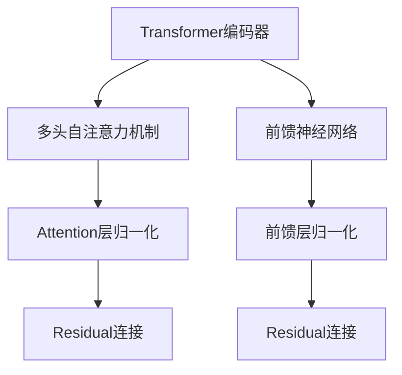
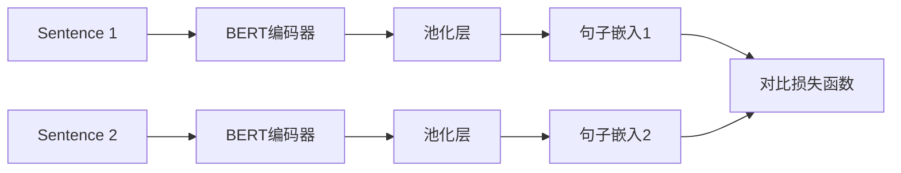

# Transformer大模型实战 用Sentence-BERT模型生成句子特征

## 1.背景介绍

### 1.1 自然语言处理的重要性

在当今的数字时代,自然语言处理(NLP)已经成为人工智能领域最重要和最具挑战性的研究方向之一。随着海量文本数据的快速增长,高效地处理和理解自然语言对于许多应用程序至关重要,例如机器翻译、问答系统、文本分类、情感分析等。

### 1.2 语义表示的挑战

传统的NLP模型通常依赖于手工设计的特征工程,这种方法存在一些固有的局限性。首先,手工特征工程是一个耗时且容易出错的过程。其次,这些特征通常无法很好地捕捉语义和上下文信息。因此,需要一种更加通用和有效的方法来自动学习语义表示。

### 1.3 Transformer模型的兴起

2017年,Transformer模型在机器翻译任务中取得了突破性的成果,展现了其强大的语义建模能力。Transformer完全基于注意力机制,摒弃了传统序列模型中的循环和卷积结构,大大提高了并行计算能力。自此,Transformer模型在NLP领域掀起了一场革命,并衍生出一系列预训练语言模型,如BERT、GPT等。

## 2.核心概念与联系

### 2.1 Transformer编码器

Transformer的核心组件是编码器(Encoder)和解码器(Decoder),两者都由多个相同的层组成。每一层包含两个子层:多头自注意力机制(Multi-Head Attention)和前馈神经网络(Feed-Forward Neural Network)。



编码器的输入是源序列,通过多头自注意力机制捕捉输入序列中的长程依赖关系,前馈神经网络则对每个位置的表示进行非线性变换。

### 2.2 Sentence-BERT

Sentence-BERT是一种用于生成句子嵌入的模型,它基于BERT预训练模型和对比学习策略。与BERT的双向编码器不同,Sentence-BERT采用Siamese网络结构,将两个句子并行输入到两个相同的BERT模型中,然后通过对比损失函数训练,使得语义相似的句子在嵌入空间中更加靠近。



通过对比学习,Sentence-BERT可以生成更加通用和语义丰富的句子表示,广泛应用于句子相似度计算、聚类、检索等任务。

## 3.核心算法原理具体操作步骤

### 3.1 输入表示

Sentence-BERT的输入是一对句子,首先需要将它们转换为BERT模型可接受的形式。具体步骤如下:

1. 对每个句子进行分词,得到词元(token)序列。
2. 在序列首部添加特殊的`[CLS]`标记,用于获取整个句子的表示。
3. 在序列末尾添加特殊的`[SEP]`标记,用于分隔两个句子。
4. 将词元映射为对应的词元嵌入(token embedding)。
5. 添加位置嵌入(position embedding)和句子嵌入(segment embedding)。

### 3.2 BERT编码器

将表示后的输入序列输入到BERT编码器中,BERT编码器由多个相同的Transformer编码器层组成。每一层包含以下步骤:

1. **多头自注意力机制**:计算输入序列中每个词元与其他词元的注意力权重,捕捉长程依赖关系。
2. **残差连接与层归一化**:将注意力输出与输入相加,然后进行层归一化。
3. **前馈神经网络**:对每个位置的表示进行非线性变换。
4. **残差连接与层归一化**:将前馈输出与上一步输出相加,然后进行层归一化。

### 3.3 池化与对比损失

经过BERT编码器后,我们获得了每个位置的上下文表示。对于句子级别的任务,需要将这些表示聚合为一个固定长度的句子嵌入向量。Sentence-BERT采用了简单的平均池化或`[CLS]`标记的表示作为句子嵌入。

然后,将两个句子的嵌入向量输入到对比损失函数中进行训练。对比损失函数的目标是使得语义相似的句子在嵌入空间中更加靠近,而语义不相似的句子更加远离。常用的对比损失函数有对比交叉熵损失(Contrastive Cross-Entropy Loss)和三元组损失(Triplet Loss)等。

通过对比学习,Sentence-BERT可以生成更加通用和语义丰富的句子表示,广泛应用于句子相似度计算、聚类、检索等任务。

## 4.数学模型和公式详细讲解举例说明

### 4.1 自注意力机制

自注意力机制是Transformer模型的核心,它允许模型捕捉输入序列中任意两个位置之间的依赖关系。给定一个长度为n的输入序列$X = (x_1, x_2, \dots, x_n)$,自注意力机制首先计算查询(Query)、键(Key)和值(Value)向量:

$$
\begin{aligned}
Q &= XW^Q\\
K &= XW^K\\
V &= XW^V
\end{aligned}
$$

其中$W^Q$、$W^K$和$W^V$是可学习的权重矩阵。然后,计算查询和键之间的点积,经过缩放和softmax操作得到注意力权重:

$$
\text{Attention}(Q, K, V) = \text{softmax}\left(\frac{QK^\top}{\sqrt{d_k}}\right)V
$$

其中$d_k$是缩放因子,用于防止点积的值过大或过小。最后,将注意力权重与值向量相乘,得到每个位置的注意力表示。

多头注意力机制是将多个注意力头的输出进行拼接,从而允许模型从不同的表示子空间中捕捉不同的信息:

$$
\text{MultiHead}(Q, K, V) = \text{Concat}(\text{head}_1, \dots, \text{head}_h)W^O
$$

其中$\text{head}_i = \text{Attention}(QW_i^Q, KW_i^K, VW_i^V)$,而$W_i^Q$、$W_i^K$、$W_i^V$和$W^O$都是可学习的权重矩阵。

### 4.2 对比损失函数

对比损失函数是Sentence-BERT训练中的关键,它的目标是使得语义相似的句子在嵌入空间中更加靠近,而语义不相似的句子更加远离。常用的对比损失函数有对比交叉熵损失和三元组损失。

**对比交叉熵损失**

对于一个包含$N$个句子对的小批量数据,对比交叉熵损失定义为:

$$
\mathcal{L}_\text{CE} = -\frac{1}{N}\sum_{i=1}^N\log\frac{e^{\text{sim}(u_i, v_i)/\tau}}{\sum_{j=1}^{2N}e^{\text{sim}(u_i, v_j)/\tau}}
$$

其中$u_i$和$v_i$是第$i$个句子对的嵌入向量,$\text{sim}(\cdot, \cdot)$是相似度函数(如余弦相似度),$\tau$是温度超参数,用于控制相似度分数的缩放程度。

**三元组损失**

三元组损失的思想是,对于一个锚句子$a$,与它语义相似的正例句子$p$应该比与它语义不相似的负例句子$n$更加靠近。形式化地,三元组损失定义为:

$$
\mathcal{L}_\text{triplet} = \sum_{(a, p, n)}\max\left(0, \text{dist}(a, p) - \text{dist}(a, n) + \text{margin}\right)
$$

其中$\text{dist}(\cdot, \cdot)$是距离函数(如欧氏距离或余弦距离),$\text{margin}$是一个超参数,用于控制正负例之间的最小距离边界。

通过优化这些对比损失函数,Sentence-BERT可以学习到更加通用和语义丰富的句子表示。

## 5.项目实践:代码实例和详细解释说明

在这一节,我们将展示如何使用Sentence-BERT生成句子嵌入,并基于这些嵌入计算句子相似度。我们将使用Python编程语言和PyTorch深度学习框架。

### 5.1 安装依赖库

首先,我们需要安装所需的Python库:

```bash
pip install sentence-transformers
```

### 5.2 加载预训练模型

接下来,我们加载一个预训练的Sentence-BERT模型:

```python
from sentence_transformers import SentenceTransformer

model = SentenceTransformer('all-MiniLM-L6-v2')
```

这里我们使用了`all-MiniLM-L6-v2`模型,它是一个基于MiniLM预训练模型的轻量级Sentence-BERT变体,具有良好的性能和效率。

### 5.3 生成句子嵌入

现在,我们可以使用加载的模型生成句子嵌入了。给定一个句子列表,我们可以一次性获得所有句子的嵌入向量:

```python
sentences = ['This is an example sentence', 'Each sentence is encoded as a vector']
sentence_embeddings = model.encode(sentences)
```

`sentence_embeddings`是一个形状为`(num_sentences, embedding_dim)`的NumPy数组,其中每一行对应一个句子的嵌入向量。

### 5.4 计算句子相似度

有了句子嵌入,我们就可以计算任意两个句子之间的相似度了。这里我们使用余弦相似度作为相似度度量:

```python
from scipy.spatial.distance import cdist
import numpy as np

# 计算句子嵌入之间的余弦距离
cos_distances = cdist(sentence_embeddings, sentence_embeddings, metric='cosine')

# 将距离转换为相似度
cos_similarities = 1 - cos_distances

# 打印相似度矩阵
print(cos_similarities)
```

输出结果是一个对称矩阵,对角线元素为1(表示与自身完全相似),其余元素值介于0和1之间,值越大表示两个句子越相似。

### 5.5 示例应用:句子聚类

基于句子嵌入,我们可以实现许多有趣的应用,例如句子聚类。我们将使用K-Means算法对一组句子进行聚类:

```python
from sklearn.cluster import KMeans

# 定义一些示例句子
sentences = [
    "This is an example sentence about machine learning",
    "Another sentence about natural language processing",
    "A third sentence related to deep learning",
    "Yet another sentence discussing artificial intelligence",
    "This sentence is not related to AI or machine learning"
]

# 生成句子嵌入
sentence_embeddings = model.encode(sentences)

# 执行K-Means聚类
num_clusters = 2
clustering_model = KMeans(n_clusters=num_clusters)
clustering_model.fit(sentence_embeddings)
cluster_assignments = clustering_model.labels_

# 打印聚类结果
for sentence_id, cluster_id in enumerate(cluster_assignments):
    print(f"Sentence {sentence_id}: '{sentences[sentence_id]}' \t Cluster: {cluster_id}")
```

在这个示例中,我们首先定义了5个句子,其中4个与机器学习/自然语言处理相关,1个与之无关。然后,我们使用Sentence-BERT模型生成句子嵌入,并基于这些嵌入执行K-Means聚类。最后,我们打印每个句子及其所属的聚类ID。

您应该会看到类似如下的输出:

```
Sentence 0: 'This is an example sentence about machine learning' 	 Cluster: 0
Sentence 1: 'Another sentence about natural language processing' 	 Cluster: 0
Sentence 2: 'A third sentence related to deep learning' 	 Cluster: 0
Sentence 3: 'Yet another sentence discussing artificial intelligence' 	 Cluster: 0
Sentence 4: 'This sentence is not related to AI or machine learning' 	 Cluster: 1
```

可以看到,与机器学习/自然语言处理相关的4个句子被正确地聚类到了同一个簇,