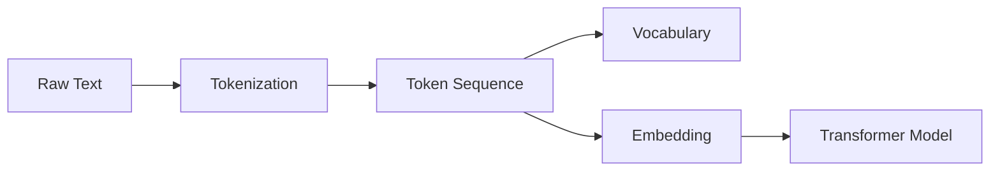

# Transformer大模型实战 输入数据

## 1.背景介绍
近年来,随着深度学习技术的快速发展,尤其是Transformer模型的出现,自然语言处理(NLP)领域取得了巨大的突破。Transformer模型凭借其强大的并行计算能力和长距离依赖捕捉能力,在机器翻译、文本摘要、问答系统等任务上取得了state-of-the-art的表现。

然而,训练一个高质量的Transformer大模型并非易事。其中一个关键因素就是输入数据的质量。高质量的训练数据集是训练出优秀模型的基础。本文将深入探讨Transformer大模型训练中输入数据的各个方面,帮助大家更好地理解和准备训练数据,提升模型性能。

### 1.1 Transformer模型简介
### 1.2 输入数据对模型性能的影响
### 1.3 本文结构安排

## 2.核心概念与联系
要讨论Transformer模型的输入数据,首先需要了解几个核心概念:

### 2.1 Token
Token是NLP中的最小处理单元,可以是一个字、词或subword。Transformer模型的输入是token的序列。

### 2.2 Vocabulary 
Vocabulary是模型训练过程中出现的所有unique token的集合。vocabulary的大小是一个重要的超参数。

### 2.3 Tokenization
Tokenization是将原始文本转化为token序列的过程。常见的tokenization算法有BPE, WordPiece等。

### 2.4 Embedding
Embedding将token映射为连续的向量表示,作为模型的输入。Transformer中使用learned positional embedding。

下图展示了这些概念之间的关系:



## 3.核心算法原理具体操作步骤
构建Transformer模型的输入数据,一般需要以下步骤:

### 3.1 语料收集与清洗
收集大规模高质量的文本语料,并进行必要的清洗,如去除HTML标签,去除特殊字符,断句等。

### 3.2 Tokenization
选择合适的tokenization算法对语料进行切分。以BPE为例,主要步骤如下:

1. 将单词拆分为字符序列,在末尾添加后缀"</w>"
2. 统计每个连续字符对的频率 
3. 将频率最高的字符对合并为新的subword
4. 重复第2步和第3步,直到达到预设的subword词表大小或下一个最高频率低于某个阈值

### 3.3 Vocabulary构建
基于上一步得到的token,统计各token的频率,根据预设的vocabulary大小,保留频率最高的token构成vocabulary。

### 3.4 Embedding
对每个token进行embedding。Transformer使用learnable的positional embedding,对token的位置进行编码。

## 4.数学模型和公式详细讲解举例说明
### 4.1 Byte Pair Encoding(BPE)
BPE是一种基于统计的tokenization算法,通过迭代地合并最频繁的连续字节对,来平衡vocabulary大小和OOV问题。

给定语料 $D$,初始化词表 $V=\{c_1,c_2,...,c_n\}$,其中 $c_i$ 为单个字符。不断重复以下步骤,直到达到预设的subword数量:

1. 统计 $V$ 中每一对连续subword的频率 $F(s_i, s_j), s_i,s_j \in V$
2. 选择频率最高的subword对 $(s_i,s_j)=\mathop{\arg\max}\limits_{s_i,s_j} F(s_i,s_j)$  
3. 将所有 $s_is_j$ 合并为新的subword $s_{ij}$,加入 $V$

例如,单词"unrelated"的BPE分词过程:

```
u n r e l a t e d </w>
u n - r e - l a t e d </w>
un - re - l a t e d </w>
un - re - lat e d </w>
unre - lat e d </w>
unrelat e d </w>
unrelated </w>
```

### 4.2 Positional Embedding
Transformer中使用正弦函数和余弦函数来编码位置信息:

$$
PE_{(pos,2i)} = sin(pos/10000^{2i/d_{model}})
$$

$$
PE_{(pos,2i+1)} = cos(pos/10000^{2i/d_{model}})
$$

其中 $pos$ 为token的位置, $i$ 为embedding的维度, $d_{model}$ 为embedding的总维度。

## 5.项目实践：代码实例和详细解释说明
下面以PyTorch为例,展示如何使用BPE算法进行tokenization并生成positional embedding:

```python
import re
from collections import defaultdict, Counter

def get_stats(vocab):
    pairs = defaultdict(int)
    for word, freq in vocab.items():
        symbols = word.split()
        for i in range(len(symbols)-1):
            pairs[symbols[i],symbols[i+1]] += freq
    return pairs

def merge_vocab(pair, v_in):
    v_out = {}
    bigram = re.escape(' '.join(pair))
    p = re.compile(r'(?<!\S)' + bigram + r'(?!\S)')
    for word in v_in:
        w_out = p.sub(''.join(pair), word)
        v_out[w_out] = v_in[word]
    return v_out

def get_vocabulary(fpath, vocab_size):
    vocab = Counter()
    with open(fpath, 'r', encoding='utf-8') as f:
        for line in f:
            for word in line.split():
                vocab[' '.join(list(word)) + ' </w>'] += 1

    for i in range(vocab_size):
        pairs = get_stats(vocab)
        best = max(pairs, key=pairs.get)
        vocab = merge_vocab(best, vocab)

    return vocab

vocab = get_vocabulary('train.txt', 10000)

import torch
import numpy as np

def get_sinusoid_encoding_table(n_position, d_model):
    def cal_angle(position, hid_idx):
        return position / np.power(10000, 2 * (hid_idx // 2) / d_model)
    def get_posi_angle_vec(position):
        return [cal_angle(position, hid_j) for hid_j in range(d_model)]

    sinusoid_table = np.array([get_posi_angle_vec(pos_i) for pos_i in range(n_position)])
    sinusoid_table[:, 0::2] = np.sin(sinusoid_table[:, 0::2])  # dim 2i
    sinusoid_table[:, 1::2] = np.cos(sinusoid_table[:, 1::2])  # dim 2i+1
    return torch.FloatTensor(sinusoid_table)

d_model = 512
n_position = 1024
pos_emb = get_sinusoid_encoding_table(n_position, d_model)
```

上面的代码实现了BPE算法,可以基于训练语料构建subword vocabulary。然后使用正弦/余弦函数生成positional embedding矩阵。最终得到的`vocab`和`pos_emb`可以用于Transformer模型的输入。

## 6.实际应用场景
高质量的输入数据在Transformer模型的实际应用中至关重要,主要场景包括:

### 6.1 机器翻译
训练机器翻译模型时,需要大规模的平行语料,即大量成对的源语言和目标语言句子。语料的质量和数量对翻译性能有很大影响。

### 6.2 文本摘要
文本摘要任务需要大量带摘要的文章语料。摘要的质量和风格直接影响模型生成的摘要。 

### 6.3 对话系统
训练聊天机器人等对话系统,需要大量高质量的对话数据,包括多轮对话。对话数据的口语化、领域多样性等特点,对模型效果有较大影响。

### 6.4 语言模型预训练
预训练语言模型如BERT、GPT等,需要在大规模通用语料上进行预训练,学习通用的语言知识,再针对下游任务进行微调。预训练语料的覆盖领域、质量等对模型性能影响很大。

## 7.工具和资源推荐
以下是一些常用的NLP数据集和处理工具:

### 数据集
- WMT:机器翻译领域常用的数据集,包含多个语言对
- CNN/DailyMail:常用于文本摘要任务的新闻文章数据集
- SQuAD:问答领域常用数据集 
- OpenWebText:从Reddit抓取的大规模英文语料,常用于语言模型预训练

### 工具
- Moses:机器翻译领域常用的数据处理工具
- NLTK:自然语言处理工具包,提供多种文本预处理功能  
- Spacy:工业级自然语言处理库,提供多语言支持
- Tokenizers:Huggingface出品的高性能tokenization库
- Datasets:Huggingface提供的NLP数据集库,可以方便地访问和预处理数百个常用数据集

## 8.总结：未来发展趋势与挑战
### 8.1 数据质量与模型鲁棒性
尽管Transformer模型在多个NLP任务上取得了很好的表现,但其性能在很大程度上依赖高质量的训练数据。低质、含噪声的数据会严重影响模型的泛化能力。如何提升模型的鲁棒性,减少对数据质量的依赖,是未来的一个重要研究方向。

### 8.2 数据隐私与安全
大规模语料的收集不可避免地涉及用户隐私数据的收集与使用。如何在保证数据安全隐私的前提下,进行数据收集、清洗和使用,是一个亟待解决的问题。联邦学习、差分隐私等技术为此提供了一些思路。

### 8.3 低资源语言的数据问题  
目前高质量的NLP数据集多集中在英语等高资源语言,但全世界存在几千种语言,其中大部分是低资源语言,缺乏大规模标注数据。如何利用零样本学习、数据增强等技术,解决低资源语言的数据问题,是一个重要的研究课题。

### 8.4 数据与计算效率
Transformer模型参数量大,训练和推理成本高。处理大规模语料需要消耗大量的存储和计算资源。因此,研究数据和模型的压缩、量化、稀疏化等技术,提高数据处理和模型训练的效率,也是一个值得关注的方向。

## 9.附录：常见问题与解答
### Q1:如何选择subword的粒度?
A:这取决于任务和语言。粒度越细(如字符级),单词拆分越细,vocab会越大,OOV越少,但平均序列长度会变长,训练和推理耗时增加。粒度越粗(如词级),vocab会小,序列短,但OOV多。一般选择BPE算法,平衡粒度,控制在1万到5万subword左右。

### Q2:不同语言应该如何选择tokenization算法?
A:对于英语、西班牙语等拉丁语系,可以使用BPE、WordPiece等基于subword的算法。对于中文、日文等,可以考虑使用字级或词级的分词算法。一些语言如阿拉伯语、梵文等,具有复杂的词形变化,需要考虑更加复杂的分词算法。

### Q3:哪些因素会影响vocabulary的大小?
A:主要有以下几点:
- 语料的规模和领域多样性:语料越大、涵盖领域越广,需要的vocab会越大
- 语言:英语等语言的词形变化相对简单,词表可以小一些。一些语言有复杂的词形变化,可能需要更大的词表
- Tokenization粒度:越细粒度,单词拆分越细,vocab越大
- OOV词的处理:是否使用 UNK 替换OOV,阈值设置多少,都会影响vocab大小

### Q4:如何高效地存储和读取大规模语料?
A:可以考虑以下几点:  
- 使用二进制格式而非纯文本格式存储,如TFRecord、recordIO等,可以显著提高读取速度
- 大文件可以切分成多个小文件,提高读取并行度
- 利用压缩算法如GZIP、bzip2等,在磁盘和内存间做trade-off
- 内存充足的情况下,可以考虑将全部数据载入内存,使用内存数据结构(如NumPy数组)提高随机访问速度
- 对于超大数据集,可以只载入一部分到内存,剩余部分使用mmap映射到内存

作者：禅与计算机程序设计艺术 / Zen and the Art of Computer Programming