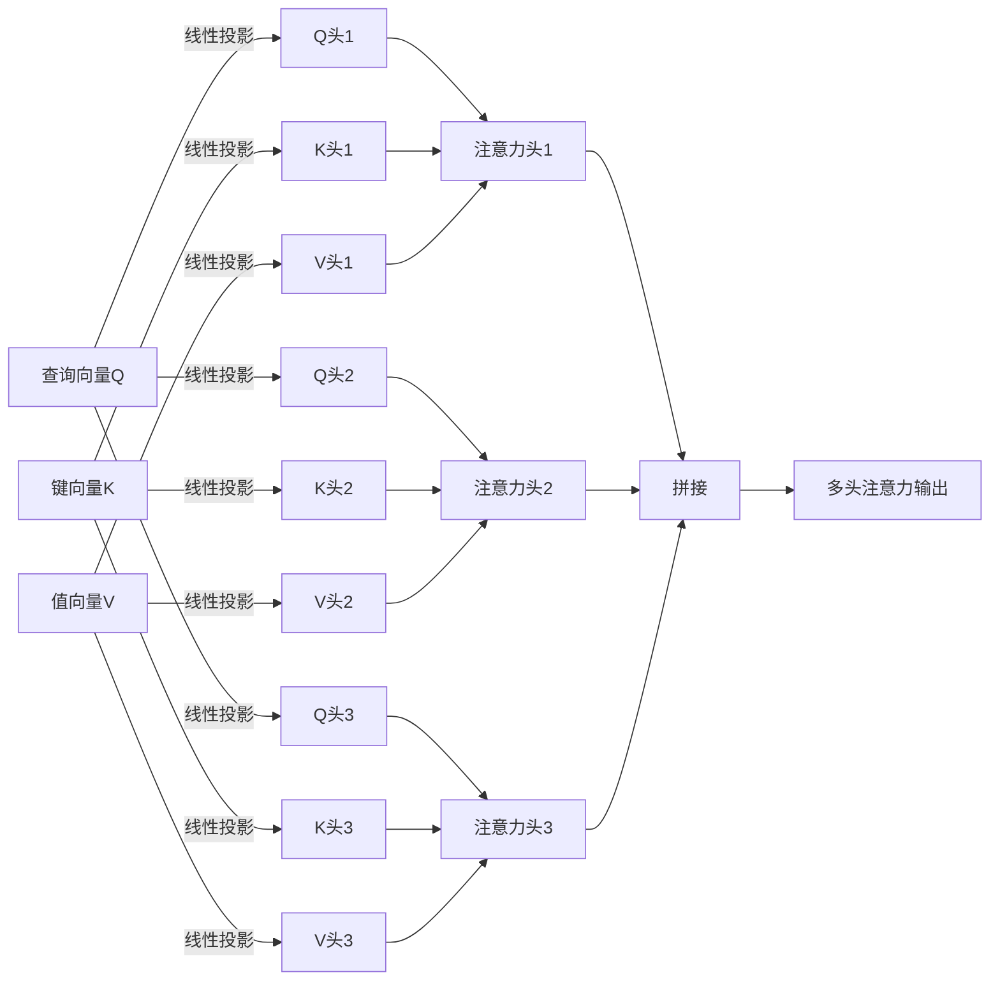

# Transformer大模型实战 通过位置编码来学习位置

## 1.背景介绍

### 1.1 序列建模的重要性

在自然语言处理、语音识别、机器翻译等众多任务中,我们需要处理序列数据。与传统的固定维度数据不同,序列数据具有可变长度的特点,因此需要特殊的建模方式。序列建模旨在从序列数据中捕获有价值的模式和规律,为下游任务提供有用的表示。

### 1.2 RNN和LSTM的局限性

早期,循环神经网络(RNN)及其变种长短期记忆网络(LSTM)被广泛应用于序列建模。它们通过递归地处理序列中的每个位置,理论上能够捕获任意长度的依赖关系。然而,在实践中RNN/LSTM存在以下局限:

- 无法完全解决长期依赖问题
- 训练过程中存在梯度消失/爆炸问题
- 无法完全并行化计算,效率较低
- 对输入序列的长度有限制

### 1.3 Transformer的提出

为了克服RNN/LSTM的缺陷,2017年Transformer被提出并迅速在多个领域获得应用。Transformer完全基于注意力机制,摒弃了RNN的递归结构,可以高效并行化,同时通过位置编码来学习序列中元素的位置信息。自从提出以来,Transformer已成为序列建模的主流模型。

## 2.核心概念与联系

### 2.1 注意力机制(Attention Mechanism)

注意力机制是Transformer的核心,它允许模型在编码序列时,对不同位置的输入元素赋予不同的权重。具体来说,在计算某个位置的表示时,模型会参考其他所有位置的表示,并根据它们的关联程度赋予不同的注意力权重。

$$\mathrm{Attention}(Q,K,V)=\mathrm{softmax}(\frac{QK^T}{\sqrt{d_k}})V$$

其中 $Q$ 为查询(Query)向量, $K$ 为键(Key)向量, $V$ 为值(Value)向量。注意力权重由 $Q$ 和 $K$ 的点积得到,再通过 softmax 函数归一化。最终的注意力表示是所有 $V$ 向量的加权和。

### 2.2 多头注意力(Multi-Head Attention)

为了提高模型的表达能力,Transformer采用了多头注意力机制。具体来说,将查询/键/值向量先通过不同的线性投影分别得到多组 $Q$、$K$、$V$,然后分别计算注意力,最后将所有注意力表示拼接起来。

### 2.3 编码器-解码器架构(Encoder-Decoder Architecture)

对于序列到序列的任务(如机器翻译),Transformer采用编码器-解码器架构。编码器用于编码输入序列,解码器则根据编码器的输出生成目标序列。

编码器由多个相同的层组成,每一层包含多头自注意力(Self-Attention)和前馈网络(Feed-Forward Network)。解码器除了这两个子层外,还包含一个对编码器输出的注意力子层。

## 3.核心算法原理具体操作步骤

### 3.1 输入表示

在输入序列进入Transformer模型之前,需要将其转化为词嵌入向量的序列。另外,由于Transformer没有循环或卷积结构,无法直接获取序列中元素的位置信息,因此需要添加位置编码。

位置编码是一个将位置信息编码为向量的函数,将其与词嵌入向量相加,就能获得含有位置信息的输入表示。常用的位置编码函数有:

- 正弦/余弦函数编码
- 学习的位置嵌入向量

### 3.2 编码器(Encoder)

编码器由 $N$ 个相同的层组成,每一层包含两个子层:

1. **多头自注意力(Multi-Head Self-Attention)**

   计算公式为:

   $$\mathrm{MultiHead}(Q,K,V)=\mathrm{Concat}(head_1,...,head_h)W^O$$
   $$\text{where } head_i=\mathrm{Attention}(QW_i^Q,KW_i^K,VW_i^V)$$

   其中 $W_i^Q\in\mathbb{R}^{d_\text{model}\times d_k}, W_i^K\in\mathbb{R}^{d_\text{model}\times d_k}, W_i^V\in\mathbb{R}^{d_\text{model}\times d_v}, W^O\in\mathbb{R}^{hd_v\times d_\text{model}}$ 为可训练参数。

   自注意力机制允许模型在编码某个位置时,参考输入序列中所有其他位置的表示。

2. **前馈网络(Feed-Forward Network)**

   前馈网络包含两个全连接层,并采用ReLU激活函数:

   $$\mathrm{FFN}(x)=\max(0,xW_1+b_1)W_2+b_2$$

   其中 $W_1\in\mathbb{R}^{d_\text{model}\times d_\text{ff}}, W_2\in\mathbb{R}^{d_\text{ff}\times d_\text{model}}, b_1\in\mathbb{R}^{d_\text{ff}}, b_2\in\mathbb{R}^{d_\text{model}}$ 为可训练参数。

每个子层的输出都会经过残差连接和层归一化,以帮助模型训练。

### 3.3 解码器(Decoder)

解码器的结构与编码器类似,也由 $N$ 个相同的层组成,每一层包含三个子层:

1. **屏蔽多头自注意力(Masked Multi-Head Self-Attention)**

   与编码器的自注意力类似,但在计算当前位置的注意力权重时,屏蔽掉其后的位置。这样可以保证模型的自回归特性,即预测时只依赖之前的输出。

2. **多头注意力(Multi-Head Attention)**

   对编码器的输出进行注意力计算,获取与当前输出相关的编码器表示。

3. **前馈网络(Feed-Forward Network)**

   与编码器中的前馈网络结构相同。

同样,每个子层的输出都会经过残差连接和层归一化。

### 3.4 预测

在训练时,给定输入序列和目标序列,模型的目标是最大化目标序列的条件概率。具体地,对于机器翻译任务:

$$\begin{aligned}
\hat{y}&=\operatorname*{argmax}_{y}P(y|x)\\
&=\operatorname*{argmax}_{y}\prod_{t=1}^{T}P(y_t|y_1,...,y_{t-1},x)
\end{aligned}$$

其中 $x$ 为输入序列, $y$ 为目标序列。在预测时,模型会自回归地生成目标序列,即基于之前生成的内容和输入序列,预测下一个词的概率分布。

## 4.数学模型和公式详细讲解举例说明

在本节,我们将详细解释Transformer中使用的数学模型和公式,并给出具体的例子说明。

### 4.1 缩放点积注意力(Scaled Dot-Product Attention)

Transformer使用了一种称为缩放点积注意力(Scaled Dot-Product Attention)的注意力机制变体。具体计算公式为:

$$\mathrm{Attention}(Q,K,V)=\mathrm{softmax}(\frac{QK^T}{\sqrt{d_k}})V$$

其中 $Q\in\mathbb{R}^{n\times d_k}$ 为查询矩阵, $K\in\mathbb{R}^{m\times d_k}$ 为键矩阵, $V\in\mathbb{R}^{m\times d_v}$ 为值矩阵。$n$ 和 $m$ 分别表示查询和键值对的个数, $d_k$ 和 $d_v$ 分别为键和值的维度。

计算过程包括以下几个步骤:

1. 计算查询和键的点积: $QK^T\in\mathbb{R}^{n\times m}$
2. 对点积结果进行缩放: $\frac{QK^T}{\sqrt{d_k}}$
3. 对缩放后的点积结果应用 softmax 函数,得到注意力权重矩阵: $\mathrm{softmax}(\frac{QK^T}{\sqrt{d_k}})\in\mathbb{R}^{n\times m}$
4. 将注意力权重矩阵与值矩阵 $V$ 相乘,得到加权和作为注意力输出: $\mathrm{Attention}(Q,K,V)\in\mathbb{R}^{n\times d_v}$

缩放操作 $\frac{1}{\sqrt{d_k}}$ 的目的是为了防止较大的点积值导致 softmax 函数的梯度较小(对较大的输入,softmax的梯度会变小)。

**举例说明**

假设我们有以下查询、键和值矩阵:

$$Q=\begin{bmatrix}
1 & 2 & 3\\
4 & 5 & 6
\end{bmatrix},\quad
K=\begin{bmatrix}
7 & 8\\
9 & 10\\
11 & 12
\end{bmatrix},\quad
V=\begin{bmatrix}
13 & 14\\
15 & 16\\
17 & 18
\end{bmatrix}$$

其中 $n=2$, $m=3$, $d_k=d_v=3$。

计算过程如下:

1. $QK^T=\begin{bmatrix}
1 & 2 & 3\\
4 & 5 & 6
\end{bmatrix}\begin{bmatrix}
7 & 9 & 11\\
8 & 10 & 12
\end{bmatrix}=\begin{bmatrix}
58 & 76 & 94\\
139 & 181 & 223
\end{bmatrix}$

2. $\frac{QK^T}{\sqrt{3}}=\begin{bmatrix}
33.5 & 43.9 & 54.3\\
80.3 & 104.5 & 128.8
\end{bmatrix}$

3. $\mathrm{softmax}(\frac{QK^T}{\sqrt{3}})=\begin{bmatrix}
0.0045 & 0.0507 & 0.9448\\
0.0003 & 0.0091 & 0.9906
\end{bmatrix}$

4. $\mathrm{Attention}(Q,K,V)=\begin{bmatrix}
0.0045 & 0.0507 & 0.9448\\
0.0003 & 0.0091 & 0.9906
\end{bmatrix}\begin{bmatrix}
13 & 14\\
15 & 16\\
17 & 18
\end{bmatrix}=\begin{bmatrix}
16.9 & 17.9\\
17.0 & 18.0
\end{bmatrix}$

可以看到,注意力机制通过计算查询与键的相关性,为每个查询分配了不同的注意力权重,从而获得加权后的值作为注意力输出。

### 4.2 多头注意力(Multi-Head Attention)

为了提高模型的表达能力,Transformer采用了多头注意力机制。具体来说,将查询/键/值向量先通过不同的线性投影分别得到多组 $Q$、$K$、$V$,然后分别计算注意力,最后将所有注意力表示拼接起来。

具体计算过程如下:

1. 线性投影: 

   $$\begin{aligned}
   Q_i&=QW_i^Q&&\in\mathbb{R}^{n\times d_k}\\
   