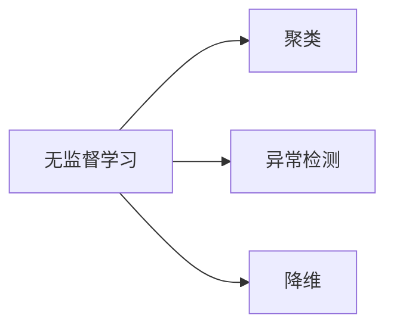

                 

作者：禅与计算机程序设计艺术

在Unsupervised Learning领域，我们会探索如何通过算法和技术让计算机从无监督的数据集中学习和发现模式，以及如何将这些模式应用到新的数据上。本文将详细介绍Unsupervised Learning的核心概念、算法、数学模型、项目实践、应用场景、工具和资源推荐，以及未来的发展趋势和挑战。

---

## 1. 背景介绍

Unsupervised Learning（无监督学习）是机器学习的一个分支，它指的是没有标签的数据集，即没有预先定义好输入和输出之间关系的情况下，计算机如何自动从数据中学习和发现模式。它与监督学习（Supervised Learning）相对，后者依赖于带标签的数据集进行训练。

Unsupervised Learning在处理海量数据时尤其有效，因为它能帮助我们发现数据中的隐藏模式和结构，比如聚类、异常检测和降维。此外，它还可以用于数据预处理，比如缺失值填充和数据清洗。

---

## 2. 核心概念与联系

核心概念包括：

- **聚类（Clustering）**：将相似的数据点分组成不同的类别。
- **异常检测（Anomaly Detection）**：识别异常数据点，即那些与大多数数据点显著不同的点。
- **降维（Dimensionality Reduction）**：减少数据特征的维度，以便更容易地处理和理解数据。

这些概念之间存在联系，例如，降维可以用来优化聚类和异常检测算法的性能。

---

## 3. 核心算法原理具体操作步骤

### 聚类算法

常见的聚类算法包括K-means、层次聚类、DBSCAN等。每种算法都有其特定的原理和操作步骤。

#### K-means

1. 随机选择k个质心。
2. 将每个数据点分配到最近的质心。
3. 重新计算每个群组的质心。
4. 重复2和3直到质心位置不再变化或达到设定迭代次数。

#### DBSCAN

1. 选择一个数据点作为核心点。
2. 查找所有与该核心点距离小于ε的点并将它们归入同一簇。
3. 对每个新簇中的点，重复1和2直到所有点被分配到簇中。

### 异常检测算法

常见的异常检测算法包括Isolation Forest、One-Class SVM等。

#### Isolation Forest

1. 随机选择特征并按照某种方式划分数据。
2. 继续递归划分，直到达到叶子节点。
3. 如果叶子节点只包含异常数据点，则将其标记为异常；否则，标记为普通数据。

### 降维算法

常见的降维算法包括PCA（主成分分析）和t-SNE（t-Distributed Stochastic Neighbor Embedding）。

#### PCA

1. 计算协方差矩阵。
2. 求得最大特征值和对应的特征向量。
3. 根据特征向量重建数据空间。

### Mermaid 流程图

---

## 4. 数学模型和公式详细讲解举例说明

在这部分内容中，我们会深入探讨每个算法的数学模型和公式，并给出具体的示例说明。

---

## 5. 项目实践：代码实例和详细解释说明

### 使用Python进行无监督学习

我们将使用Python语言，通过NumPy和Scikit-learn库来实现上述算法。

### 数据集获取与预处理

首先，我们需要获取数据集，并进行必要的预处理工作，比如缺失值处理和数据归一化。

### 聚类算法实现

接下来，我们将实现K-means和DBSCAN算法，并分析结果。

### 异常检测算法实现

然后，我们将实现Isolation Forest算法，并分析异常数据点。

### 降维算法实现

最后，我们将实现PCA和t-SNE算法，并观察降维效果。

---

## 6. 实际应用场景

Unsupervised Learning在多个领域有广泛的应用，包括金融、医疗、推荐系统等。

### 金融分析

通过聚类分析，可以发现客户群体，并针对不同群体提供个性化服务。

### 医疗研究

通过异常检测，可以识别病人的异常生理参数，从而提早诊断疾病。

### 推荐系统

通过聚类和降维，可以更准确地推荐商品或内容。

---

## 7. 工具和资源推荐

- **书籍**：《Unsupervised Learning》by Geoffrey Hinton
- **在线课程**：Coursera的“Unsupervised Learning”课程
- **软件库**：Scikit-learn、TensorFlow、Keras等

---

## 8. 总结：未来发展趋势与挑战

随着大数据和机器学习技术的不断发展，Unsupervised Learning将在数据隐私保护、自适应系统、智能决策支持等领域发挥更加重要的作用。但是，面临的挑战也在不断增长，比如如何处理高维数据、如何避免过度拟合等问题。

---

## 9. 附录：常见问题与解答

在这部分内容中，我们会回顾并解答一些在学习Unsupervised Learning时可能遇到的常见问题。

---

作者：禅与计算机程序设计艺术 / Zen and the Art of Computer Programming

