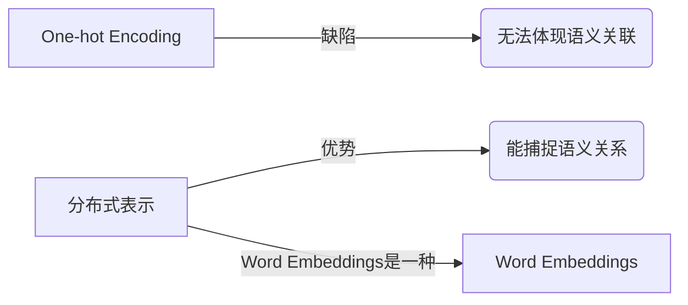

# Word Embeddings 原理与代码实战案例讲解

## 1.背景介绍

### 1.1 自然语言处理的重要性

在当今的数字时代,自然语言处理(Natural Language Processing, NLP)已经成为一个不可或缺的技术领域。它使计算机能够理解、解释和生成人类语言,为人机交互提供了强大的支持。无论是智能助手、机器翻译、情感分析还是文本生成,NLP都扮演着关键角色。

### 1.2 Word Embeddings 的出现

传统的自然语言处理方法通常将单词视为离散的符号,缺乏对单词语义的刻画。为了解决这一问题,Word Embeddings(词嵌入)应运而生。它是一种将单词映射到连续向量空间的技术,使得语义相似的单词在向量空间中彼此靠近。这种分布式表示方式为 NLP 任务提供了有价值的语义信息。

### 1.3 Word Embeddings 的重要意义

Word Embeddings 的出现极大地推动了 NLP 领域的发展。它为单词赋予了语义,使得计算机能够更好地理解和处理自然语言。这种技术已广泛应用于各种 NLP 任务,如机器翻译、文本分类、情感分析等,取得了卓越的成果。

## 2.核心概念与联系

### 2.1 One-hot Encoding 与分布式表示

在深入探讨 Word Embeddings 之前,我们需要了解 One-hot Encoding 和分布式表示(Distributed Representation)这两个概念。

- One-hot Encoding: 将单词表示为一个高维稀疏向量,其中只有一个维度为 1,其余均为 0。这种表示方式简单直观,但无法体现单词之间的语义关联。
- 分布式表示: 将单词映射到一个低维连续的向量空间中,语义相似的单词在该空间中彼此靠近。这种表示方式更加紧凑,并能捕捉单词之间的语义关系。

Word Embeddings 实际上就是一种分布式表示方法,它通过神经网络模型将单词映射到一个低维连续向量空间中。



### 2.2 Word Embeddings 的两大主流方法

目前,Word Embeddings 有两大主流方法:基于计数的方法(Count-based Methods)和基于预测的方法(Predictive Methods)。

- 基于计数的方法:通过统计单词在语料库中的共现信息,构建单词之间的关联矩阵,再对该矩阵进行矩阵分解,得到单词的向量表示。典型代表是 GloVe 模型。
- 基于预测的方法:通过神经网络模型,以单词为输入,预测它在上下文中的可能性,从而学习到单词的向量表示。典型代表是 Word2Vec 模型(包括 CBOW 和 Skip-gram 两种变体)。

这两类方法各有优缺点,在不同场景下表现也不尽相同。总的来说,基于预测的方法更加高效,能够捕捉更精细的语义信息。

## 3.核心算法原理具体操作步骤 

### 3.1 Word2Vec 原理和架构

Word2Vec 是基于神经网络的 Word Embeddings 方法,包含两种模型变体:连续词袋模型(Continuous Bag-of-Words, CBOW)和 Skip-gram 模型。

#### 3.1.1 CBOW 模型

CBOW 模型的目标是根据源单词的上下文(即前后单词的 Word Embeddings 之和)来预测源单词本身。


在训练过程中,模型会最小化预测单词和实际单词之间的误差,从而学习到每个单词的 Word Embedding。

#### 3.1.2 Skip-gram 模型

与 CBOW 相反,Skip-gram 模型的目标是根据源单词来预测它的上下文单词。


Skip-gram 模型通过最大化预测上下文单词的概率来学习 Word Embeddings。

#### 3.1.3 Word2Vec 架构

无论是 CBOW 还是 Skip-gram,Word2Vec 的核心架构都是一个浅层神经网络,包含输入层、投影层和输出层。


输入层将单词映射为 One-hot 向量,投影层将其映射为 Word Embedding 向量,输出层则根据目标函数(CBOW 或 Skip-gram)进行预测。通过反向传播算法,模型可以不断调整 Word Embeddings,最终达到最优解。

### 3.2 Word2Vec 训练细节

#### 3.2.1 负采样

由于计算每个预测单词的全量软max概率是非常耗时的操作,Word2Vec 引入了负采样(Negative Sampling)技术来加速训练。

负采样的核心思想是:对于每个正样本(源单词和上下文单词的组合),我们随机采样一些"噪声单词"作为负样本,只需要最大化正样本的概率,同时最小化负样本的概率。这种方式大大降低了计算复杂度。

#### 3.2.2 子采样

在自然语言语料中,一些常见单词(如 "the"、"a" 等)出现的频率极高,但它们对语义信息的贡献较小。为了提高训练效率,Word2Vec 采用了子采样(Subsampling)策略,按照单词频率给予一定的丢弃概率,从而减少常见单词对模型的影响。

#### 3.2.3 层序 Softmax

除了负采样之外,Word2Vec 还引入了层序 Softmax(Hierarchical Softmax)技术来加速训练。它将单词按照 Huffman 编码树的形式组织,每个单词对应一条从根节点到叶节点的路径。在预测时,只需要计算该路径上的节点概率,而不是全量 Softmax,从而大幅降低了计算复杂度。

通过这些优化技术,Word2Vec 能够高效地在大规模语料库上训练 Word Embeddings。

## 4.数学模型和公式详细讲解举例说明

### 4.1 Word2Vec 数学模型

我们以 Skip-gram 模型为例,介绍 Word2Vec 的数学模型。假设我们有一个长度为 T 的句子,记作 $w_1, w_2, \ldots, w_T$,其中 $w_t$ 表示第 t 个单词。我们的目标是最大化每个单词 $w_t$ 预测其上下文单词 $w_{t-m}, \ldots, w_{t-1}, w_{t+1}, \ldots, w_{t+m}$ 的条件概率,其中 m 是上下文窗口大小。

形式化地,我们需要最大化以下对数似然函数:

$$\mathcal{L} = \frac{1}{T}\sum_{t=1}^{T}\sum_{-m \leq j \leq m, j \neq 0} \log P(w_{t+j} | w_t)$$

其中,条件概率 $P(w_{t+j} | w_t)$ 可以通过 Softmax 函数计算:

$$P(w_O | w_I) = \frac{\exp(v_{w_O}^{\top} v_{w_I})}{\sum_{w=1}^{V} \exp(v_w^{\top} v_{w_I})}$$

这里, $v_w$ 和 $v_{w_I}$ 分别表示单词 $w$ 和 $w_I$ 的 Word Embedding 向量, V 是词表的大小。

为了加速训练,Word2Vec 采用了负采样和层序 Softmax 等技术,从而避免了计算全量 Softmax 的高昂代价。

### 4.2 Word Embeddings 的数学性质

Word Embeddings 不仅能够捕捉单词的语义信息,还具有一些有趣的数学性质。例如,通过向量运算,我们可以发现一些单词之间的语义关系。

$$\vec{king} - \vec{man} + \vec{woman} \approx \vec{queen}$$

上式表明,"king" 到 "queen" 的关系,等价于 "man" 到 "woman" 的关系。这种性质被称为"词向量的线性关系",反映了 Word Embeddings 对语义结构的刻画能力。

此外,我们还可以通过向量的余弦相似度来衡量两个单词的语义相似程度:

$$\text{sim}(w_1, w_2) = \frac{v_{w_1}^{\top} v_{w_2}}{\|v_{w_1}\| \|v_{w_2}\|}$$

余弦相似度的取值范围是 [-1, 1],值越大,说明两个单词的语义越相似。

这些数学性质为 Word Embeddings 的应用奠定了基础,也反映了它们在捕捉语义信息方面的强大能力。

## 5.项目实践:代码实例和详细解释说明

在这一部分,我们将通过实际代码示例,演示如何使用 Python 中的 Gensim 库来训练 Word2Vec 模型,并对训练好的 Word Embeddings 进行可视化和应用。

### 5.1 数据准备

首先,我们需要准备语料库数据。这里我们使用一个简单的文本文件作为示例:

```python
from gensim.test.utils import get_data_path

corpus_path = get_data_path('lee_background.cor')
```

### 5.2 训练 Word2Vec 模型

接下来,我们加载语料库数据,并使用 Gensim 库训练 Skip-gram 模型:

```python
from gensim.models import Word2Vec

sentences = Word2Vec.Text8Corpus(corpus_path)
model = Word2Vec(sentences, vector_size=100, window=5, min_count=5, workers=4)
```

这里,我们设置了以下参数:

- `vector_size`: Word Embedding 向量的维度,通常取 100 ~ 300
- `window`: 上下文窗口大小,控制考虑多少个上下文单词
- `min_count`: 忽略出现次数低于该值的单词
- `workers`: 使用多少个线程进行并行训练

### 5.3 可视化 Word Embeddings

训练完成后,我们可以使用 t-SNE 算法对 Word Embeddings 进行可视化,观察语义相似的单词在向量空间中的分布情况:

```python
import matplotlib.pyplot as plt
from sklearn.manifold import TSNE

# 获取所有单词的 Word Embeddings
word_vectors = model.wv.vectors

# 使用 t-SNE 算法降维
tsne = TSNE(n_components=2)
embeddings_2d = tsne.fit_transform(word_vectors)

# 可视化
plt.figure(figsize=(16, 9))
plt.scatter(embeddings_2d[:, 0], embeddings_2d[:, 1])

for i, word in enumerate(model.wv.index_to_key):
    plt.annotate(word, xy=(embeddings_2d[i, 0], embeddings_2d[i, 1]))

plt.show()
```

可视化结果将展示语义相似的单词在二维平面上彼此靠近的分布情况。

### 5.4 应用 Word Embeddings

最后,我们来看一个使用 Word Embeddings 进行文本相似度计算的示例:

```python
# 计算两个句子的相似度
sentence_1 = "I like machine learning"
sentence_2 = "I enjoy studying artificial intelligence"

# 将句子拆分为单词列表
words_1 = sentence_1.split()
words_2 = sentence_2.split()

# 计算每个单词的 Word Embedding 向量
vectors_1 = [model.wv[word] for word in words_1]
vectors_2 = [model.wv[word] for word in words_2]

# 对向量求平均,得到句子的向量表示
vector_1 = sum(vectors_1) / len(vectors_1)
vector_2 = sum(vectors_2) / len(vectors_2)

# 计算余弦相似度
similarity = np.dot(vector_1, vector_2) / (np.linalg.norm(vector_1) * np.linalg.norm(vector_2))
print(f"Similarity: {similarity:.4f}")
```

这个示例首先将两个句子拆分为单词列表,然后使用 Word Embeddings 计算每个单词的向量表示。接着,通过对单词向量求平均,我们得到了句子级别的向量表示。最后,使用余弦相似度公式计算两个句子向量之间的相似度。

通过这个例子,我们可以看到 Word Embeddings 